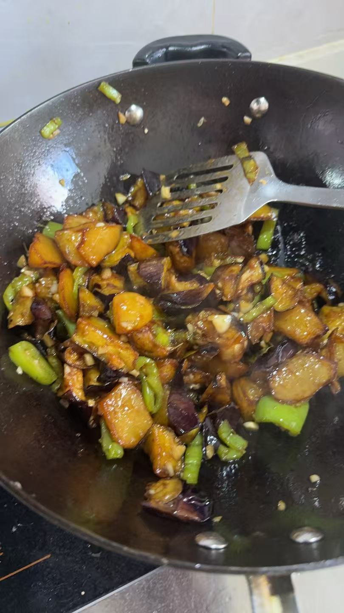

<p align="center">
<a href="README.zh.md"></a>
</p>

<h1 align="center">masterchef.skill</h1>

<p align="center">
Practical home cooking recipes for AI Agents, featuring 2,988 dishes (95%+ Chinese cuisine)<br>
2,988 real recipes — not AI-generated
</p>

<p align="center">

</p>

<p align="center">

</p>

---

## Installation

### Method 1: via OpenClaw

**CLI:**

```bash
openclaw skills install masterchef
```

**Prompt (paste into your AI agent):**

```
Install the skill "masterchef" (yummy-chat/masterchef) from ClawHub.
Skill page: https://clawhub.ai/yummy-chat/masterchef
Keep the work scoped to this skill only.
After install, inspect the skill metadata and help me finish setup.
Use only the metadata you can verify from ClawHub; do not invent missing requirements.
Ask before making any broader environment changes.
```

[ClawHub](https://clawhub.ai/yummy-chat/masterchef)

### Method 2: via npx

```bash
npx skills add yummy-chat/masterchef-skill
```

### Method 3: via SkillHub (for Agents)

```bash
# Check if SkillHub is installed
skillhub --version

# If not installed, install SkillHub CLI first (CLI only, no GUI)
curl -fsSL https://skillhub.cn/install/skillhub.md | bash

# Then install masterchef skill
skillhub install masterchef
```

---

## API Reference

This skill exposes two atomic API capabilities. Agents can call them directly for orchestration and integration.

### 1. Ingredient Search

**POST** `https://api.yummy.chat/ingredients`

Given 1-3 ingredients, returns a list of matching dishes.

```bash
curl -s -X POST https://api.yummy.chat/ingredients \
  -H "Content-Type: application/json" \
  -d '{"ingredients": ["茄子", "土豆"]}'
```

**Response:**
```json
{
  "results": [
    { "ingredient": "茄子", "dishes": ["地三鲜", "油焖茄子", "凉拌茄子"] },
    { "ingredient": "土豆", "dishes": ["地三鲜", "土豆炖牛肉", "酸辣土豆丝"] }
  ]
}
```

### 2. Recipe Lookup

**POST** `https://api.yummy.chat/howtocook`

Given a dish name, returns the full recipe with ingredients, steps, and tips.

```bash
curl -s -X POST https://api.yummy.chat/howtocook \
  -H "Content-Type: application/json" \
  -d '{"dish_name": "地三鲜"}'
```

**Response:**
```json
{
  "dish_name": "地三鲜",
  "recipes": ["地三鲜\n所属菜系：东北菜\n烹饪难度：⭐⭐⭐\n\n食材与调味品\n..."]
}
```

> **Note:** Both APIs accept and return Chinese only. The agent handles translation automatically.

---

## Usage Examples

### Example 1: Recipe Lookup

**You:** How to make cola chicken wings?

**MasterChef:**
```
# Cola Chicken Wings (可乐鸡翅)
Cuisine: Chinese Home Cooking
Difficulty: ⭐⭐

## Ingredients
🍗 Chicken wings 500g (about 10 pieces)
🥤 Cola 330ml (1 can)
🧄 Garlic 3 cloves (minced)
🧅 Ginger 3 slices
🧅 Scallion 1 stalk (cut into sections)
💧 Soy sauce 2 tbsp
🍶 Cooking wine 1 tbsp
🧂 Salt to taste
🫗 Cooking oil 2 tbsp

## Steps
1. Clean chicken wings, make 2-3 cuts on each side for better flavor
2. Blanch wings in boiling water for 2 minutes, remove and drain
3. Heat oil in pan, add garlic, ginger, and scallion until fragrant
4. Add chicken wings, fry until both sides are golden
5. Pour in cooking wine and soy sauce, stir well
6. Pour in cola until wings are just covered
7. Bring to boil, then simmer on medium-low heat for 20 minutes
8. Turn to high heat to reduce sauce until thick and glossy
9. Serve hot

## Health Tips
High in sugar due to cola. For a healthier version, use diet cola or reduce the amount.
```

---

### Example 2: Ingredient Search

**You:** I have eggplant and potato, what can I cook?

**MasterChef:**
```
Based on your ingredients, here are some dishes you can make:

🍆 Eggplant:
  • Di San Xian ⭐ Top Pick (uses both eggplant and potato)
  • Braised Eggplant
  • Cold Eggplant Salad
  • Eggplant Pancake

🥔 Potato:
  • Di San Xian ⭐ Top Pick (uses both eggplant and potato)
  • Potato Beef Stew
  • Hot & Sour Shredded Potato
  • Mashed Potato

💡 "Di San Xian" is highly recommended — it uses both of your ingredients!
```

---

## Share Your Cooking 📸

Made a dish from a recipe? Share your food photos with the community!

Name your photo `{recipe_id}_{american-name}.png`, place it in the `recipe_photo/` directory, and submit a Pull Request.

**Naming examples:**
```
recipe_photo/
├── 2367_liangban-qiezi.png       # Cold Eggplant Salad
├── 973_dan-chao-fan.png          # Egg Fried Rice
└── 1203_italian-lemon-chicken.png # Italian Lemon Chicken
```

The recipe ID matches the prefix of files in the `recipe/` directory.


---

## Recipe Catalog

Browse all 2,988 recipes organized by cuisine. Click any dish name to view the full recipe.

<details open>
<summary><b>Home Cooking</b> (1300)</summary>

| ID | Dish |
|:---|:-----|
| 2 | [Braised Common Carp 🐟](recipe_en/2_Braised%20Common%20Carp%20%F0%9F%90%9F.md) |
| 3 | [Mom's Seafood Pot](recipe_en/3_Mom%27s%20Seafood%20Pot.md) |
| 6 | [Beef Rib Pot](recipe_en/6_Beef%20Rib%20Pot.md) |
| 8 | [Pork Ball & Radish Soup 🥣](recipe_en/8_Pork%20Ball%20%26%20Radish%20Soup%20%F0%9F%A5%A3.md) |
| 11 | [Triple-Coat Crispy Fried Chicken Wings](recipe_en/11_Triple-Coat%20Crispy%20Fried%20Chicken%20Wings.md) |
| 12 | [Ham Sausage and Egg Soft Pancake](recipe_en/12_Ham%20Sausage%20and%20Egg%20Soft%20Pancake.md) |
| 13 | [Baby Mixed Rice](recipe_en/13_Baby%20Mixed%20Rice.md) |
| 14 | [Coke Braised Chicken Wings](recipe_en/14_Coke%20Braised%20Chicken%20Wings.md) |
| 17 | [Chiffon Cake](recipe_en/17_Chiffon%20Cake.md) |
| 18 | [Quick-Frozen Baozi (Steamed Buns)](recipe_en/18_Quick-Frozen%20Baozi%20%28Steamed%20Buns%29.md) |
| 19 | [Autumn Pear Syrup Lollipops](recipe_en/19_Autumn%20Pear%20Syrup%20Lollipops.md) |
| 22 | [White Fungus and Pear Soup 🍵](recipe_en/22_White%20Fungus%20and%20Pear%20Soup%20%F0%9F%8D%B5.md) |
| 23 | [Lard Rendering](recipe_en/23_Lard%20Rendering.md) |
| 24 | [Glutinous Rice Rolls with Soybean Flour](recipe_en/24_Glutinous%20Rice%20Rolls%20with%20Soybean%20Flour.md) |
| 27 | [Spicy Braised Duck Parts](recipe_en/27_Spicy%20Braised%20Duck%20Parts.md) |
| 29 | [Meat Dragon (Chinese Steamed Meat Roll)](recipe_en/29_Meat%20Dragon%20%28Chinese%20Steamed%20Meat%20Roll%29.md) |
| 31 | [Risen Dough Juicy Meat Pie](recipe_en/31_Risen%20Dough%20Juicy%20Meat%20Pie.md) |
| 35 | [Milk Pudding Cake 🍰](recipe_en/35_Milk%20Pudding%20Cake%20%F0%9F%8D%B0.md) |
| 38 | [Stir-Fried Beef with Water Bamboo Shoots](recipe_en/38_Stir-Fried%20Beef%20with%20Water%20Bamboo%20Shoots.md) |
| 39 | [Braised Chicken with Chestnuts](recipe_en/39_Braised%20Chicken%20with%20Chestnuts.md) |
| 40 | [Green Pepper and Eggplant Buns](recipe_en/40_Green%20Pepper%20and%20Eggplant%20Buns.md) |
| 41 | [Fish Skin Peanuts](recipe_en/41_Fish%20Skin%20Peanuts.md) |
| 45 | [Apple Pork Rib Soup](recipe_en/45_Apple%20Pork%20Rib%20Soup.md) |
| 47 | [Western-style Tomato Salad](recipe_en/47_Western-style%20Tomato%20Salad.md) |
| 50 | [Stir-Fried Cabbage with Pork](recipe_en/50_Stir-Fried%20Cabbage%20with%20Pork.md) |
| 52 | [Potstickers](recipe_en/52_Potstickers.md) |
| 53 | [Rice Cakes](recipe_en/53_Rice%20Cakes.md) |
| 54 | [Stir-Fried Clams](recipe_en/54_Stir-Fried%20Clams.md) |
| 55 | [Ancient Style Cake](recipe_en/55_Ancient%20Style%20Cake.md) |
| 56 | [Spicy Bird’s Eye Chili Sauce](recipe_en/56_Spicy%20Bird%E2%80%99s%20Eye%20Chili%20Sauce.md) |
| 59 | [Homestyle Stir-Fried Pork](recipe_en/59_Homestyle%20Stir-Fried%20Pork.md) |
| 62 | [Home-Style Braised Pan-Fried Tofu and Eggs](recipe_en/62_Home-Style%20Braised%20Pan-Fried%20Tofu%20and%20Eggs.md) |
| 63 | [Cola Tiger Skin Eggs](recipe_en/63_Cola%20Tiger%20Skin%20Eggs.md) |
| 66 | [Tomato Beef Rolls](recipe_en/66_Tomato%20Beef%20Rolls.md) |
| 67 | [Lotus Root Sandwiches](recipe_en/67_Lotus%20Root%20Sandwiches.md) |
| 69 | [Homemade Loaf Bread](recipe_en/69_Homemade%20Loaf%20Bread.md) |
| 72 | [Chive and Pork Baozi](recipe_en/72_Chive%20and%20Pork%20Baozi.md) |
| 73 | [Taro Mochi](recipe_en/73_Taro%20Mochi.md) |
| 74 | [Braised Sunny-Side-Up Eggs](recipe_en/74_Braised%20Sunny-Side-Up%20Eggs.md) |
| 82 | [Century Egg and Lean Pork Congee](recipe_en/82_Century%20Egg%20and%20Lean%20Pork%20Congee.md) |
| 83 | [Slap Tofu](recipe_en/83_Slap%20Tofu.md) |
| 86 | [Creamy Low-Sugar Mung Bean Cake](recipe_en/86_Creamy%20Low-Sugar%20Mung%20Bean%20Cake.md) |
| 89 | [Shrimp and Beef Stir-Fried Noodles](recipe_en/89_Shrimp%20and%20Beef%20Stir-Fried%20Noodles.md) |
| 90 | [Minced Pork and Potato Rice Bowl](recipe_en/90_Minced%20Pork%20and%20Potato%20Rice%20Bowl.md) |
| 92 | [Braised Softshell Turtle](recipe_en/92_Braised%20Softshell%20Turtle.md) |
| 94 | [Hand-Kneaded Old-Fashioned Bread](recipe_en/94_Hand-Kneaded%20Old-Fashioned%20Bread.md) |
| 95 | [Steamed Pork Belly with Pickled Mustard Stem](recipe_en/95_Steamed%20Pork%20Belly%20with%20Pickled%20Mustard%20Stem.md) |
| 105 | [Shredded Green Pepper and Potato Rice Bowl](recipe_en/105_Shredded%20Green%20Pepper%20and%20Potato%20Rice%20Bowl.md) |
| 106 | [Egg Fried Rice](recipe_en/106_Egg%20Fried%20Rice.md) |
| 108 | [Coconut Shred Bread](recipe_en/108_Coconut%20Shred%20Bread.md) |
| 109 | [Braised Eggplant](recipe_en/109_Braised%20Eggplant.md) |
| 110 | [Overnight Oats](recipe_en/110_Overnight%20Oats.md) |
| 111 | [Stir-Fried Celery with Red Bell Pepper](recipe_en/111_Stir-Fried%20Celery%20with%20Red%20Bell%20Pepper.md) |
| 114 | [Green Bean and Egg Pancake](recipe_en/114_Green%20Bean%20and%20Egg%20Pancake.md) |
| 115 | [Cucumber Pancakes](recipe_en/115_Cucumber%20Pancakes.md) |
| 117 | [Secret Recipe Pickled Radish](recipe_en/117_Secret%20Recipe%20Pickled%20Radish.md) |
| 118 | [0 Oil 0 Sugar Steamed Cake](recipe_en/118_0%20Oil%200%20Sugar%20Steamed%20Cake.md) |
| 120 | [Black Pepper Pan-Seared Shrimp](recipe_en/120_Black%20Pepper%20Pan-Seared%20Shrimp.md) |
| 122 | [Cheese Baked Rice](recipe_en/122_Cheese%20Baked%20Rice.md) |
| 123 | [Cucumber and Pig Ear Salad](recipe_en/123_Cucumber%20and%20Pig%20Ear%20Salad.md) |
| 128 | [Cold Noodles with Shrimp 🍝](recipe_en/128_Cold%20Noodles%20with%20Shrimp%20%F0%9F%8D%9D.md) |
| 129 | [Golden Pumpkin Chestnut Chicken Soup](recipe_en/129_Golden%20Pumpkin%20Chestnut%20Chicken%20Soup.md) |
| 130 | [Spicy Sichuan Sausage](recipe_en/130_Spicy%20Sichuan%20Sausage.md) |
| 132 | [Clear Stewed Beef and Radish Soup](recipe_en/132_Clear%20Stewed%20Beef%20and%20Radish%20Soup.md) |
| 133 | [Spicy Fat-Reducing Buckwheat Noodles](recipe_en/133_Spicy%20Fat-Reducing%20Buckwheat%20Noodles.md) |
| 137 | [Eggplant and Meat Rolls](recipe_en/137_Eggplant%20and%20Meat%20Rolls.md) |
| 138 | [Scrambled Eggs with Tomatoes and Shrimp](recipe_en/138_Scrambled%20Eggs%20with%20Tomatoes%20and%20Shrimp.md) |
| 139 | [Cola-Scented Braised Pork Belly](recipe_en/139_Cola-Scented%20Braised%20Pork%20Belly.md) |
| 142 | [Winter Melon Tea](recipe_en/142_Winter%20Melon%20Tea.md) |
| 150 | [Milk Curry Noodles](recipe_en/150_Milk%20Curry%20Noodles.md) |
| 151 | [Fragrant Abalone and Shrimp Pot](recipe_en/151_Fragrant%20Abalone%20and%20Shrimp%20Pot.md) |
| 152 | [Shredded Pork with Green Peppers and Ham Sausage](recipe_en/152_Shredded%20Pork%20with%20Green%20Peppers%20and%20Ham%20Sausage.md) |
| 155 | [Cat Ears (Deep-Fried Cookies)](recipe_en/155_Cat%20Ears%20%28Deep-Fried%20Cookies%29.md) |
| 157 | [Crystal Pork Skin Aspic](recipe_en/157_Crystal%20Pork%20Skin%20Aspic.md) |
| 158 | [Braised Pork Knuckle in Rice Cooker](recipe_en/158_Braised%20Pork%20Knuckle%20in%20Rice%20Cooker.md) |
| 160 | [Braised Pork Belly with Tofu Puffs](recipe_en/160_Braised%20Pork%20Belly%20with%20Tofu%20Puffs.md) |
| 161 | [Sautéed Ground Pork with Hot Pepper Noodles 🍜](recipe_en/161_Saut%C3%A9ed%20Ground%20Pork%20with%20Hot%20Pepper%20Noodles%20%F0%9F%8D%9C.md) |
| 162 | [All-Purpose Scallion Oil](recipe_en/162_All-Purpose%20Scallion%20Oil.md) |
| 164 | [Fried Spring Chicken](recipe_en/164_Fried%20Spring%20Chicken.md) |
| 167 | [Silky Scrambled Eggs 🥚](recipe_en/167_Silky%20Scrambled%20Eggs%20%F0%9F%A5%9A.md) |
| 169 | [One-Person Steamed Meal Set](recipe_en/169_One-Person%20Steamed%20Meal%20Set.md) |
| 171 | [Old-Fashioned Sugar Cake](recipe_en/171_Old-Fashioned%20Sugar%20Cake.md) |
| 173 | [Egg and Vegetable Sandwich](recipe_en/173_Egg%20and%20Vegetable%20Sandwich.md) |
| 174 | [Shredded Pork Stir-fried with Green Pepper and Onion](recipe_en/174_Shredded%20Pork%20Stir-fried%20with%20Green%20Pepper%20and%20Onion.md) |
| 175 | [Healthy Oatmeal Breakfast for Weight Loss](recipe_en/175_Healthy%20Oatmeal%20Breakfast%20for%20Weight%20Loss.md) |
| 176 | [Tomato Cabbage](recipe_en/176_Tomato%20Cabbage.md) |
| 177 | [Pan-Fried Topmouth Culter Fish](recipe_en/177_Pan-Fried%20Topmouth%20Culter%20Fish.md) |
| 181 | [Salted Duck Leg Mini Hot Pot](recipe_en/181_Salted%20Duck%20Leg%20Mini%20Hot%20Pot.md) |
| 184 | [Plum Blossom Mini Cakes](recipe_en/184_Plum%20Blossom%20Mini%20Cakes.md) |
| 185 | [Braised Eggplant and Pork Sauce over Rice 🍆🥩](recipe_en/185_Braised%20Eggplant%20and%20Pork%20Sauce%20over%20Rice%20%F0%9F%8D%86%F0%9F%A5%A9.md) |
| 186 | [Plum Spareribs](recipe_en/186_Plum%20Spareribs.md) |
| 188 | [Honey Bread](recipe_en/188_Honey%20Bread.md) |
| 192 | [Roast Chicken](recipe_en/192_Roast%20Chicken.md) |
| 194 | [Bing Dwen Dwen Meat Buns](recipe_en/194_Bing%20Dwen%20Dwen%20Meat%20Buns.md) |
| 198 | [Tomato Hot Pot Base](recipe_en/198_Tomato%20Hot%20Pot%20Base.md) |
| 199 | [No-Top Instant Noodles](recipe_en/199_No-Top%20Instant%20Noodles.md) |
| 201 | [Country Bumpkin Eggs](recipe_en/201_Country%20Bumpkin%20Eggs.md) |
| 202 | [Thousand-Layer Meat Pie](recipe_en/202_Thousand-Layer%20Meat%20Pie.md) |
| 203 | [Dough Drop Soup](recipe_en/203_Dough%20Drop%20Soup.md) |
| 207 | [Hand in Hand 🥢](recipe_en/207_Hand%20in%20Hand%20%F0%9F%A5%A2.md) |
| 208 | [Homemade Sichuan Pepper Salt](recipe_en/208_Homemade%20Sichuan%20Pepper%20Salt.md) |
| 210 | [Curry Shrimp Cutlet Rice](recipe_en/210_Curry%20Shrimp%20Cutlet%20Rice.md) |
| 212 | [No-Water Braised Chicken in Rice Cooker](recipe_en/212_No-Water%20Braised%20Chicken%20in%20Rice%20Cooker.md) |
| 213 | [Stir-Fried Mushrooms and Eggplant](recipe_en/213_Stir-Fried%20Mushrooms%20and%20Eggplant.md) |
| 216 | [Potato and Ham Braised Noodles](recipe_en/216_Potato%20and%20Ham%20Braised%20Noodles.md) |
| 220 | [Pan-Fried Oysters with Eggs](recipe_en/220_Pan-Fried%20Oysters%20with%20Eggs.md) |
| 221 | [Dry-Fried Meatballs](recipe_en/221_Dry-Fried%20Meatballs.md) |
| 224 | [Quick Pickled Vegetables](recipe_en/224_Quick%20Pickled%20Vegetables.md) |
| 226 | [Sesame Paste Dressing](recipe_en/226_Sesame%20Paste%20Dressing.md) |
| 227 | [Snakehead Fish Soup](recipe_en/227_Snakehead%20Fish%20Soup.md) |
| 230 | [Tips for Steaming Buns (Mantou)](recipe_en/230_Tips%20for%20Steaming%20Buns%20%28Mantou%29.md) |
| 231 | [Salted Pork and Rice with Greens 🥬](recipe_en/231_Salted%20Pork%20and%20Rice%20with%20Greens%20%F0%9F%A5%AC.md) |
| 233 | [Poached Egg](recipe_en/233_Poached%20Egg.md) |
| 234 | [Steamed Egg with Shrimp](recipe_en/234_Steamed%20Egg%20with%20Shrimp.md) |
| 235 | [Steamed Pork with Rice Flour](recipe_en/235_Steamed%20Pork%20with%20Rice%20Flour.md) |
| 237 | [Braised Carp with Chinese Cabbage](recipe_en/237_Braised%20Carp%20with%20Chinese%20Cabbage.md) |
| 238 | [Pumpkin and Cheese Pancake 🎃🧀](recipe_en/238_Pumpkin%20and%20Cheese%20Pancake%20%F0%9F%8E%83%F0%9F%A7%80.md) |
| 240 | [Buckwheat Noodles with Sauce](recipe_en/240_Buckwheat%20Noodles%20with%20Sauce.md) |
| 242 | [Steamed Mushrooms with Quail Eggs](recipe_en/242_Steamed%20Mushrooms%20with%20Quail%20Eggs.md) |
| 246 | [Animal Cream Piped Flower Cake](recipe_en/246_Animal%20Cream%20Piped%20Flower%20Cake.md) |
| 247 | [Seafood Congee](recipe_en/247_Seafood%20Congee.md) |
| 249 | [Tomato Egg Dumplings 🥟](recipe_en/249_Tomato%20Egg%20Dumplings%20%F0%9F%A5%9F.md) |
| 250 | [Honey Glazed Chicken Wings](recipe_en/250_Honey%20Glazed%20Chicken%20Wings.md) |
| 252 | [Secret Chili Oil](recipe_en/252_Secret%20Chili%20Oil.md) |
| 253 | [Tomato Hot Pot Broth](recipe_en/253_Tomato%20Hot%20Pot%20Broth.md) |
| 254 | [Pan-fried Water Spinach Omelette](recipe_en/254_Pan-fried%20Water%20Spinach%20Omelette.md) |
| 256 | [Supreme Braised Prawns](recipe_en/256_Supreme%20Braised%20Prawns.md) |
| 258 | [Fried Sweet Potato Chips](recipe_en/258_Fried%20Sweet%20Potato%20Chips.md) |
| 259 | [Yellow Millet New Year Cake (Nian Gao)](recipe_en/259_Yellow%20Millet%20New%20Year%20Cake%20%28Nian%20Gao%29.md) |
| 264 | [Yellow Catfish with Tofu](recipe_en/264_Yellow%20Catfish%20with%20Tofu.md) |
| 266 | [Stir-fried Shredded Potatoes with Millet and Pork Cracklings](recipe_en/266_Stir-fried%20Shredded%20Potatoes%20with%20Millet%20and%20Pork%20Cracklings.md) |
| 269 | [Scrambled Eggs with Tomatoes](recipe_en/269_Scrambled%20Eggs%20with%20Tomatoes.md) |
| 273 | [Sweet and Sour Shrimp Paste Eggplant Sandwich](recipe_en/273_Sweet%20and%20Sour%20Shrimp%20Paste%20Eggplant%20Sandwich.md) |
| 274 | [Skipjack Tuna and Seaweed Corn Rice](recipe_en/274_Skipjack%20Tuna%20and%20Seaweed%20Corn%20Rice.md) |
| 275 | [Basic Milk Dinner Rolls](recipe_en/275_Basic%20Milk%20Dinner%20Rolls.md) |
| 278 | [Tomato Sliced Pork Soup 🍅🥩](recipe_en/278_Tomato%20Sliced%20Pork%20Soup%20%F0%9F%8D%85%F0%9F%A5%A9.md) |
| 283 | [Healthy Fried Dough Sticks (You Tiao)](recipe_en/283_Healthy%20Fried%20Dough%20Sticks%20%28You%20Tiao%29.md) |
| 285 | [Chocolate Nut Tangyuan Skewers](recipe_en/285_Chocolate%20Nut%20Tangyuan%20Skewers.md) |
| 287 | [Steamed Rice with Seasonal Vegetables and Shrimp](recipe_en/287_Steamed%20Rice%20with%20Seasonal%20Vegetables%20and%20Shrimp.md) |
| 289 | [Cold Mixed Lettuce Shreds](recipe_en/289_Cold%20Mixed%20Lettuce%20Shreds.md) |
| 291 | [Braised Platter](recipe_en/291_Braised%20Platter.md) |
| 293 | [Curry Chicken Thigh Rice](recipe_en/293_Curry%20Chicken%20Thigh%20Rice.md) |
| 297 | [Broccoli Steamed Cake](recipe_en/297_Broccoli%20Steamed%20Cake.md) |
| 299 | [Farewell My Concubine](recipe_en/299_Farewell%20My%20Concubine.md) |
| 302 | [Sesame Potato Slices](recipe_en/302_Sesame%20Potato%20Slices.md) |
| 303 | [Health-Boosting Pigeon Soup](recipe_en/303_Health-Boosting%20Pigeon%20Soup.md) |
| 307 | [Boiled Corn](recipe_en/307_Boiled%20Corn.md) |
| 314 | [Tomato and Shrimp Ball Soup](recipe_en/314_Tomato%20and%20Shrimp%20Ball%20Soup.md) |
| 316 | [Corn and Shrimp Roll](recipe_en/316_Corn%20and%20Shrimp%20Roll.md) |
| 317 | [Braised Carp in Brown Sauce](recipe_en/317_Braised%20Carp%20in%20Brown%20Sauce.md) |
| 326 | [Clay Pot Fish](recipe_en/326_Clay%20Pot%20Fish.md) |
| 328 | [Hand-Torn Pan-Seared King Oyster Mushrooms](recipe_en/328_Hand-Torn%20Pan-Seared%20King%20Oyster%20Mushrooms.md) |
| 329 | [Green Chili Peppers Stuffed with Meat](recipe_en/329_Green%20Chili%20Peppers%20Stuffed%20with%20Meat.md) |
| 331 | [Seaweed and Egg Drop Soup](recipe_en/331_Seaweed%20and%20Egg%20Drop%20Soup.md) |
| 339 | [Egg Zhajiang Noodles (Fried Sauce Noodles)](recipe_en/339_Egg%20Zhajiang%20Noodles%20%28Fried%20Sauce%20Noodles%29.md) |
| 341 | [Tiger Skin Marinated Eggs](recipe_en/341_Tiger%20Skin%20Marinated%20Eggs.md) |
| 342 | [Braised Ribs with Wide Noodles](recipe_en/342_Braised%20Ribs%20with%20Wide%20Noodles.md) |
| 343 | [Bacon-Wrapped Chicken Drumsticks](recipe_en/343_Bacon-Wrapped%20Chicken%20Drumsticks.md) |
| 348 | [Stir-Fried Pork with Oyster Mushroom 🍄🐖](recipe_en/348_Stir-Fried%20Pork%20with%20Oyster%20Mushroom%20%F0%9F%8D%84%F0%9F%90%96.md) |
| 351 | [Salt and Pepper Enoki Mushrooms](recipe_en/351_Salt%20and%20Pepper%20Enoki%20Mushrooms.md) |
| 352 | [Braised Sweet Potato Noodles in Spiced Broth](recipe_en/352_Braised%20Sweet%20Potato%20Noodles%20in%20Spiced%20Broth.md) |
| 355 | [Old-fashioned Ice Cream with Glutinous Rice and Red Dates](recipe_en/355_Old-fashioned%20Ice%20Cream%20with%20Glutinous%20Rice%20and%20Red%20Dates.md) |
| 357 | [Lazy Hamburger](recipe_en/357_Lazy%20Hamburger.md) |
| 359 | [Zero-Rise Spicy Eggplant Filling Buns](recipe_en/359_Zero-Rise%20Spicy%20Eggplant%20Filling%20Buns.md) |
| 362 | [Cheese-Stuffed Crust Pizza](recipe_en/362_Cheese-Stuffed%20Crust%20Pizza.md) |
| 365 | [Tuna Salad Sandwich](recipe_en/365_Tuna%20Salad%20Sandwich.md) |
| 366 | [Fish Skin Dumpling and Tofu Soup](recipe_en/366_Fish%20Skin%20Dumpling%20and%20Tofu%20Soup.md) |
| 367 | [Konjac Cake](recipe_en/367_Konjac%20Cake.md) |
| 368 | [Wasabi Butter Giant River Prawn](recipe_en/368_Wasabi%20Butter%20Giant%20River%20Prawn.md) |
| 370 | [Salted Egg Yolk Pork Zongzi](recipe_en/370_Salted%20Egg%20Yolk%20Pork%20Zongzi.md) |
| 372 | [Peach Cookies](recipe_en/372_Peach%20Cookies.md) |
| 373 | [Honey Peach Oolong Cake](recipe_en/373_Honey%20Peach%20Oolong%20Cake.md) |
| 378 | [Thai-Style Boneless Chicken Feet](recipe_en/378_Thai-Style%20Boneless%20Chicken%20Feet.md) |
| 379 | [Pumpkin Steamed Cake 🎃](recipe_en/379_Pumpkin%20Steamed%20Cake%20%F0%9F%8E%83.md) |
| 380 | [Braised Beef Short Ribs](recipe_en/380_Braised%20Beef%20Short%20Ribs.md) |
| 381 | [Soft and Juicy Thin-Skinned Soup Dumplings](recipe_en/381_Soft%20and%20Juicy%20Thin-Skinned%20Soup%20Dumplings.md) |
| 382 | [Chrysanthemum Greens Salad with Peanuts](recipe_en/382_Chrysanthemum%20Greens%20Salad%20with%20Peanuts.md) |
| 387 | [Green Pepper, Potato Slices, and Ham Sausage](recipe_en/387_Green%20Pepper%2C%20Potato%20Slices%2C%20and%20Ham%20Sausage.md) |
| 388 | [🥚 Steamed Egg Custard](recipe_en/388_%F0%9F%A5%9A%20Steamed%20Egg%20Custard.md) |
| 389 | [Soup-filled Meat Buns](recipe_en/389_Soup-filled%20Meat%20Buns.md) |
| 391 | [Fortune Bag Zongzi](recipe_en/391_Fortune%20Bag%20Zongzi.md) |
| 396 | [Braised Vegetarian Chicken](recipe_en/396_Braised%20Vegetarian%20Chicken.md) |
| 400 | [Passion Fruit and Orange Special Blend](recipe_en/400_Passion%20Fruit%20and%20Orange%20Special%20Blend.md) |
| 401 | [Braised Rice with Morel Mushrooms and Sausages](recipe_en/401_Braised%20Rice%20with%20Morel%20Mushrooms%20and%20Sausages.md) |
| 403 | [Stir-Fried Lotus Root Shreds](recipe_en/403_Stir-Fried%20Lotus%20Root%20Shreds.md) |
| 405 | [Mimi Shrimp Sticks](recipe_en/405_Mimi%20Shrimp%20Sticks.md) |
| 406 | [Cold Pig Ear Salad](recipe_en/406_Cold%20Pig%20Ear%20Salad.md) |
| 407 | [Pan-fried Sea Bass](recipe_en/407_Pan-fried%20Sea%20Bass.md) |
| 409 | [State Banquet Clear Noodle Soup](recipe_en/409_State%20Banquet%20Clear%20Noodle%20Soup.md) |
| 410 | [Steamed Beef with Pumpkin](recipe_en/410_Steamed%20Beef%20with%20Pumpkin.md) |
| 411 | [Rose Flower White Bean Paste Cookies](recipe_en/411_Rose%20Flower%20White%20Bean%20Paste%20Cookies.md) |
| 416 | [Stir-Fried Cucumber](recipe_en/416_Stir-Fried%20Cucumber.md) |
| 419 | [Sour Soup Instant Noodles](recipe_en/419_Sour%20Soup%20Instant%20Noodles.md) |
| 421 | [Dry-Braised Pomfret](recipe_en/421_Dry-Braised%20Pomfret.md) |
| 423 | [Mother Filling Mixing with Child Filling](recipe_en/423_Mother%20Filling%20Mixing%20with%20Child%20Filling.md) |
| 425 | [🍅 Braised Beef Brisket with Tomatoes](recipe_en/425_%F0%9F%8D%85%20Braised%20Beef%20Brisket%20with%20Tomatoes.md) |
| 426 | [Tomato and Egg Drop Soup](recipe_en/426_Tomato%20and%20Egg%20Drop%20Soup.md) |
| 428 | [Soul-Stirring Chili Chicken](recipe_en/428_Soul-Stirring%20Chili%20Chicken.md) |
| 430 | [Private Kitchen Beef Meatballs](recipe_en/430_Private%20Kitchen%20Beef%20Meatballs.md) |
| 432 | [Baby Nutritious Mixed Rice](recipe_en/432_Baby%20Nutritious%20Mixed%20Rice.md) |
| 437 | [Bamboo Shoot Meatballs](recipe_en/437_Bamboo%20Shoot%20Meatballs.md) |
| 438 | [Crispy Bottom Pan-Fried Dumplings · Wontons · Beef Balls](recipe_en/438_Crispy%20Bottom%20Pan-Fried%20Dumplings%20%C2%B7%20Wontons%20%C2%B7%20Beef%20Balls.md) |
| 443 | [Steamed Strawberry Cake](recipe_en/443_Steamed%20Strawberry%20Cake.md) |
| 446 | [Mirror Case Tofu](recipe_en/446_Mirror%20Case%20Tofu.md) |
| 451 | [State Banquet-Level Soy Milk](recipe_en/451_State%20Banquet-Level%20Soy%20Milk.md) |
| 454 | [Steamed Pork with Rice Flour and Lotus Leaf Buns 🥟](recipe_en/454_Steamed%20Pork%20with%20Rice%20Flour%20and%20Lotus%20Leaf%20Buns%20%F0%9F%A5%9F.md) |
| 455 | [Pickled Cucumber](recipe_en/455_Pickled%20Cucumber.md) |
| 459 | [Stir-fried Sponge Gourd with Eggs](recipe_en/459_Stir-fried%20Sponge%20Gourd%20with%20Eggs.md) |
| 460 | [Microwave Red Date Cake](recipe_en/460_Microwave%20Red%20Date%20Cake.md) |
| 462 | [Mini Rolled Crepe Cake](recipe_en/462_Mini%20Rolled%20Crepe%20Cake.md) |
| 465 | [Tender Flatbread (Jin Bing)](recipe_en/465_Tender%20Flatbread%20%28Jin%20Bing%29.md) |
| 466 | [Mustard Giant River Prawns](recipe_en/466_Mustard%20Giant%20River%20Prawns.md) |
| 469 | [Spiced Chili Oil](recipe_en/469_Spiced%20Chili%20Oil.md) |
| 470 | [Japanese Beef Bowl (Gyudon)](recipe_en/470_Japanese%20Beef%20Bowl%20%28Gyudon%29.md) |
| 471 | [Steamed Egg with Yam and Minced Meat 💫](recipe_en/471_Steamed%20Egg%20with%20Yam%20and%20Minced%20Meat%20%F0%9F%92%AB.md) |
| 472 | [Iced Milk Custard](recipe_en/472_Iced%20Milk%20Custard.md) |
| 473 | [Mutton Soup](recipe_en/473_Mutton%20Soup.md) |
| 485 | [Homemade Hawthorn Slices](recipe_en/485_Homemade%20Hawthorn%20Slices.md) |
| 486 | [Pancakes](recipe_en/486_Pancakes.md) |
| 487 | [Eight-Shrimp Broth Noodles](recipe_en/487_Eight-Shrimp%20Broth%20Noodles.md) |
| 492 | [Osmanthus Rice Cake](recipe_en/492_Osmanthus%20Rice%20Cake.md) |
| 493 | [Quick Tofu Pudding](recipe_en/493_Quick%20Tofu%20Pudding.md) |
| 494 | [Soul-Burning Potatoes](recipe_en/494_Soul-Burning%20Potatoes.md) |
| 495 | [Electric Rice Cooker Tomato Beef Brisket Rice](recipe_en/495_Electric%20Rice%20Cooker%20Tomato%20Beef%20Brisket%20Rice.md) |
| 496 | [Braised Lamb Shank with Radish](recipe_en/496_Braised%20Lamb%20Shank%20with%20Radish.md) |
| 497 | [Ham and Egg Fried Rice](recipe_en/497_Ham%20and%20Egg%20Fried%20Rice.md) |
| 502 | [Sprouting Mung Beans in a Jar](recipe_en/502_Sprouting%20Mung%20Beans%20in%20a%20Jar.md) |
| 504 | [Braised Spare Ribs](recipe_en/504_Braised%20Spare%20Ribs.md) |
| 506 | [Pan-Fried Dumplings](recipe_en/506_Pan-Fried%20Dumplings.md) |
| 510 | [Braised Eggplant](recipe_en/510_Braised%20Eggplant.md) |
| 512 | [Clam and Chinese Yam Soup 🥣](recipe_en/512_Clam%20and%20Chinese%20Yam%20Soup%20%F0%9F%A5%A3.md) |
| 513 | [Stir-Fried Shredded Pancake](recipe_en/513_Stir-Fried%20Shredded%20Pancake.md) |
| 514 | [Mushroom and Bok Choy Baozi 🥟](recipe_en/514_Mushroom%20and%20Bok%20Choy%20Baozi%20%F0%9F%A5%9F.md) |
| 515 | [Homemade Spicy Strips (Latiao)](recipe_en/515_Homemade%20Spicy%20Strips%20%28Latiao%29.md) |
| 516 | [Fermented Rice Wine Steamed Buns](recipe_en/516_Fermented%20Rice%20Wine%20Steamed%20Buns.md) |
| 522 | [Homestyle Braised Dish](recipe_en/522_Homestyle%20Braised%20Dish.md) |
| 530 | [Spicy Shredded Pork](recipe_en/530_Spicy%20Shredded%20Pork.md) |
| 531 | [Crispy Noodle Threads in Caramel](recipe_en/531_Crispy%20Noodle%20Threads%20in%20Caramel.md) |
| 532 | [Potato Stuffed Pancakes](recipe_en/532_Potato%20Stuffed%20Pancakes.md) |
| 536 | [Crispy Meat Pancake](recipe_en/536_Crispy%20Meat%20Pancake.md) |
| 540 | [Crispy Lotus Root Balls](recipe_en/540_Crispy%20Lotus%20Root%20Balls.md) |
| 543 | [Braised Pork Trotter Rice 🍖](recipe_en/543_Braised%20Pork%20Trotter%20Rice%20%F0%9F%8D%96.md) |
| 544 | [Pork Rib and Bitter Melon Soup](recipe_en/544_Pork%20Rib%20and%20Bitter%20Melon%20Soup.md) |
| 547 | [Electric Rice Cooker Braised Rice](recipe_en/547_Electric%20Rice%20Cooker%20Braised%20Rice.md) |
| 560 | [Pumpkin Milk Layered Cake](recipe_en/560_Pumpkin%20Milk%20Layered%20Cake.md) |
| 561 | [Shrimp and Celery Pancakes](recipe_en/561_Shrimp%20and%20Celery%20Pancakes.md) |
| 566 | [Classic Braised Pork Belly (Hong Shao Rou)](recipe_en/566_Classic%20Braised%20Pork%20Belly%20%28Hong%20Shao%20Rou%29.md) |
| 572 | [Marinated Grilled Pork Belly](recipe_en/572_Marinated%20Grilled%20Pork%20Belly.md) |
| 575 | [Seafood Assorted Stir-Fried Instant Noodles](recipe_en/575_Seafood%20Assorted%20Stir-Fried%20Instant%20Noodles.md) |
| 576 | [Steamed Razor Clams with Garlic Sauce](recipe_en/576_Steamed%20Razor%20Clams%20with%20Garlic%20Sauce.md) |
| 578 | [Hand-Grabbed Pancake (Shou Zhua Bing)](recipe_en/578_Hand-Grabbed%20Pancake%20%28Shou%20Zhua%20Bing%29.md) |
| 581 | [Pork and Preserved Vegetable Guokui (Chinese Pan-Baked Pastry)](recipe_en/581_Pork%20and%20Preserved%20Vegetable%20Guokui%20%28Chinese%20Pan-Baked%20Pastry%29.md) |
| 583 | [Lettuce Leaf Pancake](recipe_en/583_Lettuce%20Leaf%20Pancake.md) |
| 586 | [Caramel-Coated Taro](recipe_en/586_Caramel-Coated%20Taro.md) |
| 588 | [Universal Chili Sauce](recipe_en/588_Universal%20Chili%20Sauce.md) |
| 589 | [Fried Potato Chips](recipe_en/589_Fried%20Potato%20Chips.md) |
| 590 | [Tea Tree Mushroom and Cordyceps Flower Chicken Soup](recipe_en/590_Tea%20Tree%20Mushroom%20and%20Cordyceps%20Flower%20Chicken%20Soup.md) |
| 593 | [Stir-fried Onion and Egg](recipe_en/593_Stir-fried%20Onion%20and%20Egg.md) |
| 596 | [Microwave Cold Noodles](recipe_en/596_Microwave%20Cold%20Noodles.md) |
| 603 | [Pumpkin Scallion Pancake 🎃](recipe_en/603_Pumpkin%20Scallion%20Pancake%20%F0%9F%8E%83.md) |
| 606 | [Candied Ginger](recipe_en/606_Candied%20Ginger.md) |
| 607 | [Skewer Dipping Sauce](recipe_en/607_Skewer%20Dipping%20Sauce.md) |
| 608 | [Egg-Crispy Peanuts](recipe_en/608_Egg-Crispy%20Peanuts.md) |
| 609 | [Stir-Fried Chinese Yam with Wood Ear Mushroom](recipe_en/609_Stir-Fried%20Chinese%20Yam%20with%20Wood%20Ear%20Mushroom.md) |
| 611 | [Sweet and Sour Ribs](recipe_en/611_Sweet%20and%20Sour%20Ribs.md) |
| 612 | [Old-Style Meat Broth Tofu Pudding 🥣](recipe_en/612_Old-Style%20Meat%20Broth%20Tofu%20Pudding%20%F0%9F%A5%A3.md) |
| 613 | [Crispy Banana](recipe_en/613_Crispy%20Banana.md) |
| 617 | [Homemade Sesame Paste and Spicy Mixed Vegetables & Meatballs](recipe_en/617_Homemade%20Sesame%20Paste%20and%20Spicy%20Mixed%20Vegetables%20%26%20Meatballs.md) |
| 618 | [Braised Pork Ribs Stuffed with Rice Cakes](recipe_en/618_Braised%20Pork%20Ribs%20Stuffed%20with%20Rice%20Cakes.md) |
| 620 | [Salted Egg Three-Ingredient Soup 🥣](recipe_en/620_Salted%20Egg%20Three-Ingredient%20Soup%20%F0%9F%A5%A3.md) |
| 621 | [Steamed Shredded Radish](recipe_en/621_Steamed%20Shredded%20Radish.md) |
| 624 | [Creamy Mushroom and Shrimp Soup](recipe_en/624_Creamy%20Mushroom%20and%20Shrimp%20Soup.md) |
| 626 | [Tomato and Greens Drop Soup](recipe_en/626_Tomato%20and%20Greens%20Drop%20Soup.md) |
| 627 | [Braised Eggplant with Peppers in Sauce](recipe_en/627_Braised%20Eggplant%20with%20Peppers%20in%20Sauce.md) |
| 630 | [Homestyle Braised Meat Platter](recipe_en/630_Homestyle%20Braised%20Meat%20Platter.md) |
| 631 | [Steamed Enoki Mushrooms with Garlic](recipe_en/631_Steamed%20Enoki%20Mushrooms%20with%20Garlic.md) |
| 632 | [Sugar Heart Tea Eggs](recipe_en/632_Sugar%20Heart%20Tea%20Eggs.md) |
| 639 | [Rice Porridge (Congee)](recipe_en/639_Rice%20Porridge%20%28Congee%29.md) |
| 641 | [Three Delicacy Chive Rolls](recipe_en/641_Three%20Delicacy%20Chive%20Rolls.md) |
| 643 | [Braised Duck with Ginger](recipe_en/643_Braised%20Duck%20with%20Ginger.md) |
| 644 | [Shrimp and Scallion Eggs](recipe_en/644_Shrimp%20and%20Scallion%20Eggs.md) |
| 646 | [Tomato Ring Bells Hot Pot](recipe_en/646_Tomato%20Ring%20Bells%20Hot%20Pot.md) |
| 647 | [Laba Congee (Eight Treasures Porridge)](recipe_en/647_Laba%20Congee%20%28Eight%20Treasures%20Porridge%29.md) |
| 648 | [Towel Roll](recipe_en/648_Towel%20Roll.md) |
| 649 | [Fish Soup Noodles](recipe_en/649_Fish%20Soup%20Noodles.md) |
| 651 | [Pan-Fried Trio with Crispy Lace](recipe_en/651_Pan-Fried%20Trio%20with%20Crispy%20Lace.md) |
| 652 | [Five-Spice Braised Beef Shin Cold Salad](recipe_en/652_Five-Spice%20Braised%20Beef%20Shin%20Cold%20Salad.md) |
| 653 | [Baked Rice with Minced Meat and Cheese](recipe_en/653_Baked%20Rice%20with%20Minced%20Meat%20and%20Cheese.md) |
| 657 | [Crispy Sugar Cake](recipe_en/657_Crispy%20Sugar%20Cake.md) |
| 658 | [Roasted Pork Large Intestine](recipe_en/658_Roasted%20Pork%20Large%20Intestine.md) |
| 663 | [Fried Noodle Snack](recipe_en/663_Fried%20Noodle%20Snack.md) |
| 665 | [Flourless Potato Pancake](recipe_en/665_Flourless%20Potato%20Pancake.md) |
| 666 | [Sour Plum Drink](recipe_en/666_Sour%20Plum%20Drink.md) |
| 667 | [Bitter Melon Omelette](recipe_en/667_Bitter%20Melon%20Omelette.md) |
| 668 | [Potato Wrapped Shrimp Paste Rolls](recipe_en/668_Potato%20Wrapped%20Shrimp%20Paste%20Rolls.md) |
| 669 | [Onion and Egg Pancake](recipe_en/669_Onion%20and%20Egg%20Pancake.md) |
| 670 | [Fried Glutinous Rice Balls](recipe_en/670_Fried%20Glutinous%20Rice%20Balls.md) |
| 673 | [Stone Plate Eggs 🥚](recipe_en/673_Stone%20Plate%20Eggs%20%F0%9F%A5%9A.md) |
| 675 | [Pan-Seared Yellow Croaker](recipe_en/675_Pan-Seared%20Yellow%20Croaker.md) |
| 677 | [Crystal Steamed Dumplings](recipe_en/677_Crystal%20Steamed%20Dumplings.md) |
| 679 | [Soy Milk Bun](recipe_en/679_Soy%20Milk%20Bun.md) |
| 680 | [Egg Rad Bibimbap](recipe_en/680_Egg%20Rad%20Bibimbap.md) |
| 681 | [Beef Rice Bowl](recipe_en/681_Beef%20Rice%20Bowl.md) |
| 685 | [Homemade High-Gluten Toast with All-Purpose Flour](recipe_en/685_Homemade%20High-Gluten%20Toast%20with%20All-Purpose%20Flour.md) |
| 687 | [Braised Chicken with Edamame](recipe_en/687_Braised%20Chicken%20with%20Edamame.md) |
| 690 | [Crispy Egg Bread](recipe_en/690_Crispy%20Egg%20Bread.md) |
| 694 | [Fried Clam Meat with Eggs](recipe_en/694_Fried%20Clam%20Meat%20with%20Eggs.md) |
| 696 | [Black Pepper Chicken Nuggets](recipe_en/696_Black%20Pepper%20Chicken%20Nuggets.md) |
| 697 | [Air Fryer Toast](recipe_en/697_Air%20Fryer%20Toast.md) |
| 698 | [Pan-Seared Tofu](recipe_en/698_Pan-Seared%20Tofu.md) |
| 699 | [Good Morning One-Bowl Noodles](recipe_en/699_Good%20Morning%20One-Bowl%20Noodles.md) |
| 703 | [Sour and Spicy Steamed Potato Cake](recipe_en/703_Sour%20and%20Spicy%20Steamed%20Potato%20Cake.md) |
| 705 | [Longan and Red Date Congee](recipe_en/705_Longan%20and%20Red%20Date%20Congee.md) |
| 706 | [Sweet and Spicy Roasted Whole Chicken Wings](recipe_en/706_Sweet%20and%20Spicy%20Roasted%20Whole%20Chicken%20Wings.md) |
| 707 | [Egg-wrapped Rice Roll](recipe_en/707_Egg-wrapped%20Rice%20Roll.md) |
| 708 | [Screw Pepper Appetizer](recipe_en/708_Screw%20Pepper%20Appetizer.md) |
| 712 | [Fruit Grilled Meat](recipe_en/712_Fruit%20Grilled%20Meat.md) |
| 715 | [Stir-Fried Shredded Flatbread (Vegetarian)](recipe_en/715_Stir-Fried%20Shredded%20Flatbread%20%28Vegetarian%29.md) |
| 718 | [Knife-Cut Mantou (Chinese Steamed Buns)](recipe_en/718_Knife-Cut%20Mantou%20%28Chinese%20Steamed%20Buns%29.md) |
| 722 | [Beef Ribs Cooked by Steaming Over Broth](recipe_en/722_Beef%20Ribs%20Cooked%20by%20Steaming%20Over%20Broth.md) |
| 724 | [Pomegranate Lollipops 🍭](recipe_en/724_Pomegranate%20Lollipops%20%F0%9F%8D%AD.md) |
| 725 | [Egg Dumplings](recipe_en/725_Egg%20Dumplings.md) |
| 728 | [Spicy Fried Chicken](recipe_en/728_Spicy%20Fried%20Chicken.md) |
| 732 | [Mushroom and Chinese Sausage Rice](recipe_en/732_Mushroom%20and%20Chinese%20Sausage%20Rice.md) |
| 734 | [Homemade BBQ Seasoning](recipe_en/734_Homemade%20BBQ%20Seasoning.md) |
| 735 | [Chestnut Filling](recipe_en/735_Chestnut%20Filling.md) |
| 736 | [Sesame Red Bean Pastry](recipe_en/736_Sesame%20Red%20Bean%20Pastry.md) |
| 739 | [Cold Mixed Enoki Mushrooms and Pea Shoots](recipe_en/739_Cold%20Mixed%20Enoki%20Mushrooms%20and%20Pea%20Shoots.md) |
| 740 | [Braised Lamb Ribs with Noodles](recipe_en/740_Braised%20Lamb%20Ribs%20with%20Noodles.md) |
| 744 | [Cooling Mung Bean Cake](recipe_en/744_Cooling%20Mung%20Bean%20Cake.md) |
| 749 | [All-Purpose Crepe Batter](recipe_en/749_All-Purpose%20Crepe%20Batter.md) |
| 750 | [Wild Vegetable and Vermicelli Pie](recipe_en/750_Wild%20Vegetable%20and%20Vermicelli%20Pie.md) |
| 753 | [Noodle Nut Walnut](recipe_en/753_Noodle%20Nut%20Walnut.md) |
| 756 | [Clear Simmered Chicken Soup](recipe_en/756_Clear%20Simmered%20Chicken%20Soup.md) |
| 758 | [Deep-Fried Dough Sticks (Youtiao)](recipe_en/758_Deep-Fried%20Dough%20Sticks%20%28Youtiao%29.md) |
| 760 | [Sesame Paste](recipe_en/760_Sesame%20Paste.md) |
| 767 | [Potato Stuffed Rice](recipe_en/767_Potato%20Stuffed%20Rice.md) |
| 769 | [Internet-famous Roasted Pork Trotter](recipe_en/769_Internet-famous%20Roasted%20Pork%20Trotter.md) |
| 771 | [Crispy Salt and Pepper Chicken Drumsticks](recipe_en/771_Crispy%20Salt%20and%20Pepper%20Chicken%20Drumsticks.md) |
| 772 | [Carrot Stir-Fry with Pork](recipe_en/772_Carrot%20Stir-Fry%20with%20Pork.md) |
| 775 | [Lard](recipe_en/775_Lard.md) |
| 776 | [Stir-Fried Cauliflower](recipe_en/776_Stir-Fried%20Cauliflower.md) |
| 779 | [Internet-famous Lava Omurice](recipe_en/779_Internet-famous%20Lava%20Omurice.md) |
| 784 | [Lazy Peanuts](recipe_en/784_Lazy%20Peanuts.md) |
| 785 | [Braised Cabbage in Thick Broth](recipe_en/785_Braised%20Cabbage%20in%20Thick%20Broth.md) |
| 787 | [Braised Fish Head](recipe_en/787_Braised%20Fish%20Head.md) |
| 789 | [Green Pepper and Potato Slices](recipe_en/789_Green%20Pepper%20and%20Potato%20Slices.md) |
| 790 | [Dumpling Skin Eggplant Meat Rolls](recipe_en/790_Dumpling%20Skin%20Eggplant%20Meat%20Rolls.md) |
| 792 | [Pan-Seared Beef Rib Tips](recipe_en/792_Pan-Seared%20Beef%20Rib%20Tips.md) |
| 795 | [Assorted Vegetable Balls](recipe_en/795_Assorted%20Vegetable%20Balls.md) |
| 797 | [Compound Soy Sauce](recipe_en/797_Compound%20Soy%20Sauce.md) |
| 798 | [Fresh Garlic Chili Sauce](recipe_en/798_Fresh%20Garlic%20Chili%20Sauce.md) |
| 801 | [Chinese Yam Steamed Cake](recipe_en/801_Chinese%20Yam%20Steamed%20Cake.md) |
| 802 | [Tomato Red Sauce](recipe_en/802_Tomato%20Red%20Sauce.md) |
| 803 | [Purple Rice Wrapped Rice](recipe_en/803_Purple%20Rice%20Wrapped%20Rice.md) |
| 804 | [Sweet and Sour Crispy Fish](recipe_en/804_Sweet%20and%20Sour%20Crispy%20Fish.md) |
| 805 | [Xiao Pang's Crispy Pan-Fried Chicken](recipe_en/805_Xiao%20Pang%27s%20Crispy%20Pan-Fried%20Chicken.md) |
| 808 | [Land and Sea Dual Delight Dumplings 🥟](recipe_en/808_Land%20and%20Sea%20Dual%20Delight%20Dumplings%20%F0%9F%A5%9F.md) |
| 809 | [Eggplant Egg Pancake 🥞](recipe_en/809_Eggplant%20Egg%20Pancake%20%F0%9F%A5%9E.md) |
| 810 | [Tomato and Meatball Soup](recipe_en/810_Tomato%20and%20Meatball%20Soup.md) |
| 811 | [Homestyle Chicken Popcorn](recipe_en/811_Homestyle%20Chicken%20Popcorn.md) |
| 816 | [Lazy Stir-fried Noodles](recipe_en/816_Lazy%20Stir-fried%20Noodles.md) |
| 819 | [Dumpling Wrapper Spring Pancakes](recipe_en/819_Dumpling%20Wrapper%20Spring%20Pancakes.md) |
| 822 | [Bamboo Fungus and Pork Rib Soup 🍲](recipe_en/822_Bamboo%20Fungus%20and%20Pork%20Rib%20Soup%20%F0%9F%8D%B2.md) |
| 823 | [Stir-Fried Broccoli](recipe_en/823_Stir-Fried%20Broccoli.md) |
| 824 | [Pig Trotters Aspic](recipe_en/824_Pig%20Trotters%20Aspic.md) |
| 825 | [Longevity Noodles](recipe_en/825_Longevity%20Noodles.md) |
| 829 | [Lemon Iced Black Tea](recipe_en/829_Lemon%20Iced%20Black%20Tea.md) |
| 830 | [Braised Fried Eggs](recipe_en/830_Braised%20Fried%20Eggs.md) |
| 831 | [Pure Milk Tangzhong Toast](recipe_en/831_Pure%20Milk%20Tangzhong%20Toast.md) |
| 832 | [Pumpkin Pancakes 🎃](recipe_en/832_Pumpkin%20Pancakes%20%F0%9F%8E%83.md) |
| 833 | [Stir-Fried Cabbage with Chili 🌶️](recipe_en/833_Stir-Fried%20Cabbage%20with%20Chili%20%F0%9F%8C%B6%EF%B8%8F.md) |
| 835 | [Spicy Braised Duck Parts](recipe_en/835_Spicy%20Braised%20Duck%20Parts.md) |
| 839 | [Clear Simmered Rib Soup](recipe_en/839_Clear%20Simmered%20Rib%20Soup.md) |
| 841 | [Water-Stretched Noodles](recipe_en/841_Water-Stretched%20Noodles.md) |
| 845 | [Cola Fried Rice](recipe_en/845_Cola%20Fried%20Rice.md) |
| 848 | [Braised Beef Shin in Rice Cooker](recipe_en/848_Braised%20Beef%20Shin%20in%20Rice%20Cooker.md) |
| 849 | [Steamed Fish Deodorizing Pretreatment](recipe_en/849_Steamed%20Fish%20Deodorizing%20Pretreatment.md) |
| 851 | [Cumin Squid](recipe_en/851_Cumin%20Squid.md) |
| 854 | [Stuffed Fish Balls](recipe_en/854_Stuffed%20Fish%20Balls.md) |
| 855 | [Braised Bream in Brown Sauce](recipe_en/855_Braised%20Bream%20in%20Brown%20Sauce.md) |
| 856 | [Fried Onion Rings](recipe_en/856_Fried%20Onion%20Rings.md) |
| 857 | [Homemade Pickled Sweet Garlic](recipe_en/857_Homemade%20Pickled%20Sweet%20Garlic.md) |
| 858 | [Versatile Quick Pickles 🥒](recipe_en/858_Versatile%20Quick%20Pickles%20%F0%9F%A5%92.md) |
| 861 | [Braised Potato and Egg with Meat Sauce](recipe_en/861_Braised%20Potato%20and%20Egg%20with%20Meat%20Sauce.md) |
| 862 | [Braised Chicken Leg Rice with Mushrooms](recipe_en/862_Braised%20Chicken%20Leg%20Rice%20with%20Mushrooms.md) |
| 863 | [Crispy Butterflied Shrimp 🦐](recipe_en/863_Crispy%20Butterflied%20Shrimp%20%F0%9F%A6%90.md) |
| 865 | [Oil-Free Honey Concave Cake](recipe_en/865_Oil-Free%20Honey%20Concave%20Cake.md) |
| 869 | [Shredded King Oyster Mushroom with Shredded Pork](recipe_en/869_Shredded%20King%20Oyster%20Mushroom%20with%20Shredded%20Pork.md) |
| 872 | [Beef Pan-Fried Buns](recipe_en/872_Beef%20Pan-Fried%20Buns.md) |
| 875 | [Shredded Tofu Skin, Green Pepper, and Shredded Pork](recipe_en/875_Shredded%20Tofu%20Skin%2C%20Green%20Pepper%2C%20and%20Shredded%20Pork.md) |
| 878 | [Beef Hot Pot Rice](recipe_en/878_Beef%20Hot%20Pot%20Rice.md) |
| 879 | [Braised Pork Trotters with Soybeans](recipe_en/879_Braised%20Pork%20Trotters%20with%20Soybeans.md) |
| 881 | [Beer-Braised Grass Carp](recipe_en/881_Beer-Braised%20Grass%20Carp.md) |
| 882 | [Buttered King Oyster Mushrooms](recipe_en/882_Buttered%20King%20Oyster%20Mushrooms.md) |
| 885 | [Pork Skin Jelly](recipe_en/885_Pork%20Skin%20Jelly.md) |
| 887 | [Chive and Shrimp Dumplings](recipe_en/887_Chive%20and%20Shrimp%20Dumplings.md) |
| 888 | [Blueberry Scrambled Egg Sandwich](recipe_en/888_Blueberry%20Scrambled%20Egg%20Sandwich.md) |
| 890 | [Tomato Egg and Spinach Scissor Cut Noodles](recipe_en/890_Tomato%20Egg%20and%20Spinach%20Scissor%20Cut%20Noodles.md) |
| 891 | [Homemade Cumin Chicken Strips](recipe_en/891_Homemade%20Cumin%20Chicken%20Strips.md) |
| 892 | [Shiitake Mushroom and Bok Choy](recipe_en/892_Shiitake%20Mushroom%20and%20Bok%20Choy.md) |
| 893 | [Soft Braised Pumpkin](recipe_en/893_Soft%20Braised%20Pumpkin.md) |
| 894 | [Golden Fried Rice](recipe_en/894_Golden%20Fried%20Rice.md) |
| 896 | [Sprite Noodles](recipe_en/896_Sprite%20Noodles.md) |
| 899 | [Pique Volcano Mashed Potatoes](recipe_en/899_Pique%20Volcano%20Mashed%20Potatoes.md) |
| 900 | [Stir-Fried Eggs with Green Peppers](recipe_en/900_Stir-Fried%20Eggs%20with%20Green%20Peppers.md) |
| 904 | [Braised Noodles with Spare Ribs and Long Beans](recipe_en/904_Braised%20Noodles%20with%20Spare%20Ribs%20and%20Long%20Beans.md) |
| 905 | [Braised Pork Belly Fried Rice 🍚](recipe_en/905_Braised%20Pork%20Belly%20Fried%20Rice%20%F0%9F%8D%9A.md) |
| 906 | [Fruit Ice Cream Crispy Shell Version](recipe_en/906_Fruit%20Ice%20Cream%20Crispy%20Shell%20Version.md) |
| 908 | [Air Fryer Chicken Wings (Middle Section)](recipe_en/908_Air%20Fryer%20Chicken%20Wings%20%28Middle%20Section%29.md) |
| 916 | [Home-Style Braised Eggplant](recipe_en/916_Home-Style%20Braised%20Eggplant.md) |
| 921 | [Cauliflower and Tomato Fried Rice](recipe_en/921_Cauliflower%20and%20Tomato%20Fried%20Rice.md) |
| 922 | [Crispy Pan-Fried Zongzi](recipe_en/922_Crispy%20Pan-Fried%20Zongzi.md) |
| 924 | [Hand-Twisted Dough Twist](recipe_en/924_Hand-Twisted%20Dough%20Twist.md) |
| 926 | [Snowflake Hawthorn Balls](recipe_en/926_Snowflake%20Hawthorn%20Balls.md) |
| 927 | [Garlic Shrimp 🍤](recipe_en/927_Garlic%20Shrimp%20%F0%9F%8D%A4.md) |
| 930 | [Cumin Beef Cubes](recipe_en/930_Cumin%20Beef%20Cubes.md) |
| 933 | [Braised Chicken Legs with Potatoes and Vermicelli](recipe_en/933_Braised%20Chicken%20Legs%20with%20Potatoes%20and%20Vermicelli.md) |
| 936 | [Chinese Toon Omelette](recipe_en/936_Chinese%20Toon%20Omelette.md) |
| 937 | [Cold Tossed Vermicelli](recipe_en/937_Cold%20Tossed%20Vermicelli.md) |
| 938 | [Dormitory Instant Mochi](recipe_en/938_Dormitory%20Instant%20Mochi.md) |
| 940 | [Spicy Meat](recipe_en/940_Spicy%20Meat.md) |
| 941 | [Margaret Biscuits](recipe_en/941_Margaret%20Biscuits.md) |
| 944 | [Seafood Borscht](recipe_en/944_Seafood%20Borscht.md) |
| 946 | [Hollow Scallion Pancake](recipe_en/946_Hollow%20Scallion%20Pancake.md) |
| 947 | [Dumpling Wrapper Cheese Pie](recipe_en/947_Dumpling%20Wrapper%20Cheese%20Pie.md) |
| 950 | [Crispy Tofu](recipe_en/950_Crispy%20Tofu.md) |
| 952 | [Rice Wine (Jiuniang)](recipe_en/952_Rice%20Wine%20%28Jiuniang%29.md) |
| 953 | [Peach Snow Lady (Mochi)](recipe_en/953_Peach%20Snow%20Lady%20%28Mochi%29.md) |
| 957 | [Pearl Pork Chop](recipe_en/957_Pearl%20Pork%20Chop.md) |
| 959 | [Cordyceps Flower and Chicken Soup](recipe_en/959_Cordyceps%20Flower%20and%20Chicken%20Soup.md) |
| 971 | [Steamed Squid with Tofu](recipe_en/971_Steamed%20Squid%20with%20Tofu.md) |
| 973 | [Perfectly Separated Egg Fried Rice](recipe_en/973_Perfectly%20Separated%20Egg%20Fried%20Rice.md) |
| 978 | [Angus Beef Rolls](recipe_en/978_Angus%20Beef%20Rolls.md) |
| 979 | [Rice Cooker Chiffon Cake](recipe_en/979_Rice%20Cooker%20Chiffon%20Cake.md) |
| 981 | [Spring Pancakes 🥟](recipe_en/981_Spring%20Pancakes%20%F0%9F%A5%9F.md) |
| 982 | [Steamed Bread](recipe_en/982_Steamed%20Bread.md) |
| 986 | [Sprite Sesame Dip](recipe_en/986_Sprite%20Sesame%20Dip.md) |
| 989 | [Tender Vegetable Fish Balls](recipe_en/989_Tender%20Vegetable%20Fish%20Balls.md) |
| 990 | [Ham and Egg Stir-fried Cucumber](recipe_en/990_Ham%20and%20Egg%20Stir-fried%20Cucumber.md) |
| 991 | [Luxurious Instant Noodles 🍜](recipe_en/991_Luxurious%20Instant%20Noodles%20%F0%9F%8D%9C.md) |
| 992 | [Beef Stir-fried with Celery](recipe_en/992_Beef%20Stir-fried%20with%20Celery.md) |
| 995 | [Steak Bowl](recipe_en/995_Steak%20Bowl.md) |
| 999 | [Soy Sauce Fried Rice](recipe_en/999_Soy%20Sauce%20Fried%20Rice.md) |
| 1001 | [Air Fryer BBQ Eggs](recipe_en/1001_Air%20Fryer%20BBQ%20Eggs.md) |
| 1002 | [Bubble Mini Bread](recipe_en/1002_Bubble%20Mini%20Bread.md) |
| 1003 | [Poor Man’s Crab Roe Congee 🍲](recipe_en/1003_Poor%20Man%E2%80%99s%20Crab%20Roe%20Congee%20%F0%9F%8D%B2.md) |
| 1005 | [Shrimp Paste Steamed Dumplings](recipe_en/1005_Shrimp%20Paste%20Steamed%20Dumplings.md) |
| 1006 | [Razor Clams with Eggs](recipe_en/1006_Razor%20Clams%20with%20Eggs.md) |
| 1008 | [Honey Yam](recipe_en/1008_Honey%20Yam.md) |
| 1009 | [Shrimp and Pork Potstickers](recipe_en/1009_Shrimp%20and%20Pork%20Potstickers.md) |
| 1010 | [Tomato Egg Fried Rice with Instant Noodles](recipe_en/1010_Tomato%20Egg%20Fried%20Rice%20with%20Instant%20Noodles.md) |
| 1016 | [Fermented Sweet Rice Wine (Jiuniang - Laozao)](recipe_en/1016_Fermented%20Sweet%20Rice%20Wine%20%28Jiuniang%20-%20Laozao%29.md) |
| 1017 | [Quick Salted Duck Eggs](recipe_en/1017_Quick%20Salted%20Duck%20Eggs.md) |
| 1018 | [Fresh Meat Buns](recipe_en/1018_Fresh%20Meat%20Buns.md) |
| 1020 | [Ejiao Cake (Donkey-Hide Gelatin Cake)](recipe_en/1020_Ejiao%20Cake%20%28Donkey-Hide%20Gelatin%20Cake%29.md) |
| 1023 | [Corn and Pork Rib Soup](recipe_en/1023_Corn%20and%20Pork%20Rib%20Soup.md) |
| 1024 | [Blueberry Jam Cake](recipe_en/1024_Blueberry%20Jam%20Cake.md) |
| 1027 | [Handmade Dumplings 🥟](recipe_en/1027_Handmade%20Dumplings%20%F0%9F%A5%9F.md) |
| 1029 | [Leftover Medley](recipe_en/1029_Leftover%20Medley.md) |
| 1030 | [Boiled Eggs](recipe_en/1030_Boiled%20Eggs.md) |
| 1032 | [Milk Taro and Red Bean Paste](recipe_en/1032_Milk%20Taro%20and%20Red%20Bean%20Paste.md) |
| 1037 | [Shredded Potatoes with Hot and Sour Flavor](recipe_en/1037_Shredded%20Potatoes%20with%20Hot%20and%20Sour%20Flavor.md) |
| 1038 | [Low-Fat Corn and Pork Rib Soup](recipe_en/1038_Low-Fat%20Corn%20and%20Pork%20Rib%20Soup.md) |
| 1042 | [Creamy Mushroom Soup](recipe_en/1042_Creamy%20Mushroom%20Soup.md) |
| 1043 | [Large Fried Dough Sticks](recipe_en/1043_Large%20Fried%20Dough%20Sticks.md) |
| 1045 | [Canned Yellow Peach](recipe_en/1045_Canned%20Yellow%20Peach.md) |
| 1046 | [Chrysanthemum Fish in Sweet and Sour Sauce](recipe_en/1046_Chrysanthemum%20Fish%20in%20Sweet%20and%20Sour%20Sauce.md) |
| 1049 | [Osmanthus Yam Cake](recipe_en/1049_Osmanthus%20Yam%20Cake.md) |
| 1055 | [Quick-Fried Shredded Potatoes with Chili and Sichuan Pepper](recipe_en/1055_Quick-Fried%20Shredded%20Potatoes%20with%20Chili%20and%20Sichuan%20Pepper.md) |
| 1056 | [Braised Beef and Dried Tofu Sticks in Clay Pot](recipe_en/1056_Braised%20Beef%20and%20Dried%20Tofu%20Sticks%20in%20Clay%20Pot.md) |
| 1058 | [Tomato Fish Fillet Slices](recipe_en/1058_Tomato%20Fish%20Fillet%20Slices.md) |
| 1060 | [Stir-Fried Pork Intestines with Chili Peppers](recipe_en/1060_Stir-Fried%20Pork%20Intestines%20with%20Chili%20Peppers.md) |
| 1061 | [Stir-Fried Pork with Scallion and Wood Ear Mushroom](recipe_en/1061_Stir-Fried%20Pork%20with%20Scallion%20and%20Wood%20Ear%20Mushroom.md) |
| 1063 | [Tender Chicken Steak](recipe_en/1063_Tender%20Chicken%20Steak.md) |
| 1066 | [Steamed Chicken in Its Own Juices (Sauna Chicken)](recipe_en/1066_Steamed%20Chicken%20in%20Its%20Own%20Juices%20%28Sauna%20Chicken%29.md) |
| 1069 | [Old Dough Steamed Buns](recipe_en/1069_Old%20Dough%20Steamed%20Buns.md) |
| 1071 | [Scrambled Eggs with Potato Slices](recipe_en/1071_Scrambled%20Eggs%20with%20Potato%20Slices.md) |
| 1072 | [Sesame Sauce Shrimp Paste and Wide Rice Noodles](recipe_en/1072_Sesame%20Sauce%20Shrimp%20Paste%20and%20Wide%20Rice%20Noodles.md) |
| 1074 | [Cold Noodles](recipe_en/1074_Cold%20Noodles.md) |
| 1075 | [Coconut Pandan Layered Cake](recipe_en/1075_Coconut%20Pandan%20Layered%20Cake.md) |
| 1079 | [Steamed Buns](recipe_en/1079_Steamed%20Buns.md) |
| 1082 | [Cilantro Beef Rice Bowl](recipe_en/1082_Cilantro%20Beef%20Rice%20Bowl.md) |
| 1083 | [Salted Egg Yolk Pumpkin](recipe_en/1083_Salted%20Egg%20Yolk%20Pumpkin.md) |
| 1084 | [Tomato and Egg Lazy Noodle Soup](recipe_en/1084_Tomato%20and%20Egg%20Lazy%20Noodle%20Soup.md) |
| 1088 | [Amber Walnuts](recipe_en/1088_Amber%20Walnuts.md) |
| 1089 | [Electric Rice Cooker Mixed Rice](recipe_en/1089_Electric%20Rice%20Cooker%20Mixed%20Rice.md) |
| 1090 | [Brown Sugar Steamed Cake (Made in Rice Cooker)](recipe_en/1090_Brown%20Sugar%20Steamed%20Cake%20%28Made%20in%20Rice%20Cooker%29.md) |
| 1091 | [Crispy Aromatic Duck](recipe_en/1091_Crispy%20Aromatic%20Duck.md) |
| 1096 | [Microwave Black Oat Porridge](recipe_en/1096_Microwave%20Black%20Oat%20Porridge.md) |
| 1097 | [Braised Prawns](recipe_en/1097_Braised%20Prawns.md) |
| 1100 | [Braised Pork Trotters](recipe_en/1100_Braised%20Pork%20Trotters.md) |
| 1102 | [Milk and Mung Bean Paste](recipe_en/1102_Milk%20and%20Mung%20Bean%20Paste.md) |
| 1103 | [Baked Sweet Potatoes](recipe_en/1103_Baked%20Sweet%20Potatoes.md) |
| 1104 | [Meat Floss, Pastrami, and Cucumber Sandwich](recipe_en/1104_Meat%20Floss%2C%20Pastrami%2C%20and%20Cucumber%20Sandwich.md) |
| 1108 | [Green Pepper, Ham, and Egg Stir-Fry](recipe_en/1108_Green%20Pepper%2C%20Ham%2C%20and%20Egg%20Stir-Fry.md) |
| 1109 | [Hawthorn Fruit Roll](recipe_en/1109_Hawthorn%20Fruit%20Roll.md) |
| 1112 | [Pomegranate Soda](recipe_en/1112_Pomegranate%20Soda.md) |
| 1113 | [Scallion Meat Pie](recipe_en/1113_Scallion%20Meat%20Pie.md) |
| 1115 | [Braised Pork Rib Rice](recipe_en/1115_Braised%20Pork%20Rib%20Rice.md) |
| 1121 | [Home-Style Stir-Fried Shredded Potatoes](recipe_en/1121_Home-Style%20Stir-Fried%20Shredded%20Potatoes.md) |
| 1127 | [Braised Beef Board Noodles (Rice Cooker Version)](recipe_en/1127_Braised%20Beef%20Board%20Noodles%20%28Rice%20Cooker%20Version%29.md) |
| 1129 | [Paopao Orange Tea](recipe_en/1129_Paopao%20Orange%20Tea.md) |
| 1130 | [Poached Egg](recipe_en/1130_Poached%20Egg.md) |
| 1131 | [Braised White Radish with Cured Meat](recipe_en/1131_Braised%20White%20Radish%20with%20Cured%20Meat.md) |
| 1132 | [Blueberry Cheese Baked Toast](recipe_en/1132_Blueberry%20Cheese%20Baked%20Toast.md) |
| 1134 | [Braised Chicken with Chestnuts and Shiitake Mushrooms](recipe_en/1134_Braised%20Chicken%20with%20Chestnuts%20and%20Shiitake%20Mushrooms.md) |
| 1136 | [Crispy Fried Pork Strips with Fennel](recipe_en/1136_Crispy%20Fried%20Pork%20Strips%20with%20Fennel.md) |
| 1139 | [Braised Spareribs with Chestnuts](recipe_en/1139_Braised%20Spareribs%20with%20Chestnuts.md) |
| 1141 | [Homestyle Cold Dish](recipe_en/1141_Homestyle%20Cold%20Dish.md) |
| 1143 | [Electric Rice Cooker Braised Spare Ribs](recipe_en/1143_Electric%20Rice%20Cooker%20Braised%20Spare%20Ribs.md) |
| 1144 | [Crispy Baked Glutinous Rice Balls](recipe_en/1144_Crispy%20Baked%20Glutinous%20Rice%20Balls.md) |
| 1145 | [Potato Egg Pancakes](recipe_en/1145_Potato%20Egg%20Pancakes.md) |
| 1146 | [Red Bean Marble Toast](recipe_en/1146_Red%20Bean%20Marble%20Toast.md) |
| 1148 | [Steamed Eggplant with Cornmeal](recipe_en/1148_Steamed%20Eggplant%20with%20Cornmeal.md) |
| 1152 | [Pan-Fried Yellow Croaker](recipe_en/1152_Pan-Fried%20Yellow%20Croaker.md) |
| 1154 | [Braised Rice with Pork Ribs and Chinese Sausage](recipe_en/1154_Braised%20Rice%20with%20Pork%20Ribs%20and%20Chinese%20Sausage.md) |
| 1155 | [Garlic Chicken Feet](recipe_en/1155_Garlic%20Chicken%20Feet.md) |
| 1156 | [Flower-Shaped Tomato Egg](recipe_en/1156_Flower-Shaped%20Tomato%20Egg.md) |
| 1158 | [Pan-Fried Pork Belly](recipe_en/1158_Pan-Fried%20Pork%20Belly.md) |
| 1159 | [Pan-Fried Tofu Vegetable Patties](recipe_en/1159_Pan-Fried%20Tofu%20Vegetable%20Patties.md) |
| 1160 | [Tiger Skin Chicken Feet](recipe_en/1160_Tiger%20Skin%20Chicken%20Feet.md) |
| 1161 | [Low-Calorie Three-Fresh Soup](recipe_en/1161_Low-Calorie%20Three-Fresh%20Soup.md) |
| 1163 | [Oil-Free Water-Fried Egg Avocado Bagel](recipe_en/1163_Oil-Free%20Water-Fried%20Egg%20Avocado%20Bagel.md) |
| 1165 | [Salmon Rice Bowl](recipe_en/1165_Salmon%20Rice%20Bowl.md) |
| 1167 | [Homemade Budget Unagi Donburi](recipe_en/1167_Homemade%20Budget%20Unagi%20Donburi.md) |
| 1168 | [Garlic Butter Shrimp with Split Backs](recipe_en/1168_Garlic%20Butter%20Shrimp%20with%20Split%20Backs.md) |
| 1169 | [Milk Song Gao (Steamed Milk Cake)](recipe_en/1169_Milk%20Song%20Gao%20%28Steamed%20Milk%20Cake%29.md) |
| 1173 | [Shrimp-Stuffed Wonton Skin Noodles](recipe_en/1173_Shrimp-Stuffed%20Wonton%20Skin%20Noodles.md) |
| 1176 | [Golden Autumn Eight Delicacies Soup](recipe_en/1176_Golden%20Autumn%20Eight%20Delicacies%20Soup.md) |
| 1177 | [Chinese Style Savory Pancake](recipe_en/1177_Chinese%20Style%20Savory%20Pancake.md) |
| 1179 | [Flash-Fried Treasure Shrimp](recipe_en/1179_Flash-Fried%20Treasure%20Shrimp.md) |
| 1180 | [Cucumber, Shrimp, and Egg Steamed Dumplings](recipe_en/1180_Cucumber%2C%20Shrimp%2C%20and%20Egg%20Steamed%20Dumplings.md) |
| 1183 | [Luxurious Meat Zongzi 🥟](recipe_en/1183_Luxurious%20Meat%20Zongzi%20%F0%9F%A5%9F.md) |
| 1185 | [Yu Xiang Stir-Fried Noodles 🍜](recipe_en/1185_Yu%20Xiang%20Stir-Fried%20Noodles%20%F0%9F%8D%9C.md) |
| 1190 | [Seafood Pancake](recipe_en/1190_Seafood%20Pancake.md) |
| 1193 | [Peach Boba 🍑](recipe_en/1193_Peach%20Boba%20%F0%9F%8D%91.md) |
| 1194 | [Green Pepper Pork Belly Rolls](recipe_en/1194_Green%20Pepper%20Pork%20Belly%20Rolls.md) |
| 1197 | [Blue Glutinous Rice Meatballs](recipe_en/1197_Blue%20Glutinous%20Rice%20Meatballs.md) |
| 1202 | [Beef Jerky](recipe_en/1202_Beef%20Jerky.md) |
| 1204 | [Braised Potatoes with Green Beans](recipe_en/1204_Braised%20Potatoes%20with%20Green%20Beans.md) |
| 1206 | [Salmon and Pumpkin Mixed Rice](recipe_en/1206_Salmon%20and%20Pumpkin%20Mixed%20Rice.md) |
| 1209 | [Sweet and Sour Pickled Radish](recipe_en/1209_Sweet%20and%20Sour%20Pickled%20Radish.md) |
| 1214 | [Steamed Flower Rolls](recipe_en/1214_Steamed%20Flower%20Rolls.md) |
| 1216 | [Potato Mash Sandwich](recipe_en/1216_Potato%20Mash%20Sandwich.md) |
| 1218 | [Chive Boxes](recipe_en/1218_Chive%20Boxes.md) |
| 1220 | [Stir-Fried Luffa](recipe_en/1220_Stir-Fried%20Luffa.md) |
| 1222 | [Shredded Pork with Dried Tofu](recipe_en/1222_Shredded%20Pork%20with%20Dried%20Tofu.md) |
| 1225 | [Braised Pork Belly](recipe_en/1225_Braised%20Pork%20Belly.md) |
| 1226 | [Chess Piece Pork Trotters 🐖](recipe_en/1226_Chess%20Piece%20Pork%20Trotters%20%F0%9F%90%96.md) |
| 1227 | [Spicy Beef and Tofu](recipe_en/1227_Spicy%20Beef%20and%20Tofu.md) |
| 1228 | [All-Purpose Golden and Silver Garlic Sauce](recipe_en/1228_All-Purpose%20Golden%20and%20Silver%20Garlic%20Sauce.md) |
| 1229 | [Hand-Stirred Pork Floss](recipe_en/1229_Hand-Stirred%20Pork%20Floss.md) |
| 1231 | [Pan-Fried Chicken Breast](recipe_en/1231_Pan-Fried%20Chicken%20Breast.md) |
| 1237 | [Brother-in-Law's Nest Egg Beef Rice](recipe_en/1237_Brother-in-Law%27s%20Nest%20Egg%20Beef%20Rice.md) |
| 1238 | [Sauced Lamb Spine (Lamb Backbone)](recipe_en/1238_Sauced%20Lamb%20Spine%20%28Lamb%20Backbone%29.md) |
| 1239 | [Sweet Osmanthus](recipe_en/1239_Sweet%20Osmanthus.md) |
| 1245 | [Cheese-Baked Steamed Buns](recipe_en/1245_Cheese-Baked%20Steamed%20Buns.md) |
| 1246 | [Baked Steamed Bun Pizza](recipe_en/1246_Baked%20Steamed%20Bun%20Pizza.md) |
| 1247 | [Lard](recipe_en/1247_Lard.md) |
| 1250 | [Steamed Rice in a Pot](recipe_en/1250_Steamed%20Rice%20in%20a%20Pot.md) |
| 1251 | [Baby Nutritious Rice](recipe_en/1251_Baby%20Nutritious%20Rice.md) |
| 1256 | [Mudslide Drink](recipe_en/1256_Mudslide%20Drink.md) |
| 1257 | [Braised Fish](recipe_en/1257_Braised%20Fish.md) |
| 1260 | [Spicy Tofu and Pork Blood](recipe_en/1260_Spicy%20Tofu%20and%20Pork%20Blood.md) |
| 1262 | [Cicadas on the Tree](recipe_en/1262_Cicadas%20on%20the%20Tree.md) |
| 1264 | [Frozen Dumplings](recipe_en/1264_Frozen%20Dumplings.md) |
| 1266 | [Baby Mixed Steamed Rice](recipe_en/1266_Baby%20Mixed%20Steamed%20Rice.md) |
| 1268 | [Black Oat Egg and Nut Cup](recipe_en/1268_Black%20Oat%20Egg%20and%20Nut%20Cup.md) |
| 1269 | [Silky Thick Egg Roll](recipe_en/1269_Silky%20Thick%20Egg%20Roll.md) |
| 1270 | [Braised Beef Brisket and Tomato Noodle Soup](recipe_en/1270_Braised%20Beef%20Brisket%20and%20Tomato%20Noodle%20Soup.md) |
| 1272 | [Brown Sugar and Red Date Blossom Steamed Buns](recipe_en/1272_Brown%20Sugar%20and%20Red%20Date%20Blossom%20Steamed%20Buns.md) |
| 1274 | [Braised Chicken with Shiitake Mushrooms](recipe_en/1274_Braised%20Chicken%20with%20Shiitake%20Mushrooms.md) |
| 1281 | [Spicy Duck Parts](recipe_en/1281_Spicy%20Duck%20Parts.md) |
| 1282 | [Mushroom and Pork Meatballs](recipe_en/1282_Mushroom%20and%20Pork%20Meatballs.md) |
| 1284 | [Cold Tossed Beef Tripe](recipe_en/1284_Cold%20Tossed%20Beef%20Tripe.md) |
| 1285 | [Shrimp and Pork Wontons](recipe_en/1285_Shrimp%20and%20Pork%20Wontons.md) |
| 1286 | [Nutritious Children's Meat Puree Sausages](recipe_en/1286_Nutritious%20Children%27s%20Meat%20Puree%20Sausages.md) |
| 1287 | [Whole Wheat Toast](recipe_en/1287_Whole%20Wheat%20Toast.md) |
| 1288 | [Mango Mochi](recipe_en/1288_Mango%20Mochi.md) |
| 1289 | [Spiced Tossed Shredded Tofu Skin](recipe_en/1289_Spiced%20Tossed%20Shredded%20Tofu%20Skin.md) |
| 1292 | [Peanut and Black Sesame Mochi](recipe_en/1292_Peanut%20and%20Black%20Sesame%20Mochi.md) |
| 1297 | [Tomato and Egg Drop Soup](recipe_en/1297_Tomato%20and%20Egg%20Drop%20Soup.md) |
| 1299 | [Salted Egg Yolk Shrimp Paste Clam Tofu Pot](recipe_en/1299_Salted%20Egg%20Yolk%20Shrimp%20Paste%20Clam%20Tofu%20Pot.md) |
| 1300 | [Chinese Yam, Snow Fungus, and Lily Bulb Soup](recipe_en/1300_Chinese%20Yam%2C%20Snow%20Fungus%2C%20and%20Lily%20Bulb%20Soup.md) |
| 1301 | [Steamed Buns](recipe_en/1301_Steamed%20Buns.md) |
| 1303 | [Blueberry Egg Tarts](recipe_en/1303_Blueberry%20Egg%20Tarts.md) |
| 1304 | [Braised Beef Noodle Soup](recipe_en/1304_Braised%20Beef%20Noodle%20Soup.md) |
| 1305 | [Homemade Salad Dressing](recipe_en/1305_Homemade%20Salad%20Dressing.md) |
| 1310 | [Homemade Tea Eggs](recipe_en/1310_Homemade%20Tea%20Eggs.md) |
| 1311 | [Braised Pork Belly with Potatoes](recipe_en/1311_Braised%20Pork%20Belly%20with%20Potatoes.md) |
| 1315 | [Pine Nut and Corn](recipe_en/1315_Pine%20Nut%20and%20Corn.md) |
| 1317 | [Stir-Fried Chicken Liver](recipe_en/1317_Stir-Fried%20Chicken%20Liver.md) |
| 1319 | [Three-Steam, Three-Sun Dried Sweet Potato Sticks](recipe_en/1319_Three-Steam%2C%20Three-Sun%20Dried%20Sweet%20Potato%20Sticks.md) |
| 1320 | [Fried Belt Fish](recipe_en/1320_Fried%20Belt%20Fish.md) |
| 1321 | [Boiled Lettuce with Hot Water](recipe_en/1321_Boiled%20Lettuce%20with%20Hot%20Water.md) |
| 1322 | [Braised Pork Hock Rice Bowl](recipe_en/1322_Braised%20Pork%20Hock%20Rice%20Bowl.md) |
| 1324 | [Sweet and Sour Shrimp](recipe_en/1324_Sweet%20and%20Sour%20Shrimp.md) |
| 1329 | [Stir-Fried Eggs](recipe_en/1329_Stir-Fried%20Eggs.md) |
| 1330 | [Cold Tossed Cucumber](recipe_en/1330_Cold%20Tossed%20Cucumber.md) |
| 1335 | [Sichuan Pepper Oil](recipe_en/1335_Sichuan%20Pepper%20Oil.md) |
| 1337 | [Cumin Sausage Dumplings](recipe_en/1337_Cumin%20Sausage%20Dumplings.md) |
| 1338 | [Waffles with Pan-Seared Steak](recipe_en/1338_Waffles%20with%20Pan-Seared%20Steak.md) |
| 1340 | [Crispy Egg Waffle Pockets](recipe_en/1340_Crispy%20Egg%20Waffle%20Pockets.md) |
| 1341 | [Spicy Stir-Fried Seafood Pot](recipe_en/1341_Spicy%20Stir-Fried%20Seafood%20Pot.md) |
| 1345 | [Golden Chicken Cutlet](recipe_en/1345_Golden%20Chicken%20Cutlet.md) |
| 1346 | [Braised Beef Brisket and Tomato Noodle Soup](recipe_en/1346_Braised%20Beef%20Brisket%20and%20Tomato%20Noodle%20Soup.md) |
| 1349 | [Beef Dumplings](recipe_en/1349_Beef%20Dumplings.md) |
| 1350 | [Millet Crackers](recipe_en/1350_Millet%20Crackers.md) |
| 1354 | [Pork and Chinese Cabbage Dumpling Filling](recipe_en/1354_Pork%20and%20Chinese%20Cabbage%20Dumpling%20Filling.md) |
| 1355 | [Braised Beef Ribs with Tomato](recipe_en/1355_Braised%20Beef%20Ribs%20with%20Tomato.md) |
| 1357 | [Braised Beef with Sour and Spicy Shredded Potatoes](recipe_en/1357_Braised%20Beef%20with%20Sour%20and%20Spicy%20Shredded%20Potatoes.md) |
| 1358 | [Garlic Butter Shrimp](recipe_en/1358_Garlic%20Butter%20Shrimp.md) |
| 1359 | [Cartoon Cookie Base](recipe_en/1359_Cartoon%20Cookie%20Base.md) |
| 1360 | [Electric Rice Cooker Five-Spice Salt-Baked Eggs](recipe_en/1360_Electric%20Rice%20Cooker%20Five-Spice%20Salt-Baked%20Eggs.md) |
| 1361 | [Candied Orange Peel Chips](recipe_en/1361_Candied%20Orange%20Peel%20Chips.md) |
| 1362 | [Beef and Mushroom Sauce](recipe_en/1362_Beef%20and%20Mushroom%20Sauce.md) |
| 1363 | [Spicy Shredded Pork](recipe_en/1363_Spicy%20Shredded%20Pork.md) |
| 1367 | [Chive Boxes (Jiǔ Cài Hé Zi)](recipe_en/1367_Chive%20Boxes%20%28Ji%C7%94%20C%C3%A0i%20H%C3%A9%20Zi%29.md) |
| 1370 | [Cold-Spiced Pork Hock](recipe_en/1370_Cold-Spiced%20Pork%20Hock.md) |
| 1371 | [Quick & Versatile Breakfast Pancakes](recipe_en/1371_Quick%20%26%20Versatile%20Breakfast%20Pancakes.md) |
| 1375 | [Five-Nut Mooncake](recipe_en/1375_Five-Nut%20Mooncake.md) |
| 1378 | [Low Sugar & Oil Whole Wheat Bread](recipe_en/1378_Low%20Sugar%20%26%20Oil%20Whole%20Wheat%20Bread.md) |
| 1381 | [Glutinous Rice Shaomai with Wonton Wrappers](recipe_en/1381_Glutinous%20Rice%20Shaomai%20with%20Wonton%20Wrappers.md) |
| 1382 | [Stir-Fried Beef](recipe_en/1382_Stir-Fried%20Beef.md) |
| 1384 | [Sugar-Glazed Egg Dumplings 🥟](recipe_en/1384_Sugar-Glazed%20Egg%20Dumplings%20%F0%9F%A5%9F.md) |
| 1385 | [Green Pepper Pancake](recipe_en/1385_Green%20Pepper%20Pancake.md) |
| 1389 | [Caramelized Soy Sauce Braised Pork](recipe_en/1389_Caramelized%20Soy%20Sauce%20Braised%20Pork.md) |
| 1392 | [Stir-Fried Shredded Pancake with Meat](recipe_en/1392_Stir-Fried%20Shredded%20Pancake%20with%20Meat.md) |
| 1393 | [Wang Xilou's Mixed Endive Salad](recipe_en/1393_Wang%20Xilou%27s%20Mixed%20Endive%20Salad.md) |
| 1394 | [Salt and Pepper Potato Cubes](recipe_en/1394_Salt%20and%20Pepper%20Potato%20Cubes.md) |
| 1395 | [State Banquet Mashed Potatoes](recipe_en/1395_State%20Banquet%20Mashed%20Potatoes.md) |
| 1396 | [Home-Style Braised Meat](recipe_en/1396_Home-Style%20Braised%20Meat.md) |
| 1398 | [European Bread Cheese Fried Egg Sandwich](recipe_en/1398_European%20Bread%20Cheese%20Fried%20Egg%20Sandwich.md) |
| 1399 | [Braised Lamb Ribs with Radish](recipe_en/1399_Braised%20Lamb%20Ribs%20with%20Radish.md) |
| 1401 | [Tomato Beef Cheese Rice Bowl](recipe_en/1401_Tomato%20Beef%20Cheese%20Rice%20Bowl.md) |
| 1403 | [Thousand-Layer Scallion Hand-Pulled Pancake](recipe_en/1403_Thousand-Layer%20Scallion%20Hand-Pulled%20Pancake.md) |
| 1407 | [Dumpling Wrapper Icy Flower Pan-Fried Dumplings](recipe_en/1407_Dumpling%20Wrapper%20Icy%20Flower%20Pan-Fried%20Dumplings.md) |
| 1409 | [Tomato Rice](recipe_en/1409_Tomato%20Rice.md) |
| 1410 | [Cola Pork Ribs and Chicken Wings](recipe_en/1410_Cola%20Pork%20Ribs%20and%20Chicken%20Wings.md) |
| 1411 | [Spicy Fried Chicken Drumsticks](recipe_en/1411_Spicy%20Fried%20Chicken%20Drumsticks.md) |
| 1412 | [Rice Cooker Ciabatta](recipe_en/1412_Rice%20Cooker%20Ciabatta.md) |
| 1413 | [Street-Side Chow Mein](recipe_en/1413_Street-Side%20Chow%20Mein.md) |
| 1415 | [Rice Toast](recipe_en/1415_Rice%20Toast.md) |
| 1416 | [Purple Rice Cheese Bun](recipe_en/1416_Purple%20Rice%20Cheese%20Bun.md) |
| 1417 | [Milk Mochi](recipe_en/1417_Milk%20Mochi.md) |
| 1419 | [Egg Tarts](recipe_en/1419_Egg%20Tarts.md) |
| 1420 | [Tomato Instant Noodles](recipe_en/1420_Tomato%20Instant%20Noodles.md) |
| 1422 | [Seaweed Rice Ball Sandwich](recipe_en/1422_Seaweed%20Rice%20Ball%20Sandwich.md) |
| 1423 | [Sweet and Sour & Braised Two-Flavor Fried Eggs](recipe_en/1423_Sweet%20and%20Sour%20%26%20Braised%20Two-Flavor%20Fried%20Eggs.md) |
| 1426 | [Sweet and Sour Eggs with Rice](recipe_en/1426_Sweet%20and%20Sour%20Eggs%20with%20Rice.md) |
| 1432 | [Fish Congee](recipe_en/1432_Fish%20Congee.md) |
| 1433 | [Egg White Cloud Cookies](recipe_en/1433_Egg%20White%20Cloud%20Cookies.md) |
| 1435 | [Winter Melon and Vermicelli Soup](recipe_en/1435_Winter%20Melon%20and%20Vermicelli%20Soup.md) |
| 1436 | [Milk and Oatmeal Steamed Cake](recipe_en/1436_Milk%20and%20Oatmeal%20Steamed%20Cake.md) |
| 1437 | [Spring Tulip Flower Pastry 🍃🌸](recipe_en/1437_Spring%20Tulip%20Flower%20Pastry%20%F0%9F%8D%83%F0%9F%8C%B8.md) |
| 1449 | [Celery with Tea Tree Mushrooms](recipe_en/1449_Celery%20with%20Tea%20Tree%20Mushrooms.md) |
| 1450 | [Cumin Spicy Baby Potatoes](recipe_en/1450_Cumin%20Spicy%20Baby%20Potatoes.md) |
| 1451 | [Sunny-Side Up Egg (Microwave)](recipe_en/1451_Sunny-Side%20Up%20Egg%20%28Microwave%29.md) |
| 1454 | [Microwave Garlic Shrimp](recipe_en/1454_Microwave%20Garlic%20Shrimp.md) |
| 1455 | [Steamed Rice Bowl with Tuna](recipe_en/1455_Steamed%20Rice%20Bowl%20with%20Tuna.md) |
| 1456 | [Vegetable Radish Balls](recipe_en/1456_Vegetable%20Radish%20Balls.md) |
| 1458 | [Hot Pot Milk Instant Noodles](recipe_en/1458_Hot%20Pot%20Milk%20Instant%20Noodles.md) |
| 1459 | [Homestyle Street Steak](recipe_en/1459_Homestyle%20Street%20Steak.md) |
| 1461 | [How to Sprout Mung Beans](recipe_en/1461_How%20to%20Sprout%20Mung%20Beans.md) |
| 1462 | [Shrimp and Edamame Sauce](recipe_en/1462_Shrimp%20and%20Edamame%20Sauce.md) |
| 1465 | [Vegetable Soup](recipe_en/1465_Vegetable%20Soup.md) |
| 1474 | [Braised Pork Ribs with Soy-Marinated Eggs](recipe_en/1474_Braised%20Pork%20Ribs%20with%20Soy-Marinated%20Eggs.md) |
| 1475 | [Egg Roll](recipe_en/1475_Egg%20Roll.md) |
| 1477 | [Microwave Thick Egg Roll](recipe_en/1477_Microwave%20Thick%20Egg%20Roll.md) |
| 1478 | [Beef and Cheese Rolls](recipe_en/1478_Beef%20and%20Cheese%20Rolls.md) |
| 1480 | [Cheese and Sweet Potato Baked Rice Cake](recipe_en/1480_Cheese%20and%20Sweet%20Potato%20Baked%20Rice%20Cake.md) |
| 1481 | [Curry Pork Cutlet Rice](recipe_en/1481_Curry%20Pork%20Cutlet%20Rice.md) |
| 1484 | [Thousand Leaf Pattern Cake](recipe_en/1484_Thousand%20Leaf%20Pattern%20Cake.md) |
| 1487 | [Cola Fried Egg Dumplings](recipe_en/1487_Cola%20Fried%20Egg%20Dumplings.md) |
| 1490 | [Steamed Dumplings with Zucchini, Egg, and Shrimp](recipe_en/1490_Steamed%20Dumplings%20with%20Zucchini%2C%20Egg%2C%20and%20Shrimp.md) |
| 1491 | [Whole Wheat Steamed Buns](recipe_en/1491_Whole%20Wheat%20Steamed%20Buns.md) |
| 1495 | [Chinese Sesame Sauce Mixed Vegetables](recipe_en/1495_Chinese%20Sesame%20Sauce%20Mixed%20Vegetables.md) |
| 1497 | [Steamed Pork Ribs with Preserved Mustard Greens](recipe_en/1497_Steamed%20Pork%20Ribs%20with%20Preserved%20Mustard%20Greens.md) |
| 1498 | [Cold Mixed Fish Scale Jelly](recipe_en/1498_Cold%20Mixed%20Fish%20Scale%20Jelly.md) |
| 1500 | [Mung Bean Milk Drink](recipe_en/1500_Mung%20Bean%20Milk%20Drink.md) |
| 1501 | [Stuffed Winter Melon with Meat](recipe_en/1501_Stuffed%20Winter%20Melon%20with%20Meat.md) |
| 1502 | [Lazy Ice Cream](recipe_en/1502_Lazy%20Ice%20Cream.md) |
| 1507 | [Braised Pork Intestines](recipe_en/1507_Braised%20Pork%20Intestines.md) |
| 1513 | [Spicy Fermented Tofu (Mala Fermented Tofu)](recipe_en/1513_Spicy%20Fermented%20Tofu%20%28Mala%20Fermented%20Tofu%29.md) |
| 1515 | [Fermented Rice Soup with Small Tangyuan](recipe_en/1515_Fermented%20Rice%20Soup%20with%20Small%20Tangyuan.md) |
| 1518 | [Homestyle Fried Dough Sticks](recipe_en/1518_Homestyle%20Fried%20Dough%20Sticks.md) |
| 1520 | [Stir-fried Cabbage with Eggs and Vermicelli](recipe_en/1520_Stir-fried%20Cabbage%20with%20Eggs%20and%20Vermicelli.md) |
| 1522 | [Tea-Flavored Chicken Wings](recipe_en/1522_Tea-Flavored%20Chicken%20Wings.md) |
| 1523 | [Pancakes](recipe_en/1523_Pancakes.md) |
| 1524 | [Cold Mixed Seafood in Sauce](recipe_en/1524_Cold%20Mixed%20Seafood%20in%20Sauce.md) |
| 1525 | [Thin-Skin Chive Boxes](recipe_en/1525_Thin-Skin%20Chive%20Boxes.md) |
| 1526 | [Three-Mushroom Oyster Sauce Stir-fry](recipe_en/1526_Three-Mushroom%20Oyster%20Sauce%20Stir-fry.md) |
| 1531 | [Soft Egg Wrap Pancake](recipe_en/1531_Soft%20Egg%20Wrap%20Pancake.md) |
| 1532 | [Honey Crispy Butter Chicken](recipe_en/1532_Honey%20Crispy%20Butter%20Chicken.md) |
| 1534 | [Garlic Oyster Sauce Lettuce](recipe_en/1534_Garlic%20Oyster%20Sauce%20Lettuce.md) |
| 1535 | [Kimchi (Pickled Vegetables)](recipe_en/1535_Kimchi%20%28Pickled%20Vegetables%29.md) |
| 1536 | [Grandma’s Fried Rice](recipe_en/1536_Grandma%E2%80%99s%20Fried%20Rice.md) |
| 1537 | [Meat-Filled Dumplings 🥟](recipe_en/1537_Meat-Filled%20Dumplings%20%F0%9F%A5%9F.md) |
| 1540 | [Spicy Mixed Vegetable Platter](recipe_en/1540_Spicy%20Mixed%20Vegetable%20Platter.md) |
| 1552 | [Fried Instant Noodles](recipe_en/1552_Fried%20Instant%20Noodles.md) |
| 1555 | [Microwaved Black Cod with Scallion and Ginger](recipe_en/1555_Microwaved%20Black%20Cod%20with%20Scallion%20and%20Ginger.md) |
| 1556 | [Auspicious Rabbit 🐰](recipe_en/1556_Auspicious%20Rabbit%20%F0%9F%90%B0.md) |
| 1558 | [Braised Beef Brisket with Tomato and Potato](recipe_en/1558_Braised%20Beef%20Brisket%20with%20Tomato%20and%20Potato.md) |
| 1562 | [Oil-Blanched Cabbage](recipe_en/1562_Oil-Blanched%20Cabbage.md) |
| 1563 | [Cola Fried Rice](recipe_en/1563_Cola%20Fried%20Rice.md) |
| 1574 | [Cloud-Turning Instant Noodles](recipe_en/1574_Cloud-Turning%20Instant%20Noodles.md) |
| 1575 | [Hot and Sour Fern Root Noodles](recipe_en/1575_Hot%20and%20Sour%20Fern%20Root%20Noodles.md) |
| 1576 | [Glass Noodle and Tofu Baozi](recipe_en/1576_Glass%20Noodle%20and%20Tofu%20Baozi.md) |
| 1577 | [Fried Fish Fillet](recipe_en/1577_Fried%20Fish%20Fillet.md) |
| 1578 | [Egg Fried Rice](recipe_en/1578_Egg%20Fried%20Rice.md) |
| 1579 | [Mini Steamed Buns](recipe_en/1579_Mini%20Steamed%20Buns.md) |
| 1583 | [Steamed Buns](recipe_en/1583_Steamed%20Buns.md) |
| 1584 | [Braised Noodles with Green Beans](recipe_en/1584_Braised%20Noodles%20with%20Green%20Beans.md) |
| 1585 | [Stir-Fried Green Beans with Shredded Pork](recipe_en/1585_Stir-Fried%20Green%20Beans%20with%20Shredded%20Pork.md) |
| 1591 | [Small Vegetable Steamed Buns](recipe_en/1591_Small%20Vegetable%20Steamed%20Buns.md) |
| 1592 | [Innovative Sweet and Sour Pork Ribs](recipe_en/1592_Innovative%20Sweet%20and%20Sour%20Pork%20Ribs.md) |
| 1593 | [Chinese Cabbage and Tofu Clay Pot](recipe_en/1593_Chinese%20Cabbage%20and%20Tofu%20Clay%20Pot.md) |
| 1594 | [Potato and Sausage Pancake Roll](recipe_en/1594_Potato%20and%20Sausage%20Pancake%20Roll.md) |
| 1595 | [Garlic Chicken Wings](recipe_en/1595_Garlic%20Chicken%20Wings.md) |
| 1598 | [Runny-yolk Fried Eggs](recipe_en/1598_Runny-yolk%20Fried%20Eggs.md) |
| 1601 | [Perfect Boiled Egg](recipe_en/1601_Perfect%20Boiled%20Egg.md) |
| 1606 | [18-Second Beef](recipe_en/1606_18-Second%20Beef.md) |
| 1612 | [Three Flower Evaporated Milk Beef Soup](recipe_en/1612_Three%20Flower%20Evaporated%20Milk%20Beef%20Soup.md) |
| 1613 | [Secret Spiced Crispy Chicken Legs](recipe_en/1613_Secret%20Spiced%20Crispy%20Chicken%20Legs.md) |
| 1615 | [Braised Chicken Wings](recipe_en/1615_Braised%20Chicken%20Wings.md) |
| 1617 | [Raincoat Cucumber](recipe_en/1617_Raincoat%20Cucumber.md) |
| 1618 | [Steamed Egg Custard](recipe_en/1618_Steamed%20Egg%20Custard.md) |
| 1628 | [Braised Chicken with Chestnuts](recipe_en/1628_Braised%20Chicken%20with%20Chestnuts.md) |
| 1632 | [Universal Red Bean Paste Filling](recipe_en/1632_Universal%20Red%20Bean%20Paste%20Filling.md) |
| 1633 | [Seafood and Chicken Feet Casserole](recipe_en/1633_Seafood%20and%20Chicken%20Feet%20Casserole.md) |
| 1634 | [Coconut Tomato Cake](recipe_en/1634_Coconut%20Tomato%20Cake.md) |
| 1635 | [Braised Beef in Soy Sauce](recipe_en/1635_Braised%20Beef%20in%20Soy%20Sauce.md) |
| 1636 | [Home-Style Stir-Fried Cured Pork](recipe_en/1636_Home-Style%20Stir-Fried%20Cured%20Pork.md) |
| 1638 | [Beer Fried Chicken](recipe_en/1638_Beer%20Fried%20Chicken.md) |
| 1644 | [Spicy Stir-Fried Beef Rolls](recipe_en/1644_Spicy%20Stir-Fried%20Beef%20Rolls.md) |
| 1647 | [Braised Pork Belly with Sour Plum](recipe_en/1647_Braised%20Pork%20Belly%20with%20Sour%20Plum.md) |
| 1651 | [Tomato Shrimp Pasta](recipe_en/1651_Tomato%20Shrimp%20Pasta.md) |
| 1655 | [Dietary Sausage](recipe_en/1655_Dietary%20Sausage.md) |
| 1656 | [Coffee Coconut Milk Jelly](recipe_en/1656_Coffee%20Coconut%20Milk%20Jelly.md) |
| 1657 | [Braised Noodles with Green Beans](recipe_en/1657_Braised%20Noodles%20with%20Green%20Beans.md) |
| 1661 | [Black Tea Chestnut Cake](recipe_en/1661_Black%20Tea%20Chestnut%20Cake.md) |
| 1664 | [Golden Corn Pancake](recipe_en/1664_Golden%20Corn%20Pancake.md) |
| 1665 | [Bear Fish-Shaped Sandwich Cookies](recipe_en/1665_Bear%20Fish-Shaped%20Sandwich%20Cookies.md) |
| 1668 | [Cement Fried Chicken](recipe_en/1668_Cement%20Fried%20Chicken.md) |
| 1669 | [Potato and Pork Backbone Soup](recipe_en/1669_Potato%20and%20Pork%20Backbone%20Soup.md) |
| 1675 | [Stir-fried Rice with Minced Pork and Pineapple](recipe_en/1675_Stir-fried%20Rice%20with%20Minced%20Pork%20and%20Pineapple.md) |
| 1676 | [Braised Red Lamb](recipe_en/1676_Braised%20Red%20Lamb.md) |
| 1678 | [Thin Pancake](recipe_en/1678_Thin%20Pancake.md) |
| 1679 | [Spicy Triangle Tofu](recipe_en/1679_Spicy%20Triangle%20Tofu.md) |
| 1684 | [Chili Oil](recipe_en/1684_Chili%20Oil.md) |
| 1685 | [State Banquet Three-Delight Dumplings](recipe_en/1685_State%20Banquet%20Three-Delight%20Dumplings.md) |
| 1686 | [Loofah and Clam Soup 🥒🍵](recipe_en/1686_Loofah%20and%20Clam%20Soup%20%F0%9F%A5%92%F0%9F%8D%B5.md) |
| 1687 | [Scissors-Cut Noodles](recipe_en/1687_Scissors-Cut%20Noodles.md) |
| 1690 | [Rice and Mung Bean Steamed Cake](recipe_en/1690_Rice%20and%20Mung%20Bean%20Steamed%20Cake.md) |
| 1691 | [Clear Broth Noodles](recipe_en/1691_Clear%20Broth%20Noodles.md) |
| 1694 | [Braised Chicken in Oil](recipe_en/1694_Braised%20Chicken%20in%20Oil.md) |
| 1695 | [Braised Noodles with Tomato and Fried Egg](recipe_en/1695_Braised%20Noodles%20with%20Tomato%20and%20Fried%20Egg.md) |
| 1696 | [Washed Red Bean Paste](recipe_en/1696_Washed%20Red%20Bean%20Paste.md) |
| 1698 | [Stir-Fried Spicy Green Peppers with Pork](recipe_en/1698_Stir-Fried%20Spicy%20Green%20Peppers%20with%20Pork.md) |
| 1701 | [Scallion Oil](recipe_en/1701_Scallion%20Oil.md) |
| 1702 | [Quick Single-Portion Chicken Rice Bowl](recipe_en/1702_Quick%20Single-Portion%20Chicken%20Rice%20Bowl.md) |
| 1706 | [Deep-Fried Ribbonfish](recipe_en/1706_Deep-Fried%20Ribbonfish.md) |
| 1707 | [Microwave Steamed Egg](recipe_en/1707_Microwave%20Steamed%20Egg.md) |
| 1715 | [Versatile Pork Filling](recipe_en/1715_Versatile%20Pork%20Filling.md) |
| 1717 | [Steamed Pork with Rice Flour](recipe_en/1717_Steamed%20Pork%20with%20Rice%20Flour.md) |
| 1718 | [Soufflé Omelette](recipe_en/1718_Souffl%C3%A9%20Omelette.md) |
| 1719 | [Tiger Skin Soft-Boiled Eggs](recipe_en/1719_Tiger%20Skin%20Soft-Boiled%20Eggs.md) |
| 1722 | [Steamed Pork Meatballs with Edamame 🫛](recipe_en/1722_Steamed%20Pork%20Meatballs%20with%20Edamame%20%F0%9F%AB%9B.md) |
| 1723 | [Frosted Small Buns](recipe_en/1723_Frosted%20Small%20Buns.md) |
| 1725 | [English Muffin Eggs Benedict Breakfast](recipe_en/1725_English%20Muffin%20Eggs%20Benedict%20Breakfast.md) |
| 1728 | [Whole Egg Cake](recipe_en/1728_Whole%20Egg%20Cake.md) |
| 1731 | [Bitter Gourd and Sliced Pork Soup](recipe_en/1731_Bitter%20Gourd%20and%20Sliced%20Pork%20Soup.md) |
| 1735 | [Thick Crust Orange Bread Sandwich](recipe_en/1735_Thick%20Crust%20Orange%20Bread%20Sandwich.md) |
| 1736 | [Home-style Stir-fried Eggplant](recipe_en/1736_Home-style%20Stir-fried%20Eggplant.md) |
| 1741 | [Green Pepper and Egg Leavened Pancake](recipe_en/1741_Green%20Pepper%20and%20Egg%20Leavened%20Pancake.md) |
| 1742 | [Roasted Gluten with Chili Oil and Nut Topping](recipe_en/1742_Roasted%20Gluten%20with%20Chili%20Oil%20and%20Nut%20Topping.md) |
| 1743 | [Spicy Crayfish Tails](recipe_en/1743_Spicy%20Crayfish%20Tails.md) |
| 1746 | [Crispy Cucumber Strips](recipe_en/1746_Crispy%20Cucumber%20Strips.md) |
| 1751 | [Perfect Tea Eggs](recipe_en/1751_Perfect%20Tea%20Eggs.md) |
| 1752 | [Homemade Rice Wine](recipe_en/1752_Homemade%20Rice%20Wine.md) |
| 1762 | [Loofah and Fried Egg Soup](recipe_en/1762_Loofah%20and%20Fried%20Egg%20Soup.md) |
| 1764 | [Salted Edamame](recipe_en/1764_Salted%20Edamame.md) |
| 1766 | [Three Flavored Skinless Chicken Thigh Fillets](recipe_en/1766_Three%20Flavored%20Skinless%20Chicken%20Thigh%20Fillets.md) |
| 1770 | [Milk Tea](recipe_en/1770_Milk%20Tea.md) |
| 1774 | [Pumpkin Red Bean Paste Buns](recipe_en/1774_Pumpkin%20Red%20Bean%20Paste%20Buns.md) |
| 1775 | [Onion Beef Rolls](recipe_en/1775_Onion%20Beef%20Rolls.md) |
| 1782 | [Honey Glazed Chicken Thigh and Potato Rice](recipe_en/1782_Honey%20Glazed%20Chicken%20Thigh%20and%20Potato%20Rice.md) |
| 1783 | [Water-Fried Eggs](recipe_en/1783_Water-Fried%20Eggs.md) |
| 1787 | [Water-Fried Chive Shrimp with Toon Sprouts](recipe_en/1787_Water-Fried%20Chive%20Shrimp%20with%20Toon%20Sprouts.md) |
| 1789 | [Minced Pork and Egg Rice Bowl](recipe_en/1789_Minced%20Pork%20and%20Egg%20Rice%20Bowl.md) |
| 1790 | [Date Cake](recipe_en/1790_Date%20Cake.md) |
| 1798 | [Braised Pork Ribs in Orange Juice](recipe_en/1798_Braised%20Pork%20Ribs%20in%20Orange%20Juice.md) |
| 1799 | [Beef Stir-Fry with Silky Eggs](recipe_en/1799_Beef%20Stir-Fry%20with%20Silky%20Eggs.md) |
| 1801 | [Milk Pudding Popsicles](recipe_en/1801_Milk%20Pudding%20Popsicles.md) |
| 1804 | [Braised Cucumber Strips](recipe_en/1804_Braised%20Cucumber%20Strips.md) |
| 1805 | [Rock Sugar and Tremella Soup](recipe_en/1805_Rock%20Sugar%20and%20Tremella%20Soup.md) |
| 1810 | [Oil-Splashed Tofu](recipe_en/1810_Oil-Splashed%20Tofu.md) |
| 1812 | [Steamed Crown Daisy](recipe_en/1812_Steamed%20Crown%20Daisy.md) |
| 1814 | [Baby’s Winter Nourishing Meal](recipe_en/1814_Baby%E2%80%99s%20Winter%20Nourishing%20Meal.md) |
| 1816 | [Stir-Fried Beef with Onion](recipe_en/1816_Stir-Fried%20Beef%20with%20Onion.md) |
| 1818 | [Universal Spicy Sauce](recipe_en/1818_Universal%20Spicy%20Sauce.md) |
| 1819 | [Stir-fried Pork Face Meat with Mushrooms and Onion over Rice](recipe_en/1819_Stir-fried%20Pork%20Face%20Meat%20with%20Mushrooms%20and%20Onion%20over%20Rice.md) |
| 1824 | [Millet Porridge](recipe_en/1824_Millet%20Porridge.md) |
| 1825 | [Street Wok-Charred Fried Rice 🍳](recipe_en/1825_Street%20Wok-Charred%20Fried%20Rice%20%F0%9F%8D%B3.md) |
| 1830 | [Red Bean Cake](recipe_en/1830_Red%20Bean%20Cake.md) |
| 1833 | [Braised Noodles with Spare Ribs and Long Beans](recipe_en/1833_Braised%20Noodles%20with%20Spare%20Ribs%20and%20Long%20Beans.md) |
| 1834 | [Braised Beef Brisket with Tomatoes](recipe_en/1834_Braised%20Beef%20Brisket%20with%20Tomatoes.md) |
| 1835 | [Cumin Potatoes and Ham Sausage](recipe_en/1835_Cumin%20Potatoes%20and%20Ham%20Sausage.md) |
| 1836 | [Spicy Pork Trotters](recipe_en/1836_Spicy%20Pork%20Trotters.md) |
| 1839 | [Pickled Chili Peppers](recipe_en/1839_Pickled%20Chili%20Peppers.md) |
| 1840 | [Shrimp, Zucchini, and Egg Dumplings](recipe_en/1840_Shrimp%2C%20Zucchini%2C%20and%20Egg%20Dumplings.md) |
| 1841 | [Oil-Free Water-Fried Egg](recipe_en/1841_Oil-Free%20Water-Fried%20Egg.md) |
| 1844 | [Shredded Potato Pancake](recipe_en/1844_Shredded%20Potato%20Pancake.md) |
| 1845 | [Mushroom Stuffed Shrimp Paste](recipe_en/1845_Mushroom%20Stuffed%20Shrimp%20Paste.md) |
| 1852 | [Steamed Free-Range Chicken](recipe_en/1852_Steamed%20Free-Range%20Chicken.md) |
| 1854 | [Green Vegetable and Mushroom Buns](recipe_en/1854_Green%20Vegetable%20and%20Mushroom%20Buns.md) |
| 1859 | [Crystal Mooncakes](recipe_en/1859_Crystal%20Mooncakes.md) |
| 1861 | [Home-Style Mixed Radish](recipe_en/1861_Home-Style%20Mixed%20Radish.md) |
| 1865 | [Pumpkin Steamed Pork Ribs](recipe_en/1865_Pumpkin%20Steamed%20Pork%20Ribs.md) |
| 1870 | [Microwave Mixed Vegetable Rice](recipe_en/1870_Microwave%20Mixed%20Vegetable%20Rice.md) |
| 1871 | [Beef Clear Soup](recipe_en/1871_Beef%20Clear%20Soup.md) |
| 1872 | [Crispy Donuts](recipe_en/1872_Crispy%20Donuts.md) |
| 1873 | [Finger-Licking Garlic Ribs 🍖](recipe_en/1873_Finger-Licking%20Garlic%20Ribs%20%F0%9F%8D%96.md) |
| 1875 | [Boiled Assorted Medley 🥟](recipe_en/1875_Boiled%20Assorted%20Medley%20%F0%9F%A5%9F.md) |
| 1878 | [Braised Pork Ribs with Tomato](recipe_en/1878_Braised%20Pork%20Ribs%20with%20Tomato.md) |
| 1881 | [Gold Ingot Flower Bun 🥟](recipe_en/1881_Gold%20Ingot%20Flower%20Bun%20%F0%9F%A5%9F.md) |
| 1883 | [Homemade Potato Chips](recipe_en/1883_Homemade%20Potato%20Chips.md) |
| 1886 | [Steamed Shredded Potato and Egg Cake](recipe_en/1886_Steamed%20Shredded%20Potato%20and%20Egg%20Cake.md) |
| 1889 | [Blue Pea Jelly 🥣](recipe_en/1889_Blue%20Pea%20Jelly%20%F0%9F%A5%A3.md) |
| 1892 | [Five-Color Steamed Rice](recipe_en/1892_Five-Color%20Steamed%20Rice.md) |
| 1893 | [Shrimp Paste Potato Rolls](recipe_en/1893_Shrimp%20Paste%20Potato%20Rolls.md) |
| 1895 | [Garlic Air Fryer Ribs](recipe_en/1895_Garlic%20Air%20Fryer%20Ribs.md) |
| 1896 | [One-Pot Clay Pot Rice 🏺](recipe_en/1896_One-Pot%20Clay%20Pot%20Rice%20%F0%9F%8F%BA.md) |
| 1904 | [State Ban Mini Fried Dough Sticks](recipe_en/1904_State%20Ban%20Mini%20Fried%20Dough%20Sticks.md) |
| 1908 | [Sea Cucumber Fried Rice](recipe_en/1908_Sea%20Cucumber%20Fried%20Rice.md) |
| 1910 | [Curry Flavored Braised Chicken in Clay Pot](recipe_en/1910_Curry%20Flavored%20Braised%20Chicken%20in%20Clay%20Pot.md) |
| 1914 | [Dumpling Skin Pancake Rolls with Stir-Fried Spicy Peppers and Eggs](recipe_en/1914_Dumpling%20Skin%20Pancake%20Rolls%20with%20Stir-Fried%20Spicy%20Peppers%20and%20Eggs.md) |
| 1919 | [Tomato Eggs with Sunny-Side-Up Eggs](recipe_en/1919_Tomato%20Eggs%20with%20Sunny-Side-Up%20Eggs.md) |
| 1923 | [Meat and Eggplant Pancake](recipe_en/1923_Meat%20and%20Eggplant%20Pancake.md) |
| 1924 | [Steamed Pumpkin](recipe_en/1924_Steamed%20Pumpkin.md) |
| 1930 | [Creative Sour Plum Drink](recipe_en/1930_Creative%20Sour%20Plum%20Drink.md) |
| 1934 | [Teriyaki Chicken Thigh Rice](recipe_en/1934_Teriyaki%20Chicken%20Thigh%20Rice.md) |
| 1939 | [Stir-fried Beef with Mushrooms](recipe_en/1939_Stir-fried%20Beef%20with%20Mushrooms.md) |
| 1940 | [🍓Strawberry Ice Cream](recipe_en/1940_%F0%9F%8D%93Strawberry%20Ice%20Cream.md) |
| 1945 | [Chicken Pot](recipe_en/1945_Chicken%20Pot.md) |
| 1946 | [Coarse Grain Jujube Cake](recipe_en/1946_Coarse%20Grain%20Jujube%20Cake.md) |
| 1947 | [Sweet Potato Steamed Cake](recipe_en/1947_Sweet%20Potato%20Steamed%20Cake.md) |
| 1948 | [Tomato and Tofu Clay Pot Stew](recipe_en/1948_Tomato%20and%20Tofu%20Clay%20Pot%20Stew.md) |
| 1949 | [Cranberry Cookies](recipe_en/1949_Cranberry%20Cookies.md) |
| 1950 | [Lettuce with Oyster Sauce](recipe_en/1950_Lettuce%20with%20Oyster%20Sauce.md) |
| 1952 | [Cold Mixed Enoki Mushrooms](recipe_en/1952_Cold%20Mixed%20Enoki%20Mushrooms.md) |
| 1953 | [Steamed Tofu with Minced Pork](recipe_en/1953_Steamed%20Tofu%20with%20Minced%20Pork.md) |
| 1954 | [Pumpkin Egg Rolls](recipe_en/1954_Pumpkin%20Egg%20Rolls.md) |
| 1955 | [Double-Layer Meat Patty Rice Bowl](recipe_en/1955_Double-Layer%20Meat%20Patty%20Rice%20Bowl.md) |
| 1956 | [Braised Fish Maw and Chicken Soup with Pumpkin Purée](recipe_en/1956_Braised%20Fish%20Maw%20and%20Chicken%20Soup%20with%20Pumpkin%20Pur%C3%A9e.md) |
| 1958 | [Hermès Hot Pot Milk Instant Noodles 🍜](recipe_en/1958_Herm%C3%A8s%20Hot%20Pot%20Milk%20Instant%20Noodles%20%F0%9F%8D%9C.md) |
| 1961 | [Pickled Chili Peanuts](recipe_en/1961_Pickled%20Chili%20Peanuts.md) |
| 1963 | [Light Cream Cheesecake](recipe_en/1963_Light%20Cream%20Cheesecake.md) |
| 1965 | [Raw Chocolate Chiffon Cake](recipe_en/1965_Raw%20Chocolate%20Chiffon%20Cake.md) |
| 1968 | [Old-Style Cooked Cabbage](recipe_en/1968_Old-Style%20Cooked%20Cabbage.md) |
| 1969 | [Willow Leaf Baozi (Liuye Bao)](recipe_en/1969_Willow%20Leaf%20Baozi%20%28Liuye%20Bao%29.md) |
| 1970 | [Milk Curry Rice](recipe_en/1970_Milk%20Curry%20Rice.md) |
| 1971 | [Stir-Fried Pork Liver with Chopped Chili and Green Bell Pepper](recipe_en/1971_Stir-Fried%20Pork%20Liver%20with%20Chopped%20Chili%20and%20Green%20Bell%20Pepper.md) |
| 1974 | [Shredded Potato and Egg Pancake](recipe_en/1974_Shredded%20Potato%20and%20Egg%20Pancake.md) |
| 1975 | [Pomegranate Salad](recipe_en/1975_Pomegranate%20Salad.md) |
| 1977 | [Pan-Fried Tofu with Scallions](recipe_en/1977_Pan-Fried%20Tofu%20with%20Scallions.md) |
| 1978 | [Pan-Fried Soufflé Pancake](recipe_en/1978_Pan-Fried%20Souffl%C3%A9%20Pancake.md) |
| 1979 | [Old-Style Ice Pops](recipe_en/1979_Old-Style%20Ice%20Pops.md) |
| 1981 | [Stir-Fried Asparagus with Shrimp 🦐🌱](recipe_en/1981_Stir-Fried%20Asparagus%20with%20Shrimp%20%F0%9F%A6%90%F0%9F%8C%B1.md) |
| 1983 | [Colorful Lace Skirt Potstickers](recipe_en/1983_Colorful%20Lace%20Skirt%20Potstickers.md) |
| 1990 | [Crispy Fried Chicken Drumettes](recipe_en/1990_Crispy%20Fried%20Chicken%20Drumettes.md) |
| 1991 | [Home-style Stir-fried Pork](recipe_en/1991_Home-style%20Stir-fried%20Pork.md) |
| 1993 | [French Butter Toast](recipe_en/1993_French%20Butter%20Toast.md) |
| 1994 | [Homemade Bone Broth & Vegetable Soup Concentrate](recipe_en/1994_Homemade%20Bone%20Broth%20%26%20Vegetable%20Soup%20Concentrate.md) |
| 1995 | [Home-Style Twice-Cooked Pork](recipe_en/1995_Home-Style%20Twice-Cooked%20Pork.md) |
| 2001 | [Shrimp and Egg Bake](recipe_en/2001_Shrimp%20and%20Egg%20Bake.md) |
| 2004 | [Chive Pancakes 🥟](recipe_en/2004_Chive%20Pancakes%20%F0%9F%A5%9F.md) |
| 2006 | [Purslane and Egg Pancake](recipe_en/2006_Purslane%20and%20Egg%20Pancake.md) |
| 2007 | [Pepper Stuffed Bun](recipe_en/2007_Pepper%20Stuffed%20Bun.md) |
| 2013 | [Salted Egg Yolk and Shrimp Tofu Stew](recipe_en/2013_Salted%20Egg%20Yolk%20and%20Shrimp%20Tofu%20Stew.md) |
| 2016 | [Strawberry Jam](recipe_en/2016_Strawberry%20Jam.md) |
| 2018 | [Sour Plum Drink](recipe_en/2018_Sour%20Plum%20Drink.md) |
| 2019 | [Braised Sea Bass in Soy Sauce](recipe_en/2019_Braised%20Sea%20Bass%20in%20Soy%20Sauce.md) |
| 2021 | [Tomato-Flavored Home-Style Hot Pot](recipe_en/2021_Tomato-Flavored%20Home-Style%20Hot%20Pot.md) |
| 2024 | [Soy Sauce Mushroom Pork Rib Rice 🍚](recipe_en/2024_Soy%20Sauce%20Mushroom%20Pork%20Rib%20Rice%20%F0%9F%8D%9A.md) |
| 2027 | [Beef Brisket Rice](recipe_en/2027_Beef%20Brisket%20Rice.md) |
| 2028 | [Spicy Crayfish](recipe_en/2028_Spicy%20Crayfish.md) |
| 2031 | [Three Delicacies Pounded Shrimp](recipe_en/2031_Three%20Delicacies%20Pounded%20Shrimp.md) |
| 2038 | [Beef Bone Broth](recipe_en/2038_Beef%20Bone%20Broth.md) |
| 2039 | [Boiled Soft-Boiled Egg 🥚](recipe_en/2039_Boiled%20Soft-Boiled%20Egg%20%F0%9F%A5%9A.md) |
| 2040 | [Safe Oil Fritters (You Tiao)](recipe_en/2040_Safe%20Oil%20Fritters%20%28You%20Tiao%29.md) |
| 2043 | [Braised Lamb Ribs 🥩](recipe_en/2043_Braised%20Lamb%20Ribs%20%F0%9F%A5%A9.md) |
| 2044 | [Chocolate Marble Loaf Bread](recipe_en/2044_Chocolate%20Marble%20Loaf%20Bread.md) |
| 2045 | [Cold Mixed Beef Shin Center](recipe_en/2045_Cold%20Mixed%20Beef%20Shin%20Center.md) |
| 2050 | [Egg Yolk Pastry 🥮](recipe_en/2050_Egg%20Yolk%20Pastry%20%F0%9F%A5%AE.md) |
| 2051 | [Seaweed Shrimp Paste Pancake 🥞](recipe_en/2051_Seaweed%20Shrimp%20Paste%20Pancake%20%F0%9F%A5%9E.md) |
| 2054 | [Homemade Tofu](recipe_en/2054_Homemade%20Tofu.md) |
| 2055 | [Chicken Thigh and Egg Sandwich](recipe_en/2055_Chicken%20Thigh%20and%20Egg%20Sandwich.md) |
| 2057 | [Refined Lard](recipe_en/2057_Refined%20Lard.md) |
| 2060 | [Fried Prawns](recipe_en/2060_Fried%20Prawns.md) |
| 2064 | [Healthy Homestyle Fried Dough Sticks](recipe_en/2064_Healthy%20Homestyle%20Fried%20Dough%20Sticks.md) |
| 2066 | [Steamed Green Crab with Tofu](recipe_en/2066_Steamed%20Green%20Crab%20with%20Tofu.md) |
| 2067 | [Home-Style Steamed Egg Custard](recipe_en/2067_Home-Style%20Steamed%20Egg%20Custard.md) |
| 2070 | [Crucian Carp Soup](recipe_en/2070_Crucian%20Carp%20Soup.md) |
| 2073 | [Electric Rice Cooker Sponge Cake](recipe_en/2073_Electric%20Rice%20Cooker%20Sponge%20Cake.md) |
| 2074 | [Creamy Mushroom Pasta](recipe_en/2074_Creamy%20Mushroom%20Pasta.md) |
| 2078 | [Lychee Rose Jam](recipe_en/2078_Lychee%20Rose%20Jam.md) |
| 2079 | [Luxury Edition Egg Burger 🍔](recipe_en/2079_Luxury%20Edition%20Egg%20Burger%20%F0%9F%8D%94.md) |
| 2080 | [Pure Meat Wonton - Dumpling](recipe_en/2080_Pure%20Meat%20Wonton%20-%20Dumpling.md) |
| 2082 | [Honey-Glazed Roasted Sweet Potato Slices](recipe_en/2082_Honey-Glazed%20Roasted%20Sweet%20Potato%20Slices.md) |
| 2087 | [Ice Cube Crucian Carp Soup 🐟](recipe_en/2087_Ice%20Cube%20Crucian%20Carp%20Soup%20%F0%9F%90%9F.md) |
| 2090 | [Steamed Tofu with Squid](recipe_en/2090_Steamed%20Tofu%20with%20Squid.md) |
| 2091 | [Stir-Fried Water Spinach](recipe_en/2091_Stir-Fried%20Water%20Spinach.md) |
| 2104 | [Waterless Braised Beef](recipe_en/2104_Waterless%20Braised%20Beef.md) |
| 2106 | [Brown Sugar Fermented Glutinous Rice Eggs](recipe_en/2106_Brown%20Sugar%20Fermented%20Glutinous%20Rice%20Eggs.md) |
| 2107 | [Bean Flour Mochi](recipe_en/2107_Bean%20Flour%20Mochi.md) |
| 2108 | [Sweet Potato and Yam Cheese Pancake 🧀](recipe_en/2108_Sweet%20Potato%20and%20Yam%20Cheese%20Pancake%20%F0%9F%A7%80.md) |
| 2113 | [Stir-Fried Shrimp with Vegetables](recipe_en/2113_Stir-Fried%20Shrimp%20with%20Vegetables.md) |
| 2115 | [Hand-Pulled Noodles](recipe_en/2115_Hand-Pulled%20Noodles.md) |
| 2117 | [Home-Style Stir-Fried Cabbage](recipe_en/2117_Home-Style%20Stir-Fried%20Cabbage.md) |
| 2118 | [Sour and Spicy Cabbage](recipe_en/2118_Sour%20and%20Spicy%20Cabbage.md) |
| 2120 | [Fried Rice with Caramelized Onion Oil](recipe_en/2120_Fried%20Rice%20with%20Caramelized%20Onion%20Oil.md) |
| 2122 | [Pork Floss Taro Swiss Roll](recipe_en/2122_Pork%20Floss%20Taro%20Swiss%20Roll.md) |
| 2123 | [Mung Bean Jelly](recipe_en/2123_Mung%20Bean%20Jelly.md) |
| 2124 | [Garlic Butter Clam Soup](recipe_en/2124_Garlic%20Butter%20Clam%20Soup.md) |
| 2126 | [Seaweed and Shrimp Egg Pancake](recipe_en/2126_Seaweed%20and%20Shrimp%20Egg%20Pancake.md) |
| 2127 | [Garlic-Scented Crispy Chicken](recipe_en/2127_Garlic-Scented%20Crispy%20Chicken.md) |
| 2129 | [Springy and Tender Fish Balls](recipe_en/2129_Springy%20and%20Tender%20Fish%20Balls.md) |
| 2130 | [Pork Floss](recipe_en/2130_Pork%20Floss.md) |
| 2135 | [Earthy Mushroom Chicken Soup](recipe_en/2135_Earthy%20Mushroom%20Chicken%20Soup.md) |
| 2136 | [Milk-Boiled Corn](recipe_en/2136_Milk-Boiled%20Corn.md) |
| 2138 | [Lemon Shredded Chicken Salad](recipe_en/2138_Lemon%20Shredded%20Chicken%20Salad.md) |
| 2143 | [Black Pepper Sauce Mashed Potatoes](recipe_en/2143_Black%20Pepper%20Sauce%20Mashed%20Potatoes.md) |
| 2145 | [Shredded Potato Stir-fry with Pork](recipe_en/2145_Shredded%20Potato%20Stir-fry%20with%20Pork.md) |
| 2146 | [Bubble Potatoes](recipe_en/2146_Bubble%20Potatoes.md) |
| 2148 | [Sesame Tangyuan](recipe_en/2148_Sesame%20Tangyuan.md) |
| 2153 | [Tomato and Shrimp Knife-Cut Noodles](recipe_en/2153_Tomato%20and%20Shrimp%20Knife-Cut%20Noodles.md) |
| 2163 | [Steamed Crab with Vermicelli](recipe_en/2163_Steamed%20Crab%20with%20Vermicelli.md) |
| 2165 | [Braised Chicken Wings with Fermented Tofu 🍗](recipe_en/2165_Braised%20Chicken%20Wings%20with%20Fermented%20Tofu%20%F0%9F%8D%97.md) |
| 2166 | [Black Pepper Prawns](recipe_en/2166_Black%20Pepper%20Prawns.md) |
| 2167 | [Pumpkin Malay Cake 🎃](recipe_en/2167_Pumpkin%20Malay%20Cake%20%F0%9F%8E%83.md) |
| 2168 | [Whole Wheat Toast Avocado Sandwich](recipe_en/2168_Whole%20Wheat%20Toast%20Avocado%20Sandwich.md) |
| 2169 | [Braised Eggplant and Ground Pork Noodles 🍆](recipe_en/2169_Braised%20Eggplant%20and%20Ground%20Pork%20Noodles%20%F0%9F%8D%86.md) |
| 2170 | [Stir-fried Dried Mustard Green with Pork](recipe_en/2170_Stir-fried%20Dried%20Mustard%20Green%20with%20Pork.md) |
| 2173 | [Spicy Mixed Potato Noodles](recipe_en/2173_Spicy%20Mixed%20Potato%20Noodles.md) |
| 2175 | [Red Bean Bread](recipe_en/2175_Red%20Bean%20Bread.md) |
| 2178 | [Steamed Shrimp Dumplings](recipe_en/2178_Steamed%20Shrimp%20Dumplings.md) |
| 2183 | [Stir-Fried Pork with Yellow Chives and Chinese Chives](recipe_en/2183_Stir-Fried%20Pork%20with%20Yellow%20Chives%20and%20Chinese%20Chives.md) |
| 2185 | [Pan-Seared Argentine Red Shrimp](recipe_en/2185_Pan-Seared%20Argentine%20Red%20Shrimp.md) |
| 2186 | [Braised Soybean Skin "Vegetarian Pork Belly"](recipe_en/2186_Braised%20Soybean%20Skin%20%22Vegetarian%20Pork%20Belly%22.md) |
| 2187 | [Braised Pork Ribs](recipe_en/2187_Braised%20Pork%20Ribs.md) |
| 2188 | [Lazy Egg Tart 🥧](recipe_en/2188_Lazy%20Egg%20Tart%20%F0%9F%A5%A7.md) |
| 2189 | [Celery, Egg, and Dried Shrimp Pancake](recipe_en/2189_Celery%2C%20Egg%2C%20and%20Dried%20Shrimp%20Pancake.md) |
| 2191 | [Braised Beef](recipe_en/2191_Braised%20Beef.md) |
| 2192 | [Strainer Fried Egg](recipe_en/2192_Strainer%20Fried%20Egg.md) |
| 2193 | [Mashed Potato Rice Bowl](recipe_en/2193_Mashed%20Potato%20Rice%20Bowl.md) |
| 2195 | [Homemade Crispy Pork Chop](recipe_en/2195_Homemade%20Crispy%20Pork%20Chop.md) |
| 2198 | [Pan-Fried Pumpkin Buns](recipe_en/2198_Pan-Fried%20Pumpkin%20Buns.md) |
| 2203 | [Cheesy Cream Baked Potatoes](recipe_en/2203_Cheesy%20Cream%20Baked%20Potatoes.md) |
| 2205 | [Braised Vegan Chicken (Sù Jī)](recipe_en/2205_Braised%20Vegan%20Chicken%20%28S%C3%B9%20J%C4%AB%29.md) |
| 2209 | [Compound Scallion Oil](recipe_en/2209_Compound%20Scallion%20Oil.md) |
| 2210 | [Spicy Tofu Buns](recipe_en/2210_Spicy%20Tofu%20Buns.md) |
| 2211 | [Braised Beef](recipe_en/2211_Braised%20Beef.md) |
| 2214 | [Purple Rice & Meat Floss Sandwich 🥪](recipe_en/2214_Purple%20Rice%20%26%20Meat%20Floss%20Sandwich%20%F0%9F%A5%AA.md) |
| 2217 | [Cola Chicken Wings](recipe_en/2217_Cola%20Chicken%20Wings.md) |
| 2221 | [Spicy Seafood Noodles](recipe_en/2221_Spicy%20Seafood%20Noodles.md) |
| 2223 | [Chestnut Chicken Soup](recipe_en/2223_Chestnut%20Chicken%20Soup.md) |
| 2226 | [Dry-Fried Lamb Rolls](recipe_en/2226_Dry-Fried%20Lamb%20Rolls.md) |
| 2228 | [Garlic Mushroom Chicken Breast](recipe_en/2228_Garlic%20Mushroom%20Chicken%20Breast.md) |
| 2229 | [Fried Peanuts](recipe_en/2229_Fried%20Peanuts.md) |
| 2230 | [Braised Pork Ribs with Abalone](recipe_en/2230_Braised%20Pork%20Ribs%20with%20Abalone.md) |
| 2231 | [Honey Crispy Bottom Small Buns](recipe_en/2231_Honey%20Crispy%20Bottom%20Small%20Buns.md) |
| 2232 | [Sweet and Sour Pickled Radish](recipe_en/2232_Sweet%20and%20Sour%20Pickled%20Radish.md) |
| 2235 | [Hand-Held Chicken Legs](recipe_en/2235_Hand-Held%20Chicken%20Legs.md) |
| 2236 | [Shredded Potatoes with Meat Sauce](recipe_en/2236_Shredded%20Potatoes%20with%20Meat%20Sauce.md) |
| 2238 | [Vegetable Crystal Dumplings](recipe_en/2238_Vegetable%20Crystal%20Dumplings.md) |
| 2241 | [Marble Cocoa Milk Chiffon Cake](recipe_en/2241_Marble%20Cocoa%20Milk%20Chiffon%20Cake.md) |
| 2242 | [Braised Crayfish](recipe_en/2242_Braised%20Crayfish.md) |
| 2243 | [Baby Cabbage in Broth](recipe_en/2243_Baby%20Cabbage%20in%20Broth.md) |
| 2244 | [Spicy Tiger-Skin Chicken Feet](recipe_en/2244_Spicy%20Tiger-Skin%20Chicken%20Feet.md) |
| 2250 | [Microwave Mandarin Fish](recipe_en/2250_Microwave%20Mandarin%20Fish.md) |
| 2252 | [Multigrain Vegetable Dumplings 🥟](recipe_en/2252_Multigrain%20Vegetable%20Dumplings%20%F0%9F%A5%9F.md) |
| 2256 | [Oat Pocket Bread](recipe_en/2256_Oat%20Pocket%20Bread.md) |
| 2260 | [Zucchini Pan-Fried Dumpling Boxes](recipe_en/2260_Zucchini%20Pan-Fried%20Dumpling%20Boxes.md) |
| 2261 | [Breakfast Burger](recipe_en/2261_Breakfast%20Burger.md) |
| 2262 | [Oil-Free Foie Gras Egg Fried Rice](recipe_en/2262_Oil-Free%20Foie%20Gras%20Egg%20Fried%20Rice.md) |
| 2265 | [Drunken Peanut](recipe_en/2265_Drunken%20Peanut.md) |
| 2267 | [Wreath Pizza](recipe_en/2267_Wreath%20Pizza.md) |
| 2272 | [Corn Cake](recipe_en/2272_Corn%20Cake.md) |
| 2275 | [Sweet and Sour Cold Noodles](recipe_en/2275_Sweet%20and%20Sour%20Cold%20Noodles.md) |
| 2278 | [Street-Style Chow Mein](recipe_en/2278_Street-Style%20Chow%20Mein.md) |
| 2279 | [Soy Sauce Chicken](recipe_en/2279_Soy%20Sauce%20Chicken.md) |
| 2281 | [Cheese Mini Sausage Buns](recipe_en/2281_Cheese%20Mini%20Sausage%20Buns.md) |
| 2282 | [Corn Tart 🥧](recipe_en/2282_Corn%20Tart%20%F0%9F%A5%A7.md) |
| 2285 | [Pan-Fried Rice Crust](recipe_en/2285_Pan-Fried%20Rice%20Crust.md) |
| 2288 | [Stir-Fried Chicken with Mushrooms](recipe_en/2288_Stir-Fried%20Chicken%20with%20Mushrooms.md) |
| 2290 | [Steamed Loofah with Chopped Chili](recipe_en/2290_Steamed%20Loofah%20with%20Chopped%20Chili.md) |
| 2293 | [Fat Cow Shrimp Paste Pot](recipe_en/2293_Fat%20Cow%20Shrimp%20Paste%20Pot.md) |
| 2294 | [Milk Steamed Buns](recipe_en/2294_Milk%20Steamed%20Buns.md) |
| 2299 | [Tiger Skin Eggs 🥚](recipe_en/2299_Tiger%20Skin%20Eggs%20%F0%9F%A5%9A.md) |
| 2301 | [Ice Cream Meat Filling 🍨](recipe_en/2301_Ice%20Cream%20Meat%20Filling%20%F0%9F%8D%A8.md) |
| 2302 | [Shredded Tomato Scrambled Eggs](recipe_en/2302_Shredded%20Tomato%20Scrambled%20Eggs.md) |
| 2305 | [Stir-Fried Pork with Green Peppers and Long Beans](recipe_en/2305_Stir-Fried%20Pork%20with%20Green%20Peppers%20and%20Long%20Beans.md) |
| 2307 | [Tomato Meatball Soup](recipe_en/2307_Tomato%20Meatball%20Soup.md) |
| 2310 | [Homestyle Fresh Pork Wontons](recipe_en/2310_Homestyle%20Fresh%20Pork%20Wontons.md) |
| 2313 | [Eggplant Boxes](recipe_en/2313_Eggplant%20Boxes.md) |
| 2315 | [Red Bean Paste Rice Wine Buns](recipe_en/2315_Red%20Bean%20Paste%20Rice%20Wine%20Buns.md) |
| 2316 | [All-Purpose Slice-and-Bake Cookies](recipe_en/2316_All-Purpose%20Slice-and-Bake%20Cookies.md) |
| 2317 | [Beef and Egg Sandwich](recipe_en/2317_Beef%20and%20Egg%20Sandwich.md) |
| 2326 | [Mantou Pancake](recipe_en/2326_Mantou%20Pancake.md) |
| 2328 | [Tomato Tofu Soup](recipe_en/2328_Tomato%20Tofu%20Soup.md) |
| 2329 | [Eggplant Pancake](recipe_en/2329_Eggplant%20Pancake.md) |
| 2331 | [Chive-Flavored Snail Meat](recipe_en/2331_Chive-Flavored%20Snail%20Meat.md) |
| 2334 | [Crispy Caramelized Bananas](recipe_en/2334_Crispy%20Caramelized%20Bananas.md) |
| 2338 | [Men's Saozhi Noodles](recipe_en/2338_Men%27s%20Saozhi%20Noodles.md) |
| 2340 | [Braised Pork Hock with Rock Sugar](recipe_en/2340_Braised%20Pork%20Hock%20with%20Rock%20Sugar.md) |
| 2342 | [Steamed Mandarin Fish Rolls on Tofu](recipe_en/2342_Steamed%20Mandarin%20Fish%20Rolls%20on%20Tofu.md) |
| 2343 | [Cola Mashed Potato Braised Pork Rice](recipe_en/2343_Cola%20Mashed%20Potato%20Braised%20Pork%20Rice.md) |
| 2345 | [Minced Pork Scallion Rolls](recipe_en/2345_Minced%20Pork%20Scallion%20Rolls.md) |
| 2346 | [Pork Meat Pie 🥟](recipe_en/2346_Pork%20Meat%20Pie%20%F0%9F%A5%9F.md) |
| 2347 | [Natural Yeast Starter](recipe_en/2347_Natural%20Yeast%20Starter.md) |
| 2348 | [Blossoming Rice Cake](recipe_en/2348_Blossoming%20Rice%20Cake.md) |
| 2349 | [Dry-Fried Lotus Root Strips](recipe_en/2349_Dry-Fried%20Lotus%20Root%20Strips.md) |
| 2350 | [Homemade Crunchy Noodle Snack](recipe_en/2350_Homemade%20Crunchy%20Noodle%20Snack.md) |
| 2351 | [Electric Rice Cooker Roast Chicken](recipe_en/2351_Electric%20Rice%20Cooker%20Roast%20Chicken.md) |
| 2352 | [Green Pepper Fish Fillets](recipe_en/2352_Green%20Pepper%20Fish%20Fillets.md) |
| 2353 | [Potato Cake](recipe_en/2353_Potato%20Cake.md) |
| 2355 | [Cola Potatoes](recipe_en/2355_Cola%20Potatoes.md) |
| 2356 | [Mushroom Three-Fresh Soup](recipe_en/2356_Mushroom%20Three-Fresh%20Soup.md) |
| 2357 | [Shredded Potato Wrap](recipe_en/2357_Shredded%20Potato%20Wrap.md) |
| 2361 | [Fried Chicken Legs](recipe_en/2361_Fried%20Chicken%20Legs.md) |
| 2362 | [Pearl Dough Drop Soup](recipe_en/2362_Pearl%20Dough%20Drop%20Soup.md) |
| 2363 | [Honorable Fragrant Pork Rib Rice 🍚](recipe_en/2363_Honorable%20Fragrant%20Pork%20Rib%20Rice%20%F0%9F%8D%9A.md) |
| 2367 | [Cold Eggplant Salad](recipe_en/2367_Cold%20Eggplant%20Salad.md) |
| 2368 | [Basic Dough Kneading Techniques](recipe_en/2368_Basic%20Dough%20Kneading%20Techniques.md) |
| 2373 | [Braised Turbot in Soy Sauce](recipe_en/2373_Braised%20Turbot%20in%20Soy%20Sauce.md) |
| 2376 | [Double Chocolate Pull-Apart Toast](recipe_en/2376_Double%20Chocolate%20Pull-Apart%20Toast.md) |
| 2377 | [Hand-Pulled Beef Jerky](recipe_en/2377_Hand-Pulled%20Beef%20Jerky.md) |
| 2378 | [Salmon and Chicken Thigh Rice Casserole](recipe_en/2378_Salmon%20and%20Chicken%20Thigh%20Rice%20Casserole.md) |
| 2379 | [Garlic Sauce](recipe_en/2379_Garlic%20Sauce.md) |
| 2380 | [Sour and Spicy Boneless Chicken Feet](recipe_en/2380_Sour%20and%20Spicy%20Boneless%20Chicken%20Feet.md) |
| 2381 | [Fresh Pork Soup Dumplings (Xiaolongbao)](recipe_en/2381_Fresh%20Pork%20Soup%20Dumplings%20%28Xiaolongbao%29.md) |
| 2383 | [Stir-Fried Mung Bean Sprouts](recipe_en/2383_Stir-Fried%20Mung%20Bean%20Sprouts.md) |
| 2384 | [Bacon Wheat Ear Rolls 🥓🌾](recipe_en/2384_Bacon%20Wheat%20Ear%20Rolls%20%F0%9F%A5%93%F0%9F%8C%BE.md) |
| 2387 | [Taro Ball with Fresh Milk Mochi](recipe_en/2387_Taro%20Ball%20with%20Fresh%20Milk%20Mochi.md) |
| 2388 | [Waterless Tomato Braised Beef](recipe_en/2388_Waterless%20Tomato%20Braised%20Beef.md) |
| 2391 | [Old-Fashioned Cake](recipe_en/2391_Old-Fashioned%20Cake.md) |
| 2393 | [Fried Glutinous Rice Cake with Egg](recipe_en/2393_Fried%20Glutinous%20Rice%20Cake%20with%20Egg.md) |
| 2394 | [Pan-Fried No-Knead Bread](recipe_en/2394_Pan-Fried%20No-Knead%20Bread.md) |
| 2396 | [Cold Tossed Yuba (Liang Ban Fu Zhu)](recipe_en/2396_Cold%20Tossed%20Yuba%20%28Liang%20Ban%20Fu%20Zhu%29.md) |
| 2400 | [Rice Tofu](recipe_en/2400_Rice%20Tofu.md) |
| 2401 | [Peach Syrup Soup](recipe_en/2401_Peach%20Syrup%20Soup.md) |
| 2402 | [Light Cream Icing Lava](recipe_en/2402_Light%20Cream%20Icing%20Lava.md) |
| 2405 | [Homemade Luncheon Meat](recipe_en/2405_Homemade%20Luncheon%20Meat.md) |
| 2408 | [Air Fryer Teriyaki Chicken Rice](recipe_en/2408_Air%20Fryer%20Teriyaki%20Chicken%20Rice.md) |
| 2412 | [Steamed Silken Tofu with Minced Pork](recipe_en/2412_Steamed%20Silken%20Tofu%20with%20Minced%20Pork.md) |
| 2413 | [Date and Walnut Cake](recipe_en/2413_Date%20and%20Walnut%20Cake.md) |
| 2415 | [Toona Sinensis Vegetable Omelette](recipe_en/2415_Toona%20Sinensis%20Vegetable%20Omelette.md) |
| 2420 | [Braised Stuffed Eggplant and Chili with Meat Filling](recipe_en/2420_Braised%20Stuffed%20Eggplant%20and%20Chili%20with%20Meat%20Filling.md) |
| 2424 | [Braised Crabs in Sauce](recipe_en/2424_Braised%20Crabs%20in%20Sauce.md) |
| 2430 | [Oil Pastry](recipe_en/2430_Oil%20Pastry.md) |
| 2431 | [Cold Dressed Celtuce (Lettuce Stem)](recipe_en/2431_Cold%20Dressed%20Celtuce%20%28Lettuce%20Stem%29.md) |
| 2433 | [Rice Cooker Bread](recipe_en/2433_Rice%20Cooker%20Bread.md) |
| 2434 | [Lamb Hot Pot](recipe_en/2434_Lamb%20Hot%20Pot.md) |
| 2436 | [Beef, Bean Sprout, and Lettuce Bibimbap (Mixed Rice Bowl)](recipe_en/2436_Beef%2C%20Bean%20Sprout%2C%20and%20Lettuce%20Bibimbap%20%28Mixed%20Rice%20Bowl%29.md) |
| 2441 | [Chips Fried Rice](recipe_en/2441_Chips%20Fried%20Rice.md) |
| 2447 | [Sour and Spicy Chicken Feet](recipe_en/2447_Sour%20and%20Spicy%20Chicken%20Feet.md) |
| 2450 | [Deep-Fried Sardines](recipe_en/2450_Deep-Fried%20Sardines.md) |
| 2455 | [Low-Calorie Rose Milk Curd Mooncake](recipe_en/2455_Low-Calorie%20Rose%20Milk%20Curd%20Mooncake.md) |
| 2457 | [Cola Sugar-Heart Tiger-Skin Eggs](recipe_en/2457_Cola%20Sugar-Heart%20Tiger-Skin%20Eggs.md) |
| 2458 | [🍖 Homestyle Soy-Marinated Beef](recipe_en/2458_%F0%9F%8D%96%20Homestyle%20Soy-Marinated%20Beef.md) |
| 2459 | [Braised Eggplant with Long Beans](recipe_en/2459_Braised%20Eggplant%20with%20Long%20Beans.md) |
| 2461 | [Zucchini Egg Pancake](recipe_en/2461_Zucchini%20Egg%20Pancake.md) |
| 2462 | [Handmade Shrimp Balls](recipe_en/2462_Handmade%20Shrimp%20Balls.md) |
| 2463 | [Meat Patty with Steamed Egg 🥟](recipe_en/2463_Meat%20Patty%20with%20Steamed%20Egg%20%F0%9F%A5%9F.md) |
| 2466 | [Mashed Potato Salad](recipe_en/2466_Mashed%20Potato%20Salad.md) |
| 2467 | [Homestyle Supreme Pizza](recipe_en/2467_Homestyle%20Supreme%20Pizza.md) |
| 2472 | [Sesame Paste Zucchini](recipe_en/2472_Sesame%20Paste%20Zucchini.md) |
| 2473 | [Garlic Soy Sauce](recipe_en/2473_Garlic%20Soy%20Sauce.md) |
| 2476 | [Braised Beef with Baby Cabbage and Enoki Mushrooms](recipe_en/2476_Braised%20Beef%20with%20Baby%20Cabbage%20and%20Enoki%20Mushrooms.md) |
| 2477 | [Air Fryer Baked Apple Chips](recipe_en/2477_Air%20Fryer%20Baked%20Apple%20Chips.md) |
| 2482 | [Black Chicken Soup](recipe_en/2482_Black%20Chicken%20Soup.md) |
| 2486 | [Braised Beef in Brown Sauce](recipe_en/2486_Braised%20Beef%20in%20Brown%20Sauce.md) |
| 2487 | [Basic Leavened Bread](recipe_en/2487_Basic%20Leavened%20Bread.md) |
| 2490 | [Homemade Pickles](recipe_en/2490_Homemade%20Pickles.md) |
| 2492 | [Spring Roll Wrappers](recipe_en/2492_Spring%20Roll%20Wrappers.md) |
| 2493 | [Flowery Egg Breakfast Sandwich](recipe_en/2493_Flowery%20Egg%20Breakfast%20Sandwich.md) |
| 2497 | [Pan-Fried Shrimp with Butter](recipe_en/2497_Pan-Fried%20Shrimp%20with%20Butter.md) |
| 2501 | [Celery, Smoked Tofu, and Chicken Thigh Buns](recipe_en/2501_Celery%2C%20Smoked%20Tofu%2C%20and%20Chicken%20Thigh%20Buns.md) |
| 2502 | [Mashed Potatoes with Lettuce](recipe_en/2502_Mashed%20Potatoes%20with%20Lettuce.md) |
| 2506 | [Steamed Vegetable Dumplings](recipe_en/2506_Steamed%20Vegetable%20Dumplings.md) |
| 2510 | [Cold Okra Salad](recipe_en/2510_Cold%20Okra%20Salad.md) |
| 2511 | [Steamed Egg Tofu with Minced Pork](recipe_en/2511_Steamed%20Egg%20Tofu%20with%20Minced%20Pork.md) |
| 2513 | [Chinese Cabbage Dumplings 🥟](recipe_en/2513_Chinese%20Cabbage%20Dumplings%20%F0%9F%A5%9F.md) |
| 2517 | [Sugar Coconut Ice Slush](recipe_en/2517_Sugar%20Coconut%20Ice%20Slush.md) |
| 2518 | [Minced Meat Cheese Baked Egg Rice Bowl](recipe_en/2518_Minced%20Meat%20Cheese%20Baked%20Egg%20Rice%20Bowl.md) |
| 2519 | [Tomato Crucian Carp and Tofu Soup](recipe_en/2519_Tomato%20Crucian%20Carp%20and%20Tofu%20Soup.md) |
| 2520 | [Fermented Rice Cake (Jiu Niang Mi Gao)](recipe_en/2520_Fermented%20Rice%20Cake%20%28Jiu%20Niang%20Mi%20Gao%29.md) |
| 2522 | [Commercial Plain Popcorn](recipe_en/2522_Commercial%20Plain%20Popcorn.md) |
| 2524 | [Fish Cake](recipe_en/2524_Fish%20Cake.md) |
| 2526 | [Steamed Meat Cake](recipe_en/2526_Steamed%20Meat%20Cake.md) |
| 2528 | [Fresh Milk Knife-Cut Mini Steamed Buns](recipe_en/2528_Fresh%20Milk%20Knife-Cut%20Mini%20Steamed%20Buns.md) |
| 2533 | [Stir-Fried Winter Melon](recipe_en/2533_Stir-Fried%20Winter%20Melon.md) |
| 2534 | [Hotel-Style Marinated Beef](recipe_en/2534_Hotel-Style%20Marinated%20Beef.md) |
| 2535 | [Homemade Dual-Flavor Hot Pot](recipe_en/2535_Homemade%20Dual-Flavor%20Hot%20Pot.md) |
| 2536 | [Private Recipe Wontons](recipe_en/2536_Private%20Recipe%20Wontons.md) |
| 2539 | [Braised Pork Belly with Radish](recipe_en/2539_Braised%20Pork%20Belly%20with%20Radish.md) |
| 2540 | [Honey Bean Triangle Zongzi](recipe_en/2540_Honey%20Bean%20Triangle%20Zongzi.md) |
| 2541 | [Scaly Fried Chicken](recipe_en/2541_Scaly%20Fried%20Chicken.md) |
| 2542 | [Gorgon Fruit and Coix Seed Congee](recipe_en/2542_Gorgon%20Fruit%20and%20Coix%20Seed%20Congee.md) |
| 2547 | [Salted Egg and Pork Zongzi](recipe_en/2547_Salted%20Egg%20and%20Pork%20Zongzi.md) |
| 2548 | [Stir-Fried Poached Eggs with Peppers](recipe_en/2548_Stir-Fried%20Poached%20Eggs%20with%20Peppers.md) |
| 2549 | [Pure Edition Super Egg Tart Filling](recipe_en/2549_Pure%20Edition%20Super%20Egg%20Tart%20Filling.md) |
| 2552 | [All-Purpose Flavored Oil](recipe_en/2552_All-Purpose%20Flavored%20Oil.md) |
| 2553 | [Braised Chicken Legs with Potatoes](recipe_en/2553_Braised%20Chicken%20Legs%20with%20Potatoes.md) |
| 2555 | [Stir-Fried Pork Belly](recipe_en/2555_Stir-Fried%20Pork%20Belly.md) |
| 2559 | [Stir-fried Clams with Loofah and Mushrooms](recipe_en/2559_Stir-fried%20Clams%20with%20Loofah%20and%20Mushrooms.md) |
| 2563 | [Stir-Fried Pig Liver with Tomatoes](recipe_en/2563_Stir-Fried%20Pig%20Liver%20with%20Tomatoes.md) |
| 2564 | [Private Recipe Braised Meat](recipe_en/2564_Private%20Recipe%20Braised%20Meat.md) |
| 2568 | [Sweet and Sour Potato & Fragrant Rice](recipe_en/2568_Sweet%20and%20Sour%20Potato%20%26%20Fragrant%20Rice.md) |
| 2570 | [Clear Dumplings](recipe_en/2570_Clear%20Dumplings.md) |
| 2572 | [Fake Fried Rice](recipe_en/2572_Fake%20Fried%20Rice.md) |
| 2575 | [Steamed Egg Custard](recipe_en/2575_Steamed%20Egg%20Custard.md) |
| 2576 | [Double Meat Rice Bowl](recipe_en/2576_Double%20Meat%20Rice%20Bowl.md) |
| 2578 | [Perfect Steamed Egg Custard](recipe_en/2578_Perfect%20Steamed%20Egg%20Custard.md) |
| 2579 | [Steamed Rice Mooncake](recipe_en/2579_Steamed%20Rice%20Mooncake.md) |
| 2580 | [Tomato Sauce Egg-filled Gluten Balls](recipe_en/2580_Tomato%20Sauce%20Egg-filled%20Gluten%20Balls.md) |
| 2581 | [Stir-Fried Chicken Slices with Black Bean, Green Pepper, and Mushroom](recipe_en/2581_Stir-Fried%20Chicken%20Slices%20with%20Black%20Bean%2C%20Green%20Pepper%2C%20and%20Mushroom.md) |
| 2582 | [Steamed Squid with Corn](recipe_en/2582_Steamed%20Squid%20with%20Corn.md) |
| 2583 | [Fried Cumin Mushrooms](recipe_en/2583_Fried%20Cumin%20Mushrooms.md) |
| 2590 | [Braised Beef with Potatoes and Tomatoes](recipe_en/2590_Braised%20Beef%20with%20Potatoes%20and%20Tomatoes.md) |
| 2591 | [Braised Beef Tendon with Tofu Skin Sticks](recipe_en/2591_Braised%20Beef%20Tendon%20with%20Tofu%20Skin%20Sticks.md) |
| 2593 | [Pear and Rock Sugar Cup](recipe_en/2593_Pear%20and%20Rock%20Sugar%20Cup.md) |
| 2596 | [Braised Taro and Mixed Vegetable Casserole](recipe_en/2596_Braised%20Taro%20and%20Mixed%20Vegetable%20Casserole.md) |
| 2597 | [Vegetable Pie 🥟](recipe_en/2597_Vegetable%20Pie%20%F0%9F%A5%9F.md) |
| 2598 | [Scrambled Eggs with Tomatoes](recipe_en/2598_Scrambled%20Eggs%20with%20Tomatoes.md) |
| 2600 | [Scallion, Wood Ear, and Scrambled Eggs](recipe_en/2600_Scallion%2C%20Wood%20Ear%2C%20and%20Scrambled%20Eggs.md) |
| 2603 | [Three Fresh Meat and Chive Dumplings 🥟](recipe_en/2603_Three%20Fresh%20Meat%20and%20Chive%20Dumplings%20%F0%9F%A5%9F.md) |
| 2604 | [Braised Beef](recipe_en/2604_Braised%20Beef.md) |
| 2606 | [Pork Rib and Mushroom Soup](recipe_en/2606_Pork%20Rib%20and%20Mushroom%20Soup.md) |
| 2608 | [Flavored Potatoes](recipe_en/2608_Flavored%20Potatoes.md) |
| 2611 | [Brown Sugar and Milk Thousand-Layer Cake](recipe_en/2611_Brown%20Sugar%20and%20Milk%20Thousand-Layer%20Cake.md) |
| 2616 | [Cornmeal Vegetable Dumplings](recipe_en/2616_Cornmeal%20Vegetable%20Dumplings.md) |
| 2618 | [Braised Ribs with Green Beans](recipe_en/2618_Braised%20Ribs%20with%20Green%20Beans.md) |
| 2619 | [Grill Shop Cucumber Salad](recipe_en/2619_Grill%20Shop%20Cucumber%20Salad.md) |
| 2621 | [Steamed Mandarin Fish with Scallion Oil](recipe_en/2621_Steamed%20Mandarin%20Fish%20with%20Scallion%20Oil.md) |
| 2622 | [Wild Mushroom & Old Hen Noodle Soup](recipe_en/2622_Wild%20Mushroom%20%26%20Old%20Hen%20Noodle%20Soup.md) |
| 2628 | [Boiled Three Fresh Ingredients](recipe_en/2628_Boiled%20Three%20Fresh%20Ingredients.md) |
| 2631 | [Spring Pancake Rolls with Mixed Vegetables](recipe_en/2631_Spring%20Pancake%20Rolls%20with%20Mixed%20Vegetables.md) |
| 2632 | [Oatmeal Egg Pancake](recipe_en/2632_Oatmeal%20Egg%20Pancake.md) |
| 2633 | [Colorful Patterned Tangyuan (Glutinous Rice Balls)](recipe_en/2633_Colorful%20Patterned%20Tangyuan%20%28Glutinous%20Rice%20Balls%29.md) |
| 2634 | [Microwave Steamed Egg Custard](recipe_en/2634_Microwave%20Steamed%20Egg%20Custard.md) |
| 2636 | [Steamed Egg with Clams](recipe_en/2636_Steamed%20Egg%20with%20Clams.md) |
| 2640 | [Lotus Seed Porridge](recipe_en/2640_Lotus%20Seed%20Porridge.md) |
| 2642 | [Southern Milky Fragrant Steamed Buns](recipe_en/2642_Southern%20Milky%20Fragrant%20Steamed%20Buns.md) |
| 2643 | [Braised Tofu with Minced Pork](recipe_en/2643_Braised%20Tofu%20with%20Minced%20Pork.md) |
| 2644 | [One Grass Carp, Two Ways](recipe_en/2644_One%20Grass%20Carp%2C%20Two%20Ways.md) |
| 2646 | [Black Sesame Crunch](recipe_en/2646_Black%20Sesame%20Crunch.md) |
| 2647 | [Quick Beef Soup](recipe_en/2647_Quick%20Beef%20Soup.md) |
| 2649 | [Braised Chicken Leg Rice](recipe_en/2649_Braised%20Chicken%20Leg%20Rice.md) |
| 2652 | [Carrot and Lamb Dumplings 🥟](recipe_en/2652_Carrot%20and%20Lamb%20Dumplings%20%F0%9F%A5%9F.md) |
| 2654 | [🥔Braised Ribs with Potatoes](recipe_en/2654_%F0%9F%A5%94Braised%20Ribs%20with%20Potatoes.md) |
| 2657 | [Home-style Rice Cooker Braised Rice](recipe_en/2657_Home-style%20Rice%20Cooker%20Braised%20Rice.md) |
| 2659 | [Mashed Potato and Beef Hot Pot Rice Bowl](recipe_en/2659_Mashed%20Potato%20and%20Beef%20Hot%20Pot%20Rice%20Bowl.md) |
| 2660 | [Quick Version Jianbing Guozi (Chinese Crepe)](recipe_en/2660_Quick%20Version%20Jianbing%20Guozi%20%28Chinese%20Crepe%29.md) |
| 2661 | [Pleatless Thumb-Sized Pan-Fried Buns](recipe_en/2661_Pleatless%20Thumb-Sized%20Pan-Fried%20Buns.md) |
| 2662 | [Tomato Broth Vegetable and Shrimp Hot Pot](recipe_en/2662_Tomato%20Broth%20Vegetable%20and%20Shrimp%20Hot%20Pot.md) |
| 2670 | [Lazy Cucumber Pickles](recipe_en/2670_Lazy%20Cucumber%20Pickles.md) |
| 2671 | [Sesame Oil Noodles](recipe_en/2671_Sesame%20Oil%20Noodles.md) |
| 2672 | [Stuffed Long Peppers](recipe_en/2672_Stuffed%20Long%20Peppers.md) |
| 2678 | [Stir-Fried Squid with Green Peppers](recipe_en/2678_Stir-Fried%20Squid%20with%20Green%20Peppers.md) |
| 2683 | [Beer Chicken](recipe_en/2683_Beer%20Chicken.md) |
| 2684 | [Water-Oil Braised Vegetables](recipe_en/2684_Water-Oil%20Braised%20Vegetables.md) |
| 2688 | [Bean and Meat Sauce Buns](recipe_en/2688_Bean%20and%20Meat%20Sauce%20Buns.md) |
| 2689 | [Coastal-Style Pacific Saury](recipe_en/2689_Coastal-Style%20Pacific%20Saury.md) |
| 2690 | [Electric Rice Cooker Tea Eggs](recipe_en/2690_Electric%20Rice%20Cooker%20Tea%20Eggs.md) |
| 2693 | [Yam Lumpy Soup](recipe_en/2693_Yam%20Lumpy%20Soup.md) |
| 2695 | [Braised Pork Chops with Apple](recipe_en/2695_Braised%20Pork%20Chops%20with%20Apple.md) |
| 2698 | [Five-Spice Edamame and Peanuts](recipe_en/2698_Five-Spice%20Edamame%20and%20Peanuts.md) |
| 2700 | [Zhazha Eggplant with Fish-Fragrant Sauce (Zha Zha Yu Xiang Qie Zi)](recipe_en/2700_Zhazha%20Eggplant%20with%20Fish-Fragrant%20Sauce%20%28Zha%20Zha%20Yu%20Xiang%20Qie%20Zi%29.md) |
| 2701 | [Minced Pork Tofu with Eggs](recipe_en/2701_Minced%20Pork%20Tofu%20with%20Eggs.md) |
| 2704 | [Chinese Yam and Black Chicken Soup](recipe_en/2704_Chinese%20Yam%20and%20Black%20Chicken%20Soup.md) |
| 2705 | [Pumpkin and Silken Tofu](recipe_en/2705_Pumpkin%20and%20Silken%20Tofu.md) |
| 2706 | [Mung Bean Cake](recipe_en/2706_Mung%20Bean%20Cake.md) |
| 2708 | [Black Pepper Beef Brisket](recipe_en/2708_Black%20Pepper%20Beef%20Brisket.md) |
| 2709 | [Shanxi Knife-Cut Noodles](recipe_en/2709_Shanxi%20Knife-Cut%20Noodles.md) |
| 2712 | [Simplified Caramelized Sugar](recipe_en/2712_Simplified%20Caramelized%20Sugar.md) |
| 2714 | [Braised Beef with Tomatoes and Potatoes](recipe_en/2714_Braised%20Beef%20with%20Tomatoes%20and%20Potatoes.md) |
| 2719 | [Steamed and Tossed Eggplant with Flour Coating](recipe_en/2719_Steamed%20and%20Tossed%20Eggplant%20with%20Flour%20Coating.md) |
| 2721 | [Private Kitchen Sautéed Noodle Soup](recipe_en/2721_Private%20Kitchen%20Saut%C3%A9ed%20Noodle%20Soup.md) |
| 2723 | [Seaweed Egg Fried Rice](recipe_en/2723_Seaweed%20Egg%20Fried%20Rice.md) |
| 2729 | [Stir-Fried Razor Clams with Luffa](recipe_en/2729_Stir-Fried%20Razor%20Clams%20with%20Luffa.md) |
| 2733 | [Shredded Potato Pancake](recipe_en/2733_Shredded%20Potato%20Pancake.md) |
| 2735 | [Glutinous Rice Sticks](recipe_en/2735_Glutinous%20Rice%20Sticks.md) |
| 2737 | [Meat and Egg Rice Bowl](recipe_en/2737_Meat%20and%20Egg%20Rice%20Bowl.md) |
| 2738 | [Basic Plain Cream Cake Roll](recipe_en/2738_Basic%20Plain%20Cream%20Cake%20Roll.md) |
| 2740 | [Pan-Fried Steak with Potatoes](recipe_en/2740_Pan-Fried%20Steak%20with%20Potatoes.md) |
| 2745 | [Microwave Peach Crisp](recipe_en/2745_Microwave%20Peach%20Crisp.md) |
| 2748 | [Lamb Soup](recipe_en/2748_Lamb%20Soup.md) |
| 2749 | [Milk Oatmeal](recipe_en/2749_Milk%20Oatmeal.md) |
| 2755 | [Northern-Style Flaky Flatbread](recipe_en/2755_Northern-Style%20Flaky%20Flatbread.md) |
| 2756 | [Pork and Scallion Dumplings](recipe_en/2756_Pork%20and%20Scallion%20Dumplings.md) |
| 2760 | [Three Delicacies Casserole](recipe_en/2760_Three%20Delicacies%20Casserole.md) |
| 2762 | [Scrambled Eggs](recipe_en/2762_Scrambled%20Eggs.md) |
| 2764 | [Electric Rice Cooker Braised Chicken](recipe_en/2764_Electric%20Rice%20Cooker%20Braised%20Chicken.md) |
| 2766 | [Crab Without Crab 🦀](recipe_en/2766_Crab%20Without%20Crab%20%F0%9F%A6%80.md) |
| 2768 | [Apple Milk Pancake 🥞](recipe_en/2768_Apple%20Milk%20Pancake%20%F0%9F%A5%9E.md) |
| 2770 | [Glutinous Rice Bean Buns](recipe_en/2770_Glutinous%20Rice%20Bean%20Buns.md) |
| 2773 | [Mango Lava Toast](recipe_en/2773_Mango%20Lava%20Toast.md) |
| 2774 | [Enoki Mushroom Soup](recipe_en/2774_Enoki%20Mushroom%20Soup.md) |
| 2776 | [Lard Rice](recipe_en/2776_Lard%20Rice.md) |
| 2777 | [Sweet and Sour Fried Eggs](recipe_en/2777_Sweet%20and%20Sour%20Fried%20Eggs.md) |
| 2778 | [Happy Noodle Soup 🍜](recipe_en/2778_Happy%20Noodle%20Soup%20%F0%9F%8D%9C.md) |
| 2779 | [Salt Water Prawns](recipe_en/2779_Salt%20Water%20Prawns.md) |
| 2780 | [Braised Pork Belly with Dried Octopus](recipe_en/2780_Braised%20Pork%20Belly%20with%20Dried%20Octopus.md) |
| 2782 | [Braised Pork Belly with Bean Curd Knots](recipe_en/2782_Braised%20Pork%20Belly%20with%20Bean%20Curd%20Knots.md) |
| 2783 | [Cumin Sausage Noodles](recipe_en/2783_Cumin%20Sausage%20Noodles.md) |
| 2784 | [Steak and Mushroom Rice Bowl](recipe_en/2784_Steak%20and%20Mushroom%20Rice%20Bowl.md) |
| 2785 | [Chilled Purslane Salad](recipe_en/2785_Chilled%20Purslane%20Salad.md) |
| 2789 | [Stir-Fried Poached Eggs with Green Peppers](recipe_en/2789_Stir-Fried%20Poached%20Eggs%20with%20Green%20Peppers.md) |
| 2792 | [Spicy Stir-Fried Pork Belly Rolls](recipe_en/2792_Spicy%20Stir-Fried%20Pork%20Belly%20Rolls.md) |
| 2793 | [Whipping Cake with a Mineral Water Bottle](recipe_en/2793_Whipping%20Cake%20with%20a%20Mineral%20Water%20Bottle.md) |
| 2795 | [Braised Chinese Cabbage with Vermicelli](recipe_en/2795_Braised%20Chinese%20Cabbage%20with%20Vermicelli.md) |
| 2796 | [Tianjin Spring Pancakes 🌯](recipe_en/2796_Tianjin%20Spring%20Pancakes%20%F0%9F%8C%AF.md) |
| 2797 | [Supreme Meatballs](recipe_en/2797_Supreme%20Meatballs.md) |
| 2800 | [Minced Pork with Green Beans](recipe_en/2800_Minced%20Pork%20with%20Green%20Beans.md) |
| 2801 | [Cumin Potato Fried Instant Noodles](recipe_en/2801_Cumin%20Potato%20Fried%20Instant%20Noodles.md) |
| 2802 | [Taro Paste](recipe_en/2802_Taro%20Paste.md) |
| 2803 | [Winter Melon Honey Drink](recipe_en/2803_Winter%20Melon%20Honey%20Drink.md) |
| 2810 | [Seaweed and Egg Drop Soup](recipe_en/2810_Seaweed%20and%20Egg%20Drop%20Soup.md) |
| 2815 | [Homemade Skewers](recipe_en/2815_Homemade%20Skewers.md) |
| 2817 | [Cola Instant Noodles](recipe_en/2817_Cola%20Instant%20Noodles.md) |
| 2821 | [Hollow Giant Sesame Balls](recipe_en/2821_Hollow%20Giant%20Sesame%20Balls.md) |
| 2822 | [Milk-Scented White Bean Paste Mooncake](recipe_en/2822_Milk-Scented%20White%20Bean%20Paste%20Mooncake.md) |
| 2823 | [Soy Milk Box Cake](recipe_en/2823_Soy%20Milk%20Box%20Cake.md) |
| 2824 | [Lemon Herb Chicken Thighs](recipe_en/2824_Lemon%20Herb%20Chicken%20Thighs.md) |
| 2827 | [Stir-Fried Okra with Eggs](recipe_en/2827_Stir-Fried%20Okra%20with%20Eggs.md) |
| 2828 | [Pan-Seared Mackerel](recipe_en/2828_Pan-Seared%20Mackerel.md) |
| 2829 | [Tomato and Egg Dumplings](recipe_en/2829_Tomato%20and%20Egg%20Dumplings.md) |
| 2833 | [Soul-Stirring Beef Rice Bowl](recipe_en/2833_Soul-Stirring%20Beef%20Rice%20Bowl.md) |
| 2834 | [Potato Shredding Knife Skills Tutorial](recipe_en/2834_Potato%20Shredding%20Knife%20Skills%20Tutorial.md) |
| 2835 | [Homemade Birthday Cake](recipe_en/2835_Homemade%20Birthday%20Cake.md) |
| 2841 | [Lemon Shredded Chicken](recipe_en/2841_Lemon%20Shredded%20Chicken.md) |
| 2847 | [Whole Wheat Chicken Wrap](recipe_en/2847_Whole%20Wheat%20Chicken%20Wrap.md) |
| 2848 | [Scallion and Pork Floss Bread Rolls](recipe_en/2848_Scallion%20and%20Pork%20Floss%20Bread%20Rolls.md) |
| 2852 | [French Fries](recipe_en/2852_French%20Fries.md) |
| 2855 | [Soy-Marinated Peppers](recipe_en/2855_Soy-Marinated%20Peppers.md) |
| 2857 | [Fruit Juice Shrimp Balls](recipe_en/2857_Fruit%20Juice%20Shrimp%20Balls.md) |
| 2860 | [Steak and Potato Strips](recipe_en/2860_Steak%20and%20Potato%20Strips.md) |
| 2861 | [Lazy Braised Pork Rice](recipe_en/2861_Lazy%20Braised%20Pork%20Rice.md) |
| 2863 | [Fried Chicken](recipe_en/2863_Fried%20Chicken.md) |
| 2864 | [Soft Flour Pancake 🥞](recipe_en/2864_Soft%20Flour%20Pancake%20%F0%9F%A5%9E.md) |
| 2865 | [Crispy Boneless Chicken Strips](recipe_en/2865_Crispy%20Boneless%20Chicken%20Strips.md) |
| 2866 | [Tiger Skin Quail Eggs](recipe_en/2866_Tiger%20Skin%20Quail%20Eggs.md) |
| 2873 | [Qiu Xian Braised Eggplant 🍆](recipe_en/2873_Qiu%20Xian%20Braised%20Eggplant%20%F0%9F%8D%86.md) |
| 2876 | [Matcha Streusel Cranberry Toast](recipe_en/2876_Matcha%20Streusel%20Cranberry%20Toast.md) |
| 2879 | [Steamed Beef with Enoki Mushrooms](recipe_en/2879_Steamed%20Beef%20with%20Enoki%20Mushrooms.md) |
| 2880 | [Microwave Sausage Clay Pot Rice](recipe_en/2880_Microwave%20Sausage%20Clay%20Pot%20Rice.md) |
| 2883 | [Diced Meat and Eggplant Sauce Noodles](recipe_en/2883_Diced%20Meat%20and%20Eggplant%20Sauce%20Noodles.md) |
| 2886 | [Quick Pan-Fried Salmon Dumplings](recipe_en/2886_Quick%20Pan-Fried%20Salmon%20Dumplings.md) |
| 2890 | [Homestyle Sesame Noodles](recipe_en/2890_Homestyle%20Sesame%20Noodles.md) |
| 2891 | [Fried Rice Congee](recipe_en/2891_Fried%20Rice%20Congee.md) |
| 2901 | [Salt-Baked Peanuts](recipe_en/2901_Salt-Baked%20Peanuts.md) |
| 2904 | [Old Vinegar Peanuts](recipe_en/2904_Old%20Vinegar%20Peanuts.md) |
| 2910 | [Pork and Corn Wontons](recipe_en/2910_Pork%20and%20Corn%20Wontons.md) |
| 2911 | [Red Bean Buns](recipe_en/2911_Red%20Bean%20Buns.md) |
| 2915 | [Century Egg Tofu Salad](recipe_en/2915_Century%20Egg%20Tofu%20Salad.md) |
| 2916 | [Flavorful Pork Ribs](recipe_en/2916_Flavorful%20Pork%20Ribs.md) |
| 2918 | [Beef Jerky Bites](recipe_en/2918_Beef%20Jerky%20Bites.md) |
| 2923 | [Tomato Sauce Thickening Demonstration](recipe_en/2923_Tomato%20Sauce%20Thickening%20Demonstration.md) |
| 2925 | [Glutinous Rice and White Radish Meatballs](recipe_en/2925_Glutinous%20Rice%20and%20White%20Radish%20Meatballs.md) |
| 2927 | [Summer Cool Fruit Mousse](recipe_en/2927_Summer%20Cool%20Fruit%20Mousse.md) |
| 2928 | [Red Date and Walnut Cake](recipe_en/2928_Red%20Date%20and%20Walnut%20Cake.md) |
| 2931 | [Potatoes with Crispy Crust](recipe_en/2931_Potatoes%20with%20Crispy%20Crust.md) |
| 2932 | [Sour and Spicy Potato Shreds Wrap](recipe_en/2932_Sour%20and%20Spicy%20Potato%20Shreds%20Wrap.md) |
| 2933 | [Emerald Celtuce](recipe_en/2933_Emerald%20Celtuce.md) |
| 2935 | [Rice Cold Cake](recipe_en/2935_Rice%20Cold%20Cake.md) |
| 2936 | [Banana Chocolate Tart](recipe_en/2936_Banana%20Chocolate%20Tart.md) |
| 2937 | [Spicy Tossed Cucumber](recipe_en/2937_Spicy%20Tossed%20Cucumber.md) |
| 2938 | [Homestyle Cold Noodles (Liangpi)](recipe_en/2938_Homestyle%20Cold%20Noodles%20%28Liangpi%29.md) |
| 2942 | [Sauce-glazed Tofu](recipe_en/2942_Sauce-glazed%20Tofu.md) |
| 2945 | [Creamy Crisps](recipe_en/2945_Creamy%20Crisps.md) |
| 2948 | [Braised Pork Hock with Celtuce](recipe_en/2948_Braised%20Pork%20Hock%20with%20Celtuce.md) |
| 2949 | [Stuffed Mushrooms](recipe_en/2949_Stuffed%20Mushrooms.md) |
| 2952 | [Universal Meat Filling](recipe_en/2952_Universal%20Meat%20Filling.md) |
| 2954 | [Crispy Shredded Potato Pancake](recipe_en/2954_Crispy%20Shredded%20Potato%20Pancake.md) |
| 2955 | [Bell Pepper and Beef Rice Bowl](recipe_en/2955_Bell%20Pepper%20and%20Beef%20Rice%20Bowl.md) |
| 2957 | [Folding Sauce Pancake](recipe_en/2957_Folding%20Sauce%20Pancake.md) |
| 2958 | [Homemade Sausage](recipe_en/2958_Homemade%20Sausage.md) |
| 2959 | [Pan-Fried Tofu in Sauce](recipe_en/2959_Pan-Fried%20Tofu%20in%20Sauce.md) |
| 2961 | [Homemade Konjac Snack (Moyu Shuang)](recipe_en/2961_Homemade%20Konjac%20Snack%20%28Moyu%20Shuang%29.md) |
| 2963 | [Chive and Egg Stir-fry](recipe_en/2963_Chive%20and%20Egg%20Stir-fry.md) |
| 2970 | [Five Grain Roll](recipe_en/2970_Five%20Grain%20Roll.md) |
| 2971 | [Lamb and Scallion Dumplings](recipe_en/2971_Lamb%20and%20Scallion%20Dumplings.md) |
| 2973 | [Osmanthus Flower Rice Cake](recipe_en/2973_Osmanthus%20Flower%20Rice%20Cake.md) |
| 2977 | [Cold Mixed Wood Ear Mushrooms](recipe_en/2977_Cold%20Mixed%20Wood%20Ear%20Mushrooms.md) |
| 2979 | [Soy Sauce Steamed Eggs](recipe_en/2979_Soy%20Sauce%20Steamed%20Eggs.md) |
| 2980 | [Seaweed Meat Rolls](recipe_en/2980_Seaweed%20Meat%20Rolls.md) |
| 2994 | [Stir-Fried Instant Noodles](recipe_en/2994_Stir-Fried%20Instant%20Noodles.md) |

</details>

<details>
<summary><b>Other</b> (622)</summary>

| ID | Dish |
|:---|:-----|
| 1 | [Silky Hollandaise Sauce](recipe_en/1_Silky%20Hollandaise%20Sauce.md) |
| 4 | [KFC-Style Black Pepper Sauce Mashed Potatoes](recipe_en/4_KFC-Style%20Black%20Pepper%20Sauce%20Mashed%20Potatoes.md) |
| 5 | [State Banquet Western-Style Roasted Lamb Leg](recipe_en/5_State%20Banquet%20Western-Style%20Roasted%20Lamb%20Leg.md) |
| 10 | [Korean-Style Cheese Fried Chicken Wings](recipe_en/10_Korean-Style%20Cheese%20Fried%20Chicken%20Wings.md) |
| 16 | [Hand-Grabbed Lamb Ribs](recipe_en/16_Hand-Grabbed%20Lamb%20Ribs.md) |
| 20 | [Chinese Flower Pastry](recipe_en/20_Chinese%20Flower%20Pastry.md) |
| 21 | [Large Mooncake](recipe_en/21_Large%20Mooncake.md) |
| 26 | [Ice Cream Bread](recipe_en/26_Ice%20Cream%20Bread.md) |
| 28 | [Crispy Tea-Scented Chicken](recipe_en/28_Crispy%20Tea-Scented%20Chicken.md) |
| 32 | [Extra Rich Chocolate Sourdough Bread](recipe_en/32_Extra%20Rich%20Chocolate%20Sourdough%20Bread.md) |
| 42 | [Spring Cherry Mini Cake](recipe_en/42_Spring%20Cherry%20Mini%20Cake.md) |
| 43 | [Chocolate Brownie Cake](recipe_en/43_Chocolate%20Brownie%20Cake.md) |
| 44 | [Salmon with Creamy Mustard Sauce](recipe_en/44_Salmon%20with%20Creamy%20Mustard%20Sauce.md) |
| 49 | [Black Pepper Pork Chop Rice](recipe_en/49_Black%20Pepper%20Pork%20Chop%20Rice.md) |
| 51 | [Small Crispy Fried Century Eggs](recipe_en/51_Small%20Crispy%20Fried%20Century%20Eggs.md) |
| 64 | [Fried Ice Cream](recipe_en/64_Fried%20Ice%20Cream.md) |
| 75 | [Seafood and Pork Zongzi](recipe_en/75_Seafood%20and%20Pork%20Zongzi.md) |
| 78 | [Corn Oil White Sandwich Bread](recipe_en/78_Corn%20Oil%20White%20Sandwich%20Bread.md) |
| 80 | [Real Tanghulu (Crystal Sugar-Coated Fruit Skewers)](recipe_en/80_Real%20Tanghulu%20%28Crystal%20Sugar-Coated%20Fruit%20Skewers%29.md) |
| 81 | [Clear Broth Beef Hot Pot](recipe_en/81_Clear%20Broth%20Beef%20Hot%20Pot.md) |
| 85 | [French-Style Scrambled Egg, Ham, and Avocado Sandwich](recipe_en/85_French-Style%20Scrambled%20Egg%2C%20Ham%2C%20and%20Avocado%20Sandwich.md) |
| 93 | [Taro Mille-Crêpe Cake](recipe_en/93_Taro%20Mille-Cr%C3%AApe%20Cake.md) |
| 97 | [Turkish Doner Kebab Rice](recipe_en/97_Turkish%20Doner%20Kebab%20Rice.md) |
| 100 | [Succulent Potted Plant Dessert](recipe_en/100_Succulent%20Potted%20Plant%20Dessert.md) |
| 104 | [Rice Daifuku 🍡](recipe_en/104_Rice%20Daifuku%20%F0%9F%8D%A1.md) |
| 107 | [Lychee Lime Refreshment](recipe_en/107_Lychee%20Lime%20Refreshment.md) |
| 119 | [Three-Color Fruit Ice Cream Cones](recipe_en/119_Three-Color%20Fruit%20Ice%20Cream%20Cones.md) |
| 121 | [Classic Soufflé Cheesecake](recipe_en/121_Classic%20Souffl%C3%A9%20Cheesecake.md) |
| 124 | [Basque Pumpkin Cheesecake](recipe_en/124_Basque%20Pumpkin%20Cheesecake.md) |
| 131 | [Matcha Milk Crisp Lye Rolls](recipe_en/131_Matcha%20Milk%20Crisp%20Lye%20Rolls.md) |
| 136 | [Tiramisu](recipe_en/136_Tiramisu.md) |
| 140 | [Pan-Seared Steak](recipe_en/140_Pan-Seared%20Steak.md) |
| 143 | [Skewer Dipping](recipe_en/143_Skewer%20Dipping.md) |
| 145 | [Crispy Crust Pizza](recipe_en/145_Crispy%20Crust%20Pizza.md) |
| 147 | [Old-Style Large Spicy Slices](recipe_en/147_Old-Style%20Large%20Spicy%20Slices.md) |
| 148 | [Basic Plain Scones](recipe_en/148_Basic%20Plain%20Scones.md) |
| 156 | [Yogurt Panna Cotta](recipe_en/156_Yogurt%20Panna%20Cotta.md) |
| 165 | [Sorghum Candy](recipe_en/165_Sorghum%20Candy.md) |
| 168 | [Fragrant Aroma Oil](recipe_en/168_Fragrant%20Aroma%20Oil.md) |
| 178 | [Korean-Style Seafood Soft Tofu Soup](recipe_en/178_Korean-Style%20Seafood%20Soft%20Tofu%20Soup.md) |
| 182 | [Baked Rice with Shrimp in White Sauce](recipe_en/182_Baked%20Rice%20with%20Shrimp%20in%20White%20Sauce.md) |
| 183 | [Shrimp Paste-Stuffed Fried Dough Sticks with Citrus Yogurt Dressing](recipe_en/183_Shrimp%20Paste-Stuffed%20Fried%20Dough%20Sticks%20with%20Citrus%20Yogurt%20Dressing.md) |
| 189 | [Harps Mille Crepe Cake](recipe_en/189_Harps%20Mille%20Crepe%20Cake.md) |
| 190 | [Pull-Apart Cheese Hot Dog Sticks](recipe_en/190_Pull-Apart%20Cheese%20Hot%20Dog%20Sticks.md) |
| 191 | [Huangtian Taro-Braised Pork Belly 🥘](recipe_en/191_Huangtian%20Taro-Braised%20Pork%20Belly%20%F0%9F%A5%98.md) |
| 205 | [North African Eggs 🍳](recipe_en/205_North%20African%20Eggs%20%F0%9F%8D%B3.md) |
| 211 | [Korean Stone Pot Bibimbap](recipe_en/211_Korean%20Stone%20Pot%20Bibimbap.md) |
| 215 | [Jade Vegetable Bag 🥬](recipe_en/215_Jade%20Vegetable%20Bag%20%F0%9F%A5%AC.md) |
| 218 | [Cheesecake](recipe_en/218_Cheesecake.md) |
| 219 | [Instant Noodle Takoyaki 🐙](recipe_en/219_Instant%20Noodle%20Takoyaki%20%F0%9F%90%99.md) |
| 222 | [Squid Pre-Treatment](recipe_en/222_Squid%20Pre-Treatment.md) |
| 225 | [Gin and Lime Pickled Pineapple](recipe_en/225_Gin%20and%20Lime%20Pickled%20Pineapple.md) |
| 239 | [Miaoxi Baked Milk](recipe_en/239_Miaoxi%20Baked%20Milk.md) |
| 241 | [Pan-Seared Salmon with Garlic Spinach Salad](recipe_en/241_Pan-Seared%20Salmon%20with%20Garlic%20Spinach%20Salad.md) |
| 243 | [Mediterranean Squid Salad](recipe_en/243_Mediterranean%20Squid%20Salad.md) |
| 244 | [Lemon Paste](recipe_en/244_Lemon%20Paste.md) |
| 255 | [Seafood Spaghetti](recipe_en/255_Seafood%20Spaghetti.md) |
| 257 | [Wang Po Big Prawns](recipe_en/257_Wang%20Po%20Big%20Prawns.md) |
| 260 | [Domino's Pizza](recipe_en/260_Domino%27s%20Pizza.md) |
| 268 | [Summer Refreshing Icy Slush](recipe_en/268_Summer%20Refreshing%20Icy%20Slush.md) |
| 270 | [Traditional Wooden Press Rapeseed Oil](recipe_en/270_Traditional%20Wooden%20Press%20Rapeseed%20Oil.md) |
| 276 | [Onsen Egg Beef Bowl](recipe_en/276_Onsen%20Egg%20Beef%20Bowl.md) |
| 277 | [Thirteen-Spice Crayfish](recipe_en/277_Thirteen-Spice%20Crayfish.md) |
| 288 | [Assorted Copper Hotpot](recipe_en/288_Assorted%20Copper%20Hotpot.md) |
| 294 | [Grilled Cheese Toast](recipe_en/294_Grilled%20Cheese%20Toast.md) |
| 296 | [How to Clean Live Abalone](recipe_en/296_How%20to%20Clean%20Live%20Abalone.md) |
| 308 | [Chuncheon Dakgalbi (Korean Spicy Stir-fried Chicken)](recipe_en/308_Chuncheon%20Dakgalbi%20%28Korean%20Spicy%20Stir-fried%20Chicken%29.md) |
| 313 | [Curly Fries](recipe_en/313_Curly%20Fries.md) |
| 318 | [Crispy Cranberry Cream Cheese Soft European Bread](recipe_en/318_Crispy%20Cranberry%20Cream%20Cheese%20Soft%20European%20Bread.md) |
| 319 | [Eggs Benedict](recipe_en/319_Eggs%20Benedict.md) |
| 322 | [Seafood Feast](recipe_en/322_Seafood%20Feast.md) |
| 323 | [Rose Macarons](recipe_en/323_Rose%20Macarons.md) |
| 325 | [Silvery Dragon Slices Soup](recipe_en/325_Silvery%20Dragon%20Slices%20Soup.md) |
| 332 | [Spicy Mixed Noodles (Mala Ban)](recipe_en/332_Spicy%20Mixed%20Noodles%20%28Mala%20Ban%29.md) |
| 334 | [Basque-Style Chicken Stew](recipe_en/334_Basque-Style%20Chicken%20Stew.md) |
| 335 | [Earl Grey Orange Scone](recipe_en/335_Earl%20Grey%20Orange%20Scone.md) |
| 336 | [Chocolate Lava Cake](recipe_en/336_Chocolate%20Lava%20Cake.md) |
| 345 | [Sugar-Free Ciabatta](recipe_en/345_Sugar-Free%20Ciabatta.md) |
| 349 | [Recreating Sam's Club Swiss Roll](recipe_en/349_Recreating%20Sam%27s%20Club%20Swiss%20Roll.md) |
| 354 | [Blueberry Yam](recipe_en/354_Blueberry%20Yam.md) |
| 360 | [Garlic Bread](recipe_en/360_Garlic%20Bread.md) |
| 361 | [Cheese and Beef Stuffed Mushroom Tower](recipe_en/361_Cheese%20and%20Beef%20Stuffed%20Mushroom%20Tower.md) |
| 369 | [Seed Toast](recipe_en/369_Seed%20Toast.md) |
| 371 | [Jiangxi Spicy Chicken Feet](recipe_en/371_Jiangxi%20Spicy%20Chicken%20Feet.md) |
| 374 | [Savory Mushroom Bacon & Cheese Crepe](recipe_en/374_Savory%20Mushroom%20Bacon%20%26%20Cheese%20Crepe.md) |
| 385 | [Stir-fried Shrimp (Jiwei Shrimp)](recipe_en/385_Stir-fried%20Shrimp%20%28Jiwei%20Shrimp%29.md) |
| 393 | [Thai Pad Thai](recipe_en/393_Thai%20Pad%20Thai.md) |
| 397 | [Provençal Ratatouille](recipe_en/397_Proven%C3%A7al%20Ratatouille.md) |
| 398 | [Guangxi Clay Oven Chicken 🐔](recipe_en/398_Guangxi%20Clay%20Oven%20Chicken%20%F0%9F%90%94.md) |
| 412 | [Omurice Steak Brunch](recipe_en/412_Omurice%20Steak%20Brunch.md) |
| 413 | [Blueberry Cheesecake](recipe_en/413_Blueberry%20Cheesecake.md) |
| 418 | [Italian Vegetable Frittata](recipe_en/418_Italian%20Vegetable%20Frittata.md) |
| 424 | [Milk Butter Alkaline Water Bag](recipe_en/424_Milk%20Butter%20Alkaline%20Water%20Bag.md) |
| 433 | [Salt and Scallion Beef Short Rib Rice Bowl](recipe_en/433_Salt%20and%20Scallion%20Beef%20Short%20Rib%20Rice%20Bowl.md) |
| 435 | [Omelette](recipe_en/435_Omelette.md) |
| 440 | [Tuna and Corn Sandwich](recipe_en/440_Tuna%20and%20Corn%20Sandwich.md) |
| 441 | [Whole Wheat Toast Bread](recipe_en/441_Whole%20Wheat%20Toast%20Bread.md) |
| 444 | [Homemade Natto](recipe_en/444_Homemade%20Natto.md) |
| 447 | [Leftover Rice Creme Caramel](recipe_en/447_Leftover%20Rice%20Creme%20Caramel.md) |
| 450 | [Brownie Cake](recipe_en/450_Brownie%20Cake.md) |
| 453 | [Carrot and Pork Rib Broth Concentrate](recipe_en/453_Carrot%20and%20Pork%20Rib%20Broth%20Concentrate.md) |
| 463 | [Guilin Stir-Fried Rice Noodles](recipe_en/463_Guilin%20Stir-Fried%20Rice%20Noodles.md) |
| 468 | [Fresh Jasmine Mousse Cake](recipe_en/468_Fresh%20Jasmine%20Mousse%20Cake.md) |
| 474 | [Sukiyaki](recipe_en/474_Sukiyaki.md) |
| 484 | [Super Rich Dark Chocolate Toast](recipe_en/484_Super%20Rich%20Dark%20Chocolate%20Toast.md) |
| 489 | [Shepherd's Pie](recipe_en/489_Shepherd%27s%20Pie.md) |
| 499 | [Sugar-Free Chocolate Lava Boule](recipe_en/499_Sugar-Free%20Chocolate%20Lava%20Boule.md) |
| 501 | [Mozzarella Cheese](recipe_en/501_Mozzarella%20Cheese.md) |
| 503 | [Cat Shaped Burger](recipe_en/503_Cat%20Shaped%20Burger.md) |
| 505 | [Crayon Shin-chan Special Croquette](recipe_en/505_Crayon%20Shin-chan%20Special%20Croquette.md) |
| 517 | [Northern Building Milk & Sugar Ice Pops](recipe_en/517_Northern%20Building%20Milk%20%26%20Sugar%20Ice%20Pops.md) |
| 518 | [Strawberry Cream Cheese Bread](recipe_en/518_Strawberry%20Cream%20Cheese%20Bread.md) |
| 521 | [Colorful Fruit Tart](recipe_en/521_Colorful%20Fruit%20Tart.md) |
| 524 | [Microwave Caramel Pudding](recipe_en/524_Microwave%20Caramel%20Pudding.md) |
| 535 | [Peach Almond Tofu](recipe_en/535_Peach%20Almond%20Tofu.md) |
| 537 | [Spanish Seafood Paella](recipe_en/537_Spanish%20Seafood%20Paella.md) |
| 542 | [Grapefruit Bavarian Cream](recipe_en/542_Grapefruit%20Bavarian%20Cream.md) |
| 546 | [Tiramisu](recipe_en/546_Tiramisu.md) |
| 551 | [Steamed Black Fungus with Cornmeal](recipe_en/551_Steamed%20Black%20Fungus%20with%20Cornmeal.md) |
| 552 | [Cloud Cupcakes](recipe_en/552_Cloud%20Cupcakes.md) |
| 553 | [Pink Crispy Noodles](recipe_en/553_Pink%20Crispy%20Noodles.md) |
| 554 | [Spaghetti Bolognese](recipe_en/554_Spaghetti%20Bolognese.md) |
| 556 | [Beef Short Rib Steak](recipe_en/556_Beef%20Short%20Rib%20Steak.md) |
| 557 | [Low-Calorie Chickpea M&M Tiramisu](recipe_en/557_Low-Calorie%20Chickpea%20M%26M%20Tiramisu.md) |
| 562 | [Lemon Cheese Breadsticks 🍋🧀](recipe_en/562_Lemon%20Cheese%20Breadsticks%20%F0%9F%8D%8B%F0%9F%A7%80.md) |
| 565 | [Oil-Poached Cherry Tomato Fried Egg on Toast](recipe_en/565_Oil-Poached%20Cherry%20Tomato%20Fried%20Egg%20on%20Toast.md) |
| 567 | [Snow Lady](recipe_en/567_Snow%20Lady.md) |
| 569 | [Crystal Rice Dumplings](recipe_en/569_Crystal%20Rice%20Dumplings.md) |
| 570 | [Mango Mille Crêpe Cake](recipe_en/570_Mango%20Mille%20Cr%C3%AApe%20Cake.md) |
| 577 | [Salted Beef](recipe_en/577_Salted%20Beef.md) |
| 579 | [Durian Pizza](recipe_en/579_Durian%20Pizza.md) |
| 584 | [Baby Silkie Chicken and Vegetable Microwave Rice Meal](recipe_en/584_Baby%20Silkie%20Chicken%20and%20Vegetable%20Microwave%20Rice%20Meal.md) |
| 592 | [Direct Method Hand-Laminated Croissant](recipe_en/592_Direct%20Method%20Hand-Laminated%20Croissant.md) |
| 605 | [Stir-Fried Snail Noodles](recipe_en/605_Stir-Fried%20Snail%20Noodles.md) |
| 619 | [Litti Chokha](recipe_en/619_Litti%20Chokha.md) |
| 622 | [Rice Pudding](recipe_en/622_Rice%20Pudding.md) |
| 640 | [Italian Meat Sauce](recipe_en/640_Italian%20Meat%20Sauce.md) |
| 645 | [Tomato Pork Jerky Ciabatta](recipe_en/645_Tomato%20Pork%20Jerky%20Ciabatta.md) |
| 650 | [Michelin-style Palmier](recipe_en/650_Michelin-style%20Palmier.md) |
| 655 | [Rose Lychee Cake](recipe_en/655_Rose%20Lychee%20Cake.md) |
| 662 | [Thick Cut Fried Yogurt](recipe_en/662_Thick%20Cut%20Fried%20Yogurt.md) |
| 674 | [French Cream Cheese Bread 🥖](recipe_en/674_French%20Cream%20Cheese%20Bread%20%F0%9F%A5%96.md) |
| 678 | [Snowflake Crisp](recipe_en/678_Snowflake%20Crisp.md) |
| 683 | [Butter](recipe_en/683_Butter.md) |
| 686 | [Spicy Sichuan-Style Pig Trotters (Jiangxi Style)](recipe_en/686_Spicy%20Sichuan-Style%20Pig%20Trotters%20%28Jiangxi%20Style%29.md) |
| 689 | [Creamy Mushroom Bacon Pasta](recipe_en/689_Creamy%20Mushroom%20Bacon%20Pasta.md) |
| 700 | [Scrambled Egg and Avocado Baguette Sandwich](recipe_en/700_Scrambled%20Egg%20and%20Avocado%20Baguette%20Sandwich.md) |
| 704 | [Cheese](recipe_en/704_Cheese.md) |
| 709 | [Dream Strawberry Cake](recipe_en/709_Dream%20Strawberry%20Cake.md) |
| 710 | [Custard Cream](recipe_en/710_Custard%20Cream.md) |
| 711 | [Salted Egg Yolk Potato Balls](recipe_en/711_Salted%20Egg%20Yolk%20Potato%20Balls.md) |
| 714 | [Fermented Rice Pineapple Dumplings](recipe_en/714_Fermented%20Rice%20Pineapple%20Dumplings.md) |
| 716 | [Blueberry Tiger Skin Cheese Ball](recipe_en/716_Blueberry%20Tiger%20Skin%20Cheese%20Ball.md) |
| 723 | [Butter Chicken Curry](recipe_en/723_Butter%20Chicken%20Curry.md) |
| 727 | [Beef Tenderloin Bagel Sandwich](recipe_en/727_Beef%20Tenderloin%20Bagel%20Sandwich.md) |
| 729 | [Spicy Shrimp Bagel Sandwich](recipe_en/729_Spicy%20Shrimp%20Bagel%20Sandwich.md) |
| 738 | [Spicy Cream Noodles](recipe_en/738_Spicy%20Cream%20Noodles.md) |
| 743 | [Spicy Paste Hot Pot 🥘](recipe_en/743_Spicy%20Paste%20Hot%20Pot%20%F0%9F%A5%98.md) |
| 745 | [Seafood Soup](recipe_en/745_Seafood%20Soup.md) |
| 748 | [Bacon and Potato Wedge Pizza](recipe_en/748_Bacon%20and%20Potato%20Wedge%20Pizza.md) |
| 752 | [Crispy Salt and Pepper Shrimp Balls](recipe_en/752_Crispy%20Salt%20and%20Pepper%20Shrimp%20Balls.md) |
| 754 | [Crispy Crust European-Style Toast 🥖](recipe_en/754_Crispy%20Crust%20European-Style%20Toast%20%F0%9F%A5%96.md) |
| 757 | [Lean Meatballs](recipe_en/757_Lean%20Meatballs.md) |
| 763 | [Street Beef Burger](recipe_en/763_Street%20Beef%20Burger.md) |
| 766 | [Tuscan Salmon](recipe_en/766_Tuscan%20Salmon.md) |
| 780 | [Green Yangchun Tea Ice Cream](recipe_en/780_Green%20Yangchun%20Tea%20Ice%20Cream.md) |
| 793 | [Orleans Chicken Pizza](recipe_en/793_Orleans%20Chicken%20Pizza.md) |
| 813 | [Half-Baked Cheese Cake](recipe_en/813_Half-Baked%20Cheese%20Cake.md) |
| 827 | [Creative Egg Noodle Soufflé](recipe_en/827_Creative%20Egg%20Noodle%20Souffl%C3%A9.md) |
| 834 | [Old Sugar](recipe_en/834_Old%20Sugar.md) |
| 842 | [Sour Cream Cheese Bagel](recipe_en/842_Sour%20Cream%20Cheese%20Bagel.md) |
| 844 | [Southeast Asian Herb-Fried Chicken Wings](recipe_en/844_Southeast%20Asian%20Herb-Fried%20Chicken%20Wings.md) |
| 847 | [XO Sauce Udon Noodles](recipe_en/847_XO%20Sauce%20Udon%20Noodles.md) |
| 852 | [Crispy Potato Cakes](recipe_en/852_Crispy%20Potato%20Cakes.md) |
| 859 | [Double-Layer Beef Burger](recipe_en/859_Double-Layer%20Beef%20Burger.md) |
| 871 | [Thai-Style Salted Cheese Latte](recipe_en/871_Thai-Style%20Salted%20Cheese%20Latte.md) |
| 874 | [Cola Hot Pot](recipe_en/874_Cola%20Hot%20Pot.md) |
| 876 | [Fruit Cheese Box](recipe_en/876_Fruit%20Cheese%20Box.md) |
| 880 | [Butter Garlic Pepper Shrimp](recipe_en/880_Butter%20Garlic%20Pepper%20Shrimp.md) |
| 883 | [Soup-filled Yellow Croaker 🐟](recipe_en/883_Soup-filled%20Yellow%20Croaker%20%F0%9F%90%9F.md) |
| 884 | [Crispy Fried Stinky Tofu with Sauce](recipe_en/884_Crispy%20Fried%20Stinky%20Tofu%20with%20Sauce.md) |
| 897 | [Dragon Beard Noodles](recipe_en/897_Dragon%20Beard%20Noodles.md) |
| 903 | [Fragrant Cheese Bread](recipe_en/903_Fragrant%20Cheese%20Bread.md) |
| 907 | [Braised “Pork Belly” (Vegetarian)](recipe_en/907_Braised%20%E2%80%9CPork%20Belly%E2%80%9D%20%28Vegetarian%29.md) |
| 912 | [Purple Rice Euryale Ferox Cake](recipe_en/912_Purple%20Rice%20Euryale%20Ferox%20Cake.md) |
| 920 | [Crispy Starch Sausage 🍢](recipe_en/920_Crispy%20Starch%20Sausage%20%F0%9F%8D%A2.md) |
| 923 | [Soufflé Pancake](recipe_en/923_Souffl%C3%A9%20Pancake.md) |
| 925 | [Bean Paste Flower Decorated Cream Puffs](recipe_en/925_Bean%20Paste%20Flower%20Decorated%20Cream%20Puffs.md) |
| 931 | [Corn Egg Tarts](recipe_en/931_Corn%20Egg%20Tarts.md) |
| 935 | [Red Date and Longan Tea](recipe_en/935_Red%20Date%20and%20Longan%20Tea.md) |
| 939 | [Chinese Pistachio Dirty](recipe_en/939_Chinese%20Pistachio%20Dirty.md) |
| 942 | [Steak and Tomato Pasta](recipe_en/942_Steak%20and%20Tomato%20Pasta.md) |
| 945 | [Red Wine Braised Beef](recipe_en/945_Red%20Wine%20Braised%20Beef.md) |
| 949 | [Homemade Christmas Cake](recipe_en/949_Homemade%20Christmas%20Cake.md) |
| 954 | [Homemade Cola](recipe_en/954_Homemade%20Cola.md) |
| 955 | [Spicy Cabbage Kimchi](recipe_en/955_Spicy%20Cabbage%20Kimchi.md) |
| 963 | [Vietnamese Pho](recipe_en/963_Vietnamese%20Pho.md) |
| 964 | [Matcha Cream Mango Cake](recipe_en/964_Matcha%20Cream%20Mango%20Cake.md) |
| 972 | [Curry Shrimp Cutlet Udon Noodles](recipe_en/972_Curry%20Shrimp%20Cutlet%20Udon%20Noodles.md) |
| 975 | [Five Guys Style Double Cheeseburger](recipe_en/975_Five%20Guys%20Style%20Double%20Cheeseburger.md) |
| 976 | [Baby Original Beef Ribs](recipe_en/976_Baby%20Original%20Beef%20Ribs.md) |
| 980 | [Avocado Lassi](recipe_en/980_Avocado%20Lassi.md) |
| 987 | [Caramel Pudding Banana Split](recipe_en/987_Caramel%20Pudding%20Banana%20Split.md) |
| 996 | [Toast Mooncake](recipe_en/996_Toast%20Mooncake.md) |
| 997 | [Ginger Soft Candy](recipe_en/997_Ginger%20Soft%20Candy.md) |
| 998 | [Italian Meat Sauce (Bolognese)](recipe_en/998_Italian%20Meat%20Sauce%20%28Bolognese%29.md) |
| 1007 | [Korean Black Bean Noodles (Jajangmyeon)](recipe_en/1007_Korean%20Black%20Bean%20Noodles%20%28Jajangmyeon%29.md) |
| 1013 | [Coconut Cream](recipe_en/1013_Coconut%20Cream.md) |
| 1025 | [Indian Naan](recipe_en/1025_Indian%20Naan.md) |
| 1028 | [Lotus Seed Crystal Cake](recipe_en/1028_Lotus%20Seed%20Crystal%20Cake.md) |
| 1031 | [Chiffon Cake](recipe_en/1031_Chiffon%20Cake.md) |
| 1033 | [All-Natural Fruit Ice Cream](recipe_en/1033_All-Natural%20Fruit%20Ice%20Cream.md) |
| 1034 | [Scalloped Potatoes](recipe_en/1034_Scalloped%20Potatoes.md) |
| 1035 | [Malatang (Spicy Hot Pot)](recipe_en/1035_Malatang%20%28Spicy%20Hot%20Pot%29.md) |
| 1036 | [Rice Cooker Pork Floss Bread](recipe_en/1036_Rice%20Cooker%20Pork%20Floss%20Bread.md) |
| 1040 | [Pandan Kaya Toast](recipe_en/1040_Pandan%20Kaya%20Toast.md) |
| 1048 | [Milk Dinner Rolls](recipe_en/1048_Milk%20Dinner%20Rolls.md) |
| 1059 | [Durian Thousand-Layer Cake](recipe_en/1059_Durian%20Thousand-Layer%20Cake.md) |
| 1064 | [Sugar-Free Yogurt Mousse Cake](recipe_en/1064_Sugar-Free%20Yogurt%20Mousse%20Cake.md) |
| 1067 | [Five-Spice Salt and Sichuan Pepper Salt & Numbing Chili Salt](recipe_en/1067_Five-Spice%20Salt%20and%20Sichuan%20Pepper%20Salt%20%26%20Numbing%20Chili%20Salt.md) |
| 1068 | [Old Beijing Copper Pot French Beef Consommé](recipe_en/1068_Old%20Beijing%20Copper%20Pot%20French%20Beef%20Consomm%C3%A9.md) |
| 1070 | [Key Lime Cheesecake Mousse](recipe_en/1070_Key%20Lime%20Cheesecake%20Mousse.md) |
| 1076 | [Echire Butter Cookies](recipe_en/1076_Echire%20Butter%20Cookies.md) |
| 1077 | [Michelin Three-Star Chef Koji Tamura's Pudding](recipe_en/1077_Michelin%20Three-Star%20Chef%20Koji%20Tamura%27s%20Pudding.md) |
| 1085 | [Braised Seafood with Chili](recipe_en/1085_Braised%20Seafood%20with%20Chili.md) |
| 1093 | [Stir-Fried Beef with Lotus Root Tips](recipe_en/1093_Stir-Fried%20Beef%20with%20Lotus%20Root%20Tips.md) |
| 1095 | [Creamy Mushroom Soup](recipe_en/1095_Creamy%20Mushroom%20Soup.md) |
| 1098 | [Star Iced Rice Dumplings](recipe_en/1098_Star%20Iced%20Rice%20Dumplings.md) |
| 1107 | [Raw Egg Ice Cream](recipe_en/1107_Raw%20Egg%20Ice%20Cream.md) |
| 1110 | [Lemon Syrup Base](recipe_en/1110_Lemon%20Syrup%20Base.md) |
| 1114 | [Sichuan Peppercorn Sour and Spicy Boneless Chicken Feet](recipe_en/1114_Sichuan%20Peppercorn%20Sour%20and%20Spicy%20Boneless%20Chicken%20Feet.md) |
| 1117 | [Tiger Skin Matcha Fig Roll](recipe_en/1117_Tiger%20Skin%20Matcha%20Fig%20Roll.md) |
| 1118 | [Winning Chocolate Cake](recipe_en/1118_Winning%20Chocolate%20Cake.md) |
| 1122 | [Original Pancake](recipe_en/1122_Original%20Pancake.md) |
| 1124 | [Cake Roll](recipe_en/1124_Cake%20Roll.md) |
| 1138 | [Frosted Hawthorn (Sugar-Coated Hawthorn)](recipe_en/1138_Frosted%20Hawthorn%20%28Sugar-Coated%20Hawthorn%29.md) |
| 1151 | [Peanut Lazy Tofu](recipe_en/1151_Peanut%20Lazy%20Tofu.md) |
| 1162 | [Breakfast Oat Bowl](recipe_en/1162_Breakfast%20Oat%20Bowl.md) |
| 1174 | [Russian Rye Bread (Dà Liě Ba)](recipe_en/1174_Russian%20Rye%20Bread%20%28D%C3%A0%20Li%C4%9B%20Ba%29.md) |
| 1175 | [Almond Meringue Mocha Cream Bun](recipe_en/1175_Almond%20Meringue%20Mocha%20Cream%20Bun.md) |
| 1178 | [Lemon Tiramisu](recipe_en/1178_Lemon%20Tiramisu.md) |
| 1181 | [Chocolate Tart 🍫](recipe_en/1181_Chocolate%20Tart%20%F0%9F%8D%AB.md) |
| 1184 | [Low-Calorie Low-Fat Luosifen Fried Egg](recipe_en/1184_Low-Calorie%20Low-Fat%20Luosifen%20Fried%20Egg.md) |
| 1191 | [Cheese Baked Rice Balls](recipe_en/1191_Cheese%20Baked%20Rice%20Balls.md) |
| 1195 | [Baguette Sandwich](recipe_en/1195_Baguette%20Sandwich.md) |
| 1198 | [Classic Pancakes](recipe_en/1198_Classic%20Pancakes.md) |
| 1203 | [Italian Lemon Chicken Cutlet](recipe_en/1203_Italian%20Lemon%20Chicken%20Cutlet.md) |
| 1205 | [Fresh Rice Cake](recipe_en/1205_Fresh%20Rice%20Cake.md) |
| 1207 | [Sam’s Club Beef Roll Replica](recipe_en/1207_Sam%E2%80%99s%20Club%20Beef%20Roll%20Replica.md) |
| 1210 | [Pumpkin Toast](recipe_en/1210_Pumpkin%20Toast.md) |
| 1211 | [Passion Fruit Hand-Torn Chicken](recipe_en/1211_Passion%20Fruit%20Hand-Torn%20Chicken.md) |
| 1215 | [Berry Yam Mash](recipe_en/1215_Berry%20Yam%20Mash.md) |
| 1221 | [Coconut Curry Prawns](recipe_en/1221_Coconut%20Curry%20Prawns.md) |
| 1223 | [Chongqing Chicken Pot (Chicken in Spicy City-Style Pot)](recipe_en/1223_Chongqing%20Chicken%20Pot%20%28Chicken%20in%20Spicy%20City-Style%20Pot%29.md) |
| 1234 | [Date-Stuffed Pastries (Honey Date Puffs)](recipe_en/1234_Date-Stuffed%20Pastries%20%28Honey%20Date%20Puffs%29.md) |
| 1235 | [Finger-Licking Original Fried Chicken](recipe_en/1235_Finger-Licking%20Original%20Fried%20Chicken.md) |
| 1242 | [Korean Street Sandwich](recipe_en/1242_Korean%20Street%20Sandwich.md) |
| 1244 | [Thai Brunch 🥘](recipe_en/1244_Thai%20Brunch%20%F0%9F%A5%98.md) |
| 1255 | [American-Style BBQ Ribs](recipe_en/1255_American-Style%20BBQ%20Ribs.md) |
| 1259 | [East-West Fusion Korean Fried Chicken](recipe_en/1259_East-West%20Fusion%20Korean%20Fried%20Chicken.md) |
| 1267 | [Homemade Focaccia](recipe_en/1267_Homemade%20Focaccia.md) |
| 1271 | [Cumin Potato and Ham Pancake](recipe_en/1271_Cumin%20Potato%20and%20Ham%20Pancake.md) |
| 1280 | [Homemade Old-Fashioned Yogurt](recipe_en/1280_Homemade%20Old-Fashioned%20Yogurt.md) |
| 1283 | [Tiramisu](recipe_en/1283_Tiramisu.md) |
| 1290 | [Homemade Pizza](recipe_en/1290_Homemade%20Pizza.md) |
| 1293 | [Blueberry Mint Sourdough Bagels](recipe_en/1293_Blueberry%20Mint%20Sourdough%20Bagels.md) |
| 1302 | [Donkey-Hide Gelatin and Black Sesame Steamed Milk Pudding](recipe_en/1302_Donkey-Hide%20Gelatin%20and%20Black%20Sesame%20Steamed%20Milk%20Pudding.md) |
| 1306 | [Whole Wheat Bagel Breakfast Sandwich](recipe_en/1306_Whole%20Wheat%20Bagel%20Breakfast%20Sandwich.md) |
| 1308 | [Large Head Prawn, Taro, and Radish Rice](recipe_en/1308_Large%20Head%20Prawn%2C%20Taro%2C%20and%20Radish%20Rice.md) |
| 1314 | [Japanese-Style Salmon Cream Stew](recipe_en/1314_Japanese-Style%20Salmon%20Cream%20Stew.md) |
| 1316 | [Extra Crispy French Fries 🍟](recipe_en/1316_Extra%20Crispy%20French%20Fries%20%F0%9F%8D%9F.md) |
| 1325 | [Pea Bagels](recipe_en/1325_Pea%20Bagels.md) |
| 1326 | [Old-Style Lean Beef](recipe_en/1326_Old-Style%20Lean%20Beef.md) |
| 1327 | [Japanese Tonkotsu Ramen 🍜](recipe_en/1327_Japanese%20Tonkotsu%20Ramen%20%F0%9F%8D%9C.md) |
| 1328 | [Tonkotsu Ramen](recipe_en/1328_Tonkotsu%20Ramen.md) |
| 1336 | [American Style Jumbo Cookies](recipe_en/1336_American%20Style%20Jumbo%20Cookies.md) |
| 1348 | [🍸 B52 Bomber](recipe_en/1348_%F0%9F%8D%B8%20B52%20Bomber.md) |
| 1356 | [Home-style Garlic Mashed Potatoes](recipe_en/1356_Home-style%20Garlic%20Mashed%20Potatoes.md) |
| 1368 | [Honey Soft Bread](recipe_en/1368_Honey%20Soft%20Bread.md) |
| 1372 | [Powder-Coated Meringue Drops](recipe_en/1372_Powder-Coated%20Meringue%20Drops.md) |
| 1377 | [Korean Mayak Eggs](recipe_en/1377_Korean%20Mayak%20Eggs.md) |
| 1383 | [Oil-Free, Sugar-Free Pan-Fried Whole Wheat Bread](recipe_en/1383_Oil-Free%2C%20Sugar-Free%20Pan-Fried%20Whole%20Wheat%20Bread.md) |
| 1386 | [Chinese Pastry](recipe_en/1386_Chinese%20Pastry.md) |
| 1402 | [Crispy Ramen Egg](recipe_en/1402_Crispy%20Ramen%20Egg.md) |
| 1414 | [Fish Ball Hot Pot](recipe_en/1414_Fish%20Ball%20Hot%20Pot.md) |
| 1418 | [Cane Sugar Syrup](recipe_en/1418_Cane%20Sugar%20Syrup.md) |
| 1429 | [Mini Cream Puffs](recipe_en/1429_Mini%20Cream%20Puffs.md) |
| 1430 | [Bone Broth 🥣](recipe_en/1430_Bone%20Broth%20%F0%9F%A5%A3.md) |
| 1439 | [Restaurant-Style Tomato Cheese Pasta](recipe_en/1439_Restaurant-Style%20Tomato%20Cheese%20Pasta.md) |
| 1441 | [Red Bean Paste](recipe_en/1441_Red%20Bean%20Paste.md) |
| 1445 | [Lamb Dipping Meat 🥩](recipe_en/1445_Lamb%20Dipping%20Meat%20%F0%9F%A5%A9.md) |
| 1446 | [Beef Noodle Cutlet](recipe_en/1446_Beef%20Noodle%20Cutlet.md) |
| 1447 | [Beef Bone Soup Noodles](recipe_en/1447_Beef%20Bone%20Soup%20Noodles.md) |
| 1448 | [Bacon and Egg Shin Ramyun](recipe_en/1448_Bacon%20and%20Egg%20Shin%20Ramyun.md) |
| 1460 | [Homemade Marshmallows](recipe_en/1460_Homemade%20Marshmallows.md) |
| 1464 | [Braised Gluten Balls Stuffed with Meat](recipe_en/1464_Braised%20Gluten%20Balls%20Stuffed%20with%20Meat.md) |
| 1466 | [Shape Cookies](recipe_en/1466_Shape%20Cookies.md) |
| 1471 | [Octopus Sausage Rolls](recipe_en/1471_Octopus%20Sausage%20Rolls.md) |
| 1482 | [New York Cheesecake](recipe_en/1482_New%20York%20Cheesecake.md) |
| 1483 | [Handmade Lemon Tea](recipe_en/1483_Handmade%20Lemon%20Tea.md) |
| 1485 | [Frozen Pasta Bento](recipe_en/1485_Frozen%20Pasta%20Bento.md) |
| 1486 | [Blueberry Lemon Boule](recipe_en/1486_Blueberry%20Lemon%20Boule.md) |
| 1489 | [Surfing Bass](recipe_en/1489_Surfing%20Bass.md) |
| 1492 | [Yogurt Mochi Sticks](recipe_en/1492_Yogurt%20Mochi%20Sticks.md) |
| 1494 | [Mascarpone Toast](recipe_en/1494_Mascarpone%20Toast.md) |
| 1496 | [Rock Sugar & Snow Pear Soup](recipe_en/1496_Rock%20Sugar%20%26%20Snow%20Pear%20Soup.md) |
| 1506 | [Earl Grey Swiss Roll 🍰](recipe_en/1506_Earl%20Grey%20Swiss%20Roll%20%F0%9F%8D%B0.md) |
| 1509 | [Garlic Pesto Pasta](recipe_en/1509_Garlic%20Pesto%20Pasta.md) |
| 1511 | [Nut Ice Cream](recipe_en/1511_Nut%20Ice%20Cream.md) |
| 1514 | [Oatmeal Cookie Cup Affogato](recipe_en/1514_Oatmeal%20Cookie%20Cup%20Affogato.md) |
| 1516 | [Genshin Impact Three-Color Rice Dumplings](recipe_en/1516_Genshin%20Impact%20Three-Color%20Rice%20Dumplings.md) |
| 1517 | [Watermelon Cream Cake](recipe_en/1517_Watermelon%20Cream%20Cake.md) |
| 1529 | [Sakura Wagashi (Cherry Blossom Japanese Confectionery)](recipe_en/1529_Sakura%20Wagashi%20%28Cherry%20Blossom%20Japanese%20Confectionery%29.md) |
| 1530 | [Homemade Mango Passion Fruit Wine 🥂](recipe_en/1530_Homemade%20Mango%20Passion%20Fruit%20Wine%20%F0%9F%A5%82.md) |
| 1539 | [Whole Sheep Butchery](recipe_en/1539_Whole%20Sheep%20Butchery.md) |
| 1542 | [Rice Paper Flower Cake](recipe_en/1542_Rice%20Paper%20Flower%20Cake.md) |
| 1546 | [Judgment Hour](recipe_en/1546_Judgment%20Hour.md) |
| 1547 | [Ginseng Chicken Soup](recipe_en/1547_Ginseng%20Chicken%20Soup.md) |
| 1549 | [Braised Chicken with Potatoes](recipe_en/1549_Braised%20Chicken%20with%20Potatoes.md) |
| 1550 | [Char-Grilled Chicken Leg Burger](recipe_en/1550_Char-Grilled%20Chicken%20Leg%20Burger.md) |
| 1551 | [Fried Skewers in Flatbread (Zha Chuan Jia Mo)](recipe_en/1551_Fried%20Skewers%20in%20Flatbread%20%28Zha%20Chuan%20Jia%20Mo%29.md) |
| 1554 | [Jasmine Shrimp](recipe_en/1554_Jasmine%20Shrimp.md) |
| 1560 | [Jam-Filled Fluffy Bun Bread](recipe_en/1560_Jam-Filled%20Fluffy%20Bun%20Bread.md) |
| 1564 | [Braised Lamb Trotters](recipe_en/1564_Braised%20Lamb%20Trotters.md) |
| 1568 | [Pistachio Sea Salt Rolls](recipe_en/1568_Pistachio%20Sea%20Salt%20Rolls.md) |
| 1572 | [Thick-Crusted Crispy Fried Chicken (Burger-Style)](recipe_en/1572_Thick-Crusted%20Crispy%20Fried%20Chicken%20%28Burger-Style%29.md) |
| 1573 | [Autumn Hued Frosted Cake](recipe_en/1573_Autumn%20Hued%20Frosted%20Cake.md) |
| 1588 | [Banana Oat Soy Milk Cup](recipe_en/1588_Banana%20Oat%20Soy%20Milk%20Cup.md) |
| 1590 | [Cyclone Potato Tower](recipe_en/1590_Cyclone%20Potato%20Tower.md) |
| 1600 | [Two-Tone Pudding](recipe_en/1600_Two-Tone%20Pudding.md) |
| 1602 | [Chocolate Mille Crepe Cake](recipe_en/1602_Chocolate%20Mille%20Crepe%20Cake.md) |
| 1603 | [Tri-Color Cold Starch Fish](recipe_en/1603_Tri-Color%20Cold%20Starch%20Fish.md) |
| 1614 | [Two-Tone Croissant](recipe_en/1614_Two-Tone%20Croissant.md) |
| 1616 | [Original Butter Cookies](recipe_en/1616_Original%20Butter%20Cookies.md) |
| 1621 | [American Scrambled Eggs](recipe_en/1621_American%20Scrambled%20Eggs.md) |
| 1623 | [Gin Fizz](recipe_en/1623_Gin%20Fizz.md) |
| 1627 | [American-Style Spicy Squid Rice Bowl](recipe_en/1627_American-Style%20Spicy%20Squid%20Rice%20Bowl.md) |
| 1629 | [Heart-Shaped Brunch Pizza](recipe_en/1629_Heart-Shaped%20Brunch%20Pizza.md) |
| 1639 | [Milk Taro Bun](recipe_en/1639_Milk%20Taro%20Bun.md) |
| 1642 | [Pumpkin Sourdough Boule 🎃](recipe_en/1642_Pumpkin%20Sourdough%20Boule%20%F0%9F%8E%83.md) |
| 1650 | [Shredding Pork](recipe_en/1650_Shredding%20Pork.md) |
| 1654 | [Chicken and Silky Egg Rice](recipe_en/1654_Chicken%20and%20Silky%20Egg%20Rice.md) |
| 1660 | [Thai-Style Lemongrass Pork Neck](recipe_en/1660_Thai-Style%20Lemongrass%20Pork%20Neck.md) |
| 1672 | [Homemade Key Lime Juice](recipe_en/1672_Homemade%20Key%20Lime%20Juice.md) |
| 1673 | [Easy Octopus Balls](recipe_en/1673_Easy%20Octopus%20Balls.md) |
| 1674 | [Christmas Wreath and Bow Bagels](recipe_en/1674_Christmas%20Wreath%20and%20Bow%20Bagels.md) |
| 1680 | [Dried Apricots](recipe_en/1680_Dried%20Apricots.md) |
| 1682 | [Raisin Mochi](recipe_en/1682_Raisin%20Mochi.md) |
| 1683 | [Matcha Sourdough Boule](recipe_en/1683_Matcha%20Sourdough%20Boule.md) |
| 1708 | [Braised Mandarin Fish with Fermented Rice and Eggplant](recipe_en/1708_Braised%20Mandarin%20Fish%20with%20Fermented%20Rice%20and%20Eggplant.md) |
| 1709 | [Boya's Heartstring](recipe_en/1709_Boya%27s%20Heartstring.md) |
| 1713 | [Kimchi Avocado Rice Bowl](recipe_en/1713_Kimchi%20Avocado%20Rice%20Bowl.md) |
| 1720 | [Mango Gummy Candy](recipe_en/1720_Mango%20Gummy%20Candy.md) |
| 1721 | [Okonomiyaki](recipe_en/1721_Okonomiyaki.md) |
| 1726 | [Cookie Biscuit](recipe_en/1726_Cookie%20Biscuit.md) |
| 1729 | [Jasmine Iced Tea Base](recipe_en/1729_Jasmine%20Iced%20Tea%20Base.md) |
| 1739 | [Indian Spiced Chai (Masala Chai)](recipe_en/1739_Indian%20Spiced%20Chai%20%28Masala%20Chai%29.md) |
| 1740 | [Salmon Cream Mushroom Soup](recipe_en/1740_Salmon%20Cream%20Mushroom%20Soup.md) |
| 1744 | [Traditional Ejiao (Donkey-Hide Gelatin) Cake](recipe_en/1744_Traditional%20Ejiao%20%28Donkey-Hide%20Gelatin%29%20Cake.md) |
| 1748 | [Flying Mantis Sugar Painting](recipe_en/1748_Flying%20Mantis%20Sugar%20Painting.md) |
| 1749 | [Jasmine Honey Peach Naked Cake](recipe_en/1749_Jasmine%20Honey%20Peach%20Naked%20Cake.md) |
| 1753 | [Fat-Reducing Cabbage and Tofu Soup](recipe_en/1753_Fat-Reducing%20Cabbage%20and%20Tofu%20Soup.md) |
| 1754 | [Low-Calorie Black Tea Cheesecake](recipe_en/1754_Low-Calorie%20Black%20Tea%20Cheesecake.md) |
| 1759 | [Sourdough Orange Peel Bread](recipe_en/1759_Sourdough%20Orange%20Peel%20Bread.md) |
| 1760 | [Fried Mini Cream Puffs](recipe_en/1760_Fried%20Mini%20Cream%20Puffs.md) |
| 1761 | [Caramel Honeycomb Candy](recipe_en/1761_Caramel%20Honeycomb%20Candy.md) |
| 1763 | [Fried Enoki Mushrooms](recipe_en/1763_Fried%20Enoki%20Mushrooms.md) |
| 1773 | [Simple Artisan Bread](recipe_en/1773_Simple%20Artisan%20Bread.md) |
| 1778 | [Plum Overnight Oats Bowl](recipe_en/1778_Plum%20Overnight%20Oats%20Bowl.md) |
| 1779 | [Boya Juexian (Boya’s Zither) Cake](recipe_en/1779_Boya%20Juexian%20%28Boya%E2%80%99s%20Zither%29%20Cake.md) |
| 1781 | [Cream-Braised Chicken](recipe_en/1781_Cream-Braised%20Chicken.md) |
| 1785 | [Beef Pulled Noodles](recipe_en/1785_Beef%20Pulled%20Noodles.md) |
| 1786 | [Mock Sea Cucumber](recipe_en/1786_Mock%20Sea%20Cucumber.md) |
| 1788 | [Matcha Ice Cream](recipe_en/1788_Matcha%20Ice%20Cream.md) |
| 1792 | [Pistachio Salt Bread](recipe_en/1792_Pistachio%20Salt%20Bread.md) |
| 1793 | [Thai-style Basil Pork Rice (Pad Krapow)](recipe_en/1793_Thai-style%20Basil%20Pork%20Rice%20%28Pad%20Krapow%29.md) |
| 1797 | [Margaret Cookies](recipe_en/1797_Margaret%20Cookies.md) |
| 1802 | [Iced Black Tea](recipe_en/1802_Iced%20Black%20Tea.md) |
| 1806 | [Creamy Salmon with Vegetables](recipe_en/1806_Creamy%20Salmon%20with%20Vegetables.md) |
| 1811 | [Pistachio Basque Cheesecake](recipe_en/1811_Pistachio%20Basque%20Cheesecake.md) |
| 1817 | [Perfect Puffs](recipe_en/1817_Perfect%20Puffs.md) |
| 1820 | [Stir-Fried Meat Topping (Sao Zi)](recipe_en/1820_Stir-Fried%20Meat%20Topping%20%28Sao%20Zi%29.md) |
| 1822 | [Matcha Bow Roll Cake 🎀](recipe_en/1822_Matcha%20Bow%20Roll%20Cake%20%F0%9F%8E%80.md) |
| 1823 | [Sesame Balls](recipe_en/1823_Sesame%20Balls.md) |
| 1838 | [Borscht](recipe_en/1838_Borscht.md) |
| 1849 | [Marseille Fish Soup (Bouillabaisse)](recipe_en/1849_Marseille%20Fish%20Soup%20%28Bouillabaisse%29.md) |
| 1853 | [Onsen Tamago Doria Rice](recipe_en/1853_Onsen%20Tamago%20Doria%20Rice.md) |
| 1855 | [Cheese Mini Burgers 🧀](recipe_en/1855_Cheese%20Mini%20Burgers%20%F0%9F%A7%80.md) |
| 1867 | [Braised Beef Brisket with Tomatoes](recipe_en/1867_Braised%20Beef%20Brisket%20with%20Tomatoes.md) |
| 1874 | [Strawberry Jam 🍓](recipe_en/1874_Strawberry%20Jam%20%F0%9F%8D%93.md) |
| 1877 | [Colorful Liangpi (Cold Noodles)](recipe_en/1877_Colorful%20Liangpi%20%28Cold%20Noodles%29.md) |
| 1887 | [Thai Basil Beef Rice (Pad Krapow)](recipe_en/1887_Thai%20Basil%20Beef%20Rice%20%28Pad%20Krapow%29.md) |
| 1888 | [Premium Magnum Ice Cream Bar](recipe_en/1888_Premium%20Magnum%20Ice%20Cream%20Bar.md) |
| 1891 | [Salt Rolls](recipe_en/1891_Salt%20Rolls.md) |
| 1898 | [Hainanese Chicken Rice](recipe_en/1898_Hainanese%20Chicken%20Rice.md) |
| 1905 | [Butter Rice Cake](recipe_en/1905_Butter%20Rice%20Cake.md) |
| 1906 | [Spicy Spiral Shells in Sauce](recipe_en/1906_Spicy%20Spiral%20Shells%20in%20Sauce.md) |
| 1913 | [Black Tea Chestnut Cake](recipe_en/1913_Black%20Tea%20Chestnut%20Cake.md) |
| 1920 | [Passion Fruit Chicken Soup Noodles](recipe_en/1920_Passion%20Fruit%20Chicken%20Soup%20Noodles.md) |
| 1925 | [Thick Omelette Sandwich](recipe_en/1925_Thick%20Omelette%20Sandwich.md) |
| 1932 | [Homemade Magnum Ice Cream Cake](recipe_en/1932_Homemade%20Magnum%20Ice%20Cream%20Cake.md) |
| 1935 | [Chocolate Lava Iceberg](recipe_en/1935_Chocolate%20Lava%20Iceberg.md) |
| 1936 | [Strawberry Bomb](recipe_en/1936_Strawberry%20Bomb.md) |
| 1937 | [Crispy Chocolate Ice Cream Bars](recipe_en/1937_Crispy%20Chocolate%20Ice%20Cream%20Bars.md) |
| 1938 | [Whole Wheat Nut Crisps](recipe_en/1938_Whole%20Wheat%20Nut%20Crisps.md) |
| 1951 | [Cheese Crispy Sticks 🧀](recipe_en/1951_Cheese%20Crispy%20Sticks%20%F0%9F%A7%80.md) |
| 1959 | [Tiramisu](recipe_en/1959_Tiramisu.md) |
| 1962 | [Fried Dual-Flavor Meatballs](recipe_en/1962_Fried%20Dual-Flavor%20Meatballs.md) |
| 1967 | [Oolong Milk Tea Ice Cream](recipe_en/1967_Oolong%20Milk%20Tea%20Ice%20Cream.md) |
| 1976 | [Indian Butter Chicken Curry](recipe_en/1976_Indian%20Butter%20Chicken%20Curry.md) |
| 1980 | [Coconut Milk Sago Dessert](recipe_en/1980_Coconut%20Milk%20Sago%20Dessert.md) |
| 1986 | [Taro Basque Cheesecake 🍰](recipe_en/1986_Taro%20Basque%20Cheesecake%20%F0%9F%8D%B0.md) |
| 1987 | [Steamed Rice Cake with Dates and Beans (Zeng Gao)](recipe_en/1987_Steamed%20Rice%20Cake%20with%20Dates%20and%20Beans%20%28Zeng%20Gao%29.md) |
| 1988 | [Mala Tang with Sugar](recipe_en/1988_Mala%20Tang%20with%20Sugar.md) |
| 2009 | [Garlic Ramen with Ground Meat](recipe_en/2009_Garlic%20Ramen%20with%20Ground%20Meat.md) |
| 2010 | [Lye Rolls](recipe_en/2010_Lye%20Rolls.md) |
| 2020 | [French Garlic Butter Seafood Rice Bowl](recipe_en/2020_French%20Garlic%20Butter%20Seafood%20Rice%20Bowl.md) |
| 2022 | [Fermented Rice Wine (Laozao)](recipe_en/2022_Fermented%20Rice%20Wine%20%28Laozao%29.md) |
| 2029 | [Guangxi New Year Zongzi](recipe_en/2029_Guangxi%20New%20Year%20Zongzi.md) |
| 2032 | [Blueberry Snowcap Mini Cakes](recipe_en/2032_Blueberry%20Snowcap%20Mini%20Cakes.md) |
| 2037 | [Onsen Tamago (Japanese Hot Spring Egg)](recipe_en/2037_Onsen%20Tamago%20%28Japanese%20Hot%20Spring%20Egg%29.md) |
| 2048 | [Stir-Fried Cat Ear Noodles](recipe_en/2048_Stir-Fried%20Cat%20Ear%20Noodles.md) |
| 2049 | [Coffee-Flavored Baked Granola 🌾](recipe_en/2049_Coffee-Flavored%20Baked%20Granola%20%F0%9F%8C%BE.md) |
| 2052 | [Soy Milk Rice Mochi](recipe_en/2052_Soy%20Milk%20Rice%20Mochi.md) |
| 2053 | [Two-Tone Sourdough Bread](recipe_en/2053_Two-Tone%20Sourdough%20Bread.md) |
| 2056 | [Juice Gummy Candies](recipe_en/2056_Juice%20Gummy%20Candies.md) |
| 2059 | [Marinated Fruits](recipe_en/2059_Marinated%20Fruits.md) |
| 2061 | [Homemade Puff Pastry Egg Tarts 🥧](recipe_en/2061_Homemade%20Puff%20Pastry%20Egg%20Tarts%20%F0%9F%A5%A7.md) |
| 2062 | [French Stuffed Tomatoes](recipe_en/2062_French%20Stuffed%20Tomatoes.md) |
| 2063 | [Crispy Jujubes](recipe_en/2063_Crispy%20Jujubes.md) |
| 2083 | [Coconut-Simmered Chicken](recipe_en/2083_Coconut-Simmered%20Chicken.md) |
| 2084 | [Watermelon Ice Tangyuan](recipe_en/2084_Watermelon%20Ice%20Tangyuan.md) |
| 2092 | [Carrot Chain](recipe_en/2092_Carrot%20Chain.md) |
| 2095 | [Salt and Pepper Ox-Tongue Pastry 🥮](recipe_en/2095_Salt%20and%20Pepper%20Ox-Tongue%20Pastry%20%F0%9F%A5%AE.md) |
| 2096 | [Avocado and Poached Egg Toast](recipe_en/2096_Avocado%20and%20Poached%20Egg%20Toast.md) |
| 2101 | [Crust Version Apple Pie](recipe_en/2101_Crust%20Version%20Apple%20Pie.md) |
| 2111 | [Pork & Egg McMuffin](recipe_en/2111_Pork%20%26%20Egg%20McMuffin.md) |
| 2116 | [Lemongrass Baked Chicken](recipe_en/2116_Lemongrass%20Baked%20Chicken.md) |
| 2119 | [Blueberry Cheese Macaron](recipe_en/2119_Blueberry%20Cheese%20Macaron.md) |
| 2121 | [Potato Buns](recipe_en/2121_Potato%20Buns.md) |
| 2125 | [Luosifen (Snail Noodles)](recipe_en/2125_Luosifen%20%28Snail%20Noodles%29.md) |
| 2128 | [Fresh Fried Potato Chips](recipe_en/2128_Fresh%20Fried%20Potato%20Chips.md) |
| 2132 | [Ciabatta Bread](recipe_en/2132_Ciabatta%20Bread.md) |
| 2133 | [Hand-Kneaded Pumpkin Cream Cheese Toast](recipe_en/2133_Hand-Kneaded%20Pumpkin%20Cream%20Cheese%20Toast.md) |
| 2140 | [Christmas Stamped Cookies](recipe_en/2140_Christmas%20Stamped%20Cookies.md) |
| 2152 | [Thai Hand-Labeled Red Tea](recipe_en/2152_Thai%20Hand-Labeled%20Red%20Tea.md) |
| 2156 | [Mini Orleans-style Pizza](recipe_en/2156_Mini%20Orleans-style%20Pizza.md) |
| 2158 | [Red Kidney Bean Rice Bowl](recipe_en/2158_Red%20Kidney%20Bean%20Rice%20Bowl.md) |
| 2162 | [Cream Horn](recipe_en/2162_Cream%20Horn.md) |
| 2174 | [Ciabatta Twists](recipe_en/2174_Ciabatta%20Twists.md) |
| 2176 | [Big Mac Burger](recipe_en/2176_Big%20Mac%20Burger.md) |
| 2181 | [Corn Pancake](recipe_en/2181_Corn%20Pancake.md) |
| 2194 | [Classic Sour Cream Swiss Roll](recipe_en/2194_Classic%20Sour%20Cream%20Swiss%20Roll.md) |
| 2197 | [Stir-Fried Crispy Cucumber Peel with Pork](recipe_en/2197_Stir-Fried%20Crispy%20Cucumber%20Peel%20with%20Pork.md) |
| 2213 | [Homemade Cream Cheese Cheesecake](recipe_en/2213_Homemade%20Cream%20Cheese%20Cheesecake.md) |
| 2218 | [Passion Fruit Peel Candy](recipe_en/2218_Passion%20Fruit%20Peel%20Candy.md) |
| 2219 | [Cheese-Stuffed Shrimp Balls with Potato Chips](recipe_en/2219_Cheese-Stuffed%20Shrimp%20Balls%20with%20Potato%20Chips.md) |
| 2222 | [Dum Biryani](recipe_en/2222_Dum%20Biryani.md) |
| 2224 | [Sugar-Free Whole Wheat Pocket Bread](recipe_en/2224_Sugar-Free%20Whole%20Wheat%20Pocket%20Bread.md) |
| 2234 | [Quick Puff Pastry](recipe_en/2234_Quick%20Puff%20Pastry.md) |
| 2237 | [Mashed Potato and Cheese Rice Bowl](recipe_en/2237_Mashed%20Potato%20and%20Cheese%20Rice%20Bowl.md) |
| 2247 | [Lemon Curd](recipe_en/2247_Lemon%20Curd.md) |
| 2249 | [White Lover Cookies](recipe_en/2249_White%20Lover%20Cookies.md) |
| 2251 | [Gansu-style Spicy Hot Pot (Malatang)](recipe_en/2251_Gansu-style%20Spicy%20Hot%20Pot%20%28Malatang%29.md) |
| 2253 | [Coix Seed and Adzuki Bean Water](recipe_en/2253_Coix%20Seed%20and%20Adzuki%20Bean%20Water.md) |
| 2255 | [Blueberry Mousse Cake](recipe_en/2255_Blueberry%20Mousse%20Cake.md) |
| 2264 | [Crispy Pork Cutlet with Soft Scrambled Eggs over Rice](recipe_en/2264_Crispy%20Pork%20Cutlet%20with%20Soft%20Scrambled%20Eggs%20over%20Rice.md) |
| 2266 | [Mango Pomelo Sago in Rice Cooker](recipe_en/2266_Mango%20Pomelo%20Sago%20in%20Rice%20Cooker.md) |
| 2268 | [Mango Pancake](recipe_en/2268_Mango%20Pancake.md) |
| 2269 | [Dream Power Hokkaido Milk Toast](recipe_en/2269_Dream%20Power%20Hokkaido%20Milk%20Toast.md) |
| 2271 | [Multi-Grain Rustic Bread](recipe_en/2271_Multi-Grain%20Rustic%20Bread.md) |
| 2274 | [Braised Five-Spice Pig Ears](recipe_en/2274_Braised%20Five-Spice%20Pig%20Ears.md) |
| 2276 | [Air-Dried Pork](recipe_en/2276_Air-Dried%20Pork.md) |
| 2292 | [Mayonnaise](recipe_en/2292_Mayonnaise.md) |
| 2295 | [Mango Coconut Jelly](recipe_en/2295_Mango%20Coconut%20Jelly.md) |
| 2298 | [Black Diamond Toast](recipe_en/2298_Black%20Diamond%20Toast.md) |
| 2303 | [Homemade Tiramisu](recipe_en/2303_Homemade%20Tiramisu.md) |
| 2318 | [Tomahawk Steak](recipe_en/2318_Tomahawk%20Steak.md) |
| 2319 | [State Banquet Simmered Broth](recipe_en/2319_State%20Banquet%20Simmered%20Broth.md) |
| 2322 | [Divine Chicken](recipe_en/2322_Divine%20Chicken.md) |
| 2327 | [Jasmine Iced Tofu Pudding](recipe_en/2327_Jasmine%20Iced%20Tofu%20Pudding.md) |
| 2330 | [Shrimp-Flavored Mashed Potato Balls](recipe_en/2330_Shrimp-Flavored%20Mashed%20Potato%20Balls.md) |
| 2333 | [English Muffin](recipe_en/2333_English%20Muffin.md) |
| 2336 | [Crispy Fried Chicken Legs (Pistol Drumsticks)](recipe_en/2336_Crispy%20Fried%20Chicken%20Legs%20%28Pistol%20Drumsticks%29.md) |
| 2341 | [Italian Bolognese Pasta](recipe_en/2341_Italian%20Bolognese%20Pasta.md) |
| 2359 | [Crispy Fish Skin Noodle Soup with Yellow Croaker](recipe_en/2359_Crispy%20Fish%20Skin%20Noodle%20Soup%20with%20Yellow%20Croaker.md) |
| 2360 | [Spaghetti with Meat Sauce and Shrimp](recipe_en/2360_Spaghetti%20with%20Meat%20Sauce%20and%20Shrimp.md) |
| 2365 | [Indian Flatbread](recipe_en/2365_Indian%20Flatbread.md) |
| 2370 | [Steamed Bowl Crispy Pork Strips](recipe_en/2370_Steamed%20Bowl%20Crispy%20Pork%20Strips.md) |
| 2371 | [Childhood Steaklet](recipe_en/2371_Childhood%20Steaklet.md) |
| 2397 | [Basque Cheesecake](recipe_en/2397_Basque%20Cheesecake.md) |
| 2398 | [Shanxi Lemonade 🍋](recipe_en/2398_Shanxi%20Lemonade%20%F0%9F%8D%8B.md) |
| 2399 | [Vietnamese Spring Rolls](recipe_en/2399_Vietnamese%20Spring%20Rolls.md) |
| 2403 | [Mexican Guacamole 🥑](recipe_en/2403_Mexican%20Guacamole%20%F0%9F%A5%91.md) |
| 2409 | [🥕 Gajar Ka Halwa](recipe_en/2409_%F0%9F%A5%95%20Gajar%20Ka%20Halwa.md) |
| 2410 | [Korean Sweet & Spicy Chicken Feet](recipe_en/2410_Korean%20Sweet%20%26%20Spicy%20Chicken%20Feet.md) |
| 2411 | [Milk Bread Toast](recipe_en/2411_Milk%20Bread%20Toast.md) |
| 2416 | [Salmon Egg Cake](recipe_en/2416_Salmon%20Egg%20Cake.md) |
| 2417 | [Crispy Spicy Chicken Burger](recipe_en/2417_Crispy%20Spicy%20Chicken%20Burger.md) |
| 2418 | [Cotton Cake](recipe_en/2418_Cotton%20Cake.md) |
| 2422 | [Braised Beef in Casserole](recipe_en/2422_Braised%20Beef%20in%20Casserole.md) |
| 2426 | [Honey Peach Strawberry Milk Foam](recipe_en/2426_Honey%20Peach%20Strawberry%20Milk%20Foam.md) |
| 2427 | [Seafood Rice](recipe_en/2427_Seafood%20Rice.md) |
| 2432 | [Braised Beef Rib Strips](recipe_en/2432_Braised%20Beef%20Rib%20Strips.md) |
| 2435 | [Flower Fermentation Liquid](recipe_en/2435_Flower%20Fermentation%20Liquid.md) |
| 2437 | [Pink Mojito](recipe_en/2437_Pink%20Mojito.md) |
| 2443 | [Ciabatta Sandwich](recipe_en/2443_Ciabatta%20Sandwich.md) |
| 2451 | [Maltose](recipe_en/2451_Maltose.md) |
| 2454 | [Vietnamese Spiced Chicken Chop](recipe_en/2454_Vietnamese%20Spiced%20Chicken%20Chop.md) |
| 2456 | [Steamer Caramel Pudding](recipe_en/2456_Steamer%20Caramel%20Pudding.md) |
| 2474 | [Taro Balls, Red Beans, and Purple Rice in Coconut Milk](recipe_en/2474_Taro%20Balls%2C%20Red%20Beans%2C%20and%20Purple%20Rice%20in%20Coconut%20Milk.md) |
| 2475 | [Beer Braised Fish](recipe_en/2475_Beer%20Braised%20Fish.md) |
| 2481 | [Sablé Cookies](recipe_en/2481_Sabl%C3%A9%20Cookies.md) |
| 2483 | [Butter and Wasabi Crayfish](recipe_en/2483_Butter%20and%20Wasabi%20Crayfish.md) |
| 2484 | [Blueberry Boule](recipe_en/2484_Blueberry%20Boule.md) |
| 2485 | [Fruit Soufflé](recipe_en/2485_Fruit%20Souffl%C3%A9.md) |
| 2494 | [Floral Patterned Cake Roll](recipe_en/2494_Floral%20Patterned%20Cake%20Roll.md) |
| 2498 | [Jiangxi Spicy Chicken Wings](recipe_en/2498_Jiangxi%20Spicy%20Chicken%20Wings.md) |
| 2507 | [Original Flavor Crispy Noodles and Lime Flavor Crispy Noodles](recipe_en/2507_Original%20Flavor%20Crispy%20Noodles%20and%20Lime%20Flavor%20Crispy%20Noodles.md) |
| 2516 | [Quick Panettone](recipe_en/2516_Quick%20Panettone.md) |
| 2521 | [Hawaiian Hamburger Steak Rice Bowl](recipe_en/2521_Hawaiian%20Hamburger%20Steak%20Rice%20Bowl.md) |
| 2523 | [No-Knead Oil-Free Sugar-Free Bagels](recipe_en/2523_No-Knead%20Oil-Free%20Sugar-Free%20Bagels.md) |
| 2527 | [Air Soufflé](recipe_en/2527_Air%20Souffl%C3%A9.md) |
| 2529 | [Spicy Korean Braised Beef Short Ribs](recipe_en/2529_Spicy%20Korean%20Braised%20Beef%20Short%20Ribs.md) |
| 2532 | [Homemade Shrimp Crackers 🦐](recipe_en/2532_Homemade%20Shrimp%20Crackers%20%F0%9F%A6%90.md) |
| 2538 | [Vanilla Apricot Butter Cookies](recipe_en/2538_Vanilla%20Apricot%20Butter%20Cookies.md) |
| 2543 | [Honey Oat Bread](recipe_en/2543_Honey%20Oat%20Bread.md) |
| 2554 | [Korean Bibimbap](recipe_en/2554_Korean%20Bibimbap.md) |
| 2560 | [Fruit Tea](recipe_en/2560_Fruit%20Tea.md) |
| 2561 | [Fermented Tofu Braised Chicken](recipe_en/2561_Fermented%20Tofu%20Braised%20Chicken.md) |
| 2562 | [Diane Steak](recipe_en/2562_Diane%20Steak.md) |
| 2565 | [Smoked Plum Juice (Wumei Zhi)](recipe_en/2565_Smoked%20Plum%20Juice%20%28Wumei%20Zhi%29.md) |
| 2566 | [Beef Rib Pasta](recipe_en/2566_Beef%20Rib%20Pasta.md) |
| 2567 | [Homemade Coconut Oil](recipe_en/2567_Homemade%20Coconut%20Oil.md) |
| 2569 | [Pan-Seared Sea Bass](recipe_en/2569_Pan-Seared%20Sea%20Bass.md) |
| 2577 | [Very Soft Whole Wheat Toast](recipe_en/2577_Very%20Soft%20Whole%20Wheat%20Toast.md) |
| 2584 | [Steak Brunch](recipe_en/2584_Steak%20Brunch.md) |
| 2586 | [White Jade Rolls & Snow Lady](recipe_en/2586_White%20Jade%20Rolls%20%26%20Snow%20Lady.md) |
| 2587 | [Black Tea Lemon Plum Nectarine Salad](recipe_en/2587_Black%20Tea%20Lemon%20Plum%20Nectarine%20Salad.md) |
| 2592 | [All-Purpose Garlic Butter](recipe_en/2592_All-Purpose%20Garlic%20Butter.md) |
| 2605 | [Thai-Style Donut Shrimp Cakes](recipe_en/2605_Thai-Style%20Donut%20Shrimp%20Cakes.md) |
| 2613 | [Yangquan Braised Eggplant](recipe_en/2613_Yangquan%20Braised%20Eggplant.md) |
| 2614 | [Cherry Jam Tiramisu](recipe_en/2614_Cherry%20Jam%20Tiramisu.md) |
| 2617 | [Cheese Cake](recipe_en/2617_Cheese%20Cake.md) |
| 2620 | [Summer Lemon Tart 🍋](recipe_en/2620_Summer%20Lemon%20Tart%20%F0%9F%8D%8B.md) |
| 2624 | [Spicy Beef Soup](recipe_en/2624_Spicy%20Beef%20Soup.md) |
| 2635 | [Crispy French Fries 🍟](recipe_en/2635_Crispy%20French%20Fries%20%F0%9F%8D%9F.md) |
| 2638 | [Matcha Cream Cheese Lye Buns](recipe_en/2638_Matcha%20Cream%20Cheese%20Lye%20Buns.md) |
| 2648 | [Indian Potato and Cauliflower](recipe_en/2648_Indian%20Potato%20and%20Cauliflower.md) |
| 2658 | [Yogurt Coconut Mousse](recipe_en/2658_Yogurt%20Coconut%20Mousse.md) |
| 2663 | [Ham, Cheese, and Lettuce Sandwich](recipe_en/2663_Ham%2C%20Cheese%2C%20and%20Lettuce%20Sandwich.md) |
| 2666 | [Milk Water Toast](recipe_en/2666_Milk%20Water%20Toast.md) |
| 2667 | [Red Bean Ice Pops](recipe_en/2667_Red%20Bean%20Ice%20Pops.md) |
| 2669 | [Steamed Pork Ribs with Glutinous Rice](recipe_en/2669_Steamed%20Pork%20Ribs%20with%20Glutinous%20Rice.md) |
| 2673 | [Orange-Scented Salmon Salad](recipe_en/2673_Orange-Scented%20Salmon%20Salad.md) |
| 2675 | [Crispy Square Ice Cream](recipe_en/2675_Crispy%20Square%20Ice%20Cream.md) |
| 2677 | [Premium Monkey Head Mushroom 🍄](recipe_en/2677_Premium%20Monkey%20Head%20Mushroom%20%F0%9F%8D%84.md) |
| 2680 | [Strawberry Milk Ice Cream](recipe_en/2680_Strawberry%20Milk%20Ice%20Cream.md) |
| 2681 | [Butterfly Pastries](recipe_en/2681_Butterfly%20Pastries.md) |
| 2687 | [Strawberry and Pineapple Salad](recipe_en/2687_Strawberry%20and%20Pineapple%20Salad.md) |
| 2692 | [Microwave Pudding](recipe_en/2692_Microwave%20Pudding.md) |
| 2696 | [Ice Cream](recipe_en/2696_Ice%20Cream.md) |
| 2699 | [Electric Rice Cooker Ham and Cheese Pie](recipe_en/2699_Electric%20Rice%20Cooker%20Ham%20and%20Cheese%20Pie.md) |
| 2703 | [Crispy Mung Bean Pastry 🥮](recipe_en/2703_Crispy%20Mung%20Bean%20Pastry%20%F0%9F%A5%AE.md) |
| 2707 | [Brioche Dinner Rolls](recipe_en/2707_Brioche%20Dinner%20Rolls.md) |
| 2710 | [Standard Procedure for Pan-Seared Steak](recipe_en/2710_Standard%20Procedure%20for%20Pan-Seared%20Steak.md) |
| 2713 | [Chuanbei Loquat Paste](recipe_en/2713_Chuanbei%20Loquat%20Paste.md) |
| 2716 | [Sweet Pepper Sausage Boule](recipe_en/2716_Sweet%20Pepper%20Sausage%20Boule.md) |
| 2726 | [Butter Hamburger Buns](recipe_en/2726_Butter%20Hamburger%20Buns.md) |
| 2728 | [Korean Spicy Rice Cakes (Tteokbokki)](recipe_en/2728_Korean%20Spicy%20Rice%20Cakes%20%28Tteokbokki%29.md) |
| 2730 | [Homemade Beef Patty Burger](recipe_en/2730_Homemade%20Beef%20Patty%20Burger.md) |
| 2732 | [Light Cheesecake](recipe_en/2732_Light%20Cheesecake.md) |
| 2734 | [Tofu Toast](recipe_en/2734_Tofu%20Toast.md) |
| 2741 | [Lavender Syrup](recipe_en/2741_Lavender%20Syrup.md) |
| 2742 | [Mexican Corn](recipe_en/2742_Mexican%20Corn.md) |
| 2743 | [Italian Meat Sauce Pizza](recipe_en/2743_Italian%20Meat%20Sauce%20Pizza.md) |
| 2746 | [Italian Roasted Chicken](recipe_en/2746_Italian%20Roasted%20Chicken.md) |
| 2751 | [Shredded Cabbage in Shrimp Broth (Shanxi Style)](recipe_en/2751_Shredded%20Cabbage%20in%20Shrimp%20Broth%20%28Shanxi%20Style%29.md) |
| 2754 | [Indian Naan Bread](recipe_en/2754_Indian%20Naan%20Bread.md) |
| 2761 | [Apple Yogurt Sandwich](recipe_en/2761_Apple%20Yogurt%20Sandwich.md) |
| 2763 | [Walking Taco](recipe_en/2763_Walking%20Taco.md) |
| 2769 | [Butter Cookie Biscuits](recipe_en/2769_Butter%20Cookie%20Biscuits.md) |
| 2788 | [Autumn Pear Paste](recipe_en/2788_Autumn%20Pear%20Paste.md) |
| 2790 | [Simple Vietnamese Spring Rolls](recipe_en/2790_Simple%20Vietnamese%20Spring%20Rolls.md) |
| 2791 | [Soul Barbecue Sauce](recipe_en/2791_Soul%20Barbecue%20Sauce.md) |
| 2807 | [Anhui Ban Mian (Anhui-Style Pulled Noodles)](recipe_en/2807_Anhui%20Ban%20Mian%20%28Anhui-Style%20Pulled%20Noodles%29.md) |
| 2808 | [Family Roasted Lamb Rack](recipe_en/2808_Family%20Roasted%20Lamb%20Rack.md) |
| 2812 | [Hagrid's Cake](recipe_en/2812_Hagrid%27s%20Cake.md) |
| 2816 | [Rice Mooncake](recipe_en/2816_Rice%20Mooncake.md) |
| 2819 | [Braised Beef Short Ribs with Yanbian Perilla Sauce 🥩🌿](recipe_en/2819_Braised%20Beef%20Short%20Ribs%20with%20Yanbian%20Perilla%20Sauce%20%F0%9F%A5%A9%F0%9F%8C%BF.md) |
| 2820 | [Diamond Bagels](recipe_en/2820_Diamond%20Bagels.md) |
| 2825 | [Convenience Store-Style Oden](recipe_en/2825_Convenience%20Store-Style%20Oden.md) |
| 2836 | [Mashed Potato Hamburger Buns](recipe_en/2836_Mashed%20Potato%20Hamburger%20Buns.md) |
| 2837 | [Dirty Bun](recipe_en/2837_Dirty%20Bun.md) |
| 2839 | [Sea Salt Mashed Potatoes](recipe_en/2839_Sea%20Salt%20Mashed%20Potatoes.md) |
| 2843 | [Purple Rice Cake](recipe_en/2843_Purple%20Rice%20Cake.md) |
| 2845 | [Huangjihuang Three-Sauce Braised Pot](recipe_en/2845_Huangjihuang%20Three-Sauce%20Braised%20Pot.md) |
| 2849 | [Teriyaki Salmon](recipe_en/2849_Teriyaki%20Salmon.md) |
| 2853 | [Black Forest Cake](recipe_en/2853_Black%20Forest%20Cake.md) |
| 2854 | [Four-Compartment No-Bake Frozen Yogurt](recipe_en/2854_Four-Compartment%20No-Bake%20Frozen%20Yogurt.md) |
| 2858 | [Cheese Beef Patty](recipe_en/2858_Cheese%20Beef%20Patty.md) |
| 2859 | [Mulled Wine with Fruit 🍷](recipe_en/2859_Mulled%20Wine%20with%20Fruit%20%F0%9F%8D%B7.md) |
| 2871 | [Crispy Fried Betel Leaves](recipe_en/2871_Crispy%20Fried%20Betel%20Leaves.md) |
| 2875 | [Caramel Crème Brûlée Macarons](recipe_en/2875_Caramel%20Cr%C3%A8me%20Br%C3%BBl%C3%A9e%20Macarons.md) |
| 2878 | [Dutch Baby Pancake with Pan-Seared Beef Short Rib](recipe_en/2878_Dutch%20Baby%20Pancake%20with%20Pan-Seared%20Beef%20Short%20Rib.md) |
| 2882 | [Cinnamon Apple Pie](recipe_en/2882_Cinnamon%20Apple%20Pie.md) |
| 2884 | [Universal Garlic Spinach Pesto 🌿](recipe_en/2884_Universal%20Garlic%20Spinach%20Pesto%20%F0%9F%8C%BF.md) |
| 2897 | [Ham, Egg, and Cheese Sandwich](recipe_en/2897_Ham%2C%20Egg%2C%20and%20Cheese%20Sandwich.md) |
| 2905 | [Homemade Lemon Soda](recipe_en/2905_Homemade%20Lemon%20Soda.md) |
| 2934 | [Royal Sauced Beef in Chicken Broth](recipe_en/2934_Royal%20Sauced%20Beef%20in%20Chicken%20Broth.md) |
| 2944 | [Yoshinoya-style Beef Bowl 🥩](recipe_en/2944_Yoshinoya-style%20Beef%20Bowl%20%F0%9F%A5%A9.md) |
| 2951 | [English Breakfast](recipe_en/2951_English%20Breakfast.md) |
| 2965 | [Italian Crispy Roast Pork](recipe_en/2965_Italian%20Crispy%20Roast%20Pork.md) |
| 2969 | [Sourdough Bread](recipe_en/2969_Sourdough%20Bread.md) |
| 2972 | [Chibi Maruko Chan Cherry Meatballs](recipe_en/2972_Chibi%20Maruko%20Chan%20Cherry%20Meatballs.md) |
| 2975 | [French Coq au Vin 🍷](recipe_en/2975_French%20Coq%20au%20Vin%20%F0%9F%8D%B7.md) |
| 2976 | [Catalan Pudding](recipe_en/2976_Catalan%20Pudding.md) |
| 2991 | [Little Cat Potato Cake 🐱](recipe_en/2991_Little%20Cat%20Potato%20Cake%20%F0%9F%90%B1.md) |
| 2993 | [Whole Wheat Muffin](recipe_en/2993_Whole%20Wheat%20Muffin.md) |
| 2997 | [Homemade Ice Cream Bars](recipe_en/2997_Homemade%20Ice%20Cream%20Bars.md) |
| 2998 | [Mango Cream Cake](recipe_en/2998_Mango%20Cream%20Cake.md) |
| 3000 | [Korean-Style Spicy Sauce Crab](recipe_en/3000_Korean-Style%20Spicy%20Sauce%20Crab.md) |

</details>

<details>
<summary><b>Cantonese</b> (319)</summary>

| ID | Dish |
|:---|:-----|
| 15 | [Pressure Cooker Curry Beef Brisket](recipe_en/15_Pressure%20Cooker%20Curry%20Beef%20Brisket.md) |
| 25 | [Real Tortoise Jelly](recipe_en/25_Real%20Tortoise%20Jelly.md) |
| 37 | [Eight Treasure Whole Chicken](recipe_en/37_Eight%20Treasure%20Whole%20Chicken.md) |
| 48 | [Beef and Choy Sum Fried Rice](recipe_en/48_Beef%20and%20Choy%20Sum%20Fried%20Rice.md) |
| 77 | [Guangdong-Style Stir-Fried Local Kailan with Ginger, Wine, and Sugar](recipe_en/77_Guangdong-Style%20Stir-Fried%20Local%20Kailan%20with%20Ginger%2C%20Wine%2C%20and%20Sugar.md) |
| 87 | [Chinese Carrot and Corn Pork Bone Soup](recipe_en/87_Chinese%20Carrot%20and%20Corn%20Pork%20Bone%20Soup.md) |
| 102 | [Shrimp and Beef with Silky Egg Rice Bowl](recipe_en/102_Shrimp%20and%20Beef%20with%20Silky%20Egg%20Rice%20Bowl.md) |
| 113 | [Pan-Seared Yellow Croaker](recipe_en/113_Pan-Seared%20Yellow%20Croaker.md) |
| 134 | [Dry-Braised Pork Ribs](recipe_en/134_Dry-Braised%20Pork%20Ribs.md) |
| 135 | [Lucky Chicken](recipe_en/135_Lucky%20Chicken.md) |
| 144 | [Blanched Okra](recipe_en/144_Blanched%20Okra.md) |
| 159 | [Steamed Perch in Ginger and Scallion Casserole 🐟](recipe_en/159_Steamed%20Perch%20in%20Ginger%20and%20Scallion%20Casserole%20%F0%9F%90%9F.md) |
| 163 | [Jade Stir-Fried Mandarin Fish Rolls](recipe_en/163_Jade%20Stir-Fried%20Mandarin%20Fish%20Rolls.md) |
| 170 | [Shacha Pork Slices](recipe_en/170_Shacha%20Pork%20Slices.md) |
| 187 | [Pork Offal Congee](recipe_en/187_Pork%20Offal%20Congee.md) |
| 193 | [Fried Milk](recipe_en/193_Fried%20Milk.md) |
| 228 | [Chaoshan Beef Balls](recipe_en/228_Chaoshan%20Beef%20Balls.md) |
| 248 | [Stir-Fried Sliced Conch with Ginger and Scallion](recipe_en/248_Stir-Fried%20Sliced%20Conch%20with%20Ginger%20and%20Scallion.md) |
| 261 | [Easy Salt-Baked Shrimp](recipe_en/261_Easy%20Salt-Baked%20Shrimp.md) |
| 263 | [Sha Cha Beef](recipe_en/263_Sha%20Cha%20Beef.md) |
| 280 | [Wellington "Five-Nut" Mooncake](recipe_en/280_Wellington%20%22Five-Nut%22%20Mooncake.md) |
| 282 | [Salt and Pepper Mantis Shrimp](recipe_en/282_Salt%20and%20Pepper%20Mantis%20Shrimp.md) |
| 310 | [Street-style Beef Offal Pot](recipe_en/310_Street-style%20Beef%20Offal%20Pot.md) |
| 312 | [Braised Pork Ribs in Clay Pot](recipe_en/312_Braised%20Pork%20Ribs%20in%20Clay%20Pot.md) |
| 333 | [Cantonese Wonton Noodles](recipe_en/333_Cantonese%20Wonton%20Noodles.md) |
| 364 | [Cantonese Braised Beef Brisket Noodles](recipe_en/364_Cantonese%20Braised%20Beef%20Brisket%20Noodles.md) |
| 375 | [Canton Claypot Scallion Oil Chicken](recipe_en/375_Canton%20Claypot%20Scallion%20Oil%20Chicken.md) |
| 376 | [Chicken Hotpot with Five-Leaf Fig Root and Herbs](recipe_en/376_Chicken%20Hotpot%20with%20Five-Leaf%20Fig%20Root%20and%20Herbs.md) |
| 390 | [Hand-Shredded Chicken](recipe_en/390_Hand-Shredded%20Chicken.md) |
| 404 | [Persimmon & Peanut Mooncake 🌸](recipe_en/404_Persimmon%20%26%20Peanut%20Mooncake%20%F0%9F%8C%B8.md) |
| 427 | [Chicken Feet in Fermented Bean Curd Sauce (Nan Ru Feng Zhao)](recipe_en/427_Chicken%20Feet%20in%20Fermented%20Bean%20Curd%20Sauce%20%28Nan%20Ru%20Feng%20Zhao%29.md) |
| 436 | [Crispy Fried Milk Custard](recipe_en/436_Crispy%20Fried%20Milk%20Custard.md) |
| 439 | [Candied Taro Strips](recipe_en/439_Candied%20Taro%20Strips.md) |
| 448 | [Pan-Fried Udon with Scallop and Egg](recipe_en/448_Pan-Fried%20Udon%20with%20Scallop%20and%20Egg.md) |
| 456 | [Stir-Fried Cabbage with Dried Sand Worms](recipe_en/456_Stir-Fried%20Cabbage%20with%20Dried%20Sand%20Worms.md) |
| 478 | [Clear Broth Lamb](recipe_en/478_Clear%20Broth%20Lamb.md) |
| 488 | [Hong Kong-Style Scrambled Egg Sandwich](recipe_en/488_Hong%20Kong-Style%20Scrambled%20Egg%20Sandwich.md) |
| 498 | [Eight Treasure Winter Melon Soup](recipe_en/498_Eight%20Treasure%20Winter%20Melon%20Soup.md) |
| 511 | [Sizzling Chicken Pot (Clay Pot Chicken)](recipe_en/511_Sizzling%20Chicken%20Pot%20%28Clay%20Pot%20Chicken%29.md) |
| 519 | [Cantonese Claypot Chicken Wings](recipe_en/519_Cantonese%20Claypot%20Chicken%20Wings.md) |
| 520 | [Seafood Crystal Noodle Hot Pot](recipe_en/520_Seafood%20Crystal%20Noodle%20Hot%20Pot.md) |
| 523 | [Pepper Clay Pot Beef](recipe_en/523_Pepper%20Clay%20Pot%20Beef.md) |
| 527 | [Snow Pear, Apple, and Lean Pork Soup](recipe_en/527_Snow%20Pear%2C%20Apple%2C%20and%20Lean%20Pork%20Soup.md) |
| 528 | [White Cloud Pork Trotters 🐷](recipe_en/528_White%20Cloud%20Pork%20Trotters%20%F0%9F%90%B7.md) |
| 533 | [Shrimp Paste Clay Pot Water Spinach Stems](recipe_en/533_Shrimp%20Paste%20Clay%20Pot%20Water%20Spinach%20Stems.md) |
| 538 | [Iced Sweet and Sour Pork (Gulaorou)](recipe_en/538_Iced%20Sweet%20and%20Sour%20Pork%20%28Gulaorou%29.md) |
| 555 | [Braised Fish Belly with Dried Bean Curd Sticks](recipe_en/555_Braised%20Fish%20Belly%20with%20Dried%20Bean%20Curd%20Sticks.md) |
| 559 | [Baked Dungeness Crab with Cheese](recipe_en/559_Baked%20Dungeness%20Crab%20with%20Cheese.md) |
| 568 | [Galangal Fried Chicken](recipe_en/568_Galangal%20Fried%20Chicken.md) |
| 573 | [Stir-Fried Sponge Gourd with Conpoy and Vermicelli (Pot-Style)](recipe_en/573_Stir-Fried%20Sponge%20Gourd%20with%20Conpoy%20and%20Vermicelli%20%28Pot-Style%29.md) |
| 580 | [Huangpu Scrambled Eggs](recipe_en/580_Huangpu%20Scrambled%20Eggs.md) |
| 585 | [Clear Nourishing Five Treasure Soup](recipe_en/585_Clear%20Nourishing%20Five%20Treasure%20Soup.md) |
| 598 | [Classic Cantonese Clay Pot Rice (Lap Mei Fan)](recipe_en/598_Classic%20Cantonese%20Clay%20Pot%20Rice%20%28Lap%20Mei%20Fan%29.md) |
| 600 | [Five-finger Fig, Poria, and Pearl Barley Tea](recipe_en/600_Five-finger%20Fig%2C%20Poria%2C%20and%20Pearl%20Barley%20Tea.md) |
| 604 | [Shrimp Stir-fried with Ginger and Scallion](recipe_en/604_Shrimp%20Stir-fried%20with%20Ginger%20and%20Scallion.md) |
| 610 | [Snowy Dragon in Hiding](recipe_en/610_Snowy%20Dragon%20in%20Hiding.md) |
| 614 | [Curry Fish Balls with Pasta](recipe_en/614_Curry%20Fish%20Balls%20with%20Pasta.md) |
| 656 | [Steamed Chicken in a Double Boiler](recipe_en/656_Steamed%20Chicken%20in%20a%20Double%20Boiler.md) |
| 659 | [Pepper and Radish Braised Beef Brisket Soup](recipe_en/659_Pepper%20and%20Radish%20Braised%20Beef%20Brisket%20Soup.md) |
| 660 | [Sandpot Pepper Chicken](recipe_en/660_Sandpot%20Pepper%20Chicken.md) |
| 676 | [Fried Chicken Wings with Fermented Red Bean Curd](recipe_en/676_Fried%20Chicken%20Wings%20with%20Fermented%20Red%20Bean%20Curd.md) |
| 688 | [XO Sauce](recipe_en/688_XO%20Sauce.md) |
| 693 | [Spanish Mackerel Clay Pot (Zhe Zhe Pot)](recipe_en/693_Spanish%20Mackerel%20Clay%20Pot%20%28Zhe%20Zhe%20Pot%29.md) |
| 701 | [Lotus Leaf Steamed Chicken with Mushrooms](recipe_en/701_Lotus%20Leaf%20Steamed%20Chicken%20with%20Mushrooms.md) |
| 713 | [Braised Giant Grouper in Clay Pot](recipe_en/713_Braised%20Giant%20Grouper%20in%20Clay%20Pot.md) |
| 719 | [Cantonese Braised Beef Brisket with Bamboo Pole Noodles](recipe_en/719_Cantonese%20Braised%20Beef%20Brisket%20with%20Bamboo%20Pole%20Noodles.md) |
| 746 | [Cantonese Clear-Broth Beef Brisket Noodles](recipe_en/746_Cantonese%20Clear-Broth%20Beef%20Brisket%20Noodles.md) |
| 770 | [Original Water Chestnut Cake](recipe_en/770_Original%20Water%20Chestnut%20Cake.md) |
| 782 | [Pork Ribs with Black Bean Sauce](recipe_en/782_Pork%20Ribs%20with%20Black%20Bean%20Sauce.md) |
| 788 | [Steamed Oysters with Garlic](recipe_en/788_Steamed%20Oysters%20with%20Garlic.md) |
| 799 | [Stir-Fried Clams with Ginger and Scallion](recipe_en/799_Stir-Fried%20Clams%20with%20Ginger%20and%20Scallion.md) |
| 806 | [Braised Pork Knuckle with霸王花 and Honey Dates](recipe_en/806_Braised%20Pork%20Knuckle%20with%E9%9C%B8%E7%8E%8B%E8%8A%B1%20and%20Honey%20Dates.md) |
| 820 | [Pan-Fried Crab with Ginger and Scallion](recipe_en/820_Pan-Fried%20Crab%20with%20Ginger%20and%20Scallion.md) |
| 836 | [Oyster Omelette 🦪](recipe_en/836_Oyster%20Omelette%20%F0%9F%A6%AA.md) |
| 853 | [Salt-Baked Pork Liver](recipe_en/853_Salt-Baked%20Pork%20Liver.md) |
| 860 | [Stir-Fried Glutinous Rice](recipe_en/860_Stir-Fried%20Glutinous%20Rice.md) |
| 867 | [Traditional Rice Cupcakes (Bowl Pudding)](recipe_en/867_Traditional%20Rice%20Cupcakes%20%28Bowl%20Pudding%29.md) |
| 868 | [Chaoshan-Style Mixed Rice Noodles](recipe_en/868_Chaoshan-Style%20Mixed%20Rice%20Noodles.md) |
| 870 | [Stir-Fried Pork Kidney with Cucumber](recipe_en/870_Stir-Fried%20Pork%20Kidney%20with%20Cucumber.md) |
| 911 | [Braised Pigeon 🕊️](recipe_en/911_Braised%20Pigeon%20%F0%9F%95%8A%EF%B8%8F.md) |
| 914 | [Dry-Steamed Pork Ribs](recipe_en/914_Dry-Steamed%20Pork%20Ribs.md) |
| 917 | [Ada Zi Easy Dessert Soup](recipe_en/917_Ada%20Zi%20Easy%20Dessert%20Soup.md) |
| 918 | [Taro and Abalone Casserole](recipe_en/918_Taro%20and%20Abalone%20Casserole.md) |
| 929 | [Chaoshan Seafood Clay Pot Congee](recipe_en/929_Chaoshan%20Seafood%20Clay%20Pot%20Congee.md) |
| 948 | [Brandy Baked Giant Freshwater Prawns](recipe_en/948_Brandy%20Baked%20Giant%20Freshwater%20Prawns.md) |
| 951 | [White-Cut Chicken](recipe_en/951_White-Cut%20Chicken.md) |
| 956 | [Steamed Ribs with Garlic and Fermented Black Beans](recipe_en/956_Steamed%20Ribs%20with%20Garlic%20and%20Fermented%20Black%20Beans.md) |
| 961 | [Braised Duck with Taro](recipe_en/961_Braised%20Duck%20with%20Taro.md) |
| 965 | [Stir-Fried Crispy Grass Carp with Ginger and Scallion](recipe_en/965_Stir-Fried%20Crispy%20Grass%20Carp%20with%20Ginger%20and%20Scallion.md) |
| 968 | [West Lake Beef Soup](recipe_en/968_West%20Lake%20Beef%20Soup.md) |
| 970 | [Steamed Grouper](recipe_en/970_Steamed%20Grouper.md) |
| 977 | [Braised Fish Head in Clay Pot](recipe_en/977_Braised%20Fish%20Head%20in%20Clay%20Pot.md) |
| 988 | [Clams with Dried Onion (Stir-fried Clams with Shallots)](recipe_en/988_Clams%20with%20Dried%20Onion%20%28Stir-fried%20Clams%20with%20Shallots%29.md) |
| 994 | [Seaweed Wontons](recipe_en/994_Seaweed%20Wontons.md) |
| 1019 | [Pork Miscellany Rice Noodles](recipe_en/1019_Pork%20Miscellany%20Rice%20Noodles.md) |
| 1026 | [Braised Shiitake Mushrooms with Abalone](recipe_en/1026_Braised%20Shiitake%20Mushrooms%20with%20Abalone.md) |
| 1041 | [Honey BBQ Pork (Char Siu)](recipe_en/1041_Honey%20BBQ%20Pork%20%28Char%20Siu%29.md) |
| 1044 | [Green Dragon Lying on Snow Mountain](recipe_en/1044_Green%20Dragon%20Lying%20on%20Snow%20Mountain.md) |
| 1050 | [Salt and Pepper Fish Skin](recipe_en/1050_Salt%20and%20Pepper%20Fish%20Skin.md) |
| 1054 | [Dark Gold Mooncake 🖤✨](recipe_en/1054_Dark%20Gold%20Mooncake%20%F0%9F%96%A4%E2%9C%A8.md) |
| 1057 | [Oil Dip](recipe_en/1057_Oil%20Dip.md) |
| 1073 | [Braised White Eel in Black Bean Sauce](recipe_en/1073_Braised%20White%20Eel%20in%20Black%20Bean%20Sauce.md) |
| 1080 | [Salted Lemon Steamed Giant Grouper](recipe_en/1080_Salted%20Lemon%20Steamed%20Giant%20Grouper.md) |
| 1081 | [XO Sauce Crispy Pork Intestines](recipe_en/1081_XO%20Sauce%20Crispy%20Pork%20Intestines.md) |
| 1094 | [Cantonese Wonton Soup](recipe_en/1094_Cantonese%20Wonton%20Soup.md) |
| 1099 | [Hong Kong Beef Offal](recipe_en/1099_Hong%20Kong%20Beef%20Offal.md) |
| 1101 | [Fish Soup with Shredded Fish](recipe_en/1101_Fish%20Soup%20with%20Shredded%20Fish.md) |
| 1128 | [Guangdong-Style Sweet and Sour Pork Ribs](recipe_en/1128_Guangdong-Style%20Sweet%20and%20Sour%20Pork%20Ribs.md) |
| 1140 | [Chaoshan Braised Goose Liver](recipe_en/1140_Chaoshan%20Braised%20Goose%20Liver.md) |
| 1142 | [Steamed Whole Eel with Black Bean Sauce in Dragon Shape](recipe_en/1142_Steamed%20Whole%20Eel%20with%20Black%20Bean%20Sauce%20in%20Dragon%20Shape.md) |
| 1147 | [Single Serving Pork Rib Claypot Rice](recipe_en/1147_Single%20Serving%20Pork%20Rib%20Claypot%20Rice.md) |
| 1150 | [Stir-Fried Meat Crab with Ginger and Scallion](recipe_en/1150_Stir-Fried%20Meat%20Crab%20with%20Ginger%20and%20Scallion.md) |
| 1170 | [Waterless Seafood Boil](recipe_en/1170_Waterless%20Seafood%20Boil.md) |
| 1171 | [Perfect Thousand-Layer Cake](recipe_en/1171_Perfect%20Thousand-Layer%20Cake.md) |
| 1182 | [Boiled Choy Sum](recipe_en/1182_Boiled%20Choy%20Sum.md) |
| 1196 | [Homemade Fish Soup](recipe_en/1196_Homemade%20Fish%20Soup.md) |
| 1200 | [Braised Small Yellow Croaker in Clay Pot](recipe_en/1200_Braised%20Small%20Yellow%20Croaker%20in%20Clay%20Pot.md) |
| 1201 | [Ginger Milk Curd](recipe_en/1201_Ginger%20Milk%20Curd.md) |
| 1212 | [Sadness BBQ Pork Rice](recipe_en/1212_Sadness%20BBQ%20Pork%20Rice.md) |
| 1213 | [Steamed Golden Pomfret with Black Bean and Garlic Sauce](recipe_en/1213_Steamed%20Golden%20Pomfret%20with%20Black%20Bean%20and%20Garlic%20Sauce.md) |
| 1219 | [Pan-Fried Prawns in Soy Sauce Supreme](recipe_en/1219_Pan-Fried%20Prawns%20in%20Soy%20Sauce%20Supreme.md) |
| 1240 | [Standing Fish Undefeated](recipe_en/1240_Standing%20Fish%20Undefeated.md) |
| 1254 | [Golden Sand Chicken Wings 🍗](recipe_en/1254_Golden%20Sand%20Chicken%20Wings%20%F0%9F%8D%97.md) |
| 1273 | [Stir-Fried Three Crispy Treasures in Clay Pot](recipe_en/1273_Stir-Fried%20Three%20Crispy%20Treasures%20in%20Clay%20Pot.md) |
| 1295 | [Iced Abalone](recipe_en/1295_Iced%20Abalone.md) |
| 1298 | [Cantonese-Style Homestyle Curry Fish Balls](recipe_en/1298_Cantonese-Style%20Homestyle%20Curry%20Fish%20Balls.md) |
| 1309 | [Char Siu (Chinese BBQ Pork)](recipe_en/1309_Char%20Siu%20%28Chinese%20BBQ%20Pork%29.md) |
| 1323 | [Braised Yellow Croaker in Clay Pot](recipe_en/1323_Braised%20Yellow%20Croaker%20in%20Clay%20Pot.md) |
| 1331 | [Coconut Milk Water Chestnut Mung Bean Soup](recipe_en/1331_Coconut%20Milk%20Water%20Chestnut%20Mung%20Bean%20Soup.md) |
| 1332 | [Adazi (Tapioca Pearls)](recipe_en/1332_Adazi%20%28Tapioca%20Pearls%29.md) |
| 1333 | [Cassava Sweet Soup](recipe_en/1333_Cassava%20Sweet%20Soup.md) |
| 1339 | [Four Treasures Qiong Mountain Tofu](recipe_en/1339_Four%20Treasures%20Qiong%20Mountain%20Tofu.md) |
| 1347 | [Steamed Chicken with Cordyceps Flower](recipe_en/1347_Steamed%20Chicken%20with%20Cordyceps%20Flower.md) |
| 1351 | [Steamed Mandarin Fish](recipe_en/1351_Steamed%20Mandarin%20Fish.md) |
| 1364 | [Shunde Steam Chicken](recipe_en/1364_Shunde%20Steam%20Chicken.md) |
| 1365 | [Mango Pomelo Sago Cheese Squares](recipe_en/1365_Mango%20Pomelo%20Sago%20Cheese%20Squares.md) |
| 1376 | [Boiled Lettuce with Soy Sauce (Bai Zhuo You Mai Cai)](recipe_en/1376_Boiled%20Lettuce%20with%20Soy%20Sauce%20%28Bai%20Zhuo%20You%20Mai%20Cai%29.md) |
| 1380 | [Salted Egg Yolk Chicken Wings](recipe_en/1380_Salted%20Egg%20Yolk%20Chicken%20Wings.md) |
| 1390 | [Dry-Fried Beef Chow Fun (Gan Chao Niu He)](recipe_en/1390_Dry-Fried%20Beef%20Chow%20Fun%20%28Gan%20Chao%20Niu%20He%29.md) |
| 1404 | [Taro and Sago in Coconut Milk](recipe_en/1404_Taro%20and%20Sago%20in%20Coconut%20Milk.md) |
| 1421 | [Stir-Fried Pork Liver with Ginger and Scallion](recipe_en/1421_Stir-Fried%20Pork%20Liver%20with%20Ginger%20and%20Scallion.md) |
| 1427 | [Char Siu (Chinese BBQ Pork) Made in a Rice Cooker](recipe_en/1427_Char%20Siu%20%28Chinese%20BBQ%20Pork%29%20Made%20in%20a%20Rice%20Cooker.md) |
| 1434 | [Coconut Chicken Hot Pot](recipe_en/1434_Coconut%20Chicken%20Hot%20Pot.md) |
| 1440 | [Sizzling Eel in Clay Pot (Zhe Zhe Huang Shan Bao)](recipe_en/1440_Sizzling%20Eel%20in%20Clay%20Pot%20%28Zhe%20Zhe%20Huang%20Shan%20Bao%29.md) |
| 1467 | [Sea Snail Chicken](recipe_en/1467_Sea%20Snail%20Chicken.md) |
| 1468 | [Dry Pepper Salt Nine-Belly Fish](recipe_en/1468_Dry%20Pepper%20Salt%20Nine-Belly%20Fish.md) |
| 1503 | [Soy Sauce Pan-Fried Noodles](recipe_en/1503_Soy%20Sauce%20Pan-Fried%20Noodles.md) |
| 1508 | [Boiled Shrimp](recipe_en/1508_Boiled%20Shrimp.md) |
| 1527 | [Simon’s Braised Beef Brisket in Chu Hou Sauce](recipe_en/1527_Simon%E2%80%99s%20Braised%20Beef%20Brisket%20in%20Chu%20Hou%20Sauce.md) |
| 1533 | [Brother Le's Clear Broth Lamb](recipe_en/1533_Brother%20Le%27s%20Clear%20Broth%20Lamb.md) |
| 1541 | [Steamed Fish Sauce](recipe_en/1541_Steamed%20Fish%20Sauce.md) |
| 1544 | [Hong Kong-Style White Cut Chicken](recipe_en/1544_Hong%20Kong-Style%20White%20Cut%20Chicken.md) |
| 1545 | [Ginger and Scallion Stir-Fried Chicken](recipe_en/1545_Ginger%20and%20Scallion%20Stir-Fried%20Chicken.md) |
| 1553 | [Prawn Soup Rice](recipe_en/1553_Prawn%20Soup%20Rice.md) |
| 1559 | [Waterless Winter Melon and Steamed Chicken](recipe_en/1559_Waterless%20Winter%20Melon%20and%20Steamed%20Chicken.md) |
| 1569 | [Black Sesame Milk Custard 🥣](recipe_en/1569_Black%20Sesame%20Milk%20Custard%20%F0%9F%A5%A3.md) |
| 1570 | [Wonton Noodle Soup](recipe_en/1570_Wonton%20Noodle%20Soup.md) |
| 1596 | [Pineapple Sweet and Sour Pork](recipe_en/1596_Pineapple%20Sweet%20and%20Sour%20Pork.md) |
| 1599 | [French Toast (Hong Kong Style)](recipe_en/1599_French%20Toast%20%28Hong%20Kong%20Style%29.md) |
| 1605 | [Eight-Cut Seafood Soup](recipe_en/1605_Eight-Cut%20Seafood%20Soup.md) |
| 1607 | [Glass-Skin Squab](recipe_en/1607_Glass-Skin%20Squab.md) |
| 1610 | [Braised Pork Kidney with Ginger Wine](recipe_en/1610_Braised%20Pork%20Kidney%20with%20Ginger%20Wine.md) |
| 1611 | [Stir-Fried Prawn Balls with Celery and Lily Bulb](recipe_en/1611_Stir-Fried%20Prawn%20Balls%20with%20Celery%20and%20Lily%20Bulb.md) |
| 1619 | [Mo's Chicken Pot](recipe_en/1619_Mo%27s%20Chicken%20Pot.md) |
| 1625 | [Bowl-Style Shark Fin Soup (Wan Zai Chi)](recipe_en/1625_Bowl-Style%20Shark%20Fin%20Soup%20%28Wan%20Zai%20Chi%29.md) |
| 1630 | [Five-Spice Braised Goose](recipe_en/1630_Five-Spice%20Braised%20Goose.md) |
| 1631 | [Fruit Bowl Cake](recipe_en/1631_Fruit%20Bowl%20Cake.md) |
| 1645 | [Hong Kong-style Lava French Toast](recipe_en/1645_Hong%20Kong-style%20Lava%20French%20Toast.md) |
| 1652 | [Traditional Stewed Chicken Essence](recipe_en/1652_Traditional%20Stewed%20Chicken%20Essence.md) |
| 1666 | [One-Bite Western Toast](recipe_en/1666_One-Bite%20Western%20Toast.md) |
| 1667 | [Stir-fried Eggs with Chives and Char Siu 🥚🌱🍖](recipe_en/1667_Stir-fried%20Eggs%20with%20Chives%20and%20Char%20Siu%20%F0%9F%A5%9A%F0%9F%8C%B1%F0%9F%8D%96.md) |
| 1671 | [Garlic Crispy Oysters](recipe_en/1671_Garlic%20Crispy%20Oysters.md) |
| 1703 | [Bitter Melon and Pork Rib Soup](recipe_en/1703_Bitter%20Melon%20and%20Pork%20Rib%20Soup.md) |
| 1704 | [Steamed Tilapia](recipe_en/1704_Steamed%20Tilapia.md) |
| 1712 | [Taro Cake](recipe_en/1712_Taro%20Cake.md) |
| 1716 | [Drunken Prawns in Hua Diao Wine](recipe_en/1716_Drunken%20Prawns%20in%20Hua%20Diao%20Wine.md) |
| 1730 | [Salt and Pepper Duck Jaws](recipe_en/1730_Salt%20and%20Pepper%20Duck%20Jaws.md) |
| 1738 | [Stir-Fried Indian Lettuce with Canned Dace in Black Bean Sauce](recipe_en/1738_Stir-Fried%20Indian%20Lettuce%20with%20Canned%20Dace%20in%20Black%20Bean%20Sauce.md) |
| 1745 | [Sandpot Garlic Fish 🐟](recipe_en/1745_Sandpot%20Garlic%20Fish%20%F0%9F%90%9F.md) |
| 1750 | [Braised Chicken and Squid Clay Pot](recipe_en/1750_Braised%20Chicken%20and%20Squid%20Clay%20Pot.md) |
| 1756 | [Crispy Roast Chicken](recipe_en/1756_Crispy%20Roast%20Chicken.md) |
| 1758 | [Steamed Pork Ribs with Fermented Black Beans](recipe_en/1758_Steamed%20Pork%20Ribs%20with%20Fermented%20Black%20Beans.md) |
| 1765 | [Steamed Egg Custard](recipe_en/1765_Steamed%20Egg%20Custard.md) |
| 1769 | [Hong Kong-Style Beef Offal](recipe_en/1769_Hong%20Kong-Style%20Beef%20Offal.md) |
| 1776 | [Brown Sugar Malay Cake](recipe_en/1776_Brown%20Sugar%20Malay%20Cake.md) |
| 1784 | [Claypot Rice](recipe_en/1784_Claypot%20Rice.md) |
| 1794 | [Molten Lava Custard Mooncake](recipe_en/1794_Molten%20Lava%20Custard%20Mooncake.md) |
| 1800 | [Cantonese-Style Char Siu](recipe_en/1800_Cantonese-Style%20Char%20Siu.md) |
| 1809 | [Seven-Color Hand-Torn Chicken](recipe_en/1809_Seven-Color%20Hand-Torn%20Chicken.md) |
| 1829 | [Steamed Crab with Garlic Vermicelli](recipe_en/1829_Steamed%20Crab%20with%20Garlic%20Vermicelli.md) |
| 1831 | [Five-Nut and Jinhua Ham Mooncake 🥮](recipe_en/1831_Five-Nut%20and%20Jinhua%20Ham%20Mooncake%20%F0%9F%A5%AE.md) |
| 1843 | [Stir-fried Rice Noodles with Three Shreds](recipe_en/1843_Stir-fried%20Rice%20Noodles%20with%20Three%20Shreds.md) |
| 1846 | [Cantonese Roast Duck](recipe_en/1846_Cantonese%20Roast%20Duck.md) |
| 1847 | [Steamed Coral Trout with Shrimp Paste and Egg Custard](recipe_en/1847_Steamed%20Coral%20Trout%20with%20Shrimp%20Paste%20and%20Egg%20Custard.md) |
| 1850 | [Stir-fried Beef with Ginger Shreds](recipe_en/1850_Stir-fried%20Beef%20with%20Ginger%20Shreds.md) |
| 1863 | [Da Ma Zhan Pot](recipe_en/1863_Da%20Ma%20Zhan%20Pot.md) |
| 1864 | [Salt-Baked Pork Rib Rice in Rice Cooker](recipe_en/1864_Salt-Baked%20Pork%20Rib%20Rice%20in%20Rice%20Cooker.md) |
| 1868 | [Chaoshan Beef Hotpot](recipe_en/1868_Chaoshan%20Beef%20Hotpot.md) |
| 1876 | [Osmanthus-Fried Fish Maw 🐟](recipe_en/1876_Osmanthus-Fried%20Fish%20Maw%20%F0%9F%90%9F.md) |
| 1882 | [White-Cut Beef Shank](recipe_en/1882_White-Cut%20Beef%20Shank.md) |
| 1884 | [Chaoshan-Style Fried Rice](recipe_en/1884_Chaoshan-Style%20Fried%20Rice.md) |
| 1900 | [Crispy Roasted Pork Belly](recipe_en/1900_Crispy%20Roasted%20Pork%20Belly.md) |
| 1907 | [Microwave Double-Skin Milk](recipe_en/1907_Microwave%20Double-Skin%20Milk.md) |
| 1915 | [Salt-Baked Sesame Chicken](recipe_en/1915_Salt-Baked%20Sesame%20Chicken.md) |
| 1917 | [Stir-fried Razor Clams with Fermented Black Beans](recipe_en/1917_Stir-fried%20Razor%20Clams%20with%20Fermented%20Black%20Beans.md) |
| 1918 | [Salt and Pepper Squid](recipe_en/1918_Salt%20and%20Pepper%20Squid.md) |
| 1928 | [Lettuce and Beef Congee](recipe_en/1928_Lettuce%20and%20Beef%20Congee.md) |
| 1933 | [Typhoon Shelter Crayfish](recipe_en/1933_Typhoon%20Shelter%20Crayfish.md) |
| 1941 | [Crispy Roasted Chicken 🐔](recipe_en/1941_Crispy%20Roasted%20Chicken%20%F0%9F%90%94.md) |
| 1964 | [Pork Liver and Lean Meat Congee](recipe_en/1964_Pork%20Liver%20and%20Lean%20Meat%20Congee.md) |
| 1982 | [Chicken Simmered in Radix Ficifolia Broth](recipe_en/1982_Chicken%20Simmered%20in%20Radix%20Ficifolia%20Broth.md) |
| 1999 | [Handmade Beef Meatballs](recipe_en/1999_Handmade%20Beef%20Meatballs.md) |
| 2008 | [Golden Pumpkin Mandarin Fish Soup 🐟](recipe_en/2008_Golden%20Pumpkin%20Mandarin%20Fish%20Soup%20%F0%9F%90%9F.md) |
| 2014 | [Beef with Ginger, Scallion and Oyster Sauce](recipe_en/2014_Beef%20with%20Ginger%2C%20Scallion%20and%20Oyster%20Sauce.md) |
| 2015 | [Braised Silkie Chicken Soup with Rehmannia Root](recipe_en/2015_Braised%20Silkie%20Chicken%20Soup%20with%20Rehmannia%20Root.md) |
| 2026 | [Steamed Red Crab with Hua Diao Wine and Chicken Oil](recipe_en/2026_Steamed%20Red%20Crab%20with%20Hua%20Diao%20Wine%20and%20Chicken%20Oil.md) |
| 2042 | [Smooth and Fragrant Fish Head with Ginger, Scallion, and Fermented Tofu](recipe_en/2042_Smooth%20and%20Fragrant%20Fish%20Head%20with%20Ginger%2C%20Scallion%2C%20and%20Fermented%20Tofu.md) |
| 2065 | [Air Fryer French Toast Sandwiches](recipe_en/2065_Air%20Fryer%20French%20Toast%20Sandwiches.md) |
| 2069 | [Five Shreds Fried Egg](recipe_en/2069_Five%20Shreds%20Fried%20Egg.md) |
| 2071 | [Custard Buns](recipe_en/2071_Custard%20Buns.md) |
| 2075 | [Bone-In Grilled Chicken](recipe_en/2075_Bone-In%20Grilled%20Chicken.md) |
| 2077 | [Braised Pork Trotters with Peanuts](recipe_en/2077_Braised%20Pork%20Trotters%20with%20Peanuts.md) |
| 2094 | [Scrambled Eggs with Sliced Mandarin Fish](recipe_en/2094_Scrambled%20Eggs%20with%20Sliced%20Mandarin%20Fish.md) |
| 2100 | [Steamed Turbot](recipe_en/2100_Steamed%20Turbot.md) |
| 2102 | [Cantonese-Style Braised Pork Belly](recipe_en/2102_Cantonese-Style%20Braised%20Pork%20Belly.md) |
| 2109 | [Braised Watercress with Preserved Duck Gizzard and Honey Date](recipe_en/2109_Braised%20Watercress%20with%20Preserved%20Duck%20Gizzard%20and%20Honey%20Date.md) |
| 2131 | [Huazhou Fragrant Oil Chicken](recipe_en/2131_Huazhou%20Fragrant%20Oil%20Chicken.md) |
| 2134 | [Salt and Pepper Lobster](recipe_en/2134_Salt%20and%20Pepper%20Lobster.md) |
| 2142 | [Braised Pork Belly with Taro](recipe_en/2142_Braised%20Pork%20Belly%20with%20Taro.md) |
| 2144 | [Easy No-Bake Snow Skin Mooncakes](recipe_en/2144_Easy%20No-Bake%20Snow%20Skin%20Mooncakes.md) |
| 2154 | [Wonton Chicken Pot](recipe_en/2154_Wonton%20Chicken%20Pot.md) |
| 2155 | [Two-Way Mandarin Fish 🐟](recipe_en/2155_Two-Way%20Mandarin%20Fish%20%F0%9F%90%9F.md) |
| 2164 | [Lean Meat Soup](recipe_en/2164_Lean%20Meat%20Soup.md) |
| 2196 | [Crispy Pork Large Intestine Head (Crispy Pork Intestines)](recipe_en/2196_Crispy%20Pork%20Large%20Intestine%20Head%20%28Crispy%20Pork%20Intestines%29.md) |
| 2200 | [Red Bean Sago Dessert](recipe_en/2200_Red%20Bean%20Sago%20Dessert.md) |
| 2204 | [Braised Pork Ribs with Taro](recipe_en/2204_Braised%20Pork%20Ribs%20with%20Taro.md) |
| 2208 | [Chicken Soup with Fish Maw](recipe_en/2208_Chicken%20Soup%20with%20Fish%20Maw.md) |
| 2215 | [Lamb Brisket Claypot (Zhe Zhe Lamb Pot)](recipe_en/2215_Lamb%20Brisket%20Claypot%20%28Zhe%20Zhe%20Lamb%20Pot%29.md) |
| 2220 | [Crystal Shrimp Dumplings](recipe_en/2220_Crystal%20Shrimp%20Dumplings.md) |
| 2225 | [Honey Garlic Crispy Chicken Wings](recipe_en/2225_Honey%20Garlic%20Crispy%20Chicken%20Wings.md) |
| 2227 | [Pepper Chicken](recipe_en/2227_Pepper%20Chicken.md) |
| 2240 | [Meatball Soup Noodles with Soft-Boiled Egg](recipe_en/2240_Meatball%20Soup%20Noodles%20with%20Soft-Boiled%20Egg.md) |
| 2257 | [Jade Hairpin Shrimp Balls](recipe_en/2257_Jade%20Hairpin%20Shrimp%20Balls.md) |
| 2273 | [Coconut Taro Sago Dessert](recipe_en/2273_Coconut%20Taro%20Sago%20Dessert.md) |
| 2280 | [Shrimp and Vermicelli Stuffed Melon Casserole 🥘](recipe_en/2280_Shrimp%20and%20Vermicelli%20Stuffed%20Melon%20Casserole%20%F0%9F%A5%98.md) |
| 2300 | [Hong Kong-Style Silky Egg Over Rice](recipe_en/2300_Hong%20Kong-Style%20Silky%20Egg%20Over%20Rice.md) |
| 2308 | [Wife Cake (Sweetheart Pastry)](recipe_en/2308_Wife%20Cake%20%28Sweetheart%20Pastry%29.md) |
| 2309 | [Steamed Sea Bass (Qing Zheng Lu Yu)](recipe_en/2309_Steamed%20Sea%20Bass%20%28Qing%20Zheng%20Lu%20Yu%29.md) |
| 2314 | [Crispy BBQ Pork (Char Siu)](recipe_en/2314_Crispy%20BBQ%20Pork%20%28Char%20Siu%29.md) |
| 2332 | [Braised Duck Gizzard in Clay Pot](recipe_en/2332_Braised%20Duck%20Gizzard%20in%20Clay%20Pot.md) |
| 2337 | [Lazy Braised Pork Belly with Quail Eggs](recipe_en/2337_Lazy%20Braised%20Pork%20Belly%20with%20Quail%20Eggs.md) |
| 2375 | [Macanese Roast Pork](recipe_en/2375_Macanese%20Roast%20Pork.md) |
| 2389 | [Glacial Crystal Sweet and Sour Pork](recipe_en/2389_Glacial%20Crystal%20Sweet%20and%20Sour%20Pork.md) |
| 2392 | [Cantonese Salted Bone Congee](recipe_en/2392_Cantonese%20Salted%20Bone%20Congee.md) |
| 2404 | [Braised Ribs with Orange Juice and Apple 🍎🍊](recipe_en/2404_Braised%20Ribs%20with%20Orange%20Juice%20and%20Apple%20%F0%9F%8D%8E%F0%9F%8D%8A.md) |
| 2406 | [Hong Kong-Style Braised Cuttlefish in Spiced Brine](recipe_en/2406_Hong%20Kong-Style%20Braised%20Cuttlefish%20in%20Spiced%20Brine.md) |
| 2425 | [Electric Rice Cooker Soy Sauce Chicken](recipe_en/2425_Electric%20Rice%20Cooker%20Soy%20Sauce%20Chicken.md) |
| 2428 | [Turtle Jelly](recipe_en/2428_Turtle%20Jelly.md) |
| 2439 | [Braised Prawns in Clay Pot](recipe_en/2439_Braised%20Prawns%20in%20Clay%20Pot.md) |
| 2445 | [Shrimp with Scrambled Eggs](recipe_en/2445_Shrimp%20with%20Scrambled%20Eggs.md) |
| 2471 | [Dried Squid and Steamed Pork Patty](recipe_en/2471_Dried%20Squid%20and%20Steamed%20Pork%20Patty.md) |
| 2478 | [Double-Skin Milk Pudding (Shuang Pi Nai)](recipe_en/2478_Double-Skin%20Milk%20Pudding%20%28Shuang%20Pi%20Nai%29.md) |
| 2499 | [Steamed Fish](recipe_en/2499_Steamed%20Fish.md) |
| 2500 | [Mango Pomelo Sago](recipe_en/2500_Mango%20Pomelo%20Sago.md) |
| 2503 | [Purple Sweet Potato Crystal Mooncakes](recipe_en/2503_Purple%20Sweet%20Potato%20Crystal%20Mooncakes.md) |
| 2508 | [Cantonese-Style Clay Pot Rice](recipe_en/2508_Cantonese-Style%20Clay%20Pot%20Rice.md) |
| 2509 | [Abalone Seafood Fried Rice](recipe_en/2509_Abalone%20Seafood%20Fried%20Rice.md) |
| 2531 | [Ginger and Scallion Fish Head Pot](recipe_en/2531_Ginger%20and%20Scallion%20Fish%20Head%20Pot.md) |
| 2544 | [Fried Pork Ribs with Fermented Tofu and Garlic](recipe_en/2544_Fried%20Pork%20Ribs%20with%20Fermented%20Tofu%20and%20Garlic.md) |
| 2550 | [Stir-Fried Squid](recipe_en/2550_Stir-Fried%20Squid.md) |
| 2556 | [Braised Bitter Melon with Dried Fish in Black Bean Sauce and Roasted Pork](recipe_en/2556_Braised%20Bitter%20Melon%20with%20Dried%20Fish%20in%20Black%20Bean%20Sauce%20and%20Roasted%20Pork.md) |
| 2557 | [Oyster Chicken](recipe_en/2557_Oyster%20Chicken.md) |
| 2594 | [Soy Sauce Prawns](recipe_en/2594_Soy%20Sauce%20Prawns.md) |
| 2609 | [Clear-Broth Beef Brisket Noodles](recipe_en/2609_Clear-Broth%20Beef%20Brisket%20Noodles.md) |
| 2610 | [Hong Kong-Style Curry Beef Brisket Casserole 🥘](recipe_en/2610_Hong%20Kong-Style%20Curry%20Beef%20Brisket%20Casserole%20%F0%9F%A5%98.md) |
| 2615 | [Salt and Pepper Chicken Wings](recipe_en/2615_Salt%20and%20Pepper%20Chicken%20Wings.md) |
| 2625 | [Squid Tentacles Baked in Clay Pot](recipe_en/2625_Squid%20Tentacles%20Baked%20in%20Clay%20Pot.md) |
| 2630 | [Roasted Suckling Pig](recipe_en/2630_Roasted%20Suckling%20Pig.md) |
| 2645 | [Braised Pork Knuckles with Dried Octopus 🐙](recipe_en/2645_Braised%20Pork%20Knuckles%20with%20Dried%20Octopus%20%F0%9F%90%99.md) |
| 2653 | [Braised Ribs in Black Bean Sauce](recipe_en/2653_Braised%20Ribs%20in%20Black%20Bean%20Sauce.md) |
| 2656 | [Prawn and Lemongrass Clay Pot Shrimp](recipe_en/2656_Prawn%20and%20Lemongrass%20Clay%20Pot%20Shrimp.md) |
| 2664 | [Mung Bean Soup](recipe_en/2664_Mung%20Bean%20Soup.md) |
| 2676 | [Pan-Fried Chicken Wings in Worcestershire Sauce](recipe_en/2676_Pan-Fried%20Chicken%20Wings%20in%20Worcestershire%20Sauce.md) |
| 2686 | [Stir-Fried Pork Liver with Ginger Shreds](recipe_en/2686_Stir-Fried%20Pork%20Liver%20with%20Ginger%20Shreds.md) |
| 2691 | [Herbal Steam-Scalded Chicken](recipe_en/2691_Herbal%20Steam-Scalded%20Chicken.md) |
| 2694 | [Braised Goose](recipe_en/2694_Braised%20Goose.md) |
| 2717 | [Cantonese-Style Steamed Chicken](recipe_en/2717_Cantonese-Style%20Steamed%20Chicken.md) |
| 2727 | [Baked Sea Bass Pot in Clay Pot](recipe_en/2727_Baked%20Sea%20Bass%20Pot%20in%20Clay%20Pot.md) |
| 2731 | [Home-style Claypot Rice with Pork Ribs](recipe_en/2731_Home-style%20Claypot%20Rice%20with%20Pork%20Ribs.md) |
| 2744 | [Cantonese Black Pepper Sauce](recipe_en/2744_Cantonese%20Black%20Pepper%20Sauce.md) |
| 2758 | [Dried Abalone](recipe_en/2758_Dried%20Abalone.md) |
| 2759 | [Hong Kong-Style Wonton Soup Base](recipe_en/2759_Hong%20Kong-Style%20Wonton%20Soup%20Base.md) |
| 2765 | [Steamed Sea Bass](recipe_en/2765_Steamed%20Sea%20Bass.md) |
| 2767 | [Crispy Beef Brisket](recipe_en/2767_Crispy%20Beef%20Brisket.md) |
| 2794 | [Ancient Method Steamed Bass with Chicken Oil](recipe_en/2794_Ancient%20Method%20Steamed%20Bass%20with%20Chicken%20Oil.md) |
| 2809 | [Drunken Duck](recipe_en/2809_Drunken%20Duck.md) |
| 2826 | [Cantonese-Style Beef Brisket](recipe_en/2826_Cantonese-Style%20Beef%20Brisket.md) |
| 2856 | [Black Pepper Beef Tenderloin](recipe_en/2856_Black%20Pepper%20Beef%20Tenderloin.md) |
| 2862 | [Stir-Fried Butterflied Shrimp in Soy Sauce](recipe_en/2862_Stir-Fried%20Butterflied%20Shrimp%20in%20Soy%20Sauce.md) |
| 2869 | [Purple Perilla Pan-Fried Pork Ribs](recipe_en/2869_Purple%20Perilla%20Pan-Fried%20Pork%20Ribs.md) |
| 2900 | [Red Bean Double-Skin Milk](recipe_en/2900_Red%20Bean%20Double-Skin%20Milk.md) |
| 2903 | [Steamed Duck Feet with Shrimp Paste](recipe_en/2903_Steamed%20Duck%20Feet%20with%20Shrimp%20Paste.md) |
| 2912 | [Ginger and Scallion Chicken Salad](recipe_en/2912_Ginger%20and%20Scallion%20Chicken%20Salad.md) |
| 2914 | [Char Siu Bao (BBQ Pork Buns)](recipe_en/2914_Char%20Siu%20Bao%20%28BBQ%20Pork%20Buns%29.md) |
| 2921 | [Secret Braised Lamb Brisket 🍲](recipe_en/2921_Secret%20Braised%20Lamb%20Brisket%20%F0%9F%8D%B2.md) |
| 2922 | [Tea-Scented Chicken](recipe_en/2922_Tea-Scented%20Chicken.md) |
| 2924 | [Jiale-Style Red-Braised Pork Belly](recipe_en/2924_Jiale-Style%20Red-Braised%20Pork%20Belly.md) |
| 2926 | [Lychee Chicken Soup](recipe_en/2926_Lychee%20Chicken%20Soup.md) |
| 2939 | [Stir-fried Deboned Pork Knuckle with Chili Peppers](recipe_en/2939_Stir-fried%20Deboned%20Pork%20Knuckle%20with%20Chili%20Peppers.md) |
| 2946 | [Lava Buns](recipe_en/2946_Lava%20Buns.md) |
| 2953 | [Mustard Shrimp Balls](recipe_en/2953_Mustard%20Shrimp%20Balls.md) |
| 2956 | [Pineapple Bun (Bo Luo Bao)](recipe_en/2956_Pineapple%20Bun%20%28Bo%20Luo%20Bao%29.md) |
| 2962 | [Salted Fish and Chicken Fried Rice](recipe_en/2962_Salted%20Fish%20and%20Chicken%20Fried%20Rice.md) |
| 2964 | [Ginger and Sand Ginger Chicken](recipe_en/2964_Ginger%20and%20Sand%20Ginger%20Chicken.md) |
| 2981 | [Braised Grouper Skin with Abalone Sauce](recipe_en/2981_Braised%20Grouper%20Skin%20with%20Abalone%20Sauce.md) |
| 2982 | [Pot-Style Char Siu (BBQ Pork)](recipe_en/2982_Pot-Style%20Char%20Siu%20%28BBQ%20Pork%29.md) |
| 2986 | [Imperata & Sugarcane Drink](recipe_en/2986_Imperata%20%26%20Sugarcane%20Drink.md) |
| 2987 | [Shunde Dry-Steamed Beef](recipe_en/2987_Shunde%20Dry-Steamed%20Beef.md) |
| 2996 | [Cart Noodles](recipe_en/2996_Cart%20Noodles.md) |

</details>

<details>
<summary><b>Sichuan</b> (247)</summary>

| ID | Dish |
|:---|:-----|
| 7 | [Sliced Chicken in Egg White Sauce](recipe_en/7_Sliced%20Chicken%20in%20Egg%20White%20Sauce.md) |
| 9 | [Country-Style Twice-Cooked Pork](recipe_en/9_Country-Style%20Twice-Cooked%20Pork.md) |
| 33 | [Snowflake Chicken Floss](recipe_en/33_Snowflake%20Chicken%20Floss.md) |
| 34 | [Chongqing-Style Fish-Flavored Shredded Pork](recipe_en/34_Chongqing-Style%20Fish-Flavored%20Shredded%20Pork.md) |
| 46 | [Daqian Dry-Braised Fish](recipe_en/46_Daqian%20Dry-Braised%20Fish.md) |
| 60 | [Double Pepper Pork Knuckle](recipe_en/60_Double%20Pepper%20Pork%20Knuckle.md) |
| 71 | [Cumin & Chili Shredded Pork](recipe_en/71_Cumin%20%26%20Chili%20Shredded%20Pork.md) |
| 88 | [Bean Curd Flower with Sliced Pork](recipe_en/88_Bean%20Curd%20Flower%20with%20Sliced%20Pork.md) |
| 96 | [Laifeng Fish](recipe_en/96_Laifeng%20Fish.md) |
| 149 | [Golden Soup Beef Rice Noodles](recipe_en/149_Golden%20Soup%20Beef%20Rice%20Noodles.md) |
| 179 | [Salt and Pepper Corn](recipe_en/179_Salt%20and%20Pepper%20Corn.md) |
| 195 | [Baked Egg](recipe_en/195_Baked%20Egg.md) |
| 214 | [Strange Flavor Soybeans](recipe_en/214_Strange%20Flavor%20Soybeans.md) |
| 217 | [Dry Pot Chicken](recipe_en/217_Dry%20Pot%20Chicken.md) |
| 236 | [Wanxi Poached Sliced Beef in Chili Sauce](recipe_en/236_Wanxi%20Poached%20Sliced%20Beef%20in%20Chili%20Sauce.md) |
| 245 | [Snowflake Chicken](recipe_en/245_Snowflake%20Chicken.md) |
| 267 | [Spicy Hot Pot (Mala Xiang Guo)](recipe_en/267_Spicy%20Hot%20Pot%20%28Mala%20Xiang%20Guo%29.md) |
| 286 | [Sichuan Salted Steamed Pork Belly](recipe_en/286_Sichuan%20Salted%20Steamed%20Pork%20Belly.md) |
| 295 | [Sweet Water Noodles](recipe_en/295_Sweet%20Water%20Noodles.md) |
| 298 | [Old-Style Pork Trotters](recipe_en/298_Old-Style%20Pork%20Trotters.md) |
| 300 | [Bean Curd with Pork Intestines](recipe_en/300_Bean%20Curd%20with%20Pork%20Intestines.md) |
| 301 | [Sour Cabbage with Pork Slices](recipe_en/301_Sour%20Cabbage%20with%20Pork%20Slices.md) |
| 305 | [Deep-Fried Crispy Pork](recipe_en/305_Deep-Fried%20Crispy%20Pork.md) |
| 311 | [Sichuan Pepper Chicken](recipe_en/311_Sichuan%20Pepper%20Chicken.md) |
| 337 | [Dry-Fried Green Beans](recipe_en/337_Dry-Fried%20Green%20Beans.md) |
| 346 | [Braised Tofu Pudding with Beef and Roasted Chili Peppers](recipe_en/346_Braised%20Tofu%20Pudding%20with%20Beef%20and%20Roasted%20Chili%20Peppers.md) |
| 350 | [Dry Pot Lamb](recipe_en/350_Dry%20Pot%20Lamb.md) |
| 358 | [Autumn Gold Instant Noodle Soup](recipe_en/358_Autumn%20Gold%20Instant%20Noodle%20Soup.md) |
| 383 | [Fish Chunks](recipe_en/383_Fish%20Chunks.md) |
| 386 | [Stir-Fried Beans (Ji Douzi)](recipe_en/386_Stir-Fried%20Beans%20%28Ji%20Douzi%29.md) |
| 399 | [Strange-Flavored Chicken Shreds](recipe_en/399_Strange-Flavored%20Chicken%20Shreds.md) |
| 417 | [Spicy Beef and Tofu](recipe_en/417_Spicy%20Beef%20and%20Tofu.md) |
| 420 | [Twice-Cooked Pork](recipe_en/420_Twice-Cooked%20Pork.md) |
| 422 | [Diced Chicken with Chili Pepper Over Rice 🍛](recipe_en/422_Diced%20Chicken%20with%20Chili%20Pepper%20Over%20Rice%20%F0%9F%8D%9B.md) |
| 429 | [Braised Suobian Fish](recipe_en/429_Braised%20Suobian%20Fish.md) |
| 434 | [Tiger Skin Pork Knuckle](recipe_en/434_Tiger%20Skin%20Pork%20Knuckle.md) |
| 464 | [Stir-Fried Water Spinach with Garlic](recipe_en/464_Stir-Fried%20Water%20Spinach%20with%20Garlic.md) |
| 467 | [Water-Boiled Duo (Shui Zhu Shuang Pin)](recipe_en/467_Water-Boiled%20Duo%20%28Shui%20Zhu%20Shuang%20Pin%29.md) |
| 477 | [Dry Pot Duck Feet](recipe_en/477_Dry%20Pot%20Duck%20Feet.md) |
| 479 | [Sichuan Hot Pot](recipe_en/479_Sichuan%20Hot%20Pot.md) |
| 483 | [Cold Shredded Chicken](recipe_en/483_Cold%20Shredded%20Chicken.md) |
| 491 | [Spicy Beef Tripe Hotpot](recipe_en/491_Spicy%20Beef%20Tripe%20Hotpot.md) |
| 507 | [Stir-Fried Potato Slices with Meat](recipe_en/507_Stir-Fried%20Potato%20Slices%20with%20Meat.md) |
| 526 | [Crispy Fried Pork Strips](recipe_en/526_Crispy%20Fried%20Pork%20Strips.md) |
| 539 | [Charcoal-Grilled Sturgeon](recipe_en/539_Charcoal-Grilled%20Sturgeon.md) |
| 564 | [Dry Pot Tea Tree Mushrooms](recipe_en/564_Dry%20Pot%20Tea%20Tree%20Mushrooms.md) |
| 582 | [Pig Trotters Popcorn 🍿](recipe_en/582_Pig%20Trotters%20Popcorn%20%F0%9F%8D%BF.md) |
| 601 | [Maoxuewang (Sichuan Blood Tofu and Tripe Hot Pot)](recipe_en/601_Maoxuewang%20%28Sichuan%20Blood%20Tofu%20and%20Tripe%20Hot%20Pot%29.md) |
| 616 | [Coral Fish](recipe_en/616_Coral%20Fish.md) |
| 625 | [Traditional Sichuan Boiled Fish (Shui Zhu Yu)](recipe_en/625_Traditional%20Sichuan%20Boiled%20Fish%20%28Shui%20Zhu%20Yu%29.md) |
| 629 | [Sauce-Grey (Fermented Tofu in Chili & Sichuan Pepper Oil)](recipe_en/629_Sauce-Grey%20%28Fermented%20Tofu%20in%20Chili%20%26%20Sichuan%20Pepper%20Oil%29.md) |
| 633 | [Traditional Sichuan Boiled Beef](recipe_en/633_Traditional%20Sichuan%20Boiled%20Beef.md) |
| 635 | [Fresh Pepper Fish](recipe_en/635_Fresh%20Pepper%20Fish.md) |
| 638 | [Shredded Tripe and Aorta in Chili Oil](recipe_en/638_Shredded%20Tripe%20and%20Aorta%20in%20Chili%20Oil.md) |
| 654 | [Young Ginger Rabbit](recipe_en/654_Young%20Ginger%20Rabbit.md) |
| 684 | [Mapo Tofu](recipe_en/684_Mapo%20Tofu.md) |
| 691 | [“Chicken Tofu” Consommé](recipe_en/691_%E2%80%9CChicken%20Tofu%E2%80%9D%20Consomm%C3%A9.md) |
| 717 | [Chong Cai (Mustard Greens)](recipe_en/717_Chong%20Cai%20%28Mustard%20Greens%29.md) |
| 721 | [Bishan Rabbit](recipe_en/721_Bishan%20Rabbit.md) |
| 731 | [Stir-Fried Duck with Young Ginger](recipe_en/731_Stir-Fried%20Duck%20with%20Young%20Ginger.md) |
| 737 | [Guizhou-Style Sausage with Baby Cabbage](recipe_en/737_Guizhou-Style%20Sausage%20with%20Baby%20Cabbage.md) |
| 755 | [Bison Stomach Hotpot](recipe_en/755_Bison%20Stomach%20Hotpot.md) |
| 761 | [Stir-Fried Pork Intestines with Pickled Cabbage](recipe_en/761_Stir-Fried%20Pork%20Intestines%20with%20Pickled%20Cabbage.md) |
| 764 | [Sichuan Mala Beef Tallow Hot Pot](recipe_en/764_Sichuan%20Mala%20Beef%20Tallow%20Hot%20Pot.md) |
| 765 | [Home-Style Braised Fish with Tofu 🐟🧈](recipe_en/765_Home-Style%20Braised%20Fish%20with%20Tofu%20%F0%9F%90%9F%F0%9F%A7%88.md) |
| 777 | [Sichuan-Style Spicy Beef Noodle Soup](recipe_en/777_Sichuan-Style%20Spicy%20Beef%20Noodle%20Soup.md) |
| 814 | [Shrimp and Sea Cucumber Mapo Tofu](recipe_en/814_Shrimp%20and%20Sea%20Cucumber%20Mapo%20Tofu.md) |
| 817 | [Flavored Pork Liver 🐖](recipe_en/817_Flavored%20Pork%20Liver%20%F0%9F%90%96.md) |
| 850 | [Sichuan-style Spicy Marinated Skewers](recipe_en/850_Sichuan-style%20Spicy%20Marinated%20Skewers.md) |
| 886 | [Pocket Tofu](recipe_en/886_Pocket%20Tofu.md) |
| 895 | [Twice-Cooked Pork](recipe_en/895_Twice-Cooked%20Pork.md) |
| 934 | [Sichuan Cold Noodles (Liang Mian)](recipe_en/934_Sichuan%20Cold%20Noodles%20%28Liang%20Mian%29.md) |
| 943 | [Fire-Exploded Double Crisp](recipe_en/943_Fire-Exploded%20Double%20Crisp.md) |
| 966 | [Home-style Pork Hock](recipe_en/966_Home-style%20Pork%20Hock.md) |
| 974 | [Beef with Roasted Chili Sauce](recipe_en/974_Beef%20with%20Roasted%20Chili%20Sauce.md) |
| 1011 | [Homemade Hot Pot](recipe_en/1011_Homemade%20Hot%20Pot.md) |
| 1021 | [Green Sichuan Pepper Fish](recipe_en/1021_Green%20Sichuan%20Pepper%20Fish.md) |
| 1052 | [Pickled Pepper Beef](recipe_en/1052_Pickled%20Pepper%20Beef.md) |
| 1087 | [Steamed Cold Fish (Liangban Jiyu)](recipe_en/1087_Steamed%20Cold%20Fish%20%28Liangban%20Jiyu%29.md) |
| 1105 | [Shredded Chicken Cold Noodles with King Oyster Mushrooms](recipe_en/1105_Shredded%20Chicken%20Cold%20Noodles%20with%20King%20Oyster%20Mushrooms.md) |
| 1116 | [Spicy Sichuan Beef Jerky](recipe_en/1116_Spicy%20Sichuan%20Beef%20Jerky.md) |
| 1123 | [Chongqing Small Noodles](recipe_en/1123_Chongqing%20Small%20Noodles.md) |
| 1126 | [🍲 Yu Xiang Rou Si (Fish-Fragrant Shredded Pork)](recipe_en/1126_%F0%9F%8D%B2%20Yu%20Xiang%20Rou%20Si%20%28Fish-Fragrant%20Shredded%20Pork%29.md) |
| 1135 | [Tai Er Sour Pickled Cabbage Fish](recipe_en/1135_Tai%20Er%20Sour%20Pickled%20Cabbage%20Fish.md) |
| 1172 | [Sichuan Pepper Fried Chicken](recipe_en/1172_Sichuan%20Pepper%20Fried%20Chicken.md) |
| 1187 | [Braised Fish Head with Chopped Chili Peppers](recipe_en/1187_Braised%20Fish%20Head%20with%20Chopped%20Chili%20Peppers.md) |
| 1188 | [Spicy Hand-Torn King Oyster Mushroom](recipe_en/1188_Spicy%20Hand-Torn%20King%20Oyster%20Mushroom.md) |
| 1189 | [Beef Hot Pot](recipe_en/1189_Beef%20Hot%20Pot.md) |
| 1199 | [Sichuan-Style Quick Pickled Vegetables](recipe_en/1199_Sichuan-Style%20Quick%20Pickled%20Vegetables.md) |
| 1224 | [Spicy Hot Pot Chicken Braised with Wide Noodles](recipe_en/1224_Spicy%20Hot%20Pot%20Chicken%20Braised%20with%20Wide%20Noodles.md) |
| 1249 | [Dry-Fried Cauliflower](recipe_en/1249_Dry-Fried%20Cauliflower.md) |
| 1258 | [Sichuan Home-Style Pork Elbow](recipe_en/1258_Sichuan%20Home-Style%20Pork%20Elbow.md) |
| 1261 | [Stir-Fried Pork Belly](recipe_en/1261_Stir-Fried%20Pork%20Belly.md) |
| 1275 | [Braised Pork Tripe with Garlic](recipe_en/1275_Braised%20Pork%20Tripe%20with%20Garlic.md) |
| 1276 | [Stir-Fried Black-Boned Chicken with Green Chili Peppers](recipe_en/1276_Stir-Fried%20Black-Boned%20Chicken%20with%20Green%20Chili%20Peppers.md) |
| 1277 | [Hechuan Sliced Pork](recipe_en/1277_Hechuan%20Sliced%20Pork.md) |
| 1278 | [Cucumber and Century Egg Salad](recipe_en/1278_Cucumber%20and%20Century%20Egg%20Salad.md) |
| 1334 | [Beef with Tofu Pudding](recipe_en/1334_Beef%20with%20Tofu%20Pudding.md) |
| 1352 | [Dry-Fried Potato Shreds](recipe_en/1352_Dry-Fried%20Potato%20Shreds.md) |
| 1366 | [Improved Spicy Chicken](recipe_en/1366_Improved%20Spicy%20Chicken.md) |
| 1374 | [Homemade Chili Sauce 🌶️](recipe_en/1374_Homemade%20Chili%20Sauce%20%F0%9F%8C%B6%EF%B8%8F.md) |
| 1387 | [Shadow Lantern Lotus Root Slices](recipe_en/1387_Shadow%20Lantern%20Lotus%20Root%20Slices.md) |
| 1400 | [Braised Tofu with Minced Pork, Enoki Mushrooms, and Golden Mushrooms](recipe_en/1400_Braised%20Tofu%20with%20Minced%20Pork%2C%20Enoki%20Mushrooms%2C%20and%20Golden%20Mushrooms.md) |
| 1405 | [Boneless Chicken Feet in Chili Oil](recipe_en/1405_Boneless%20Chicken%20Feet%20in%20Chili%20Oil.md) |
| 1406 | [Sautéed Fish with Chili](recipe_en/1406_Saut%C3%A9ed%20Fish%20with%20Chili.md) |
| 1428 | [Grilled Fish](recipe_en/1428_Grilled%20Fish.md) |
| 1442 | [Sour and Spicy Chicken Gizzards](recipe_en/1442_Sour%20and%20Spicy%20Chicken%20Gizzards.md) |
| 1444 | [Geleshan Spicy Chicken](recipe_en/1444_Geleshan%20Spicy%20Chicken.md) |
| 1452 | [Kung Pao Chicken](recipe_en/1452_Kung%20Pao%20Chicken.md) |
| 1493 | [Braised Beef Bones](recipe_en/1493_Braised%20Beef%20Bones.md) |
| 1499 | [Dry-Fried Beef Rolls](recipe_en/1499_Dry-Fried%20Beef%20Rolls.md) |
| 1505 | [Numbing & Spicy Mouthwatering Chicken](recipe_en/1505_Numbing%20%26%20Spicy%20Mouthwatering%20Chicken.md) |
| 1510 | [Grilled Fish with Green Sichuan Pepper](recipe_en/1510_Grilled%20Fish%20with%20Green%20Sichuan%20Pepper.md) |
| 1512 | [Hot Spring Bean Sauce Fish 🐟](recipe_en/1512_Hot%20Spring%20Bean%20Sauce%20Fish%20%F0%9F%90%9F.md) |
| 1519 | [Cold Rice Shrimp](recipe_en/1519_Cold%20Rice%20Shrimp.md) |
| 1521 | [Brown Sugar Rice Shrimp](recipe_en/1521_Brown%20Sugar%20Rice%20Shrimp.md) |
| 1528 | [Braised Longsnout Catfish with Pickled Peppers and Garlic](recipe_en/1528_Braised%20Longsnout%20Catfish%20with%20Pickled%20Peppers%20and%20Garlic.md) |
| 1538 | [Thousand Chili Cold Shrimp 🦐](recipe_en/1538_Thousand%20Chili%20Cold%20Shrimp%20%F0%9F%A6%90.md) |
| 1548 | [Dry Pot Bullfrog](recipe_en/1548_Dry%20Pot%20Bullfrog.md) |
| 1561 | [Dry-Fried Beef Noodles](recipe_en/1561_Dry-Fried%20Beef%20Noodles.md) |
| 1565 | [Crispy Fried Pork](recipe_en/1565_Crispy%20Fried%20Pork.md) |
| 1582 | [Sliced Fish in Chili Oil](recipe_en/1582_Sliced%20Fish%20in%20Chili%20Oil.md) |
| 1586 | [Sichuan Pepper Peanuts](recipe_en/1586_Sichuan%20Pepper%20Peanuts.md) |
| 1604 | [Sichuan Dan Dan Noodles](recipe_en/1604_Sichuan%20Dan%20Dan%20Noodles.md) |
| 1609 | [Fish with Pork Intestine in Chili Sauce](recipe_en/1609_Fish%20with%20Pork%20Intestine%20in%20Chili%20Sauce.md) |
| 1643 | [Bamboo-Pressed Da Dao Golden Silk Noodles](recipe_en/1643_Bamboo-Pressed%20Da%20Dao%20Golden%20Silk%20Noodles.md) |
| 1646 | [Water-Boiled Sliced Pork (Shuizhu Roupian)](recipe_en/1646_Water-Boiled%20Sliced%20Pork%20%28Shuizhu%20Roupian%29.md) |
| 1648 | [Garlic Braised Catfish](recipe_en/1648_Garlic%20Braised%20Catfish.md) |
| 1649 | [Passion Fruit Sour Cabbage Fish](recipe_en/1649_Passion%20Fruit%20Sour%20Cabbage%20Fish.md) |
| 1663 | [Spicy Prawns](recipe_en/1663_Spicy%20Prawns.md) |
| 1677 | [Bracken Root Braised Fish with Broad Bean Paste](recipe_en/1677_Bracken%20Root%20Braised%20Fish%20with%20Broad%20Bean%20Paste.md) |
| 1681 | [Braised Beef Tripe](recipe_en/1681_Braised%20Beef%20Tripe.md) |
| 1700 | [Sour and Spicy Shredded Chicken Cold Noodles](recipe_en/1700_Sour%20and%20Spicy%20Shredded%20Chicken%20Cold%20Noodles.md) |
| 1710 | [Dipping Five-Spice Powder](recipe_en/1710_Dipping%20Five-Spice%20Powder.md) |
| 1732 | [All-Purpose Chili Oil Dressing for Cold Dishes](recipe_en/1732_All-Purpose%20Chili%20Oil%20Dressing%20for%20Cold%20Dishes.md) |
| 1755 | [Green Pepper Silver Carp](recipe_en/1755_Green%20Pepper%20Silver%20Carp.md) |
| 1768 | [Sichuan Paste Chili Dipping Sauce](recipe_en/1768_Sichuan%20Paste%20Chili%20Dipping%20Sauce.md) |
| 1795 | [Boiled Tofu in Chili Oil](recipe_en/1795_Boiled%20Tofu%20in%20Chili%20Oil.md) |
| 1796 | [Secret Spicy Braised Beef Leg](recipe_en/1796_Secret%20Spicy%20Braised%20Beef%20Leg.md) |
| 1813 | [Traditional Sichuan Pepper Chicken](recipe_en/1813_Traditional%20Sichuan%20Pepper%20Chicken.md) |
| 1815 | [Sichuan Pepper-Scallion Hand-Torn Chicken](recipe_en/1815_Sichuan%20Pepper-Scallion%20Hand-Torn%20Chicken.md) |
| 1828 | [Explosive Dry-Fried Chicken](recipe_en/1828_Explosive%20Dry-Fried%20Chicken.md) |
| 1837 | [Home-style Bishan Rabbit](recipe_en/1837_Home-style%20Bishan%20Rabbit.md) |
| 1856 | [Spicy Pork Liver](recipe_en/1856_Spicy%20Pork%20Liver.md) |
| 1857 | [Stir-Fried Duck Intestines](recipe_en/1857_Stir-Fried%20Duck%20Intestines.md) |
| 1860 | [Garlicky Spicy Chicken Feet](recipe_en/1860_Garlicky%20Spicy%20Chicken%20Feet.md) |
| 1869 | [Dry Tossed Spicy Hot Pot (Gan Ban Ma La Tang)](recipe_en/1869_Dry%20Tossed%20Spicy%20Hot%20Pot%20%28Gan%20Ban%20Ma%20La%20Tang%29.md) |
| 1880 | [Steamed Beef with Rice Flour](recipe_en/1880_Steamed%20Beef%20with%20Rice%20Flour.md) |
| 1885 | [Screaming Bullfrog](recipe_en/1885_Screaming%20Bullfrog.md) |
| 1902 | [Dry-Braised Fish](recipe_en/1902_Dry-Braised%20Fish.md) |
| 1909 | [Quick Pickled Vegetables (Jumping into the Brine Pickles)](recipe_en/1909_Quick%20Pickled%20Vegetables%20%28Jumping%20into%20the%20Brine%20Pickles%29.md) |
| 1912 | [Braised Carp in Brown Sauce 🐟](recipe_en/1912_Braised%20Carp%20in%20Brown%20Sauce%20%F0%9F%90%9F.md) |
| 1921 | [Quick-Fried Pork Large Intestine](recipe_en/1921_Quick-Fried%20Pork%20Large%20Intestine.md) |
| 1926 | [Spicy Chicken Wings](recipe_en/1926_Spicy%20Chicken%20Wings.md) |
| 1960 | [Coiled Dragon Eel](recipe_en/1960_Coiled%20Dragon%20Eel.md) |
| 1966 | [Hand-Washed Tripe in Beef Tallow Hot Pot](recipe_en/1966_Hand-Washed%20Tripe%20in%20Beef%20Tallow%20Hot%20Pot.md) |
| 1997 | [Fragrant Bowl](recipe_en/1997_Fragrant%20Bowl.md) |
| 2003 | [Oven-Baked Spicy Sichuan Pork Skin](recipe_en/2003_Oven-Baked%20Spicy%20Sichuan%20Pork%20Skin.md) |
| 2012 | [Cold-Eating Rabbit 🐇](recipe_en/2012_Cold-Eating%20Rabbit%20%F0%9F%90%87.md) |
| 2033 | [Eight Treasure Steamed Cake](recipe_en/2033_Eight%20Treasure%20Steamed%20Cake.md) |
| 2034 | [Dry Pot Ribs and Shrimp](recipe_en/2034_Dry%20Pot%20Ribs%20and%20Shrimp.md) |
| 2047 | [Fragrant Chive Liver Slices](recipe_en/2047_Fragrant%20Chive%20Liver%20Slices.md) |
| 2093 | [Long Chao Shou (Sichuan Wontons in Chili Oil)](recipe_en/2093_Long%20Chao%20Shou%20%28Sichuan%20Wontons%20in%20Chili%20Oil%29.md) |
| 2097 | [Boiled Sliced Pork in Chili Sauce](recipe_en/2097_Boiled%20Sliced%20Pork%20in%20Chili%20Sauce.md) |
| 2099 | [Peach Slice Cake](recipe_en/2099_Peach%20Slice%20Cake.md) |
| 2103 | [New-Style Yu Xiang Rou Si (Fish-Fragrant Shredded Pork)](recipe_en/2103_New-Style%20Yu%20Xiang%20Rou%20Si%20%28Fish-Fragrant%20Shredded%20Pork%29.md) |
| 2112 | [Dry-Fried Chicken with Potatoes](recipe_en/2112_Dry-Fried%20Chicken%20with%20Potatoes.md) |
| 2137 | [Crystal Vermicelli Sheets](recipe_en/2137_Crystal%20Vermicelli%20Sheets.md) |
| 2157 | [Stir-Fried Pork Tongue with Scallions](recipe_en/2157_Stir-Fried%20Pork%20Tongue%20with%20Scallions.md) |
| 2159 | [Soybean Flour Glutinous Rice Cake 🍡](recipe_en/2159_Soybean%20Flour%20Glutinous%20Rice%20Cake%20%F0%9F%8D%A1.md) |
| 2161 | [Tiger Skin Green Peppers](recipe_en/2161_Tiger%20Skin%20Green%20Peppers.md) |
| 2177 | [Sour and Spicy Cold Noodles (Liangfen)](recipe_en/2177_Sour%20and%20Spicy%20Cold%20Noodles%20%28Liangfen%29.md) |
| 2201 | [Homemade New-Style Pickled Fish](recipe_en/2201_Homemade%20New-Style%20Pickled%20Fish.md) |
| 2206 | [Braised Beef in Chili Bean Sauce](recipe_en/2206_Braised%20Beef%20in%20Chili%20Bean%20Sauce.md) |
| 2216 | [Sichuan Cold Noodles (Chuan Bei Liang Fen)](recipe_en/2216_Sichuan%20Cold%20Noodles%20%28Chuan%20Bei%20Liang%20Fen%29.md) |
| 2233 | [Spicy Lamb Spine (Xiang La Yang Xie Zi)](recipe_en/2233_Spicy%20Lamb%20Spine%20%28Xiang%20La%20Yang%20Xie%20Zi%29.md) |
| 2239 | [Sichuan Red Oil](recipe_en/2239_Sichuan%20Red%20Oil.md) |
| 2245 | [Pickled Chili Beef Noodle Soup](recipe_en/2245_Pickled%20Chili%20Beef%20Noodle%20Soup.md) |
| 2283 | [Sichuan Pepper Black Fish Fillets](recipe_en/2283_Sichuan%20Pepper%20Black%20Fish%20Fillets.md) |
| 2284 | [Braised Beef with Potatoes](recipe_en/2284_Braised%20Beef%20with%20Potatoes.md) |
| 2286 | [Kung Pao Potato Cubes](recipe_en/2286_Kung%20Pao%20Potato%20Cubes.md) |
| 2289 | [Braised Pork Intestine with Chicken (Fei Chang Ji)](recipe_en/2289_Braised%20Pork%20Intestine%20with%20Chicken%20%28Fei%20Chang%20Ji%29.md) |
| 2320 | [White-Cut Pork Knuckle 🐖](recipe_en/2320_White-Cut%20Pork%20Knuckle%20%F0%9F%90%96.md) |
| 2321 | [Roasted Sweet Potato Starch Sheet](recipe_en/2321_Roasted%20Sweet%20Potato%20Starch%20Sheet.md) |
| 2344 | [Sichuan-style Sesame Sauce Cold Noodles](recipe_en/2344_Sichuan-style%20Sesame%20Sauce%20Cold%20Noodles.md) |
| 2354 | [Clay Pot Ya Fish](recipe_en/2354_Clay%20Pot%20Ya%20Fish.md) |
| 2369 | [Tender Beef Slices](recipe_en/2369_Tender%20Beef%20Slices.md) |
| 2372 | [Toothpick Spicy Beef](recipe_en/2372_Toothpick%20Spicy%20Beef.md) |
| 2382 | [Sliced Tripe in Chili Oil](recipe_en/2382_Sliced%20Tripe%20in%20Chili%20Oil.md) |
| 2407 | [Stir-Fried Pork Kidney with Yellow Chives](recipe_en/2407_Stir-Fried%20Pork%20Kidney%20with%20Yellow%20Chives.md) |
| 2419 | [Boiled Cabbage in Supreme Broth](recipe_en/2419_Boiled%20Cabbage%20in%20Supreme%20Broth.md) |
| 2421 | [Dry-Fried Red-Braised Pork Belly](recipe_en/2421_Dry-Fried%20Red-Braised%20Pork%20Belly.md) |
| 2440 | [Spicy Braised Crayfish](recipe_en/2440_Spicy%20Braised%20Crayfish.md) |
| 2446 | [Secret Spicy Hand-Torn Chicken](recipe_en/2446_Secret%20Spicy%20Hand-Torn%20Chicken.md) |
| 2448 | [Kung Pao Shrimp](recipe_en/2448_Kung%20Pao%20Shrimp.md) |
| 2460 | [Chongqing Laifeng Fish](recipe_en/2460_Chongqing%20Laifeng%20Fish.md) |
| 2469 | [Braised Beef Ribs](recipe_en/2469_Braised%20Beef%20Ribs.md) |
| 2470 | [Red Oil Bobo Chicken](recipe_en/2470_Red%20Oil%20Bobo%20Chicken.md) |
| 2480 | [Sandwiched Meat Slices with Bean Paste](recipe_en/2480_Sandwiched%20Meat%20Slices%20with%20Bean%20Paste.md) |
| 2488 | [Pickled Long Beans with Minced Pork](recipe_en/2488_Pickled%20Long%20Beans%20with%20Minced%20Pork.md) |
| 2496 | [Green Pepper Fish](recipe_en/2496_Green%20Pepper%20Fish.md) |
| 2504 | [Sichuan Traditional Garlic White Pork](recipe_en/2504_Sichuan%20Traditional%20Garlic%20White%20Pork.md) |
| 2505 | [Stir-fried Chinese Toon with Cured Pork Belly](recipe_en/2505_Stir-fried%20Chinese%20Toon%20with%20Cured%20Pork%20Belly.md) |
| 2512 | [Cilantro Beef Salad](recipe_en/2512_Cilantro%20Beef%20Salad.md) |
| 2514 | [Bo Bo Chicken (Sichuan Cold Skewers)](recipe_en/2514_Bo%20Bo%20Chicken%20%28Sichuan%20Cold%20Skewers%29.md) |
| 2515 | [Youting Crucian Carp](recipe_en/2515_Youting%20Crucian%20Carp.md) |
| 2537 | [Sichuan Pepper Chicken](recipe_en/2537_Sichuan%20Pepper%20Chicken.md) |
| 2546 | [Poached Sliced Fish in Chili Oil (Shuizhu Yu)](recipe_en/2546_Poached%20Sliced%20Fish%20in%20Chili%20Oil%20%28Shuizhu%20Yu%29.md) |
| 2601 | [Sliced Pork in Chili Oil](recipe_en/2601_Sliced%20Pork%20in%20Chili%20Oil.md) |
| 2602 | [Fried Maoxuewang (Fried Blood Curd & Tripe)](recipe_en/2602_Fried%20Maoxuewang%20%28Fried%20Blood%20Curd%20%26%20Tripe%29.md) |
| 2607 | [Glutinous Rice Duck](recipe_en/2607_Glutinous%20Rice%20Duck.md) |
| 2612 | [Easy Skewers](recipe_en/2612_Easy%20Skewers.md) |
| 2637 | [Seafood Mao Cai](recipe_en/2637_Seafood%20Mao%20Cai.md) |
| 2641 | [Floured Dough Drop & Sauerkraut Chicken](recipe_en/2641_Floured%20Dough%20Drop%20%26%20Sauerkraut%20Chicken.md) |
| 2650 | [Braised Tofu with Shrimp and Sea Cucumber in Sichuan Style](recipe_en/2650_Braised%20Tofu%20with%20Shrimp%20and%20Sea%20Cucumber%20in%20Sichuan%20Style.md) |
| 2651 | [Rice Broth Fish Slices](recipe_en/2651_Rice%20Broth%20Fish%20Slices.md) |
| 2655 | [Colorful Cold Noodle Rolls](recipe_en/2655_Colorful%20Cold%20Noodle%20Rolls.md) |
| 2679 | [Braised Spicy Chicken 🍗](recipe_en/2679_Braised%20Spicy%20Chicken%20%F0%9F%8D%97.md) |
| 2702 | [Rice Cake](recipe_en/2702_Rice%20Cake.md) |
| 2722 | [Braised Chicken with Taro](recipe_en/2722_Braised%20Chicken%20with%20Taro.md) |
| 2736 | [Red Oil Milk Broth Spicy Hot Pot](recipe_en/2736_Red%20Oil%20Milk%20Broth%20Spicy%20Hot%20Pot.md) |
| 2757 | [Ants Climbing a Tree 🐜🌳](recipe_en/2757_Ants%20Climbing%20a%20Tree%20%F0%9F%90%9C%F0%9F%8C%B3.md) |
| 2771 | [Stir-Fried Chinese Cabbage with Yacai 🥬](recipe_en/2771_Stir-Fried%20Chinese%20Cabbage%20with%20Yacai%20%F0%9F%A5%AC.md) |
| 2775 | [Boiling Water Poached Shrimp Slices](recipe_en/2775_Boiling%20Water%20Poached%20Shrimp%20Slices.md) |
| 2781 | [Shredded Pork in Yu Xiang (Fish-Fragrant) Sauce](recipe_en/2781_Shredded%20Pork%20in%20Yu%20Xiang%20%28Fish-Fragrant%29%20Sauce.md) |
| 2786 | [Homemade Beef Rolls Hot Pot](recipe_en/2786_Homemade%20Beef%20Rolls%20Hot%20Pot.md) |
| 2787 | [Fragrant Potato Shreds](recipe_en/2787_Fragrant%20Potato%20Shreds.md) |
| 2804 | [Candied Pork Fat Strips (Tang Zhan Yang Wei)](recipe_en/2804_Candied%20Pork%20Fat%20Strips%20%28Tang%20Zhan%20Yang%20Wei%29.md) |
| 2805 | [Mala Xiang Guo (Spicy Stir-Fry Pot)](recipe_en/2805_Mala%20Xiang%20Guo%20%28Spicy%20Stir-Fry%20Pot%29.md) |
| 2811 | [Pickled Vegetables (Bath-Style Pickles)](recipe_en/2811_Pickled%20Vegetables%20%28Bath-Style%20Pickles%29.md) |
| 2867 | [Dry Pot Chicken Wings and Prawns](recipe_en/2867_Dry%20Pot%20Chicken%20Wings%20and%20Prawns.md) |
| 2870 | [Pixian Doubanjiang (Broad Bean Chili Paste)](recipe_en/2870_Pixian%20Doubanjiang%20%28Broad%20Bean%20Chili%20Paste%29.md) |
| 2874 | [Lian Guo Tang (Hotpot Soup)](recipe_en/2874_Lian%20Guo%20Tang%20%28Hotpot%20Soup%29.md) |
| 2888 | [Cold-Spiced Chicken Wings](recipe_en/2888_Cold-Spiced%20Chicken%20Wings.md) |
| 2893 | [Leshan Bōbō Chicken](recipe_en/2893_Leshan%20B%C5%8Db%C5%8D%20Chicken.md) |
| 2894 | [Iced Tangyuan](recipe_en/2894_Iced%20Tangyuan.md) |
| 2902 | [Honey Peach Cake 🍯](recipe_en/2902_Honey%20Peach%20Cake%20%F0%9F%8D%AF.md) |
| 2917 | [Bone Broth Spicy Hot Pot (Malatang)](recipe_en/2917_Bone%20Broth%20Spicy%20Hot%20Pot%20%28Malatang%29.md) |
| 2940 | [Maocai (Sichuan-Style Poached Vegetables)](recipe_en/2940_Maocai%20%28Sichuan-Style%20Poached%20Vegetables%29.md) |
| 2941 | [Lemon Pickled Chicken Feet](recipe_en/2941_Lemon%20Pickled%20Chicken%20Feet.md) |
| 2950 | [Braised Tofu with Shrimp and Sea Cucumber in Mapo Sauce](recipe_en/2950_Braised%20Tofu%20with%20Shrimp%20and%20Sea%20Cucumber%20in%20Mapo%20Sauce.md) |
| 2960 | [Homemade Soybean Chili Oil](recipe_en/2960_Homemade%20Soybean%20Chili%20Oil.md) |
| 2968 | [Traditional Bò Bō Jī (Chicken in Chili Oil)](recipe_en/2968_Traditional%20B%C3%B2%20B%C5%8D%20J%C4%AB%20%28Chicken%20in%20Chili%20Oil%29.md) |
| 2974 | [Dry Pot Pig Trotters and Shrimp 🦐🐖](recipe_en/2974_Dry%20Pot%20Pig%20Trotters%20and%20Shrimp%20%F0%9F%A6%90%F0%9F%90%96.md) |
| 2978 | [Fish-Flavored Baked Egg](recipe_en/2978_Fish-Flavored%20Baked%20Egg.md) |
| 2985 | [Authentic Sichuan Twice-Cooked Pork](recipe_en/2985_Authentic%20Sichuan%20Twice-Cooked%20Pork.md) |
| 2988 | [Strange-Flavored Garlic Pork Liver](recipe_en/2988_Strange-Flavored%20Garlic%20Pork%20Liver.md) |

</details>

<details>
<summary><b>Northeastern</b> (142)</summary>

| ID | Dish |
|:---|:-----|
| 36 | [Rice Wrap](recipe_en/36_Rice%20Wrap.md) |
| 70 | [Juicy & Compact Pork Filling for Steamed Buns](recipe_en/70_Juicy%20%26%20Compact%20Pork%20Filling%20for%20Steamed%20Buns.md) |
| 76 | [Stir-Fried Noodles in Soup (Vegetarian)](recipe_en/76_Stir-Fried%20Noodles%20in%20Soup%20%28Vegetarian%29.md) |
| 79 | [Chilled Yanji Cold Noodles](recipe_en/79_Chilled%20Yanji%20Cold%20Noodles.md) |
| 99 | [Three Delicacy Dumplings](recipe_en/99_Three%20Delicacy%20Dumplings.md) |
| 126 | [Sugar-Glazed Potato Slices](recipe_en/126_Sugar-Glazed%20Potato%20Slices.md) |
| 127 | [Five-Spice Crispy Soybeans](recipe_en/127_Five-Spice%20Crispy%20Soybeans.md) |
| 172 | [Steamed Sweet Potato Leaves](recipe_en/172_Steamed%20Sweet%20Potato%20Leaves.md) |
| 180 | [Steamed Eggs with Minced Pork and Shrimp](recipe_en/180_Steamed%20Eggs%20with%20Minced%20Pork%20and%20Shrimp.md) |
| 209 | [Potato and Long Bean Braised Pork](recipe_en/209_Potato%20and%20Long%20Bean%20Braised%20Pork.md) |
| 232 | [Deep-Fried Crucian Carp](recipe_en/232_Deep-Fried%20Crucian%20Carp.md) |
| 265 | [Northeast Chinese Cold Noodles (Dongbei Da Lapi)](recipe_en/265_Northeast%20Chinese%20Cold%20Noodles%20%28Dongbei%20Da%20Lapi%29.md) |
| 309 | [Northeast China Salted Cucumbers](recipe_en/309_Northeast%20China%20Salted%20Cucumbers.md) |
| 315 | [Quick-Scored Dry Tofu Strips](recipe_en/315_Quick-Scored%20Dry%20Tofu%20Strips.md) |
| 340 | [Muxu Sauce](recipe_en/340_Muxu%20Sauce.md) |
| 363 | [Pickled Chinese Cabbage (Sour Cabbage)](recipe_en/363_Pickled%20Chinese%20Cabbage%20%28Sour%20Cabbage%29.md) |
| 384 | [Soft-Fried Shrimp 🦐](recipe_en/384_Soft-Fried%20Shrimp%20%F0%9F%A6%90.md) |
| 394 | [Shredded Radish Vegetarian Balls](recipe_en/394_Shredded%20Radish%20Vegetarian%20Balls.md) |
| 395 | [Cold Noodles (Naengmyeon)](recipe_en/395_Cold%20Noodles%20%28Naengmyeon%29.md) |
| 402 | [Pan-Fried Potato Shreds](recipe_en/402_Pan-Fried%20Potato%20Shreds.md) |
| 431 | [Braised Pork with Pickled Cabbage](recipe_en/431_Braised%20Pork%20with%20Pickled%20Cabbage.md) |
| 452 | [Pork and Sauerkraut Dumplings 🥟](recipe_en/452_Pork%20and%20Sauerkraut%20Dumplings%20%F0%9F%A5%9F.md) |
| 458 | [Deep-Fried Pork Tenderloin](recipe_en/458_Deep-Fried%20Pork%20Tenderloin.md) |
| 461 | [Braised Pork Ribs with Dried Potato Slices and Vermicelli](recipe_en/461_Braised%20Pork%20Ribs%20with%20Dried%20Potato%20Slices%20and%20Vermicelli.md) |
| 475 | [Spicy Braised Chicken Soup](recipe_en/475_Spicy%20Braised%20Chicken%20Soup.md) |
| 480 | [Cucumber and Egg Dumplings 🥟](recipe_en/480_Cucumber%20and%20Egg%20Dumplings%20%F0%9F%A5%9F.md) |
| 490 | [Homestyle Barbecue](recipe_en/490_Homestyle%20Barbecue.md) |
| 509 | [Crispy Braised Crucian Carp](recipe_en/509_Crispy%20Braised%20Crucian%20Carp.md) |
| 541 | [Salted Pork Liver](recipe_en/541_Salted%20Pork%20Liver.md) |
| 548 | [Braised Fish without Water in Rice Cooker with Large Flower Rolls](recipe_en/548_Braised%20Fish%20without%20Water%20in%20Rice%20Cooker%20with%20Large%20Flower%20Rolls.md) |
| 558 | [Paper-Thin Skin Baozi](recipe_en/558_Paper-Thin%20Skin%20Baozi.md) |
| 574 | [Old-Style Guo Bao Rou (Double-Cooked Pork Slices)](recipe_en/574_Old-Style%20Guo%20Bao%20Rou%20%28Double-Cooked%20Pork%20Slices%29.md) |
| 595 | [Pulled Sugar Fried Pork Fat](recipe_en/595_Pulled%20Sugar%20Fried%20Pork%20Fat.md) |
| 599 | [Eggplant with Tomato and Green Pepper](recipe_en/599_Eggplant%20with%20Tomato%20and%20Green%20Pepper.md) |
| 602 | [Three Delicacies Noodles in Gravy](recipe_en/602_Three%20Delicacies%20Noodles%20in%20Gravy.md) |
| 615 | [Traditional Northeast Chinese "Three Fresh from the Earth"](recipe_en/615_Traditional%20Northeast%20Chinese%20%22Three%20Fresh%20from%20the%20Earth%22.md) |
| 634 | [Chive Corn Pancakes](recipe_en/634_Chive%20Corn%20Pancakes.md) |
| 636 | [Traditional Smoked Chicken 🐔](recipe_en/636_Traditional%20Smoked%20Chicken%20%F0%9F%90%94.md) |
| 637 | [Braised Pork Ribs with Green Beans](recipe_en/637_Braised%20Pork%20Ribs%20with%20Green%20Beans.md) |
| 695 | [Pork Skin Aspic](recipe_en/695_Pork%20Skin%20Aspic.md) |
| 730 | [Braised Pork Knuckle Jelly](recipe_en/730_Braised%20Pork%20Knuckle%20Jelly.md) |
| 741 | [Northeast China Stewed Dried Vegetables with Meat](recipe_en/741_Northeast%20China%20Stewed%20Dried%20Vegetables%20with%20Meat.md) |
| 747 | [Crayfish Tofu](recipe_en/747_Crayfish%20Tofu.md) |
| 762 | [Cold Tossed Dried Tofu Skin Strips](recipe_en/762_Cold%20Tossed%20Dried%20Tofu%20Skin%20Strips.md) |
| 773 | [Northeastern Braised Salted Vegetables 🥬](recipe_en/773_Northeastern%20Braised%20Salted%20Vegetables%20%F0%9F%A5%AC.md) |
| 778 | [Home-style Three Treasures](recipe_en/778_Home-style%20Three%20Treasures.md) |
| 796 | [Braised Lamb Ribs in Clear Broth](recipe_en/796_Braised%20Lamb%20Ribs%20in%20Clear%20Broth.md) |
| 812 | [Qiqihar Barbecue](recipe_en/812_Qiqihar%20Barbecue.md) |
| 828 | [Beef Meatballs](recipe_en/828_Beef%20Meatballs.md) |
| 877 | [Soy Sauce Pickled Cucumbers](recipe_en/877_Soy%20Sauce%20Pickled%20Cucumbers.md) |
| 889 | [Little Pig Gets a Blanket](recipe_en/889_Little%20Pig%20Gets%20a%20Blanket.md) |
| 909 | [Killing-the-Pig Stew (Suān Cài Xuě Cháng)](recipe_en/909_Killing-the-Pig%20Stew%20%28Su%C4%81n%20C%C3%A0i%20Xu%C4%9B%20Ch%C3%A1ng%29.md) |
| 910 | [Stir-Fried Cabbage with Vermicelli 🥬🍠](recipe_en/910_Stir-Fried%20Cabbage%20with%20Vermicelli%20%F0%9F%A5%AC%F0%9F%8D%A0.md) |
| 913 | [Old-Fashioned Sweet and Sour Fish](recipe_en/913_Old-Fashioned%20Sweet%20and%20Sour%20Fish.md) |
| 919 | [Water-Braised Egg Cake](recipe_en/919_Water-Braised%20Egg%20Cake.md) |
| 967 | [Braised Pork Hock with Aged Vinegar](recipe_en/967_Braised%20Pork%20Hock%20with%20Aged%20Vinegar.md) |
| 984 | [Steamed Zucchini Dumplings](recipe_en/984_Steamed%20Zucchini%20Dumplings.md) |
| 993 | [Sweet and Sour Eggplant Dragon](recipe_en/993_Sweet%20and%20Sour%20Eggplant%20Dragon.md) |
| 1000 | [Vegetarian Cabbage Dumplings](recipe_en/1000_Vegetarian%20Cabbage%20Dumplings.md) |
| 1014 | [New Three Fresh](recipe_en/1014_New%20Three%20Fresh.md) |
| 1053 | [Northeastern Chinese Braised Eggplant](recipe_en/1053_Northeastern%20Chinese%20Braised%20Eggplant.md) |
| 1065 | [Lamb Skewers](recipe_en/1065_Lamb%20Skewers.md) |
| 1137 | [Braised Spare Ribs with Hazel Mushrooms and Vermicelli](recipe_en/1137_Braised%20Spare%20Ribs%20with%20Hazel%20Mushrooms%20and%20Vermicelli.md) |
| 1164 | [Deep-Fried Eggplant with Meat Filling](recipe_en/1164_Deep-Fried%20Eggplant%20with%20Meat%20Filling.md) |
| 1186 | [Charred Meat Strips](recipe_en/1186_Charred%20Meat%20Strips.md) |
| 1192 | [Clear-Braised Beef](recipe_en/1192_Clear-Braised%20Beef.md) |
| 1233 | [Roasted Pork Belly with Pickled Cabbage](recipe_en/1233_Roasted%20Pork%20Belly%20with%20Pickled%20Cabbage.md) |
| 1243 | [Pirate-Style Braised Beef Ribs](recipe_en/1243_Pirate-Style%20Braised%20Beef%20Ribs.md) |
| 1291 | [Northeast Chinese Braised Pot](recipe_en/1291_Northeast%20Chinese%20Braised%20Pot.md) |
| 1307 | [Tofu Braised with Chinese Cabbage](recipe_en/1307_Tofu%20Braised%20with%20Chinese%20Cabbage.md) |
| 1313 | [Northeast-Style Old-Style Guobaorou (Double-Cooked Pork Slices)](recipe_en/1313_Northeast-Style%20Old-Style%20Guobaorou%20%28Double-Cooked%20Pork%20Slices%29.md) |
| 1373 | [Shredded Crispy Pork Intestine](recipe_en/1373_Shredded%20Crispy%20Pork%20Intestine.md) |
| 1379 | [Cumin Potato Slices](recipe_en/1379_Cumin%20Potato%20Slices.md) |
| 1408 | [Thousand-Layer Crispy Pig Ear 🐷](recipe_en/1408_Thousand-Layer%20Crispy%20Pig%20Ear%20%F0%9F%90%B7.md) |
| 1425 | [Baked Potato Rice Stuffed Boat](recipe_en/1425_Baked%20Potato%20Rice%20Stuffed%20Boat.md) |
| 1453 | [Spicy Chili Water Tofu Skin Rolls](recipe_en/1453_Spicy%20Chili%20Water%20Tofu%20Skin%20Rolls.md) |
| 1463 | [Spinach Little Steamed Buns 🥬](recipe_en/1463_Spinach%20Little%20Steamed%20Buns%20%F0%9F%A5%AC.md) |
| 1557 | [Beef and Radish Dumplings 🥟](recipe_en/1557_Beef%20and%20Radish%20Dumplings%20%F0%9F%A5%9F.md) |
| 1580 | [Spicy Beef with Chili Peppers](recipe_en/1580_Spicy%20Beef%20with%20Chili%20Peppers.md) |
| 1589 | [Braised Potatoes and Eggplant](recipe_en/1589_Braised%20Potatoes%20and%20Eggplant.md) |
| 1624 | [Jiamusi Mixed Cold Noodles](recipe_en/1624_Jiamusi%20Mixed%20Cold%20Noodles.md) |
| 1640 | [Three Fresh Vegetables (Di San Xian)](recipe_en/1640_Three%20Fresh%20Vegetables%20%28Di%20San%20Xian%29.md) |
| 1688 | [Northeast Chinese Jar Pork](recipe_en/1688_Northeast%20Chinese%20Jar%20Pork.md) |
| 1689 | [Beef Sauce (Beef Ragù)](recipe_en/1689_Beef%20Sauce%20%28Beef%20Rag%C3%B9%29.md) |
| 1699 | [Snowy Bean Paste Balls](recipe_en/1699_Snowy%20Bean%20Paste%20Balls.md) |
| 1711 | [Five Dishes in One Pot](recipe_en/1711_Five%20Dishes%20in%20One%20Pot.md) |
| 1733 | [Northeastern-Style Braised Potatoes and Beans](recipe_en/1733_Northeastern-Style%20Braised%20Potatoes%20and%20Beans.md) |
| 1734 | [Northeastern Roasted Gluten Skewers](recipe_en/1734_Northeastern%20Roasted%20Gluten%20Skewers.md) |
| 1767 | [Shredded Three-Side Dish with Meat Topping](recipe_en/1767_Shredded%20Three-Side%20Dish%20with%20Meat%20Topping.md) |
| 1777 | [Stir-Fried Green Peppers with Pork](recipe_en/1777_Stir-Fried%20Green%20Peppers%20with%20Pork.md) |
| 1827 | [Tiger Vegetable (Laohu Cai)](recipe_en/1827_Tiger%20Vegetable%20%28Laohu%20Cai%29.md) |
| 1848 | [Sautéed Sliced Pork](recipe_en/1848_Saut%C3%A9ed%20Sliced%20Pork.md) |
| 1862 | [Childhood Spicy Skewers with Chicken Bones](recipe_en/1862_Childhood%20Spicy%20Skewers%20with%20Chicken%20Bones.md) |
| 1879 | [Old Northeast Infused Oil](recipe_en/1879_Old%20Northeast%20Infused%20Oil.md) |
| 1901 | [Xiao An Braised Chicken](recipe_en/1901_Xiao%20An%20Braised%20Chicken.md) |
| 1903 | [Candied Sweet Potatoes (拔丝地瓜)](recipe_en/1903_Candied%20Sweet%20Potatoes%20%28%E6%8B%94%E4%B8%9D%E5%9C%B0%E7%93%9C%29.md) |
| 1916 | [Potsticker Skin Vegetable Rolls](recipe_en/1916_Potsticker%20Skin%20Vegetable%20Rolls.md) |
| 1943 | [Braised Chinese Cabbage with Tofu](recipe_en/1943_Braised%20Chinese%20Cabbage%20with%20Tofu.md) |
| 1984 | [Harbin Sweet and Sour Pork Slices](recipe_en/1984_Harbin%20Sweet%20and%20Sour%20Pork%20Slices.md) |
| 2017 | [Garlic Flavored Starch Sausage](recipe_en/2017_Garlic%20Flavored%20Starch%20Sausage.md) |
| 2025 | [Pork and Green Pepper Strips](recipe_en/2025_Pork%20and%20Green%20Pepper%20Strips.md) |
| 2036 | [Poached Eggs in Sauce](recipe_en/2036_Poached%20Eggs%20in%20Sauce.md) |
| 2041 | [Great Harvest Ribs](recipe_en/2041_Great%20Harvest%20Ribs.md) |
| 2058 | [Three Delicacies from the Earth (Di San Xian)](recipe_en/2058_Three%20Delicacies%20from%20the%20Earth%20%28Di%20San%20Xian%29.md) |
| 2076 | [Braised Pork Belly with Oil Beans](recipe_en/2076_Braised%20Pork%20Belly%20with%20Oil%20Beans.md) |
| 2086 | [Stir-Fried Mixed Vegetables](recipe_en/2086_Stir-Fried%20Mixed%20Vegetables.md) |
| 2098 | [Meat Skin Aspic](recipe_en/2098_Meat%20Skin%20Aspic.md) |
| 2149 | [Iced Crispy Pork Belly](recipe_en/2149_Iced%20Crispy%20Pork%20Belly.md) |
| 2180 | [Northeast Chinese Potato and Eggplant Sauce](recipe_en/2180_Northeast%20Chinese%20Potato%20and%20Eggplant%20Sauce.md) |
| 2254 | [Northeast China Iron Pot Braised Pork Ribs](recipe_en/2254_Northeast%20China%20Iron%20Pot%20Braised%20Pork%20Ribs.md) |
| 2291 | [Boiled Peanuts and Edamame](recipe_en/2291_Boiled%20Peanuts%20and%20Edamame.md) |
| 2323 | [Northeast Chinese Crispy Shredded Potatoes](recipe_en/2323_Northeast%20Chinese%20Crispy%20Shredded%20Potatoes.md) |
| 2325 | [Deep-Fried Pork Nuggets](recipe_en/2325_Deep-Fried%20Pork%20Nuggets.md) |
| 2385 | [Northeast Bumper Harvest 🍂](recipe_en/2385_Northeast%20Bumper%20Harvest%20%F0%9F%8D%82.md) |
| 2386 | [Braised Pork in Aged Vinegar](recipe_en/2386_Braised%20Pork%20in%20Aged%20Vinegar.md) |
| 2390 | [Old-Style Mixed Rice](recipe_en/2390_Old-Style%20Mixed%20Rice.md) |
| 2395 | [Steamed Pickled Mustard Root](recipe_en/2395_Steamed%20Pickled%20Mustard%20Root.md) |
| 2453 | [Braised Cod with Tofu in Clay Pot](recipe_en/2453_Braised%20Cod%20with%20Tofu%20in%20Clay%20Pot.md) |
| 2530 | [Braised Potatoes, Green Beans, and Eggplant](recipe_en/2530_Braised%20Potatoes%2C%20Green%20Beans%2C%20and%20Eggplant.md) |
| 2551 | [Traditional Old-Style Guobaorou (Double-Cooked Pork Slices)](recipe_en/2551_Traditional%20Old-Style%20Guobaorou%20%28Double-Cooked%20Pork%20Slices%29.md) |
| 2558 | [Northeast Chinese Rice Wraps](recipe_en/2558_Northeast%20Chinese%20Rice%20Wraps.md) |
| 2573 | [Northeastern Fried Meat Strips 🥩](recipe_en/2573_Northeastern%20Fried%20Meat%20Strips%20%F0%9F%A5%A9.md) |
| 2595 | [Braised Chinese Cabbage and Pork Belly with Glass Noodles](recipe_en/2595_Braised%20Chinese%20Cabbage%20and%20Pork%20Belly%20with%20Glass%20Noodles.md) |
| 2599 | [Shredded Mantou (Caramelized Fried Mantou)](recipe_en/2599_Shredded%20Mantou%20%28Caramelized%20Fried%20Mantou%29.md) |
| 2626 | [Jin Tou Ba Nao (Beef Tendon and Trim Cuts Stew)](recipe_en/2626_Jin%20Tou%20Ba%20Nao%20%28Beef%20Tendon%20and%20Trim%20Cuts%20Stew%29.md) |
| 2627 | [Clear-Braised Beef Short Ribs](recipe_en/2627_Clear-Braised%20Beef%20Short%20Ribs.md) |
| 2639 | [Pickled Cabbage and Stinky Tofu](recipe_en/2639_Pickled%20Cabbage%20and%20Stinky%20Tofu.md) |
| 2685 | [Home-Style Braised Pork Belly](recipe_en/2685_Home-Style%20Braised%20Pork%20Belly.md) |
| 2772 | [Pot Meat (Braised Pork in a Pot)](recipe_en/2772_Pot%20Meat%20%28Braised%20Pork%20in%20a%20Pot%29.md) |
| 2840 | [Bubbling Green Beans](recipe_en/2840_Bubbling%20Green%20Beans.md) |
| 2844 | [Lazy Lamb with Scallions](recipe_en/2844_Lazy%20Lamb%20with%20Scallions.md) |
| 2846 | [Braised Pork Ribs with Beans and Steamed Bread Lid](recipe_en/2846_Braised%20Pork%20Ribs%20with%20Beans%20and%20Steamed%20Bread%20Lid.md) |
| 2851 | [Northeast-style Braised Eggplant with Soybean Paste](recipe_en/2851_Northeast-style%20Braised%20Eggplant%20with%20Soybean%20Paste.md) |
| 2868 | [Pan-Fried Corn Paste Buns with Water-Braising](recipe_en/2868_Pan-Fried%20Corn%20Paste%20Buns%20with%20Water-Braising.md) |
| 2872 | [Pine Flower Tofu and Pork Skin Jelly](recipe_en/2872_Pine%20Flower%20Tofu%20and%20Pork%20Skin%20Jelly.md) |
| 2877 | [Apple Fritters with Millet Coating](recipe_en/2877_Apple%20Fritters%20with%20Millet%20Coating.md) |
| 2881 | [Braised Chicken with Potatoes](recipe_en/2881_Braised%20Chicken%20with%20Potatoes.md) |
| 2896 | [Old-Style Sauerkraut Hotpot](recipe_en/2896_Old-Style%20Sauerkraut%20Hotpot.md) |
| 2899 | [Salt-Roasted Corn](recipe_en/2899_Salt-Roasted%20Corn.md) |
| 2906 | [Guobao Rou (Double-Cooked Pork Slices)](recipe_en/2906_Guobao%20Rou%20%28Double-Cooked%20Pork%20Slices%29.md) |
| 2930 | [Kitchen Candle Candy](recipe_en/2930_Kitchen%20Candle%20Candy.md) |
| 2984 | [Home-style Steamed Menzi (Starch & Pork Cake)](recipe_en/2984_Home-style%20Steamed%20Menzi%20%28Starch%20%26%20Pork%20Cake%29.md) |

</details>

<details>
<summary><b>Shaanxi</b> (70)</summary>

| ID | Dish |
|:---|:-----|
| 112 | [Rich White Lamb Soup](recipe_en/112_Rich%20White%20Lamb%20Soup.md) |
| 116 | [Cold Noodles (Liangpi)](recipe_en/116_Cold%20Noodles%20%28Liangpi%29.md) |
| 146 | [Raw Meatball Soup](recipe_en/146_Raw%20Meatball%20Soup.md) |
| 153 | [Belt Noodles with Dipping Sauce](recipe_en/153_Belt%20Noodles%20with%20Dipping%20Sauce.md) |
| 272 | [High-Hydration Soft Dough](recipe_en/272_High-Hydration%20Soft%20Dough.md) |
| 292 | [Oiled Noodles (Youpo Mian)](recipe_en/292_Oiled%20Noodles%20%28Youpo%20Mian%29.md) |
| 321 | [Qinzhen Rice Noodles](recipe_en/321_Qinzhen%20Rice%20Noodles.md) |
| 338 | [Shaanxi Oil-Splashed Chili Oil](recipe_en/338_Shaanxi%20Oil-Splashed%20Chili%20Oil.md) |
| 353 | [Ready-to-Wash Cold Noodles (Liang Pi)](recipe_en/353_Ready-to-Wash%20Cold%20Noodles%20%28Liang%20Pi%29.md) |
| 414 | [Clear Lamb Soup](recipe_en/414_Clear%20Lamb%20Soup.md) |
| 482 | [Shaanxi Biangbiang Noodles](recipe_en/482_Shaanxi%20Biangbiang%20Noodles.md) |
| 534 | [Shaanxi Dry-Braised Meat Noodles](recipe_en/534_Shaanxi%20Dry-Braised%20Meat%20Noodles.md) |
| 550 | [Yellow Millet Cold Cake](recipe_en/550_Yellow%20Millet%20Cold%20Cake.md) |
| 597 | [Purple Rolls](recipe_en/597_Purple%20Rolls.md) |
| 628 | [Jade Cold Fish](recipe_en/628_Jade%20Cold%20Fish.md) |
| 664 | [Water Basin Lamb Soup](recipe_en/664_Water%20Basin%20Lamb%20Soup.md) |
| 672 | [Shaanxi Hand-Pulled Liangpi (Cold Noodles)](recipe_en/672_Shaanxi%20Hand-Pulled%20Liangpi%20%28Cold%20Noodles%29.md) |
| 726 | [Lazy Person's Pulled Noodles](recipe_en/726_Lazy%20Person%27s%20Pulled%20Noodles.md) |
| 786 | [Shaanxi-Style Wonton Filling](recipe_en/786_Shaanxi-Style%20Wonton%20Filling.md) |
| 800 | [Handmade Spicy Strips (Latiao)](recipe_en/800_Handmade%20Spicy%20Strips%20%28Latiao%29.md) |
| 807 | [Shaanxi Cold Noodle Chili Oil](recipe_en/807_Shaanxi%20Cold%20Noodle%20Chili%20Oil.md) |
| 826 | [Hand-Pulled Noodles with Dipping Sauce](recipe_en/826_Hand-Pulled%20Noodles%20with%20Dipping%20Sauce.md) |
| 843 | [Homemade Chili Oil](recipe_en/843_Homemade%20Chili%20Oil.md) |
| 866 | [Qian County Tofu Pudding](recipe_en/866_Qian%20County%20Tofu%20Pudding.md) |
| 962 | [Niangpi (Steamed Gluten Noodles)](recipe_en/962_Niangpi%20%28Steamed%20Gluten%20Noodles%29.md) |
| 969 | [White Sesame Seed Cake (Baiji Bing)](recipe_en/969_White%20Sesame%20Seed%20Cake%20%28Baiji%20Bing%29.md) |
| 985 | [Super Fast Chinese Hamburger (Rou Jia Mo)](recipe_en/985_Super%20Fast%20Chinese%20Hamburger%20%28Rou%20Jia%20Mo%29.md) |
| 1120 | [Sesame Sauce Cold Noodles (Liangpi)](recipe_en/1120_Sesame%20Sauce%20Cold%20Noodles%20%28Liangpi%29.md) |
| 1133 | [Soft Noodle Liang Pi (Cold Skin Noodles)](recipe_en/1133_Soft%20Noodle%20Liang%20Pi%20%28Cold%20Skin%20Noodles%29.md) |
| 1230 | [Lamb Fat Chili Oil](recipe_en/1230_Lamb%20Fat%20Chili%20Oil.md) |
| 1236 | [Homemade Hand-Rolled Wontons](recipe_en/1236_Homemade%20Hand-Rolled%20Wontons.md) |
| 1279 | [Shaanxi-Style Hand-Pulled Noodles (La Tiao Zi)](recipe_en/1279_Shaanxi-Style%20Hand-Pulled%20Noodles%20%28La%20Tiao%20Zi%29.md) |
| 1342 | [Old Shaanxi Braised Noodle Slices](recipe_en/1342_Old%20Shaanxi%20Braised%20Noodle%20Slices.md) |
| 1344 | [Chili Oil](recipe_en/1344_Chili%20Oil.md) |
| 1388 | [Bread Floss Meatballs](recipe_en/1388_Bread%20Floss%20Meatballs.md) |
| 1443 | [Versatile Cold Dressing Sauce](recipe_en/1443_Versatile%20Cold%20Dressing%20Sauce.md) |
| 1457 | [Sesame Sauce Cold Skin Noodles](recipe_en/1457_Sesame%20Sauce%20Cold%20Skin%20Noodles.md) |
| 1479 | [Braised Pork for Chinese Meat in Bun (Rou Jia Mo)](recipe_en/1479_Braised%20Pork%20for%20Chinese%20Meat%20in%20Bun%20%28Rou%20Jia%20Mo%29.md) |
| 1567 | [Lazy Person's Cold Noodles (Liang Pi)](recipe_en/1567_Lazy%20Person%27s%20Cold%20Noodles%20%28Liang%20Pi%29.md) |
| 1608 | [Shaanxi Cold Skin Noodles (Liangpi)](recipe_en/1608_Shaanxi%20Cold%20Skin%20Noodles%20%28Liangpi%29.md) |
| 1653 | [Sour and Spicy Tripe Soup](recipe_en/1653_Sour%20and%20Spicy%20Tripe%20Soup.md) |
| 1659 | [Shaanxi Rice Noodles](recipe_en/1659_Shaanxi%20Rice%20Noodles.md) |
| 1714 | [Shanxi Guo You Rou (Fried Sliced Pork)](recipe_en/1714_Shanxi%20Guo%20You%20Rou%20%28Fried%20Sliced%20Pork%29.md) |
| 1724 | [Shangzhi Braised Pork Belly](recipe_en/1724_Shangzhi%20Braised%20Pork%20Belly.md) |
| 1866 | [Steamed Cold Skin Noodles (Liangpi)](recipe_en/1866_Steamed%20Cold%20Skin%20Noodles%20%28Liangpi%29.md) |
| 1897 | [Vegetarian Mixed Cold Dish](recipe_en/1897_Vegetarian%20Mixed%20Cold%20Dish.md) |
| 1922 | [Fennel Seed Small Fried Flatbread](recipe_en/1922_Fennel%20Seed%20Small%20Fried%20Flatbread.md) |
| 1957 | [Braised Pork in Pita Bread (Electric Rice Cooker Version)](recipe_en/1957_Braised%20Pork%20in%20Pita%20Bread%20%28Electric%20Rice%20Cooker%20Version%29.md) |
| 1972 | [Honey Date Zeng Cake](recipe_en/1972_Honey%20Date%20Zeng%20Cake.md) |
| 1996 | [Salt-Crisp Pickles 🥒](recipe_en/1996_Salt-Crisp%20Pickles%20%F0%9F%A5%92.md) |
| 2046 | [Hand-Pulled Oil-Splashed Noodles](recipe_en/2046_Hand-Pulled%20Oil-Splashed%20Noodles.md) |
| 2072 | [Spicy Beef Pancake](recipe_en/2072_Spicy%20Beef%20Pancake.md) |
| 2081 | [Raw Simmered Meatball Soup](recipe_en/2081_Raw%20Simmered%20Meatball%20Soup.md) |
| 2171 | [Oil-Splashed Chili Noodles 🥢](recipe_en/2171_Oil-Splashed%20Chili%20Noodles%20%F0%9F%A5%A2.md) |
| 2182 | [Shaanxi Crispy Oil Cake](recipe_en/2182_Shaanxi%20Crispy%20Oil%20Cake.md) |
| 2184 | [Beef and Cumin Sandwich](recipe_en/2184_Beef%20and%20Cumin%20Sandwich.md) |
| 2212 | [Imperial Crispy Beef Pie](recipe_en/2212_Imperial%20Crispy%20Beef%20Pie.md) |
| 2339 | [Shaanxi-Style Tofu Pudding](recipe_en/2339_Shaanxi-Style%20Tofu%20Pudding.md) |
| 2423 | [Bean Curd Skin with Beef Tripe Skewers](recipe_en/2423_Bean%20Curd%20Skin%20with%20Beef%20Tripe%20Skewers.md) |
| 2444 | [Irritant Oil Cold Mixed Vegetables](recipe_en/2444_Irritant%20Oil%20Cold%20Mixed%20Vegetables.md) |
| 2491 | [Shaanxi-Style Braised Pork in a Bun (Rou Jia Mo)](recipe_en/2491_Shaanxi-Style%20Braised%20Pork%20in%20a%20Bun%20%28Rou%20Jia%20Mo%29.md) |
| 2588 | [Microwave Cold Noodles (Liangpi)](recipe_en/2588_Microwave%20Cold%20Noodles%20%28Liangpi%29.md) |
| 2623 | [Shaanxi Liangpi Chili Oil](recipe_en/2623_Shaanxi%20Liangpi%20Chili%20Oil.md) |
| 2750 | [Hollow Sesame Pancake](recipe_en/2750_Hollow%20Sesame%20Pancake.md) |
| 2889 | [Northern Shaanxi Braised Green Beans](recipe_en/2889_Northern%20Shaanxi%20Braised%20Green%20Beans.md) |
| 2908 | [Golden Thread Beef Pie](recipe_en/2908_Golden%20Thread%20Beef%20Pie.md) |
| 2947 | [Fried Oil Cake](recipe_en/2947_Fried%20Oil%20Cake.md) |
| 2966 | [All-Purpose Noodle Sauce](recipe_en/2966_All-Purpose%20Noodle%20Sauce.md) |
| 2990 | [Plum Vegetable Pot Helmet](recipe_en/2990_Plum%20Vegetable%20Pot%20Helmet.md) |
| 2995 | [Shaanxi Hand-Pulled Noodles](recipe_en/2995_Shaanxi%20Hand-Pulled%20Noodles.md) |

</details>

<details>
<summary><b>Beijing</b> (49)</summary>

| ID | Dish |
|:---|:-----|
| 91 | [Family-Style Griddle Roasted Meat](recipe_en/91_Family-Style%20Griddle%20Roasted%20Meat.md) |
| 103 | [Spicy Lamb Spine (Málà Yáng Xiē Zi)](recipe_en/103_Spicy%20Lamb%20Spine%20%28M%C3%A1l%C3%A0%20Y%C3%A1ng%20Xi%C4%93%20Zi%29.md) |
| 154 | [Old Beijing Sesame Sauce Hot Pot Dipping Sauce](recipe_en/154_Old%20Beijing%20Sesame%20Sauce%20Hot%20Pot%20Dipping%20Sauce.md) |
| 204 | [Old Beijing Roasted Lamb](recipe_en/204_Old%20Beijing%20Roasted%20Lamb.md) |
| 229 | [Beijing-Style Iron Griddle Roasted Lamb](recipe_en/229_Beijing-Style%20Iron%20Griddle%20Roasted%20Lamb.md) |
| 304 | [Tomato, Egg, and Shredded Pork Noodles](recipe_en/304_Tomato%2C%20Egg%2C%20and%20Shredded%20Pork%20Noodles.md) |
| 344 | [Microwave Hawthorn Candy Skewers (Tanghulu)](recipe_en/344_Microwave%20Hawthorn%20Candy%20Skewers%20%28Tanghulu%29.md) |
| 408 | [Old Masters' Scallion Oil Meat-Diced Zhajiang Noodles](recipe_en/408_Old%20Masters%27%20Scallion%20Oil%20Meat-Diced%20Zhajiang%20Noodles.md) |
| 508 | [Zhajiang Noodles (Fried Sauce Noodles)](recipe_en/508_Zhajiang%20Noodles%20%28Fried%20Sauce%20Noodles%29.md) |
| 661 | [Lamb Offal Soup](recipe_en/661_Lamb%20Offal%20Soup.md) |
| 692 | [Home-style Meat Pie](recipe_en/692_Home-style%20Meat%20Pie.md) |
| 759 | [Quick-Fried Shrimp with Vinegar Sauce](recipe_en/759_Quick-Fried%20Shrimp%20with%20Vinegar%20Sauce.md) |
| 821 | [It Looks Like Honey (Ta Si Mi)](recipe_en/821_It%20Looks%20Like%20Honey%20%28Ta%20Si%20Mi%29.md) |
| 1022 | [Soft Fried Mushrooms](recipe_en/1022_Soft%20Fried%20Mushrooms.md) |
| 1062 | [Emerald Consommé 🥒](recipe_en/1062_Emerald%20Consomm%C3%A9%20%F0%9F%A5%92.md) |
| 1157 | [Imperial Court Beef Shank in Chicken Broth](recipe_en/1157_Imperial%20Court%20Beef%20Shank%20in%20Chicken%20Broth.md) |
| 1208 | [Lamb and Cabbage Dumplings](recipe_en/1208_Lamb%20and%20Cabbage%20Dumplings.md) |
| 1241 | [Sachima (Chinese Fried Honey Puffs)](recipe_en/1241_Sachima%20%28Chinese%20Fried%20Honey%20Puffs%29.md) |
| 1253 | [Old Beijing Stir-Fried Three Dices](recipe_en/1253_Old%20Beijing%20Stir-Fried%20Three%20Dices.md) |
| 1504 | [Crispy Lamb Tripe](recipe_en/1504_Crispy%20Lamb%20Tripe.md) |
| 1543 | [Stir-fried Noodle Soup](recipe_en/1543_Stir-fried%20Noodle%20Soup.md) |
| 1587 | [Old Beijing Sesame Paste Flatbread](recipe_en/1587_Old%20Beijing%20Sesame%20Paste%20Flatbread.md) |
| 1597 | [Homemade Sour Plum Drink](recipe_en/1597_Homemade%20Sour%20Plum%20Drink.md) |
| 1620 | [Home-Style Sauce-Braised Lamb Spine](recipe_en/1620_Home-Style%20Sauce-Braised%20Lamb%20Spine.md) |
| 1637 | [Palace-Style Soy-Marinated Beef](recipe_en/1637_Palace-Style%20Soy-Marinated%20Beef.md) |
| 1658 | [Jing Jiang Rou Si (Beijing Sauce Shredded Pork)](recipe_en/1658_Jing%20Jiang%20Rou%20Si%20%28Beijing%20Sauce%20Shredded%20Pork%29.md) |
| 1737 | [Homestyle Meat Pie](recipe_en/1737_Homestyle%20Meat%20Pie.md) |
| 1771 | [Grilled Meat on an Iron Plate](recipe_en/1771_Grilled%20Meat%20on%20an%20Iron%20Plate.md) |
| 1803 | [Peach Blossom Surge 🍑🌊](recipe_en/1803_Peach%20Blossom%20Surge%20%F0%9F%8D%91%F0%9F%8C%8A.md) |
| 1894 | [Home-Style Roast Duck](recipe_en/1894_Home-Style%20Roast%20Duck.md) |
| 1927 | [Old Beijing Zhajiang Noodles (Noodles with Fried Sauce)](recipe_en/1927_Old%20Beijing%20Zhajiang%20Noodles%20%28Noodles%20with%20Fried%20Sauce%29.md) |
| 1992 | [Tofu Pudding (Doufunao)](recipe_en/1992_Tofu%20Pudding%20%28Doufunao%29.md) |
| 2005 | [Braised Pork Offal with Flatbread (Luzhu Huoshao)](recipe_en/2005_Braised%20Pork%20Offal%20with%20Flatbread%20%28Luzhu%20Huoshao%29.md) |
| 2023 | [Gate Nail Meat Pie](recipe_en/2023_Gate%20Nail%20Meat%20Pie.md) |
| 2088 | [Fried Toon Fish](recipe_en/2088_Fried%20Toon%20Fish.md) |
| 2089 | [Small Hanging Pear Soup](recipe_en/2089_Small%20Hanging%20Pear%20Soup.md) |
| 2110 | [Second-Class Tofu 🏆](recipe_en/2110_Second-Class%20Tofu%20%F0%9F%8F%86.md) |
| 2139 | [Hot Pot Sesame Dipping Sauce](recipe_en/2139_Hot%20Pot%20Sesame%20Dipping%20Sauce.md) |
| 2150 | [Abundant Fortune Fish 🐟](recipe_en/2150_Abundant%20Fortune%20Fish%20%F0%9F%90%9F.md) |
| 2172 | [Beef Zhajiang Noodles (Beijing-Style Fried Sauce Noodles)](recipe_en/2172_Beef%20Zhajiang%20Noodles%20%28Beijing-Style%20Fried%20Sauce%20Noodles%29.md) |
| 2277 | [Apple-Shaped Bun](recipe_en/2277_Apple-Shaped%20Bun.md) |
| 2296 | [Dough Date](recipe_en/2296_Dough%20Date.md) |
| 2571 | [Beijing Roast Duck](recipe_en/2571_Beijing%20Roast%20Duck.md) |
| 2674 | [Old Master's Secret Chicken](recipe_en/2674_Old%20Master%27s%20Secret%20Chicken.md) |
| 2715 | [Big Lazy Dragon - Meat Dragon](recipe_en/2715_Big%20Lazy%20Dragon%20-%20Meat%20Dragon.md) |
| 2799 | [Mixed Hot Pot Family Feast 🎉](recipe_en/2799_Mixed%20Hot%20Pot%20Family%20Feast%20%F0%9F%8E%89.md) |
| 2842 | [Old Beijing Hand-Grabbed Lamb](recipe_en/2842_Old%20Beijing%20Hand-Grabbed%20Lamb.md) |
| 2909 | [Old Beijing Meat and Vegetable Noodles in Gravy](recipe_en/2909_Old%20Beijing%20Meat%20and%20Vegetable%20Noodles%20in%20Gravy.md) |
| 2929 | [Watermelon Jelly](recipe_en/2929_Watermelon%20Jelly.md) |

</details>

<details>
<summary><b>Jiangsu</b> (36)</summary>

| ID | Dish |
|:---|:-----|
| 57 | [Taro Milk Ice](recipe_en/57_Taro%20Milk%20Ice.md) |
| 271 | [Three-Shrimp Noodles](recipe_en/271_Three-Shrimp%20Noodles.md) |
| 500 | [Beggar's Chicken](recipe_en/500_Beggar%27s%20Chicken.md) |
| 529 | [Dry-Braised Giant Prawns](recipe_en/529_Dry-Braised%20Giant%20Prawns.md) |
| 720 | [Braised Lion's Head Meatballs](recipe_en/720_Braised%20Lion%27s%20Head%20Meatballs.md) |
| 742 | [Wensi Tofu](recipe_en/742_Wensi%20Tofu.md) |
| 794 | [Nanjing Braised Pork Noodles 🍜](recipe_en/794_Nanjing%20Braised%20Pork%20Noodles%20%F0%9F%8D%9C.md) |
| 840 | [Big-Eyed Bunny Rice Balls 🐰](recipe_en/840_Big-Eyed%20Bunny%20Rice%20Balls%20%F0%9F%90%B0.md) |
| 901 | [Squirrel-Shaped Mandarin Fish](recipe_en/901_Squirrel-Shaped%20Mandarin%20Fish.md) |
| 928 | [Steamed Chicken with Dried Mushrooms](recipe_en/928_Steamed%20Chicken%20with%20Dried%20Mushrooms.md) |
| 1051 | [Lamb and Fish Harmony](recipe_en/1051_Lamb%20and%20Fish%20Harmony.md) |
| 1232 | [Versatile Green Rice Balls](recipe_en/1232_Versatile%20Green%20Rice%20Balls.md) |
| 1294 | [Secret Yangchun Noodles](recipe_en/1294_Secret%20Yangchun%20Noodles.md) |
| 1424 | [Hairy Crab Butter](recipe_en/1424_Hairy%20Crab%20Butter.md) |
| 1488 | [Peach Blossom Pastry](recipe_en/1488_Peach%20Blossom%20Pastry.md) |
| 1670 | [Yangzhou Crab Roe Soup Buns](recipe_en/1670_Yangzhou%20Crab%20Roe%20Soup%20Buns.md) |
| 1693 | [Pine Nut Sweet and Sour Mandarin Fish](recipe_en/1693_Pine%20Nut%20Sweet%20and%20Sour%20Mandarin%20Fish.md) |
| 1705 | [Oil-Exploded Tiny River Shrimp](recipe_en/1705_Oil-Exploded%20Tiny%20River%20Shrimp.md) |
| 1747 | [Stir-Fried Eel Shreds with Sizzling Oil](recipe_en/1747_Stir-Fried%20Eel%20Shreds%20with%20Sizzling%20Oil.md) |
| 1772 | [Peach Syrup](recipe_en/1772_Peach%20Syrup.md) |
| 1826 | [Fresh Meat Mooncakes](recipe_en/1826_Fresh%20Meat%20Mooncakes.md) |
| 1832 | [Fresh Meat Siu Mai](recipe_en/1832_Fresh%20Meat%20Siu%20Mai.md) |
| 1890 | [Steamed Hairy Crab](recipe_en/1890_Steamed%20Hairy%20Crab.md) |
| 1929 | [Yangchun Noodles](recipe_en/1929_Yangchun%20Noodles.md) |
| 2000 | [Yangzhou Lion's Head Meatball](recipe_en/2000_Yangzhou%20Lion%27s%20Head%20Meatball.md) |
| 2147 | [Salted Duck](recipe_en/2147_Salted%20Duck.md) |
| 2151 | [Steamed Sponge Gourd with Shrimp](recipe_en/2151_Steamed%20Sponge%20Gourd%20with%20Shrimp.md) |
| 2442 | [Exploded Fish (Bao Yu)](recipe_en/2442_Exploded%20Fish%20%28Bao%20Yu%29.md) |
| 2449 | [Chrysanthemum Pastry](recipe_en/2449_Chrysanthemum%20Pastry.md) |
| 2489 | [Suzhou Boat Pastry](recipe_en/2489_Suzhou%20Boat%20Pastry.md) |
| 2545 | [Yangzhou Fried Rice](recipe_en/2545_Yangzhou%20Fried%20Rice.md) |
| 2574 | [Salted Water Duck](recipe_en/2574_Salted%20Water%20Duck.md) |
| 2668 | [Classic Three-Filling Green Rice Balls](recipe_en/2668_Classic%20Three-Filling%20Green%20Rice%20Balls.md) |
| 2752 | [Everything in Spiced Brine](recipe_en/2752_Everything%20in%20Spiced%20Brine.md) |
| 2850 | [Stir-fried Celery with Bamboo Shoots](recipe_en/2850_Stir-fried%20Celery%20with%20Bamboo%20Shoots.md) |
| 2989 | [Sweet and Sour Squirrel Fish](recipe_en/2989_Sweet%20and%20Sour%20Squirrel%20Fish.md) |

</details>

<details>
<summary><b>Shandong</b> (32)</summary>

| ID | Dish |
|:---|:-----|
| 30 | [Braised Pork Belly with Tofu Skin](recipe_en/30_Braised%20Pork%20Belly%20with%20Tofu%20Skin.md) |
| 65 | [Zaozhuang Spicy Chicken](recipe_en/65_Zaozhuang%20Spicy%20Chicken.md) |
| 206 | [Floating Oil Tofu](recipe_en/206_Floating%20Oil%20Tofu.md) |
| 284 | [Deep-Fried Pork Meatballs](recipe_en/284_Deep-Fried%20Pork%20Meatballs.md) |
| 377 | [Braised Chicken with Mushrooms (Huangmenji)](recipe_en/377_Braised%20Chicken%20with%20Mushrooms%20%28Huangmenji%29.md) |
| 457 | [Stir-Fried Shrimp with Chinese Cabbage](recipe_en/457_Stir-Fried%20Shrimp%20with%20Chinese%20Cabbage.md) |
| 549 | [Sweet and Sour Yellow Croaker](recipe_en/549_Sweet%20and%20Sour%20Yellow%20Croaker.md) |
| 671 | [Zibo BBQ Pancake](recipe_en/671_Zibo%20BBQ%20Pancake.md) |
| 898 | [Linyi Stir-Fried Chicken](recipe_en/898_Linyi%20Stir-Fried%20Chicken.md) |
| 915 | [Braised Cabbage with Large Prawns](recipe_en/915_Braised%20Cabbage%20with%20Large%20Prawns.md) |
| 1111 | [Sweet and Sour Fish](recipe_en/1111_Sweet%20and%20Sour%20Fish.md) |
| 1318 | [Sautéed Pork Liver Tips](recipe_en/1318_Saut%C3%A9ed%20Pork%20Liver%20Tips.md) |
| 1622 | [Sautéed Pork Liver Slices 🥩](recipe_en/1622_Saut%C3%A9ed%20Pork%20Liver%20Slices%20%F0%9F%A5%A9.md) |
| 1842 | [Penglai Yellow Croaker 🐟](recipe_en/1842_Penglai%20Yellow%20Croaker%20%F0%9F%90%9F.md) |
| 1944 | [Nine-Turn Large Intestine](recipe_en/1944_Nine-Turn%20Large%20Intestine.md) |
| 1989 | [Pan-Fried Stuffed Tofu](recipe_en/1989_Pan-Fried%20Stuffed%20Tofu.md) |
| 2011 | [Cuttlefish Dumplings 🦑](recipe_en/2011_Cuttlefish%20Dumplings%20%F0%9F%A6%91.md) |
| 2068 | [Twice-Cooked Pulling Potatoes](recipe_en/2068_Twice-Cooked%20Pulling%20Potatoes.md) |
| 2105 | [Small Flatbread](recipe_en/2105_Small%20Flatbread.md) |
| 2263 | [Vinegar and Pepper Mandarin Fish](recipe_en/2263_Vinegar%20and%20Pepper%20Mandarin%20Fish.md) |
| 2270 | [Making Oil Pastry](recipe_en/2270_Making%20Oil%20Pastry.md) |
| 2287 | [Braised Rice with Pork Bone, Seafood and Vegetables](recipe_en/2287_Braised%20Rice%20with%20Pork%20Bone%2C%20Seafood%20and%20Vegetables.md) |
| 2324 | [Braised Prawns in Oil](recipe_en/2324_Braised%20Prawns%20in%20Oil.md) |
| 2725 | [Traditional Sweet and Sour Pork Tenderloin](recipe_en/2725_Traditional%20Sweet%20and%20Sour%20Pork%20Tenderloin.md) |
| 2747 | [Braised Pork Belly in Electric Rice Cooker](recipe_en/2747_Braised%20Pork%20Belly%20in%20Electric%20Rice%20Cooker.md) |
| 2753 | [Braised Pork Belly (Bazi Pork)](recipe_en/2753_Braised%20Pork%20Belly%20%28Bazi%20Pork%29.md) |
| 2806 | [Dumpling Wrappers](recipe_en/2806_Dumpling%20Wrappers.md) |
| 2813 | [Braised Sea Cucumber with Scallion](recipe_en/2813_Braised%20Sea%20Cucumber%20with%20Scallion.md) |
| 2832 | [Multigrain Pancake 🥞](recipe_en/2832_Multigrain%20Pancake%20%F0%9F%A5%9E.md) |
| 2885 | [Shandong Salad](recipe_en/2885_Shandong%20Salad.md) |
| 2920 | [Cold Marinated Seafood Salad](recipe_en/2920_Cold%20Marinated%20Seafood%20Salad.md) |
| 2992 | [Suiyuan-Style Stir-Fried Clams with Pork Belly](recipe_en/2992_Suiyuan-Style%20Stir-Fried%20Clams%20with%20Pork%20Belly.md) |

</details>

<details>
<summary><b>Hunan</b> (31)</summary>

| ID | Dish |
|:---|:-----|
| 101 | [Stir-Fried Pork with Thai Chilies](recipe_en/101_Stir-Fried%20Pork%20with%20Thai%20Chilies.md) |
| 223 | [Stir-Fried Beef with Yellow Beef Tenderloin](recipe_en/223_Stir-Fried%20Beef%20with%20Yellow%20Beef%20Tenderloin.md) |
| 320 | [Hunan Home-Style Braised Pork Belly](recipe_en/320_Hunan%20Home-Style%20Braised%20Pork%20Belly.md) |
| 449 | [Shredded Cabbage](recipe_en/449_Shredded%20Cabbage.md) |
| 571 | [Torn Cabbage](recipe_en/571_Torn%20Cabbage.md) |
| 682 | [Stir-Fried Beef with Yellow Chili](recipe_en/682_Stir-Fried%20Beef%20with%20Yellow%20Chili.md) |
| 791 | [Soft-Fried Pork Tenderloin](recipe_en/791_Soft-Fried%20Pork%20Tenderloin.md) |
| 846 | [Stir-Fried Pork with Chili Peppers](recipe_en/846_Stir-Fried%20Pork%20with%20Chili%20Peppers.md) |
| 864 | [Stir-Fried Meat (Xiaochao Rou)](recipe_en/864_Stir-Fried%20Meat%20%28Xiaochao%20Rou%29.md) |
| 960 | [Stir-fried Pork with Chili Pepper Noodles](recipe_en/960_Stir-fried%20Pork%20with%20Chili%20Pepper%20Noodles.md) |
| 1125 | [Stir-Fried Eel](recipe_en/1125_Stir-Fried%20Eel.md) |
| 1312 | [Bandit Pork Liver](recipe_en/1312_Bandit%20Pork%20Liver.md) |
| 1353 | [Steamed Assorted Cured Meats](recipe_en/1353_Steamed%20Assorted%20Cured%20Meats.md) |
| 1470 | [Stir-Fried Green Pepper and Century Egg Noodles with Smashed Chilies](recipe_en/1470_Stir-Fried%20Green%20Pepper%20and%20Century%20Egg%20Noodles%20with%20Smashed%20Chilies.md) |
| 1473 | [Xiang Qi Mi Fu Duck](recipe_en/1473_Xiang%20Qi%20Mi%20Fu%20Duck.md) |
| 1581 | [Braised Soft-Shell Turtle with Five Treasures 🐢](recipe_en/1581_Braised%20Soft-Shell%20Turtle%20with%20Five%20Treasures%20%F0%9F%90%A2.md) |
| 1626 | [Farmhouse Stir-fried Pork](recipe_en/1626_Farmhouse%20Stir-fried%20Pork.md) |
| 1727 | [Supreme Duck Neck](recipe_en/1727_Supreme%20Duck%20Neck.md) |
| 1757 | [Dry Pot Cauliflower](recipe_en/1757_Dry%20Pot%20Cauliflower.md) |
| 1807 | [Sour Soup Beef](recipe_en/1807_Sour%20Soup%20Beef.md) |
| 1851 | [Hunan Chopped Chili Sauce](recipe_en/1851_Hunan%20Chopped%20Chili%20Sauce.md) |
| 2002 | [Farmhouse Bowl of Fragrance](recipe_en/2002_Farmhouse%20Bowl%20of%20Fragrance.md) |
| 2030 | [Braised Crab with Chopped Chili in Clay Pot](recipe_en/2030_Braised%20Crab%20with%20Chopped%20Chili%20in%20Clay%20Pot.md) |
| 2358 | [Hunan-Style Refreshing Radish Peel 🥬](recipe_en/2358_Hunan-Style%20Refreshing%20Radish%20Peel%20%F0%9F%A5%AC.md) |
| 2468 | [Blood Duck](recipe_en/2468_Blood%20Duck.md) |
| 2495 | [Hunan-Style Pickles](recipe_en/2495_Hunan-Style%20Pickles.md) |
| 2525 | [Spicy Fermented Rice Fish](recipe_en/2525_Spicy%20Fermented%20Rice%20Fish.md) |
| 2711 | [Ginger & Perilla Pickled Peaches](recipe_en/2711_Ginger%20%26%20Perilla%20Pickled%20Peaches.md) |
| 2720 | [Stir-Fried Pork with Chili Peppers over Rice 🍚](recipe_en/2720_Stir-Fried%20Pork%20with%20Chili%20Peppers%20over%20Rice%20%F0%9F%8D%9A.md) |
| 2831 | [Stir-Fried Ribs with Smashed Chili Peppers](recipe_en/2831_Stir-Fried%20Ribs%20with%20Smashed%20Chili%20Peppers.md) |
| 2983 | [Smashed Chili and Century Egg](recipe_en/2983_Smashed%20Chili%20and%20Century%20Egg.md) |

</details>

<details>
<summary><b>Fujian</b> (29)</summary>

| ID | Dish |
|:---|:-----|
| 84 | [Nine-Day Garlic Fried Sweet and Sour Ribs](recipe_en/84_Nine-Day%20Garlic%20Fried%20Sweet%20and%20Sour%20Ribs.md) |
| 197 | [Soy Sauce Poached Fish](recipe_en/197_Soy%20Sauce%20Poached%20Fish.md) |
| 327 | [Stir-fried Squid with Black Bean Sauce and Bell Peppers](recipe_en/327_Stir-fried%20Squid%20with%20Black%20Bean%20Sauce%20and%20Bell%20Peppers.md) |
| 330 | [Homestyle Braised Delicacies](recipe_en/330_Homestyle%20Braised%20Delicacies.md) |
| 356 | [Fuding Meat Slices](recipe_en/356_Fuding%20Meat%20Slices.md) |
| 563 | [Clear Soup Buddha Jumps Over the Wall](recipe_en/563_Clear%20Soup%20Buddha%20Jumps%20Over%20the%20Wall.md) |
| 623 | [Five-Spice Rolls](recipe_en/623_Five-Spice%20Rolls.md) |
| 818 | [Sand Tea Beef and Tofu Clay Pot](recipe_en/818_Sand%20Tea%20Beef%20and%20Tofu%20Clay%20Pot.md) |
| 932 | [Steamed Lobster with Vermicelli](recipe_en/932_Steamed%20Lobster%20with%20Vermicelli.md) |
| 1015 | [Fujian-Style Fried Rice Cakes](recipe_en/1015_Fujian-Style%20Fried%20Rice%20Cakes.md) |
| 1086 | [Buddha Jumping Over the Wall](recipe_en/1086_Buddha%20Jumping%20Over%20the%20Wall.md) |
| 1149 | [Garlic Mussels](recipe_en/1149_Garlic%20Mussels.md) |
| 1166 | [Seafood Longevity Noodles](recipe_en/1166_Seafood%20Longevity%20Noodles.md) |
| 1397 | [Braised Loofah with Fresh Shrimp and Seaweed](recipe_en/1397_Braised%20Loofah%20with%20Fresh%20Shrimp%20and%20Seaweed.md) |
| 1641 | [Braised Pork Trotters in Yellow Wine](recipe_en/1641_Braised%20Pork%20Trotters%20in%20Yellow%20Wine.md) |
| 1662 | [Pan-Fried Oysters with Eggs](recipe_en/1662_Pan-Fried%20Oysters%20with%20Eggs.md) |
| 2085 | [Shaxian Crispy Wontons](recipe_en/2085_Shaxian%20Crispy%20Wontons.md) |
| 2190 | [Min-Style Fish Head and Tofu Soup](recipe_en/2190_Min-Style%20Fish%20Head%20and%20Tofu%20Soup.md) |
| 2202 | [Meat-Stuffed Eggs](recipe_en/2202_Meat-Stuffed%20Eggs.md) |
| 2306 | [Braised Sturgeon](recipe_en/2306_Braised%20Sturgeon.md) |
| 2414 | [Seaweed Wonton with Shrimp and Pork](recipe_en/2414_Seaweed%20Wonton%20with%20Shrimp%20and%20Pork.md) |
| 2429 | [Pork Small Intestine Soup with Four Herbs](recipe_en/2429_Pork%20Small%20Intestine%20Soup%20with%20Four%20Herbs.md) |
| 2438 | [Fujian Seafood Stir-Fried Noodles](recipe_en/2438_Fujian%20Seafood%20Stir-Fried%20Noodles.md) |
| 2629 | [Homemade Garlic Confit in Oil (Microwave Method)](recipe_en/2629_Homemade%20Garlic%20Confit%20in%20Oil%20%28Microwave%20Method%29.md) |
| 2697 | [Homestyle Buddha Jumps Over the Wall](recipe_en/2697_Homestyle%20Buddha%20Jumps%20Over%20the%20Wall.md) |
| 2724 | [🍖 Drunken Ribs](recipe_en/2724_%F0%9F%8D%96%20Drunken%20Ribs.md) |
| 2814 | [Loofah and Razor Clam Soup](recipe_en/2814_Loofah%20and%20Razor%20Clam%20Soup.md) |
| 2892 | [Bingzhou Pan-Fried Crabs](recipe_en/2892_Bingzhou%20Pan-Fried%20Crabs.md) |
| 2898 | [Shaxian Wonton Meat Soup Set Meal](recipe_en/2898_Shaxian%20Wonton%20Meat%20Soup%20Set%20Meal.md) |

</details>

<details>
<summary><b>Shanghai</b> (27)</summary>

| ID | Dish |
|:---|:-----|
| 58 | [Lin Xue Braised Pork Belly (Hong Shao Rou)](recipe_en/58_Lin%20Xue%20Braised%20Pork%20Belly%20%28Hong%20Shao%20Rou%29.md) |
| 200 | [Crepe Wontons](recipe_en/200_Crepe%20Wontons.md) |
| 445 | [Salt and Pepper Pork Strips](recipe_en/445_Salt%20and%20Pepper%20Pork%20Strips.md) |
| 476 | [Seasonal Spring Bamboo Shoot Rice & Greens](recipe_en/476_Seasonal%20Spring%20Bamboo%20Shoot%20Rice%20%26%20Greens.md) |
| 587 | [Traditional Shanghai Pan-Fried Pork Buns (Shengjian)](recipe_en/587_Traditional%20Shanghai%20Pan-Fried%20Pork%20Buns%20%28Shengjian%29.md) |
| 642 | [Braised Gluten Balls Stuffed with Pork](recipe_en/642_Braised%20Gluten%20Balls%20Stuffed%20with%20Pork.md) |
| 837 | [Old Shanghai Fried Pork Chop](recipe_en/837_Old%20Shanghai%20Fried%20Pork%20Chop.md) |
| 873 | [Shanghai-Style Fried Pork Chop](recipe_en/873_Shanghai-Style%20Fried%20Pork%20Chop.md) |
| 902 | [Pan-Fried Pork Buns](recipe_en/902_Pan-Fried%20Pork%20Buns.md) |
| 1004 | [Grandma’s Braised Pork Belly (Shanghai-Style Red-Braised Pork)](recipe_en/1004_Grandma%E2%80%99s%20Braised%20Pork%20Belly%20%28Shanghai-Style%20Red-Braised%20Pork%29.md) |
| 1217 | [Braised Three Delicacies](recipe_en/1217_Braised%20Three%20Delicacies.md) |
| 1248 | [Steamed-Free Green Rice Balls](recipe_en/1248_Steamed-Free%20Green%20Rice%20Balls.md) |
| 1263 | [Shanghai-Style Sizzling Eel Shreds](recipe_en/1263_Shanghai-Style%20Sizzling%20Eel%20Shreds.md) |
| 1265 | [Shanghai Scallion Pancake](recipe_en/1265_Shanghai%20Scallion%20Pancake.md) |
| 1296 | [Old Shanghai Borscht](recipe_en/1296_Old%20Shanghai%20Borscht.md) |
| 1438 | [Shanghai-Style Braised Pork Chops with Scallions](recipe_en/1438_Shanghai-Style%20Braised%20Pork%20Chops%20with%20Scallions.md) |
| 1469 | [Ultimate Pork Rib Rice Cake](recipe_en/1469_Ultimate%20Pork%20Rib%20Rice%20Cake.md) |
| 1571 | [Smoked Fish](recipe_en/1571_Smoked%20Fish.md) |
| 1780 | [Sweet and Sour Pork Ribs 🍖](recipe_en/1780_Sweet%20and%20Sour%20Pork%20Ribs%20%F0%9F%8D%96.md) |
| 1858 | [Oil-Exploded Freshwater Prawns](recipe_en/1858_Oil-Exploded%20Freshwater%20Prawns.md) |
| 1911 | [Air Fryer Scallion Oil Noodles](recipe_en/1911_Air%20Fryer%20Scallion%20Oil%20Noodles.md) |
| 2160 | [Stir-Fried Spring Bamboo Shoots with Pork Belly](recipe_en/2160_Stir-Fried%20Spring%20Bamboo%20Shoots%20with%20Pork%20Belly.md) |
| 2199 | [Scallion Oil Noodles](recipe_en/2199_Scallion%20Oil%20Noodles.md) |
| 2246 | [Shanghai Borscht](recipe_en/2246_Shanghai%20Borscht.md) |
| 2304 | [Shanghai-Style Braised Pork Belly with Abalone](recipe_en/2304_Shanghai-Style%20Braised%20Pork%20Belly%20with%20Abalone.md) |
| 2682 | [Iron Eggs](recipe_en/2682_Iron%20Eggs.md) |
| 2967 | [Yan Du Xian (Shanghai Spring Bamboo Shoot & Pork Soup)](recipe_en/2967_Yan%20Du%20Xian%20%28Shanghai%20Spring%20Bamboo%20Shoot%20%26%20Pork%20Soup%29.md) |

</details>

<details>
<summary><b>Taiwanese</b> (20)</summary>

| ID | Dish |
|:---|:-----|
| 61 | [Taiwanese Fragrant Chicken 🐔](recipe_en/61_Taiwanese%20Fragrant%20Chicken%20%F0%9F%90%94.md) |
| 98 | [Hand-Pulled Flatbread 🥞](recipe_en/98_Hand-Pulled%20Flatbread%20%F0%9F%A5%9E.md) |
| 166 | [Homemade Want Want Snow Rice Crackers 🍘](recipe_en/166_Homemade%20Want%20Want%20Snow%20Rice%20Crackers%20%F0%9F%8D%98.md) |
| 251 | [Taiwanese Braised Pork Rice](recipe_en/251_Taiwanese%20Braised%20Pork%20Rice.md) |
| 415 | [Taro Balls with Grass Jelly](recipe_en/415_Taro%20Balls%20with%20Grass%20Jelly.md) |
| 545 | [Zhengxin Big Chicken Chop](recipe_en/545_Zhengxin%20Big%20Chicken%20Chop.md) |
| 591 | [Summer Fruit Pickle](recipe_en/591_Summer%20Fruit%20Pickle.md) |
| 774 | [Stir-Fried "Fly Heads" (Preserved Black Bean & Pork Mince with Garlic Scapes)](recipe_en/774_Stir-Fried%20%22Fly%20Heads%22%20%28Preserved%20Black%20Bean%20%26%20Pork%20Mince%20with%20Garlic%20Scapes%29.md) |
| 958 | [Three-Cup Chicken](recipe_en/958_Three-Cup%20Chicken.md) |
| 1391 | [Fresh Milk Mochi](recipe_en/1391_Fresh%20Milk%20Mochi.md) |
| 1692 | [Grass Jelly (Burn Xian Cao)](recipe_en/1692_Grass%20Jelly%20%28Burn%20Xian%20Cao%29.md) |
| 1942 | [Fried Shallots with Garlic](recipe_en/1942_Fried%20Shallots%20with%20Garlic.md) |
| 1998 | [Laofangu's Three-Cup Chicken](recipe_en/1998_Laofangu%27s%20Three-Cup%20Chicken.md) |
| 2114 | [Chen Guilin's Braised Pork Chop Bento Box](recipe_en/2114_Chen%20Guilin%27s%20Braised%20Pork%20Chop%20Bento%20Box.md) |
| 2248 | [Salt and Pepper Chicken (Taiwanese Style)](recipe_en/2248_Salt%20and%20Pepper%20Chicken%20%28Taiwanese%20Style%29.md) |
| 2311 | [Gold Gold Braised Pork Rice 🍚](recipe_en/2311_Gold%20Gold%20Braised%20Pork%20Rice%20%F0%9F%8D%9A.md) |
| 2589 | [Taiwan-Style Braised Pork Rice (Lu Rou Fan)](recipe_en/2589_Taiwan-Style%20Braised%20Pork%20Rice%20%28Lu%20Rou%20Fan%29.md) |
| 2665 | [Oil-Splashed Scallion Eggs](recipe_en/2665_Oil-Splashed%20Scallion%20Eggs.md) |
| 2830 | [Five-Cup Chicken](recipe_en/2830_Five-Cup%20Chicken.md) |
| 2887 | [Bubble Milk Tea (Pearl Milk Tea)](recipe_en/2887_Bubble%20Milk%20Tea%20%28Pearl%20Milk%20Tea%29.md) |

</details>

<details>
<summary><b>Xinjiang</b> (17)</summary>

| ID | Dish |
|:---|:-----|
| 68 | [Chickpea Flatbread](recipe_en/68_Chickpea%20Flatbread.md) |
| 125 | [Fried Lamb Stir-Fry (Xinjiang Style)](recipe_en/125_Fried%20Lamb%20Stir-Fry%20%28Xinjiang%20Style%29.md) |
| 141 | [Fried Pork Belt Noodles (Guo You Rou Ban Mian)](recipe_en/141_Fried%20Pork%20Belt%20Noodles%20%28Guo%20You%20Rou%20Ban%20Mian%29.md) |
| 196 | [State Banquet Lamb Pilaf](recipe_en/196_State%20Banquet%20Lamb%20Pilaf.md) |
| 290 | [Air Fryer Lamb Skewers](recipe_en/290_Air%20Fryer%20Lamb%20Skewers.md) |
| 702 | [Lamb Skewers](recipe_en/702_Lamb%20Skewers.md) |
| 1119 | [Roasted Naan Bread](recipe_en/1119_Roasted%20Naan%20Bread.md) |
| 1252 | [Lamb Pilaf](recipe_en/1252_Lamb%20Pilaf.md) |
| 1343 | [Braised Chicken with Noodles (Dapanji)](recipe_en/1343_Braised%20Chicken%20with%20Noodles%20%28Dapanji%29.md) |
| 2141 | [Cumin Lamb](recipe_en/2141_Cumin%20Lamb.md) |
| 2259 | [Naan 🫓](recipe_en/2259_Naan%20%F0%9F%AB%93.md) |
| 2297 | [Xinjiang-Style Stir-Fried Rice Noodles](recipe_en/2297_Xinjiang-Style%20Stir-Fried%20Rice%20Noodles.md) |
| 2312 | [Xinjiang Big Plate Chicken](recipe_en/2312_Xinjiang%20Big%20Plate%20Chicken.md) |
| 2335 | [Lamb Skewers on Red Willow Branches](recipe_en/2335_Lamb%20Skewers%20on%20Red%20Willow%20Branches.md) |
| 2465 | [Cumin Lamb Chops](recipe_en/2465_Cumin%20Lamb%20Chops.md) |
| 2818 | [Xinjiang Spiced & Numbing Chicken](recipe_en/2818_Xinjiang%20Spiced%20%26%20Numbing%20Chicken.md) |
| 2999 | [Homestyle Stir-Fried Lamb with Homemade Nut Dipping Powder](recipe_en/2999_Homestyle%20Stir-Fried%20Lamb%20with%20Homemade%20Nut%20Dipping%20Powder.md) |

</details>

<details>
<summary><b>Henan</b> (10)</summary>

| ID | Dish |
|:---|:-----|
| 281 | [Hot and Spicy Soup (Henan Style)](recipe_en/281_Hot%20and%20Spicy%20Soup%20%28Henan%20Style%29.md) |
| 442 | [Henan-Style Steamed Noodles](recipe_en/442_Henan-Style%20Steamed%20Noodles.md) |
| 525 | [Chive, Tofu, and Vermicelli Vegetarian Filling](recipe_en/525_Chive%2C%20Tofu%2C%20and%20Vermicelli%20Vegetarian%20Filling.md) |
| 1153 | [Soup-Filled Baozi (Steamed Buns with Soup)](recipe_en/1153_Soup-Filled%20Baozi%20%28Steamed%20Buns%20with%20Soup%29.md) |
| 1697 | [Steamed Noodles with Braised Pork and Vegetables](recipe_en/1697_Steamed%20Noodles%20with%20Braised%20Pork%20and%20Vegetables.md) |
| 1973 | [Hollow Flaky Sesame Pastry](recipe_en/1973_Hollow%20Flaky%20Sesame%20Pastry.md) |
| 2035 | [Three Non-Stickies (San Bu Zhan)](recipe_en/2035_Three%20Non-Stickies%20%28San%20Bu%20Zhan%29.md) |
| 2374 | [Fermented Tofu Pork](recipe_en/2374_Fermented%20Tofu%20Pork.md) |
| 2798 | [Vermilion Bird Soup](recipe_en/2798_Vermilion%20Bird%20Soup.md) |
| 2838 | [Henan Steamed Noodles](recipe_en/2838_Henan%20Steamed%20Noodles.md) |

</details>

<details>
<summary><b>Zhejiang</b> (9)</summary>

| ID | Dish |
|:---|:-----|
| 279 | [Dongpo Pork (Braised Pork Belly)](recipe_en/279_Dongpo%20Pork%20%28Braised%20Pork%20Belly%29.md) |
| 838 | [Swimming Crab and Rice Cake Soup](recipe_en/838_Swimming%20Crab%20and%20Rice%20Cake%20Soup.md) |
| 983 | [Preserved Mustard Greens (Meigan Cai)](recipe_en/983_Preserved%20Mustard%20Greens%20%28Meigan%20Cai%29.md) |
| 1078 | [West Lake Vinegar Fish](recipe_en/1078_West%20Lake%20Vinegar%20Fish.md) |
| 1472 | [Summer Wine-Poised Giant River Prawns 🦐](recipe_en/1472_Summer%20Wine-Poised%20Giant%20River%20Prawns%20%F0%9F%A6%90.md) |
| 1808 | [State Banquet Dongpo Pork](recipe_en/1808_State%20Banquet%20Dongpo%20Pork.md) |
| 1931 | [Braised Yellow Croaker with Rice Cakes](recipe_en/1931_Braised%20Yellow%20Croaker%20with%20Rice%20Cakes.md) |
| 1985 | [Osmanthus Glutinous Rice Stuffed Lotus Root](recipe_en/1985_Osmanthus%20Glutinous%20Rice%20Stuffed%20Lotus%20Root.md) |
| 2364 | [Golden Crispy Belt Fish](recipe_en/2364_Golden%20Crispy%20Belt%20Fish.md) |

</details>

<details>
<summary><b>Hakka</b> (9)</summary>

| ID | Dish |
|:---|:-----|
| 324 | [Macau-Style Minced Beef Rice](recipe_en/324_Macau-Style%20Minced%20Beef%20Rice.md) |
| 481 | [Dongjiang Salt-Baked Hand-Torn Chicken](recipe_en/481_Dongjiang%20Salt-Baked%20Hand-Torn%20Chicken.md) |
| 768 | [Mei Cai Kou Rou (Preserved Vegetable Pork Belly)](recipe_en/768_Mei%20Cai%20Kou%20Rou%20%28Preserved%20Vegetable%20Pork%20Belly%29.md) |
| 1369 | [Braised Pork Belly with Taro](recipe_en/1369_Braised%20Pork%20Belly%20with%20Taro.md) |
| 1791 | [Hakka Mei Cai Kou Rou (Braised Pork Belly with Preserved Mustard Greens)](recipe_en/1791_Hakka%20Mei%20Cai%20Kou%20Rou%20%28Braised%20Pork%20Belly%20with%20Preserved%20Mustard%20Greens%29.md) |
| 1821 | [Family-Style Drunken Goose](recipe_en/1821_Family-Style%20Drunken%20Goose.md) |
| 1899 | [Electric Rice Cooker Clay Pot Chicken](recipe_en/1899_Electric%20Rice%20Cooker%20Clay%20Pot%20Chicken.md) |
| 2585 | [Clay Pot Chicken](recipe_en/2585_Clay%20Pot%20Chicken.md) |
| 2943 | [Stuffed Green Peppers with Meat Filling](recipe_en/2943_Stuffed%20Green%20Peppers%20with%20Meat%20Filling.md) |

</details>

<details>
<summary><b>Hubei</b> (7)</summary>

| ID | Dish |
|:---|:-----|
| 306 | [Five-Spice Secret Steamed Pork with Rice Flour](recipe_en/306_Five-Spice%20Secret%20Steamed%20Pork%20with%20Rice%20Flour.md) |
| 781 | [Braised Duck Wings](recipe_en/781_Braised%20Duck%20Wings.md) |
| 1012 | [Wuhan Hot Dry Noodles](recipe_en/1012_Wuhan%20Hot%20Dry%20Noodles.md) |
| 1039 | [Garlicky Crayfish](recipe_en/1039_Garlicky%20Crayfish.md) |
| 2452 | [Hot Dry Noodles (Re Gan Mian)](recipe_en/2452_Hot%20Dry%20Noodles%20%28Re%20Gan%20Mian%29.md) |
| 2479 | [Orange-Petal Fish Balls](recipe_en/2479_Orange-Petal%20Fish%20Balls.md) |
| 2895 | [Zhou Hei Ya Braised Beef in Spiced Marinade](recipe_en/2895_Zhou%20Hei%20Ya%20Braised%20Beef%20in%20Spiced%20Marinade.md) |

</details>

<details>
<summary><b>Yunnan</b> (7)</summary>

| ID | Dish |
|:---|:-----|
| 262 | [Mint Fried Pork Ribs](recipe_en/262_Mint%20Fried%20Pork%20Ribs.md) |
| 1476 | [Bamboo Rice](recipe_en/1476_Bamboo%20Rice.md) |
| 1566 | [Yunnan-style Oil-braised Chicken](recipe_en/1566_Yunnan-style%20Oil-braised%20Chicken.md) |
| 2207 | [Deadly Red Three Chop](recipe_en/2207_Deadly%20Red%20Three%20Chop.md) |
| 2739 | [Yunnan Mushroom and Pork Tripe Soup](recipe_en/2739_Yunnan%20Mushroom%20and%20Pork%20Tripe%20Soup.md) |
| 2907 | [Passion Fruit Sour Soup Beef](recipe_en/2907_Passion%20Fruit%20Sour%20Soup%20Beef.md) |
| 2913 | [Ganba菌 Fried Rice](recipe_en/2913_Ganba%E8%8F%8C%20Fried%20Rice.md) |

</details>

<details>
<summary><b>Anhui</b> (3)</summary>

| ID | Dish |
|:---|:-----|
| 733 | [Wind and Rain in Harmony 🌿](recipe_en/733_Wind%20and%20Rain%20in%20Harmony%20%F0%9F%8C%BF.md) |
| 2718 | [Braised Stinky Mandarin Fish](recipe_en/2718_Braised%20Stinky%20Mandarin%20Fish.md) |
| 2919 | [Braised Tofu with Pickled Mustard Greens](recipe_en/2919_Braised%20Tofu%20with%20Pickled%20Mustard%20Greens.md) |

</details>

<details>
<summary><b>Guangxi</b> (1)</summary>

| ID | Dish |
|:---|:-----|
| 2179 | [Luosifen (Snail Noodles)](recipe_en/2179_Luosifen%20%28Snail%20Noodles%29.md) |

</details>

<details>
<summary><b>Guizhou</b> (1)</summary>

| ID | Dish |
|:---|:-----|
| 2366 | [Guizhou Spicy Chicken](recipe_en/2366_Guizhou%20Spicy%20Chicken.md) |

</details>

---

<p align="center">
Made with ❤️ by recipe@yummy.chat
</p>
